# BIT.10_网络编程套接字.pdf


## 1IP地址和端口号

**网络编程套接字**

**源  ip地址：发送端:从哪儿来**

**目的ip地址：接受端:到哪儿去**

**从哪儿来--到哪儿去**


**IPA          ....路由器转发....            IPB**


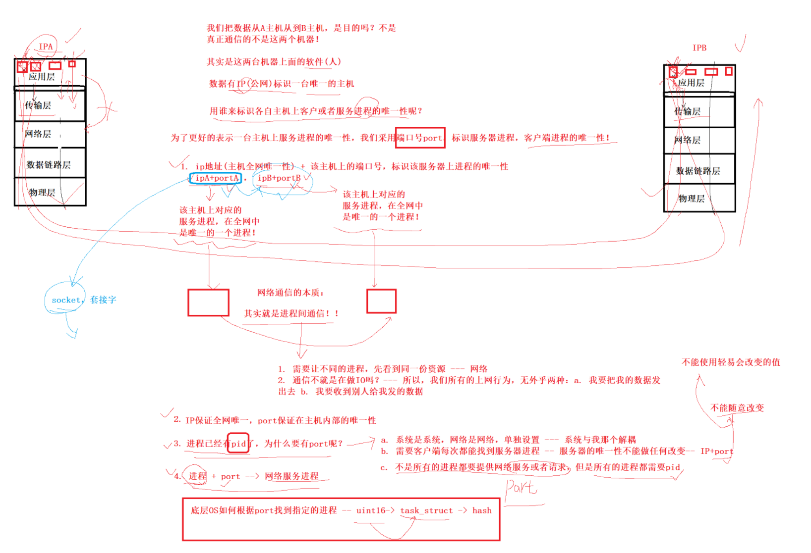


**我们把数据从A主机送到B主机是目的吗？不是**

**真正通信的，不是这两个机器！**

**其实这两台机器上面的软件(人)**


**数据有IP(公网IP)标识一台唯一的主机**

**用谁来标识各: 主机上客户或者服务进程的唯一性呢？**

**为了更好的表示一台主机上服务进程的唯一性，我们采用端口号port，标识服务器进程，客户进程的唯一性。**

**端口号，应用层的。**

**1.ip地址(主机全网唯一性) + 该主机上的端口号，标识该服务器上进程的唯一性。**

​	**ipA + portA,  ipB + portB**

​	**A该主机上对应的服务进程，在全网中是唯一的一个进程。ipA + portB。**

​	**B该主机上对应的服务进程，在全网中是唯一的一个进程。ipB + portB。**

**网络通信的本质：**

**网络通信的本质：其实就是进程间通信！！**


**服务端   网络   客户端**

**1.进程间通信，先让不同的进程看到同一份资源----网络**

**2.通信不就是在做IO吗？---- 所有我们所有的上网行为：无外乎两种：我要把我的数据发出去。我要收到别人发给我的数据。**


**2ip保证全网唯一（这里是公网IP），port保证在主机内部的唯一性。**


**3进程已经有了pid，为什么有还需要port呢？**

​    **1.系统是系统，网络是网络。单独设置---为了系统和网络解耦。**

​	**2.需要客户端每次都能找到服务器进程--服务器的唯一性不能做任何改变。IP+PORT不能随便改变的。不能随意改变。不能使用轻易会改变的值。 **

​	**3.不是所有的进程都需要提供网络服务或者请求，但是所有的进程都需要pid。这就是为什么不使用pid标定在网络中的唯一性。 **


**4进程 + port ---》网络服务进程 **

**底层OS如何根据port找到指定的进程---》uint16-->task_struct -->hash(基于端口号 key, value pcb地址) pcb 文件 文件缓冲区。**

**pcb可能是多个数据结构的 点。多种数据结构的组合点。**

**根据网络端口找到进程数据。**


**一个进程可以绑定多个端口号，但是一个端口号不能被多个进程绑定。**

**我们在网络通信的过程中，IP+PORT标识唯一性  client-->server。除了数据，需要把自己的ip和port发给对方吗？需要的，我们还要发回来 **

**未来发数据的时候，一定会  多发 一部分数据--以协议的形式呈现。**


**端口号是传输层协议的内容：**

​	**传输层的端口号。**

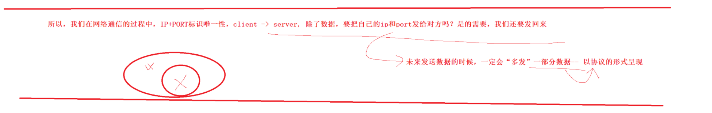

 **一个进程可以绑定多个端口号，但是一个端口号不能被多个进程绑定。**

 **我们在网络通信的过程中，IP+PORT标识唯一性  client-->server。除了数据，需要把自己的ip和port发给对方吗？需要的，我们还要发回来**

 **未来发数据的时候，一定会  多发 一部分数据--以协议的形式呈现。**


## 2TCP和UDP

**传输层协议**

**TCP协议：TCP 是一种面向连接的、可靠的、基于字节流的传输层通信协议。**

​	**传输层协议**

​	**有连接**

​	**可靠传输**

**面向字节流：TCP 传输数据的时候，不关心消息（message）边界，只把所有数据当成一串连续的字节流来传输。**

**UDP协议：UDP 是一种无连接的、不可靠的传输层通信协议。**

​	**传输层协议**

​	**无连接**

​	**不可靠传输**

**面向数据报：面向数据报 = 有边界、每个消息独立传输，发送端的一个数据报对应接收端的一个数据报。**


**面向数据报（UDP）：每个包独立、有边界、不能被拆或合并，可能丢失、乱序、不可靠但速度快。**

**面向字节流（TCP）：数据无边界，是连续字节流，可能粘包、拆包，但可靠、顺序。**


**不可靠和可靠是中性词。**

**可靠是有成本的---这样的协议往往是复杂的---维护&&编码**

**不可靠-----------这样的协议往往比较简单---维护和使用**

**挑选合适的场景。**


**TCP** 和 **UDP** 是两种核心的网络传输层协议，它们的英文全称和核心特点是：

1. TCP

*   **英文全称**：**T**ransmission **C**ontrol **P**rotocol
*   **中文翻译**：**传输控制协议**
*   **核心特点**：**面向连接的、可靠的、基于字节流的** 协议。
    *   **连接导向**：通信前必须先建立“三次握手”连接，通信结束后有“四次挥手”断开连接。
    *   **可靠传输**：通过确认、重传、排序、流量控制和拥塞控制等机制，确保数据包**不丢失、不重复、按顺序**到达。
    *   **适用场景**：对数据准确性要求高，但可以容忍一定延迟的应用。例如：
        *   **网页浏览**
        *   **电子邮件**
        *   **文件传输**

2. UDP

*   **英文全称**：**U**ser **D**atagram **P**rotocol
*   **中文翻译**：**用户数据报协议**
*   **核心特点**：**无连接的、不可靠的、基于数据报的** 协议。
    *   **无连接**：直接发送数据，无需事先建立连接，开销小。
    *   **不可靠传输**：发送数据后不确认对方是否收到，不保证数据包顺序，不进行重传。
    *   **高效、低延迟**：由于没有复杂的控制机制，传输速度非常快。
    *   **适用场景**：对实时性要求高，可以容忍少量数据丢失的应用。例如：
        *   **在线视频/语音通话**
        *   **网络直播**
        *   **多人在线游戏**
        *   **DNS查询**

快速对比与比喻

| 特性         | TCP                        | UDP                               |
| :----------- | :------------------------- | :-------------------------------- |
| **连接方式** | **面向连接**（如：打电话） | **无连接**（如：发短信/寄明信片） |
| **可靠性**   | **高可靠**，确保数据完整   | **尽力而为**，可能丢失            |
| **数据顺序** | **保证顺序**               | **不保证顺序**                    |
| **传输速度** | **相对较慢**（有控制开销） | **非常快**（直接发送）            |
| **头部开销** | 较大（20字节）             | 较小（8字节）                     |
| **流量控制** | **有**（滑动窗口）         | **无**                            |
| **拥塞控制** | **有**（复杂算法）         | **无**                            |
| **典型应用** | HTTP、HTTPS、FTP、SSH      | DNS、DHCP、VoIP、在线游戏         |

**与知名端口号的关系**

你之前了解的**知名端口号**，实际上就是**基于TCP或UDP协议**的。一个服务会“绑定”在某个协议的某个端口上。
*   例如：`TCP 80` 提供HTTP服务，`TCP 443` 提供HTTPS服务，`UDP 53` 常用于DNS查询。

**简单总结：**
记住两个关键句：
*   **TCP：要可靠，就找它。** 像寄“挂号信”，确保送到，但慢一点。
*   **UDP：要速度，就找它。** 像“广播喊话”，瞬间发出，不管你是否听到。


## 3网络字节序

**发送主机通常将发送缓冲区中的数据按内存地址从低到高的顺序发出** **加加比较方便**

**c语言：小小小。小端。**

**网络字节序列**

**接受方，怎么知道是发送的数据是大小端？？**

**规定网络中的数据都是大端。**

**网络字节流：**

**发送主机通常将发送缓冲区中的数据按内存地址从低到高的顺序发出。++简单**

0x0102


**网络字节序：网络字节序 = 规定使用大端字节序（Big-Endian）来表示多字节数据。**

**h: host主机**

**n: net网络**

**l: long 32字节**

**s: short 16字节**

**uint32_t htonl(uint32_t hostlong);**

**uint16_t htons(uint16_t hostshort);**

**uint32_t ntohl(uint32_t netlong);**

**uint16_t ntohs(uint16_t netshort);**


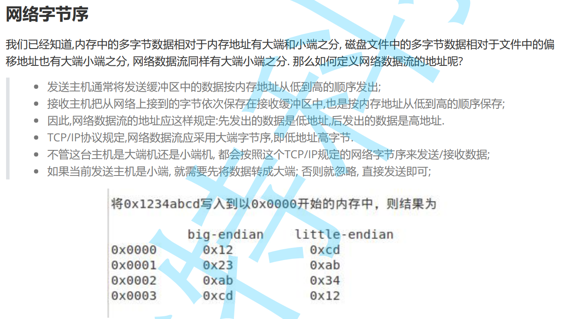

**其它 的数据默认处理的**

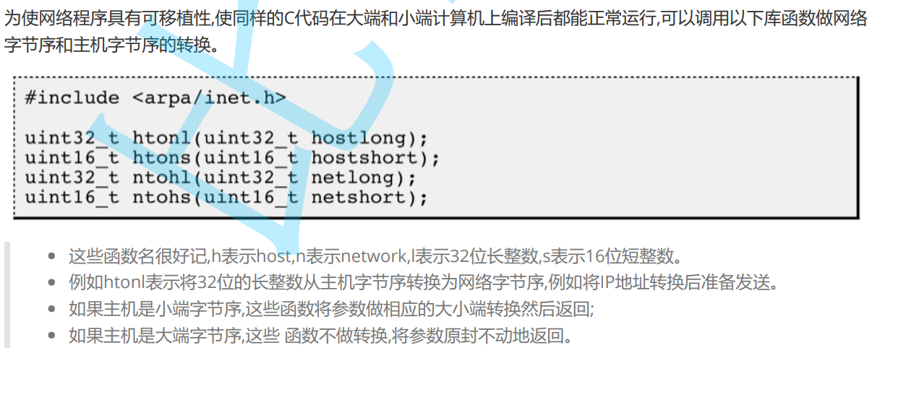

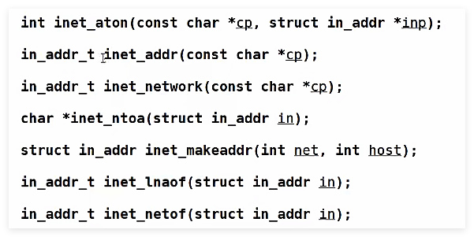

**低地址开始发，同时也是低地址开始接收。**


## 4SOCKET编程接口

**IP + PORT  == 套接字(SOCKET)**

**socket:插头**


**通信协议**

**1网络套接字编程：跨主机和网络**

**2原始套接字：**

**3Unix域间套接字：**

**三套不同的接口。只是设计一套接口，通过参数的不同，解决所有网络或者其他场景下的通信问题。**


**多态**

**struct sockadd_in   ipv4**

**struct sockadd_in6  ipv6**

**struct sockadd_un  unix**

**设计这一套c语言不支持void***

**操作系统级别的接口**

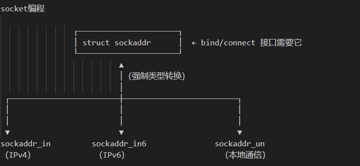

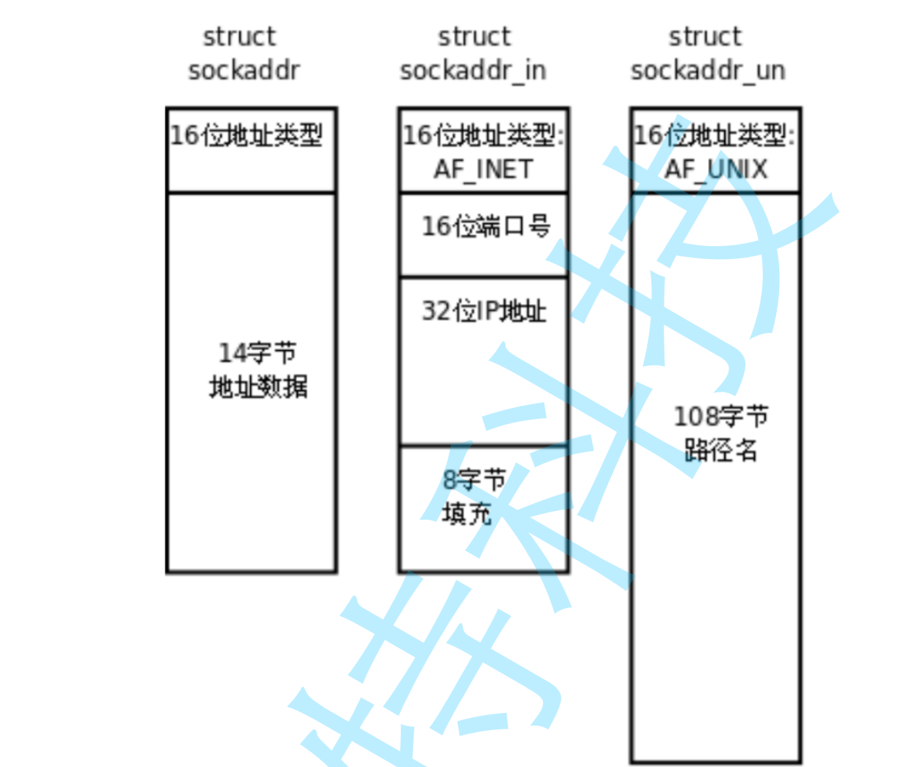

**基类，这不就还是多态吗**


## 5UDP编程

**网络数据流动：局域网和全局网**

**实际通行是主机的进程**

**ip+port标识唯一性。通过网络进行相互通信。**

**通信就是IO嘛。pid和需要port进行解耦。网络和OS进行解耦。**

**网络字节序。大端**

**socket接口**


```c++
struct sockaddr_in 
{
    sa_family_t    sin_family;   // 地址族（协议族）
    in_port_t      sin_port;     // 端口号（网络字节序）
    struct in_addr sin_addr;     // IP 地址
    unsigned char  sin_zero[8];  // 填充字节（对齐用）
};

struct in_addr 
{
	in_addr_t s_addr;            // 32位的IPv4地址，通常以网络字节顺序（大端序）存储 uint32_t;
};

```


**服务器端口必须是确定的。**

**服务器死循环，常驻内存进行。**

**127.0.01 本地环回地址，不会经过物理层。服务器测试用的**

**netstat  -nuap**

**云服务器是虚拟化的服务器，不能直接bind你的公网IP**

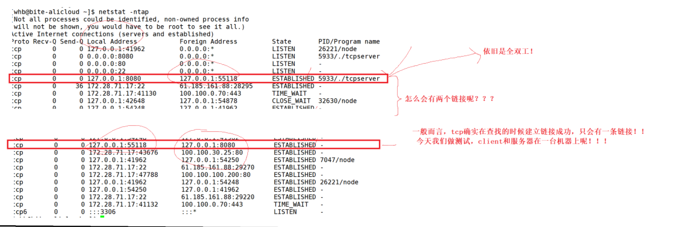


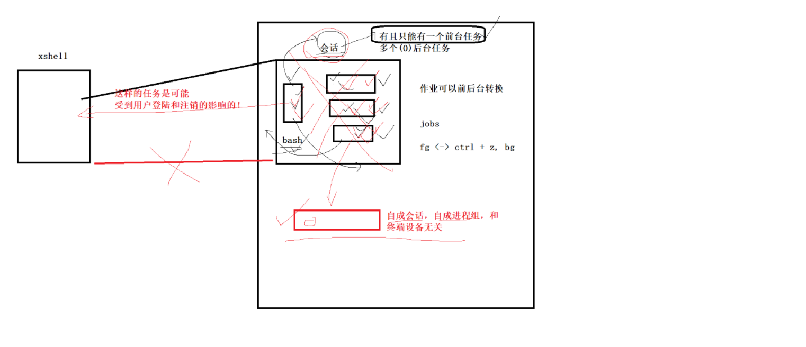

**服务器为什么bind INADDR_ANY**

**可能通过这三个地址访问机器的**

**IP1: 127.0.0.1     (环回地址，只能本机访问)
IP2: 192.168.1.100 (局域网地址，内网可访问)
IP3: 203.0.113.5   (公网地址，互联网可访问)**


## 6udp代码1.0

**最基础的代码关于udp**

### 服务端

```c++
#include "udpserver.hpp"
#include <memory>

using namespace std;
using namespace server;

static void usage()
{
  cout<< "usage ：" << "./udpserver local_port" <<endl;
}

void handlerMessage(string clientip, uint16_t clientport, string message)
{

}


int main(int agrc, char* argv[])
{
  if(agrc != 2)
  {
    usage();
    exit(1);
  }

  uint16_t port = atoi(argv[1]);

  std::unique_ptr<udpServe> usvr(new udpServe(handlerMessage, port));
  usvr->init();
  usvr->start();

  return 0;
}

```

```c++
#pragma once 
#include <iostream>
#include <string>
#include <cerrno>
#include <cstring>
#include <sys/types.h>
#include <sys/socket.h>
#include <unistd.h>
#include <cstdlib>
#include <arpa/inet.h>
#include <netinet/in.h>
#include <functional>
using namespace std;

namespace server
{
  const static string defaultIp = "0.0.0.0"; //todo
  static const int gnum = 1024;
  enum {USAGE_ERR, SOCKET_ERR = 2, BIND_ERR};
  
  typedef function<void (string, uint16_t,string)> func_t;

class udpServe
{
public:
  udpServe(const func_t& cb, const uint16_t &port, const std::string &ip = defaultIp)
    :_callback(cb), _port(port),_ip(ip),_sockfd(-1)                 // 初始化服务器的 ip+port
  {}

  void init()
  {   
      // 返回值就是一个文件描述符, 就是一个open函数，类似的。
      // 打开一个文件描述符号
      
      //1.文件描述符。
      _sockfd = socket(AF_INET, SOCK_DGRAM, 0); //1.通信协议，2.字节流和数据报，3.协议 AF_INET IPV4  SOCK_DGRAM数据报。默认0
      if(_sockfd == -1)
      {
        cerr<< "socket error " << "  : " << strerror(errno) <<endl;
        exit(SOCKET_ERR);
      }
  
      // 把文件描述符和ip+port链接起来的 。
      //2.bind ip+port 
      struct sockaddr_in local; // 定义了一个变量
      bzero(&local, sizeof(local)); // 涉及结构体对其，然后填充零。
      
      // 三件套赋值
      local.sin_family  = AF_INET;
      local.sin_port = htons(_port); // 主机序列到网络序列 服务器绑定port.我是主机需要传输到网络里面去的。
      /*
       *local.sin_addr.s_addr = inet_addr(_ip.c_str());     // 1.string->uint32_t    2.htonl()
       */
      
      local.sin_addr.s_addr = htonl(INADDR_ANY); // 任意地址bind。

      int n = bind(_sockfd, (struct sockaddr*)&local, sizeof(local));
      if(n == -1)
      {
        cerr<< "bind error " << "  : " << strerror(errno) <<endl;
        exit(BIND_ERR);
      }
//UDP服务器正式完成
  }

  void start()
  {
// 服务器的本质就是一个死循环，常驻内存的进程。OS
  
    char buffer[gnum];
    for(;;)
    {
      // recvfrom 读取数据 知道谁发送的
      struct sockaddr_in peer;
      socklen_t len = sizeof(peer);      
      ssize_t s =recvfrom(_sockfd, buffer, sizeof(buffer)-1, 0, (struct sockaddr*)&peer, &len);
      //1.数据是什么 2.谁发的的
      
      if(s > 0)
      {
        buffer[s] = 0;
        string clientip = inet_ntoa(peer.sin_addr);  // 网络到主机 点分十进制
        uint16_t clientport = ntohs(peer.sin_port);
        string message = buffer;

        // cout<< clientport << ":" <<  clientip << ":" << message <<endl; 
        _callback(clientip, clientport, message);
      }

    }


  }
  ~udpServe()
  {


  }
private:
  func_t _callback;
  uint16_t _port;
  std::string _ip; // 不建议绑定一款特定的ip
  int _sockfd;
};
}

```


### 客户端

```c++
#include <iostream>
#include "udpclient.hpp"
#include <memory>

using namespace std;
using namespace client;

static void usage()
{
  cout<< "usage ：" << "./udpserver ip port" <<endl;
}

// ./udpclient ip port

int main(int argc, char* argv[])
{
  if(argc != 3)
  {
    usage();
    exit(1);
  }

  string serverip =  argv[1];
  uint16_t serverport = atoi(argv[2]);

  unique_ptr<udpclient> ucli(new udpclient(serverip, serverport));

  ucli->init();
  ucli->run();


  return 0;
}

```


```c++
#pragma once 
#include <iostream>
#include <string>
#include <cerrno>
#include <cstring>
#include <sys/types.h>
#include <sys/socket.h>
#include <unistd.h>
#include <cstdlib>
#include <arpa/inet.h>
#include <netinet/in.h>
using namespace std;


namespace client 
{
class udpclient
{
public:
  udpclient(const string& serverip, const uint16_t& serverport)
    :_serverip(serverip)
    ,_serverport(serverport)
    ,_sockfd(-1)
    ,_quit(false)
  {}

  void init()
  {
      //1.文件描述符。
      _sockfd = socket(AF_INET, SOCK_DGRAM, 0); //1.通信协议，2.字节流和数据报，3.协议 AF_INET IPV4  SOCK_DGRAM数据报。默认0
      if(_sockfd == -1)
      {
        cerr<< "socket error " << "  : " << strerror(errno) <<endl;
        exit(1);
      }
      //客户端必须bind，不需要显示的bind。 存在即可。
      //写服务器是一家公司，客户端是无数家公司。
      //os帮你合理安排端口资源
      //什么时候bind


  }

  void run()
  {
    struct sockaddr_in server;
    memset(&server, 0, sizeof(server));

    server.sin_family = AF_INET;
    server.sin_addr.s_addr = inet_addr(_serverip.c_str());
    server.sin_port = htons(_serverport);

    string message;
    while(!_quit)
    {
      cout<<"message enter#";
      cin>>message;
      sendto(_sockfd, message.c_str(), message.size(), 0, (struct sockaddr*)&server, sizeof(server));
    }
  }
  ~udpclient()
  {

  }

private:
  string _serverip;
  uint16_t _serverport;
  int _sockfd;
  bool _quit;
};


}

```


## 7udp代码2.0

**服务器是一个进程，死循环，知名端口。**

```c++
      struct sockaddr_in local; // 定义了一个变量
      bzero(&local, sizeof(local)); // 涉及结构体对其，然后填充零。

      local.sin_family  = AF_INET;
      local.sin_port = htons(_port); // 主机序列到网络序列 服务器绑定port.我是主机需要传输到网络里面去的
      local.sin_addr.s_addr = htonl(INADDR_ANY); // 任意地址bind。
```

**udp 创建套接字和bind。**

**bind设置内核**

**字节序列注意**

**recvfrom能够知道谁发的，输出型参数。**

**回调函数，实现数据的接收和使用解耦。**

**客户端不需要显示的bind，OS自动帮你bind。 客户单只需存在端口就行，是谁不重要的！！**

**两板斧**

**支持翻译软件**

### 服务端

```c++
#include "udpserver.hpp"
#include <unordered_map>
#include <memory>
#include <fstream>
#include <signal.h>

using namespace std;
using namespace server;

static void usage()
{
  cout<< "usage ：" << "./udpserver local_port" <<endl;
}

const std::string dicttxt = "./dict.txt";
unordered_map<string, string> dict;
// apple:苹果
static bool cutString(const string& target, string* s1, string* s2, const string& sep)
{
  auto pos = target.find(sep);
  if(pos == string::npos) return false;
  *s1 = target.substr(0, pos);  // apple:苹果
  *s2 = target.substr(pos + sep.size()); // 苹果
  return true;
}

static void initDict()
{
  ifstream in(dicttxt, std::ios::binary);
  if(!in.is_open())
  {
    std::cerr<< "open_cerr : " << dicttxt <<endl;
    exit(OPEN_ERR);
  }

  string line;
  string key, value;
  while(getline(in, line))
  {
    // cout<< line <<endl;
    if(cutString(line, &key, &value, ":"))
    {
      dict.insert(make_pair(key, value));
    }
  }
  cout<< "load dict success"<<endl;
  in.close();
}

static void debugPrint()
{
  for(const auto& dt : dict)
  {
    cout<< dt.first << " # " << dt.second <<endl;
  }
}

void reload(int sig)
{
  (void)sig;
  initDict();
}
void handlerMessage(int socket, string clientip, uint16_t clientport, string message)
{
  string respose_message;
  auto iter = dict.find(message);
  if(iter == dict.end()) respose_message = "ukonwn";
  else respose_message = iter->second;

  // 构建开始返回
  struct sockaddr_in client;
  bzero(&client, sizeof(client));
  client.sin_family = AF_INET;
  client.sin_port = htons(clientport);
  client.sin_addr.s_addr = inet_addr(clientip.c_str());

  sendto(socket, respose_message.c_str(), respose_message.size(), 0, (struct sockaddr*)&client, sizeof(client));
}


int main(int agrc, char* argv[])
{
  if(agrc != 2)
  {
    usage();
    exit(1);
  }

  initDict();
  // debugPrint();
  signal(2,reload);

  uint16_t port = atoi(argv[1]);

  std::unique_ptr<udpServe> usvr(new udpServe(handlerMessage, port));
  usvr->init();
  usvr->start();

  return 0;
}

```


```c++
#pragma once 
#include <iostream>
#include <string>
#include <cerrno>
#include <cstring>
#include <sys/types.h>
#include <sys/socket.h>
#include <unistd.h>
#include <cstdlib>
#include <arpa/inet.h>
#include <netinet/in.h>
#include <functional>
using namespace std;

namespace server
{
  const static string defaultIp = "0.0.0.0"; //todo
  static const int gnum = 1024;
  enum {USAGE_ERR, SOCKET_ERR = 2, BIND_ERR,  OPEN_ERR};
  typedef function<void (int, string, uint16_t,string)> func_t;

class udpServe
{
public:
  udpServe(const func_t& cb, const uint16_t &port, const std::string &ip = defaultIp)
    :_callback(cb), _port(port), _ip(ip), _sockfd(-1)                 // 初始化服务器的 ip+port
  {}

  void init()
  {   
      // 返回值就是一个文件描述符, 就是一个open函数，类似的。
      // 打开一个文件描述符号
      
      //1.文件描述符。
      _sockfd = socket(AF_INET, SOCK_DGRAM, 0); //1.通信协议，2.字节流和数据报，3.协议 AF_INET IPV4  SOCK_DGRAM数据报。默认0
      if(_sockfd == -1)
      {
        cerr<< "socket error " << "  : " << strerror(errno) <<endl;
        exit(SOCKET_ERR);
      }
  
      // 把文件描述符和ip+port链接起来的 。
      //2.bind ip+port 
      struct sockaddr_in local; // 定义了一个变量
      bzero(&local, sizeof(local)); // 涉及结构体对其，然后填充零。
      
      // 三件套赋值
      local.sin_family  = AF_INET;
      local.sin_port = htons(_port); // 主机序列到网络序列 服务器绑定port.我是主机需要传输到网络里面去的。
      /*
       *local.sin_addr.s_addr = inet_addr(_ip.c_str());     // 1.string->uint32_t    2.htonl()
       */
      
      local.sin_addr.s_addr = htonl(INADDR_ANY); // 任意地址bind。

      int n = bind(_sockfd, (struct sockaddr*)&local, sizeof(local));
      if(n == -1)
      {
        cerr<< "bind error " << "  : " << strerror(errno) <<endl;
        exit(BIND_ERR);
      }
//UDP服务器正式完成
  }

  void start()
  {
// 服务器的本质就是一个死循环，常驻内存的进程。OS
  
    char buffer[gnum];
    for(;;)
    {
      // recvfrom 读取数据 知道谁发送的
      struct sockaddr_in peer;
      socklen_t len = sizeof(peer);      
      ssize_t s =recvfrom(_sockfd, buffer, sizeof(buffer)-1, 0, (struct sockaddr*)&peer, &len);
      //1.数据是什么 2.谁发的的
      
      if(s > 0)
      {
        buffer[s] = 0;
        string clientip = inet_ntoa(peer.sin_addr);  // 网络到主机 点分十进制
        uint16_t clientport = ntohs(peer.sin_port);
        string message = buffer;

         cout<< clientport << ":" <<  clientip << ":" << message <<endl; 
        _callback(_sockfd, clientip, clientport, message);
      }
    }
  }
  ~udpServe()
  {}

private:
  func_t _callback;
  uint16_t _port;
  std::string _ip; // 不建议绑定一款特定的ip
  int _sockfd;
};
}

```


### 客户端

```c++
#include <iostream>
#include "udpclient.hpp"
#include <memory>

using namespace std;
using namespace client;

static void usage()
{
  cout<< "usage ：" << "./udpserver ip port" <<endl;
}

// ./udpclient ip port

int main(int argc, char* argv[])
{
  if(argc != 3)
  {
    usage();
    exit(1);
  }

  string serverip =  argv[1];
  uint16_t serverport = atoi(argv[2]);

  unique_ptr<udpclient> ucli(new udpclient(serverip, serverport));

  ucli->init();
  ucli->run();
  return 0;
}
```


```c++
#pragma once 
#include <iostream>
#include <string>
#include <cerrno>
#include <cstring>
#include <sys/types.h>
#include <sys/socket.h>
#include <unistd.h>
#include <cstdlib>
#include <arpa/inet.h>
#include <netinet/in.h>
using namespace std;

namespace client 
{
class udpclient
{
public:
  udpclient(const string& serverip, const uint16_t& serverport)
    :_serverip(serverip)
    ,_serverport(serverport)
    ,_sockfd(-1)
    ,_quit(false)
  {}

  void init()
  {
      //1.文件描述符。
      _sockfd = socket(AF_INET, SOCK_DGRAM, 0); //1.通信协议，2.字节流和数据报，3.协议 AF_INET IPV4  SOCK_DGRAM数据报。默认0
      if(_sockfd == -1)
      {
        cerr<< "socket error " << "  : " << strerror(errno) <<endl;
        exit(1);
      }
      //客户端必须bind，不需要显示的bind。 存在即可。
      //写服务器是一家公司，客户端是无数家公司。
      //os帮你合理安排端口资源
      //什么时候bind


  }

  void run()
  {
    struct sockaddr_in server;
    memset(&server, 0, sizeof(server));

    server.sin_family = AF_INET;
    server.sin_addr.s_addr = inet_addr(_serverip.c_str());
    server.sin_port = htons(_serverport);

    string message;
    while(!_quit)
    {
      cout<<"message enter#";
      cin>>message;
      sendto(_sockfd, message.c_str(), message.size(), 0, (struct sockaddr*)&server, sizeof(server));
      
      char buffer[1024];
      struct sockaddr_in temp;
      socklen_t temp_len = sizeof(temp);
      size_t n = recvfrom(_sockfd, buffer, sizeof(buffer)-1, 0, (struct sockaddr*)&temp, &temp_len);
      if(n>0) buffer[n] = 0;
      cout<< "服务器的翻译结果："<< buffer <<endl;
    }
  }
  ~udpclient()
  {
  }

private:
  string _serverip;
  uint16_t _serverport;
  int _sockfd;
  bool _quit;
};
}
```


## 8udp代码3.0

### 服务端

```c++
#include "udpserver.hpp"
#include <unordered_map>
#include <memory>
#include <fstream>
#include <signal.h>

using namespace std;
using namespace server;

static void usage()
{
  cout<< "usage ：" << "./udpserver local_port" <<endl;
}

const std::string dicttxt = "./dict.txt";
unordered_map<string, string> dict;
// apple:苹果
static bool cutString(const string& target, string* s1, string* s2, const string& sep)
{
  auto pos = target.find(sep);
  if(pos == string::npos) return false;
  *s1 = target.substr(0, pos);  // apple:苹果
  *s2 = target.substr(pos + sep.size()); // 苹果
  return true;
}

static void initDict()
{
  ifstream in(dicttxt, std::ios::binary);
  if(!in.is_open())
  {
    std::cerr<< "open_cerr : " << dicttxt <<endl;
    exit(OPEN_ERR);
  }

  string line;
  string key, value;
  while(getline(in, line))
  {
    // cout<< line <<endl;
    if(cutString(line, &key, &value, ":"))
    {
      dict.insert(make_pair(key, value));
    }
  }
  cout<< "load dict success"<<endl;
  in.close();
}

static void debugPrint()
{
  for(const auto& dt : dict)
  {
    cout<< dt.first << " # " << dt.second <<endl;
  }
}

void reload(int sig)
{
  (void)sig;
  initDict();
}
void handlerMessage(int socket, string clientip, uint16_t clientport, string message)
{
  string respose_message;
  auto iter = dict.find(message);
  if(iter == dict.end()) respose_message = "ukonwn";
  else respose_message = iter->second;

  // 构建开始返回
  struct sockaddr_in client;
  bzero(&client, sizeof(client));
  client.sin_family = AF_INET;
  client.sin_port = htons(clientport);
  client.sin_addr.s_addr = inet_addr(clientip.c_str());

  sendto(socket, respose_message.c_str(), respose_message.size(), 0, (struct sockaddr*)&client, sizeof(client));
}


void exeCommand(int socket, string clientip, uint16_t clientport, string cmd)
{

  if(cmd.find("rm") != string::npos)
  {
    cout<<"this error execution" <<endl;
  }

   string respose;
   FILE* fp = popen(cmd.c_str(), "r");
   if(fp == nullptr)
   {
     respose = cmd + "exex failde";
   }
  
   char line[1024];
   while(fgets(line, sizeof(line), fp))
   {
      respose += line;
   }
   pclose(fp);
  // 构建开始返回
  struct sockaddr_in client;
  bzero(&client, sizeof(client));
  client.sin_family = AF_INET;
  client.sin_port = htons(clientport);
  client.sin_addr.s_addr = inet_addr(clientip.c_str());

  sendto(socket, respose.c_str(), respose.size(), 0, (struct sockaddr*)&client, sizeof(client));
}

int main(int agrc, char* argv[])
{
  if(agrc != 2)
  {
    usage();
    exit(1);
  }

  initDict();
  // debugPrint();
  signal(2,reload);

  uint16_t port = atoi(argv[1]);

  /*
   *std::unique_ptr<udpServe> usvr(new udpServe(handlerMessage, port));
   */
  std::unique_ptr<udpServe> usvr(new udpServe(exeCommand, port));
  usvr->init();
  usvr->start();

  return 0;
}

```


```c++
#pragma once 
#include <iostream>
#include <string>
#include <cerrno>
#include <cstring>
#include <sys/types.h>
#include <sys/socket.h>
#include <unistd.h>
#include <cstdlib>
#include <arpa/inet.h>
#include <netinet/in.h>
#include <functional>
using namespace std;

namespace server
{
  const static string defaultIp = "0.0.0.0"; //todo
  static const int gnum = 1024;
  enum {USAGE_ERR, SOCKET_ERR = 2, BIND_ERR,  OPEN_ERR};
  typedef function<void (int, string, uint16_t,string)> func_t;

class udpServe
{
public:
  udpServe(const func_t& cb, const uint16_t &port, const std::string &ip = defaultIp)
    :_callback(cb), _port(port), _ip(ip), _sockfd(-1)                 // 初始化服务器的 ip+port
  {}

  void init()
  {   
      // 返回值就是一个文件描述符, 就是一个open函数，类似的。
      // 打开一个文件描述符号
      
      //1.文件描述符。
      _sockfd = socket(AF_INET, SOCK_DGRAM, 0); //1.通信协议，2.字节流和数据报，3.协议 AF_INET IPV4  SOCK_DGRAM数据报。默认0
      if(_sockfd == -1)
      {
        cerr<< "socket error " << "  : " << strerror(errno) <<endl;
        exit(SOCKET_ERR);
      }
  
      // 把文件描述符和ip+port链接起来的 。
      //2.bind ip+port 
      struct sockaddr_in local; // 定义了一个变量
      bzero(&local, sizeof(local)); // 涉及结构体对其，然后填充零。
      
      // 三件套赋值
      local.sin_family  = AF_INET;
      local.sin_port = htons(_port); // 主机序列到网络序列 服务器绑定port.我是主机需要传输到网络里面去的。
      /*
       *local.sin_addr.s_addr = inet_addr(_ip.c_str());     // 1.string->uint32_t    2.htonl()
       */
      
      local.sin_addr.s_addr = htonl(INADDR_ANY); // 任意地址bind。

      int n = bind(_sockfd, (struct sockaddr*)&local, sizeof(local));
      if(n == -1)
      {
        cerr<< "bind error " << "  : " << strerror(errno) <<endl;
        exit(BIND_ERR);
      }
//UDP服务器正式完成
  }

  void start()
  {
// 服务器的本质就是一个死循环，常驻内存的进程。OS
  
    char buffer[gnum];
    for(;;)
    {
      // recvfrom 读取数据 知道谁发送的
      struct sockaddr_in peer;
      socklen_t len = sizeof(peer);      
      ssize_t s =recvfrom(_sockfd, buffer, sizeof(buffer)-1, 0, (struct sockaddr*)&peer, &len);
      //1.数据是什么 2.谁发的的
      
      if(s > 0)
      {
        buffer[s] = 0;
        string clientip = inet_ntoa(peer.sin_addr);  // 网络到主机 点分十进制
        uint16_t clientport = ntohs(peer.sin_port);
        string message = buffer;

         cout<< clientport << ":" <<  clientip << ":" << message <<endl; 
        _callback(_sockfd, clientip, clientport, message);
      }
    }
  }
  ~udpServe()
  {}

private:
  func_t _callback;
  uint16_t _port;
  std::string _ip; // 不建议绑定一款特定的ip
  int _sockfd;
};
}

```


### 客户端

```c++
#include <iostream>
#include "udpclient.hpp"
#include <memory>

using namespace std;
using namespace client;

static void usage()
{
  cout<< "usage ：" << "./udpserver ip port" <<endl;
}

// ./udpclient ip port

int main(int argc, char* argv[])
{
  if(argc != 3)
  {
    usage();
    exit(1);
  }

  string serverip =  argv[1];
  uint16_t serverport = atoi(argv[2]);

  unique_ptr<udpclient> ucli(new udpclient(serverip, serverport));

  ucli->init();
  ucli->run();
  return 0;
}
```


````c++
#pragma once 
#include <iostream>
#include <string>
#include <cerrno>
#include <cstring>
#include <sys/types.h>
#include <sys/socket.h>
#include <unistd.h>
#include <cstdlib>
#include <arpa/inet.h>
#include <netinet/in.h>
using namespace std;

namespace client 
{
class udpclient
{
public:
  udpclient(const string& serverip, const uint16_t& serverport)
    :_serverip(serverip)
    ,_serverport(serverport)
    ,_sockfd(-1)
    ,_quit(false)
  {}

  void init()
  {
      //1.文件描述符。
      _sockfd = socket(AF_INET, SOCK_DGRAM, 0); //1.通信协议，2.字节流和数据报，3.协议 AF_INET IPV4  SOCK_DGRAM数据报。默认0
      if(_sockfd == -1)
      {
        cerr<< "socket error " << "  : " << strerror(errno) <<endl;
        exit(1);
      }
      //客户端必须bind，不需要显示的bind。 存在即可。
      //写服务器是一家公司，客户端是无数家公司。
      //os帮你合理安排端口资源
      //什么时候bind
  }

  void run()
  {
    struct sockaddr_in server;
    memset(&server, 0, sizeof(server));

    server.sin_family = AF_INET;
    server.sin_addr.s_addr = inet_addr(_serverip.c_str());
    server.sin_port = htons(_serverport);

    string message;
    char cmdlinne[1024];
    while(!_quit)
    {

      cout<<"message enter#";
      fgets(cmdlinne, sizeof(cmdlinne), stdin);
      message = cmdlinne;

      sendto(_sockfd, message.c_str(), message.size(), 0, (struct sockaddr*)&server, sizeof(server));
      
      char buffer[1024];
      struct sockaddr_in temp;
      socklen_t temp_len = sizeof(temp);
      size_t n = recvfrom(_sockfd, buffer, sizeof(buffer)-1, 0, (struct sockaddr*)&temp, &temp_len);
      if(n>0) buffer[n] = 0;
      cout<< "服务器的翻译结果：\n"<< buffer <<endl;
    }
  }
  ~udpclient()
  {
  }

private:
  string _serverip;
  uint16_t _serverport;
  int _sockfd;
  bool _quit;
};
}

````

## 9udp代码4.0

### 客户端


### 服务端


## 10tcp代码1.0

**netstat  指令**

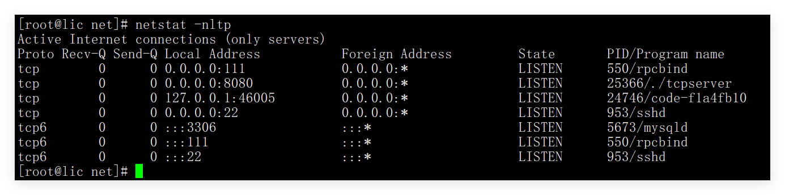

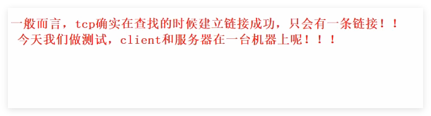

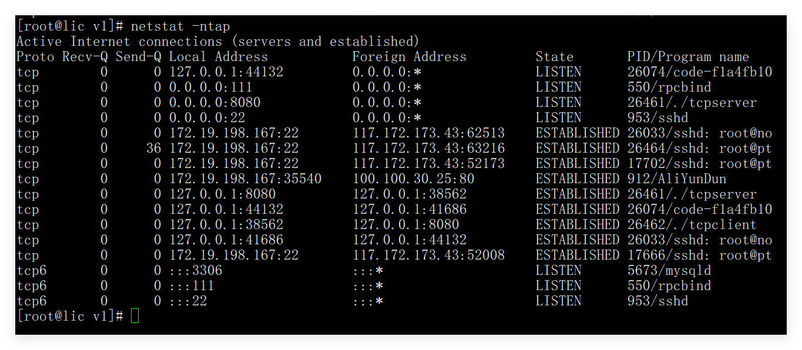

### 客户端

```c++
#include "tcpClient.hpp"
#include <memory>
using namespace std;

static void Usage(string proc)
{
  cout<< "Usage:\n \t  "<< proc << "  serverip serverpor \n\n";
}

// ./tcpclient serverip serverport
// ./tcpclient 127.0.0.1 8080
int main(int argc, char* argv[])
{
    if(argc != 3)
    {
        Usage(argv[0]);
        exit(1);
    }

    string serverip = argv[1];
    uint16_t serverport = atoi(argv[2]);
    unique_ptr<TcpClient>  tcli(new TcpClient(serverip, serverport));

    tcli->initClient();
    tcli->start();
// 一般而言，tcp确实在查找的时候建立链接成功，只会有一条链接！
// 今天呢，我们做测试，clietn和server在一台机器上的。

    return 0;
}
```


```c++
#pragma once
#include <iostream>
#include <string>
#include <cstring>
#include <sys/types.h>
#include <sys/socket.h>
#include <netinet/in.h>
#include <arpa/inet.h>
#include <unistd.h>

#define NUM 1024
using namespace std;

class TcpClient
{
public:
    TcpClient(const std::string& serverip, uint16_t serverport)
        : _sock(-1), _serverip(serverip), _serverport(serverport)
    {}

    // 初始化客户端
    void initClient()
    {
        // 1. 创建套接字
        _sock = socket(AF_INET, SOCK_STREAM, 0);
        if (_sock < 0)
        {
            std::cerr << "socket create error" << std::endl;
            exit(2);
        }
        //tcp和先udp都是一样的
        // 客户端无需显示 bind，只需要 connect
        // os自动随机管理端口资源
    }

    // 启动 client
    bool start()
    {
        struct sockaddr_in server;
        memset(&server, 0, sizeof(server));
        server.sin_family = AF_INET;
        server.sin_port = htons(_serverport);
        server.sin_addr.s_addr = inet_addr(_serverip.c_str());

        // connect
        // 发起链接给_listensock发消息，我们来到了的
        // 客户端就是发起请求的，accept就接收到，并创建一个新的文件描述符。
        if (connect(_sock, (struct sockaddr*)&server, sizeof(server)) != 0)
        {
            std::cerr << "socket connect error" << std::endl;
            return false;
        }
        else 
        {
            // 成功连接后开始消息收发
            string msg;
            char buffer[NUM];
            while (true)
            {
                cout << "Enter # ";
                std::getline(std::cin, msg);

                // 写入服务器
                ssize_t s = write(_sock, msg.c_str(), msg.size());
                if (s <= 0)
                {
                    cerr << "write failed" << endl;
                    break;
                }

                // 读回显
                ssize_t n = read(_sock, buffer, sizeof(buffer) - 1);
                if (n > 0)
                {
                    buffer[n] = '\0';
                    cout << "Server回显# " << buffer << endl;
                }
                else if (n == 0)
                {
                    cout << "Server 关闭连接" << endl;
                    break;
                }
                else
                {
                    cerr << "read failed" << endl;
                    break;
                }
            }
        }
        return true;
    }

    ~TcpClient()
    {
        if (_sock >= 0) close(_sock);
    }
private:
    int _sock;
    std::string _serverip; // 服务器的数据
    uint16_t _serverport;  // 修正类型
};

```


### 服务端

```c++
#include "tcpServer.hpp"
#include <memory>

using namespace server;
using namespace std;

static void Usage(string proc)
{
  cout<< "Usage:\n \t  "<< proc << "  local_port\n\n";
}

// tcp和udp启动一模一样的
// ./tcpserver port 
int main(int argc, char* argv[])
{

  if(argc != 2)
  {
    Usage(argv[0]);
    exit(USAGE_ERR);
  }

  uint16_t port = atoi(argv[1]);
  unique_ptr<TcpServer> tsvr(new TcpServer());
  tsvr->initServer(); // 初始化
  tsvr->start();      // 启动服务器


    return 0;
}
```


```c++
#pragma once

#include <iostream>
#include <string>
#include <cstring>
#include <sys/types.h>
#include <sys/socket.h>
#include <netinet/in.h>
#include <arpa/inet.h>
#include "log.hpp"
#include <unistd.h>
using namespace std;

namespace server
{
enum {USAGE_ERR = 1, SOCKET_ERR, BIND_ERR, LISTEN_ERR};
static const uint16_t gport = 8080;
static const int gbacklog = 5;

class TcpServer
{
public:
    TcpServer(const uint16_t& port = gport)
        : _listensock(-1), _port(port)
    {}

    void initServer()
    {
// 1. 创建套接字
        _listensock = socket(AF_INET, SOCK_STREAM, 0);  // TCP是面向字节流的 SOCK_STREAM
        if(_listensock < 0)
        {
            logMessage(FATAL, "create socket failed");
            exit(SOCKET_ERR);
        }
        logMessage(NORMAL, "create socket success");

// 2. 绑定IP和PORT
        struct sockaddr_in local;
        memset(&local, 0, sizeof(local));          // 置零 因为结构体对其，可能会填充的。
        local.sin_family = AF_INET;                // AF_INET = PF_INET
        local.sin_port = htons(_port);             // 正确：htons   主机转网络 这里是用户序列 需要主机转网络
        local.sin_addr.s_addr = htonl(INADDR_ANY); // 绑定到任意网卡 主机转网络

        if(bind(_listensock, (struct sockaddr*)&local, sizeof(local)) < 0)  // 设置近内核里面
        {
            logMessage(FATAL, "bind failed");
            exit(BIND_ERR);
        }
        logMessage(NORMAL, "bind success");

// 3.设置socket，为监听状态。 这里和udp不一样的。这里是面向连接的，必须连接的。
        // 监听者
        if(listen(_listensock, gbacklog) < 0)
        {
            logMessage(FATAL, "listen failed");
            exit(LISTEN_ERR);
        }
        logMessage(NORMAL, "listen success");
    }

    void start()
    {
        // TODO: listen + accept
        for(;;)
        {
            // 4.server获取新链接
            // accept返回值为什么也是文件描述符
            // sock和client进行通信的fd
            sockaddr_in peer;
            socklen_t len = sizeof(peer);
            
            // return value file discriptor
            // 吃鱼的故事，招呼了人的小二。
/*
    总结一下： accept() 成功一次，就产生一个专门负责该连接的新 FD。
    原来的监听 FD 依然屹立不倒，继续等待下一个幸运儿。
*/
            int sock = accept(_listensock, (struct sockaddr*)&peer, &len);
            if(sock < 0)
            {
                logMessage(ERROR, "accept error, next");
                continue;
            }

            logMessage(NORMAL,"accept a new link success");
            cout<< "sock: " << sock <<endl;               //  print a new file discriptor

            //5.用new sock,进行通信。面向字节流的。后续全部都是文件操作。
            serverIO(sock); // callback function
            close(sock);    // 已经使用完的sock，必须关闭，要不然会导致,文件描述符泄漏。这里没有进行并发，一次只能链接一个的。
            // 后面高并发的
        }

    }

    void serverIO(int sock)
    {
        char buffer[1024];
        while(true)
        {
            ssize_t n = read(sock, buffer, sizeof(buffer) - 1); // 目前当做字符串 这里是读
            if(n > 0)
            {
                // 目前我们把我们读到的数据当做字符串，截至目前
                buffer[n] = 0;
                cout<< "recv message : " << buffer <<endl;

                std::string outbuffer = buffer;
                outbuffer += "  server[echo]";

                write(sock, outbuffer.c_str(), outbuffer.size()); // 这里是写回去的
            }
            else if(n == 0) 
            {
                // 客户端退出了
                logMessage(NORMAL, "client quit, me to");
                break;
            }
        }
    }

private:
    int _listensock;   // 不是用来通信的，用来监听链接，获取新链接
    uint16_t _port;    // 服务器指定端口号
};

}

```


## 11tcp代码2.0

### 客户端

### 服务端

   

## 12tcp代码3.0

**在现代 Unix/Linux 系统中，如果父进程明确设置了对 `SIGCHLD` 的处理方式为 `SIG_IGN`，那么子进程在终止时会被内核直接回收，不会变成僵尸进程，父进程也不需要调用 `wait()`。**


## 13tcp代码4.0

**线程是共享的 文件描述符**


## 14tcp代码5.0

进程池版本


## 15会话

**会话一个前台任务，多个后台任务**

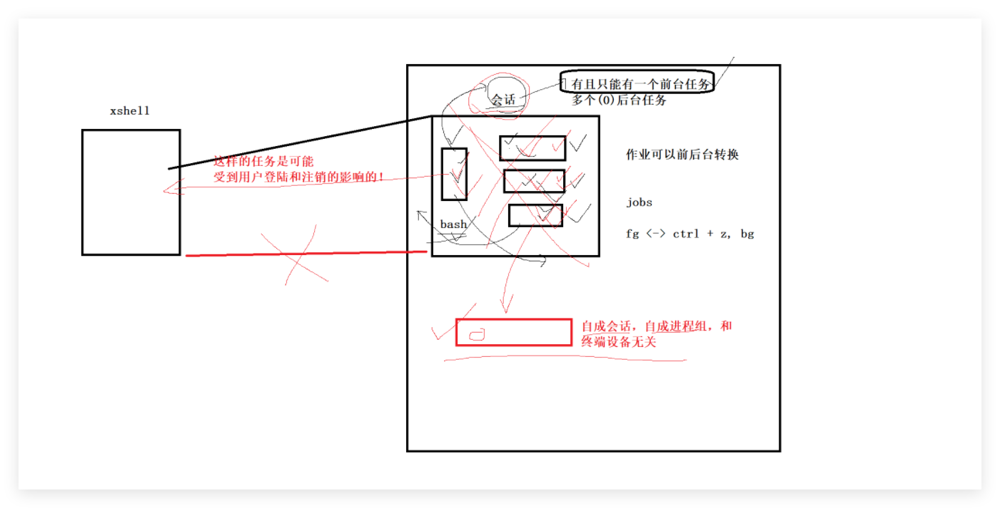

**PGID表示一个组的**

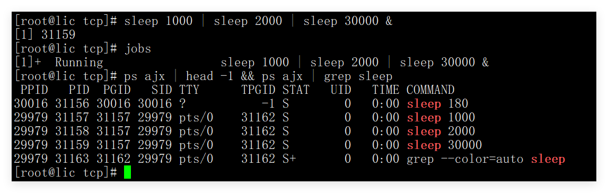

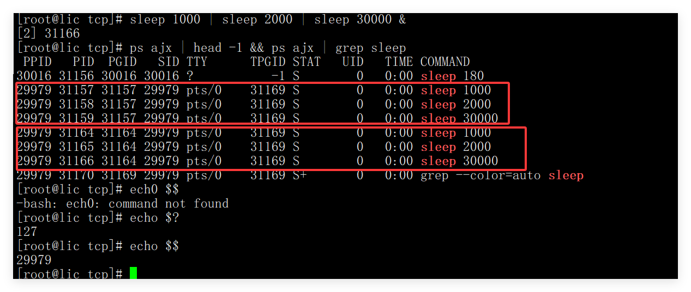


**精灵进程的诞生**

**守护进程的诞生**

**守护进程不能是“进程组组长”，是为了确保它永远无法重新获得控制终端。**

**只要一个进程是“进程组组长”，它就有资格重新绑定控制终端；**
 **而守护进程的设计目标是**：**永远不再和任何终端产生关系**。


##  16udp总结


**inet_ntoa**

| **缩写** | **全称**     | **含义**                                                     |
| -------- | ------------ | ------------------------------------------------------------ |
| **inet** | **Internet** | 代表互联网协议（IP）相关操作                                 |
| **n**    | **Network**  | 代表 **网络字节序**（通常是大端序 Big-endian）               |
| **to**   | **to**       | 转换方向：到...                                              |
| **a**    | **ASCII**    | 代表 **字符串**（即我们常见的点分十进制形式，如 `"192.168.1.1"`） |


**ntohs**

| **缩写** | **全称**    | **含义**                                         |
| -------- | ----------- | ------------------------------------------------ |
| **n**    | **network** | 网络字节序（Network byte order）                 |
| **to**   | **to**      | 转换到                                           |
| **h**    | **host**    | 主机字节序（Host byte order）                    |
| **s**    | **short**   | 16位短整型（unsigned short，通常用于**端口号**） |


## 17setsockopt


int setsockopt(
    int sockfd,
    int level,
    int optname,
    const void *optval,
    socklen_t optlen
);


