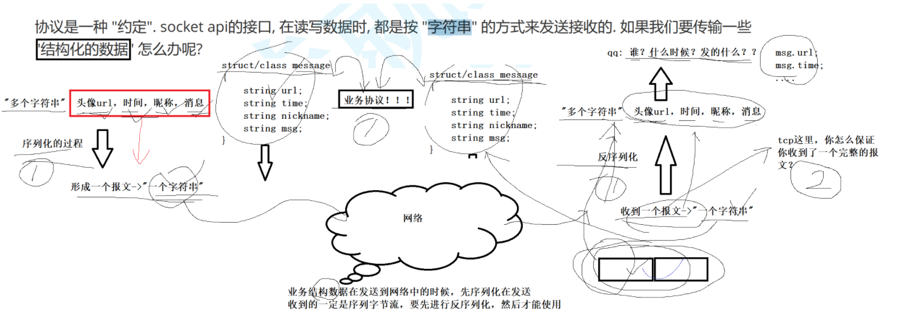
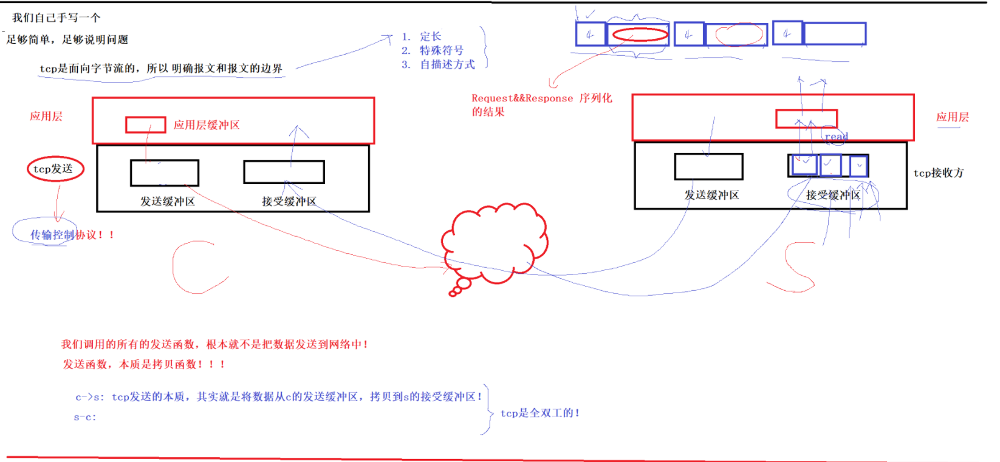
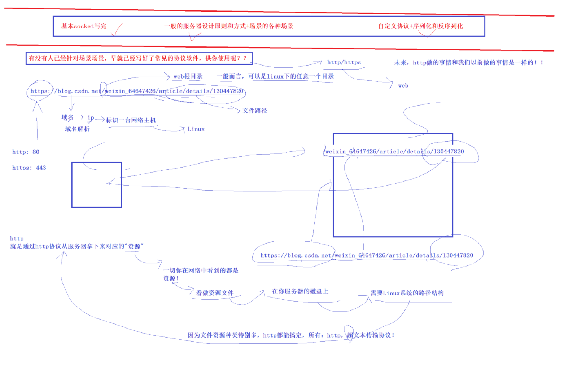

# BIT.11_网络基础2.pdf

## 1初始三次握手四次挥手

**TCP**


**listen和accept 套接字**

**connnet 发起三次握手  建立是双方的OS自动完成的。 发起然后建立。**

**accept只是只是负责获取。**

**然后，双方read和write。**

**四次挥手，曾经先先建立。然后才断开链接。**


**建立链接一定是先记住一些什么东西。**

**三次握手是手段，建立链接是目的。**


**建立链接需要先描述，然后组织起来的。**

**链接OS完成的，需要花时间的。断开链接四次挥手。**

**建立链接双方协商，断开链接双方协商。**


**Uniform Resource Locator**

**URL**

**（统一资源定位符）**


**HTTP = HyperText Transfer Protocol**

**（超文本传输协议）**


## 2协议

**再谈协议**

**什么是协议：约定**


**传输一个结构化的数据呢**

**头像url,时间，昵称，消息---》打包变成一个报文，方便我们就那些整体发送。**

**多变一：序列化的过程。**


**网络发送**

**收到一个报文，反序列化**

**头像url,时间，昵称，消息**

**结论：业务结构数据在发送到网络中的时候，先序列化在发送，**

**收到的一定是序列字节流，要先进行反序列化，然后才能使用**


```c++
结构化数据进行建模 业务协议
class/struct message
{
  string url;
  string time;
  string nickname;
  string
  msg;
};
```

**TCP这里，你怎么保存你收到一个完整的报文？**

**协议**




**我们自己手写一个**

**TCP是面向字节流的，明确报文和报文的边界。**

**TCP有自己的发送缓冲区，接收缓冲区。**


**应用层 (应用层缓冲区)**

**TCP层 (之间就是套接字)**

**我们调用的所有的发送函数，根本就不是把数据发送到网络中！**

**发送函数，本质是拷贝函数！(TCP协议自己决定什么时候发送)**

**接收函数，本质是拷贝函数！(TCP协议自己决定什么时候接收)**

**s-c:TCP发送的本质, 其实就是将数据从s的发送缓冲区，拷贝到c的接收缓冲区。**

**c-s:TCP发送的本质, 其实就是将数据从c的发送缓冲区，拷贝到s的接收缓冲区。**

**所以TCP是全双工的。(接收和发送的缓冲区分开的)**

**来不及缓冲区太多的数据了。如何解决**

**1.定长**

**2.特殊符号**

**3.自描述方式 [4字节特殊符号，数据的长度][真实数据]**




****


