# BIT.13_高级IO.pdf

## 重点

理解五种IO模型的基本概念, 重点是IO多路转接.

 掌握select编程模型, 能够实现select版本的TCP服务器.

 掌握poll编程模型, 能够实现poll版本的TCP服务器. 

掌握epoll编程模型, 能够实现epoll版本的TCP服务器. 

理解epoll的LT模式和ET模式. 

理解select和epoll的优缺点对比. 


## 什么是IO

**什么是IO？什么是高效的IO？**

**网络和系统都是从缓冲区里面拷贝数据。**

**read/recv**

**1.没有数据，阻塞住**

**2有数据，拷贝完成就返回了。**

**阻塞的本质：阻塞的本质就是进程等待某种资源就绪**

**IO的本质：等 + 数据拷贝。**

**高效的IO：数据拷贝是软件决定的，该是多少就是多少。  减少等的时间重就是高效的IO。**

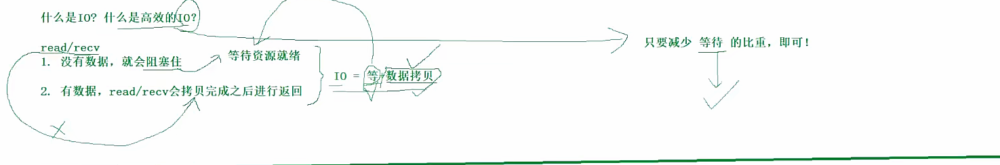

## IO的方式

**钓鱼：等 + 钓**

**1.张三：等 + 钓                                                                            阻塞**

**2.李四：边等 + 边学习 + 边钓鱼                                                     非阻塞**

**3.王五：边等鱼竿的铃铛 + 边学习  + 听消息                                   信号驱动**

**4.赵六：等一排鱼竿                                                                            多路转接/多路复用**

**5.田七：让小王钓鱼到指定目标就返回。 田七自己忙，小王钓鱼。    异步IO**

**等的比重低，旁观者看来就是高效的。**

**鱼：数据**

**河：内核**

**鱼鳔：就绪事件**

**鱼竿：文件描述符**

**钓鱼的动作：read/recv。**

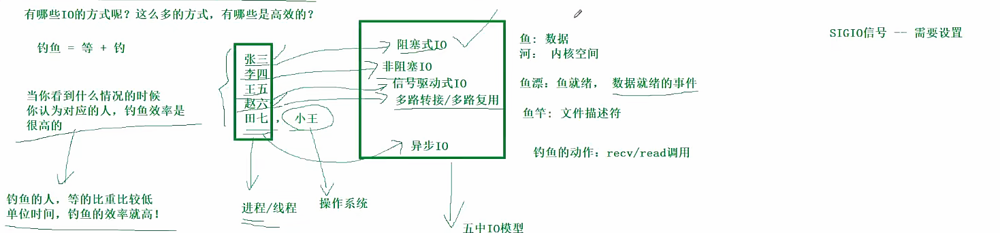

**五种IO模型**

****

**3,4,5效率是没有区别的。其它方面有区别的。4,5表现在可以做其它方面的事情。**

**6信号驱动一定等了。**

**3,4,5,6：都参与等了，参与IO的等待，这就是同步IO的。**

**田七：没有参与IO等待的过程，这就是异步IO。**

**阻塞和非阻塞：等待的方式不一样了的。**

**多路转接、多路复用为什么高效？减少等待的时间了。**

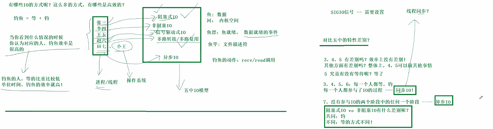

阻塞

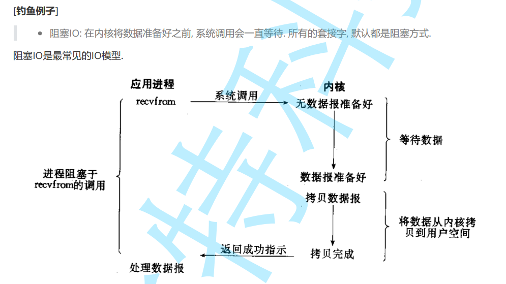

**非阻塞IO**


**信号驱动**

**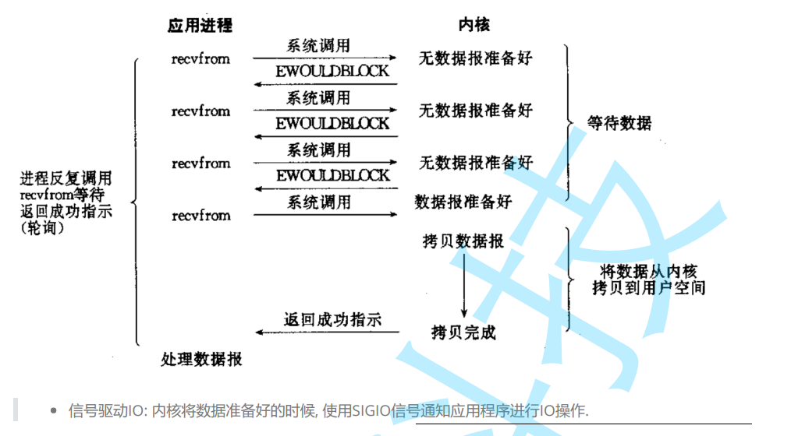**

**多路转接：一次等待多个文件描述符合。**

**select, poll epoll:只是负责等，只是负责等，只是负责等。 需要配合其它的IO函数。**

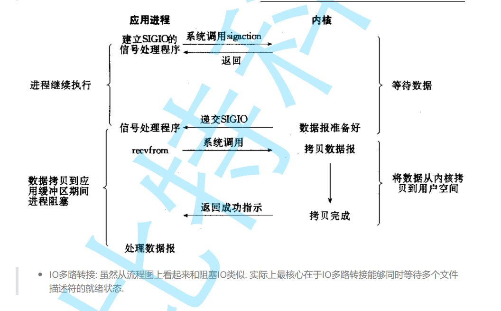

**异步IO**

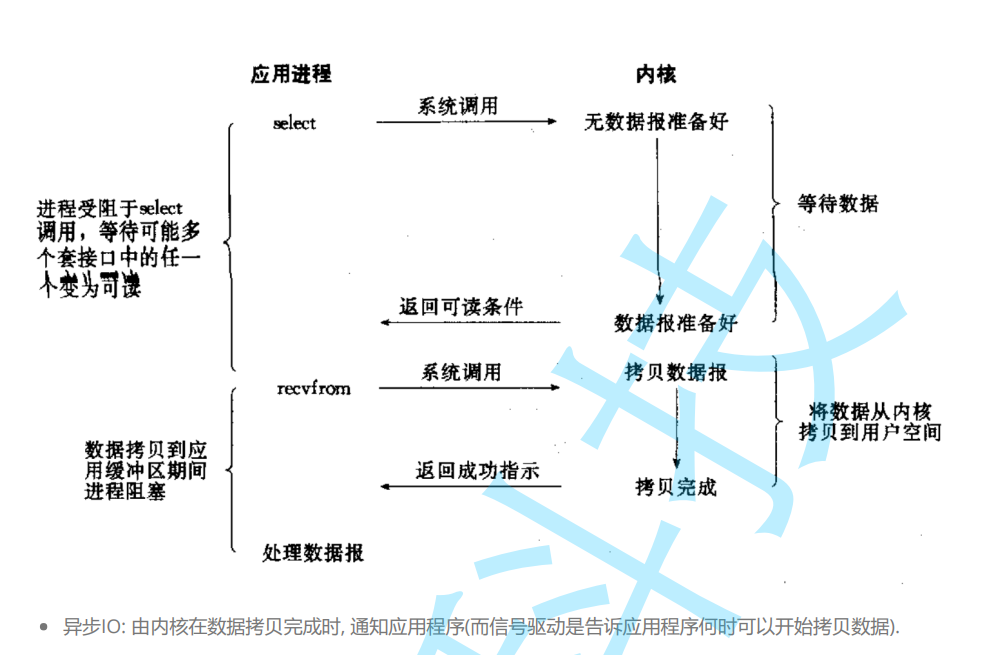

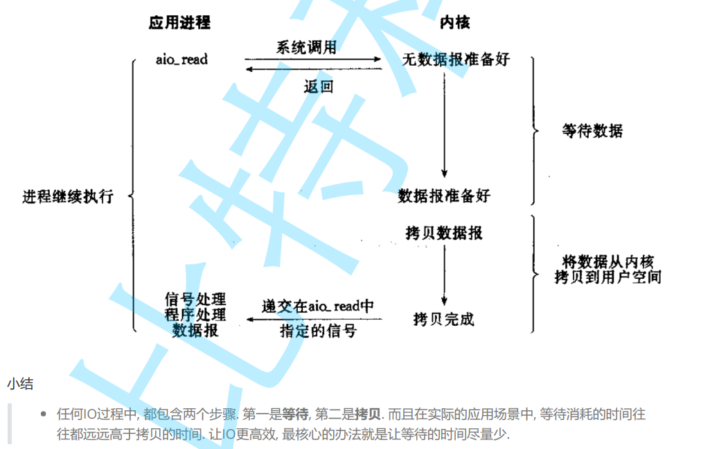

**同步IO和异步IO：参与等没有。**


```c++
       #include <unistd.h>
       #include <fcntl.h>

       int fcntl(int fd, int cmd, ... /* arg */ );


```


## 非阻塞IO

```c++
#include "util.hpp"    
#include <vector>    
#include <cstdio>    
#include <functional>    
    
using func_t = std::function<void()>;    
    
#define INIT(cbs) do{\    
      cbs.push_back(printLog);\    
      cbs.push_back(download);\    
      cbs.push_back(executeSql);\    
    }while(0)    
    
#define EXEC_OTHER(cbs) do{\    
      for(auto const& cb : cbs) cb();\    
}while(0)    
    
    
int main()    
{    
  std::vector<func_t> cbs;    
  INIT(cbs);    
    
  setNoBlock(0);    
  char buffer[1024] = {0};    
  while(true)    
  {    
    printf(">>>>");    
    fflush(stdout);    
    ssize_t s = read(0, buffer, sizeof(buffer) - 1);    
    if(s > 0)    
    {    
      buffer[s] = 0;    
      std::cout<< "echo#" << buffer << std::endl;    
    }    
    else if(s == 0)    
    {    
      std::cout<< "read end" << std::endl;    
      break;    
    }    
    else    
    {    
      // s==-1    
      // 1.当我不输入的时候，底层没有数据，算错误吗？不算错误，只不过以错误的形式返回了    
      // 2.那我如何区：是真的错了，还是底层没有数据？(单纯返回值不能够区分的，还需要根据错误码进行判断的)    
      /*    
       *std::cout<< "s:" << s << " erron:"<< errno <<std::endl;    
       */    
      /*    
       *std::cout<< "s:" << s << " erron:"<< strerror(errno) <<std::endl;    
       */    
    
      /*    
       *std::cout<< "EAGAIN:" << EAGAIN << " EWOULDBLOCK:" << EWOULDBLOCK << std::endl;    
       */    
    
       std::cout<< "s:" << s << " erron:"<< errno <<std::endl;    
       if(errno == EAGAIN)    
       {    
         std::cout<< "我没有错，只是没有数据而已" << std::endl;                                                                                                                                                                                                
         EXEC_OTHER(cbs);    
       }    
       //1.需要重新读取数据的    
       else if(errno == EINTR)      
       {    
          continue;
       }
       else 
       {
        std::cout<< "s:" << s << " erron:"<< errno <<std::endl; // 真正的错误了
        break;
       }

      sleep(5);
    }
  }
  return 0;
}

```

```c++
#pragma once     
    
#include <iostream>    
#include <unistd.h>    
#include <fcntl.h>    
#include <cstring>    
#include <cerrno>    
    
void setNoBlock(int fd)    
{    
//1.先获取文件描述符的状态标志    
  int f1 = fcntl(fd, F_GETFL);    
  if(f1 < 0)    
  {    
    std::cerr << "fcntl:" << strerror(errno) << std::endl;    
    return;    
  }    
    
//2.通过按位或追加一个标志    
  fcntl(fd, F_SETFL, f1 | O_NONBLOCK);    
    
//3.严谨一点的这里可以判断返回的信息    
}    
    
void printLog()                                                                                                                                                                                                                                                
{    
  std::cout<< "this is a log" << std::endl;    
}    
    
void download()    
{    
  std::cout<< "this is a download" << std::endl;    
}    
    
void executeSql()    
{    
  std::cout<< "this is a executeSql" << std::endl;    
} 
```


## Select

**IO = 等 + 拷贝**

**select只是负责等待，可以一次等待多个fd, select本身没有拷贝的能力，拷贝需要read, write来完成的。**

```c++
int select(int nfds, fd_set *readfds, fd_set *writefds, fd_set *exceptfds, struct timeval *timeout);
// nfds:监视多个fd中，最大fd的值加一
// 剩下的四个参数都是输入输出型参数
// struct timeval* timeout
    // 	nullptr:阻塞等待。
	// 	struct timeval timeout = {0,0} 非阻塞
	// 	struct timeval timeout = {5,0} 5s以内阻塞式(5s以内都可以返回的)，超过5s，非阻塞返回一次

    //  struct timeval
    // { 
    //  time_t tv_sec;
    //  suseconds_t tv_sec; 
    //}

// 返回值 > 0 有几个文件描述符准备就绪了
// 返回值==0  超时返回
// 返回值 < 0 调用失败

// 只关心读，写，异常事件
// fd_set位图结构，表示文件描述集合
// fd_set:
// 输入：表示用户告诉内核，你要帮我关系一下，我给你的集合中所有的fd的读事件. 哪些fd上的读事件内核需要你关系一下。
// 0000 0000：比特位的位置 表示fd的数值，比特位的内容，表示是否关关心。
// 0010 0010:只是关系1和5的读事件
// 输出：内核告诉用户，你所关系的多个fd中，哪些已经就绪了 0000 0010.1号文件描述符已经好了的
// 比特位的位置，表示fd的数值，比特位的内容，表示哪些fd上面对应的事件已经就绪了。
// 让用户和内核之间相互沟通，互相知晓对方要的和关心的。

// 读，写，异常事件类似的。

// 
void FD_CLR(int fd, fd_set *set);  // 清除
int  FD_ISSET(int fd, fd_set *set); // 判断在不在
void FD_SET(int fd, fd_set *set); // 设置进位图
void FD_ZERO(fd_set *set);       // 清空位图结构的
```

**1.了解select基本概念和接口介绍**

​	**select直接监视多个文件描述符，程序会在select等待，直到监视的文件描述符返回**

​	**select未来只关心：读，写，异常事件。**

​	


**2.代码**

​	**listen套接字首先交给select, listensock的连接就绪事件 == 读事件就绪的。**


**3.总结**

**1.select能够同时等待的文件fd是有上限的，除非重新修改内核，否则无法解决的。 fd_set是一个位图结构，有类型就是有大小的。**

​	**企业也是有上限的。 select上限1024的。**

​	**内核设置是： 65535个文件的**

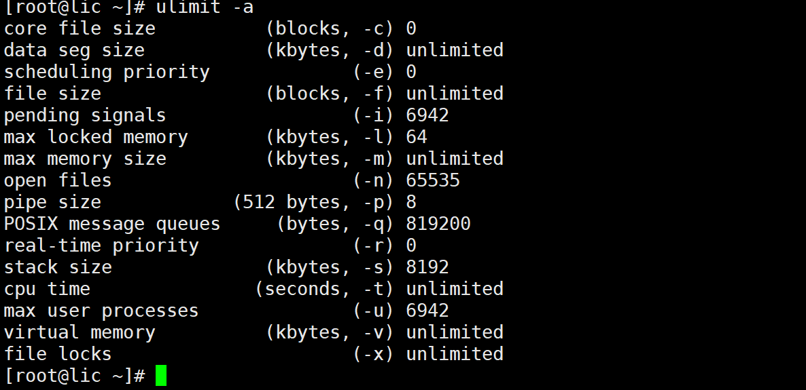

**2.必须借助第三方数组，来维护合法的fd**

**3.select大部分是输入输出型参数，调用select前，需要重写设置所有的fd,调用之后，我们还需要检查所有的fd,者带来了的遍历的成本--用户**

**4.select为什么第一个参数是fd + 1呢？  遍历这个数组的 [0, fd] 查一遍给你的。 确定遍历范围--内核层面。**

**5.select采用位图， 用户--内核  内核--用户。 来回进行拷贝的，拷贝的成本的问题。**


## poll

**1.解决select的fd有上限的问题**

**2.每次调用都需要重新设置关心的fd.**

```c++
int poll(struct pollfd *fds, nfds_t nfds, int timeout);
// struct pollfd*
// 动态数组， new/malloc出来的

// timeout 单位毫秒，纯输入型的
// > 在timeout时间内返回，否则 非阻塞返回一次的。
// = 非阻塞
// < 阻塞等待
// 返回值同select

struct pollfd 
{
    int fd;
    short events;
    short revents;
};

// 输入看：fd + events。
// 输出看：fd + revents. 你要关系的fd上面的events中哪些事件已经就绪啦
// 1.输入输出参数分离了. poll不需要重新设置的
	
// 2.解决select等待文件有上限的。
```


**event的事件。宏值，设置进内核的。**

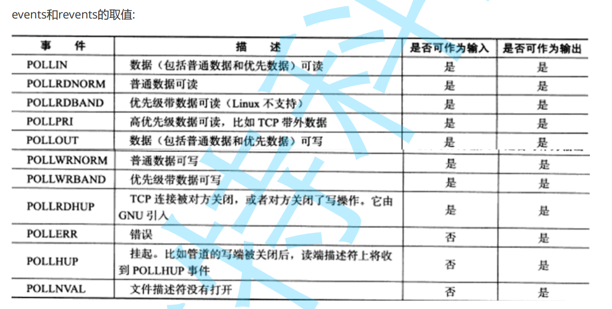

**poll的缺点：遍历问题的。**


## epoll

**extend poll。增强版本的poll。和poll没有半毛钱的关心的。**

**1.直接快速认识poll的接口**

````c++
 int epoll_create(int size);
// int size   >0 就行了
// 
````

```c++
int epoll_ctl(int epfd, int op, int fd, struct epoll_event *event);
// epfd
// op增，改，删除
//   EPOLL_ADD
//   EPOLL_MOD
//   EPOLL_DEL
// fd文件描述符的event事件
```

**事件**

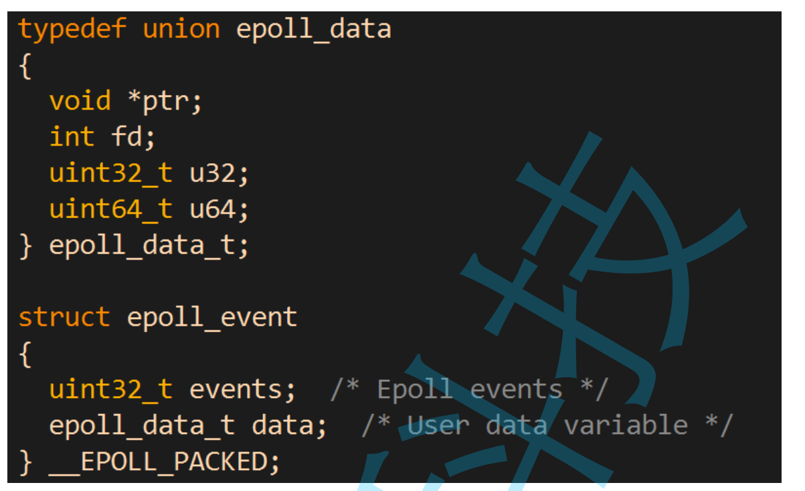

**事件**

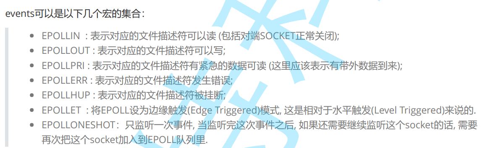

```c++
int epoll_wait(int epfd, struct epoll_event *events, int maxevents, int timeout);
// 返回值，select/poll一模一样的
// 2,3输出型参数,内核告诉用户，哪些文件描述符已经准备就绪了
// ms,同poll
```

**2.epoll底层的原理**

**OS怎么知道网络中有数据到来？ 输入设备网卡。  **

​	**硬件中断设备。 中断向量表(函数指针)。 **

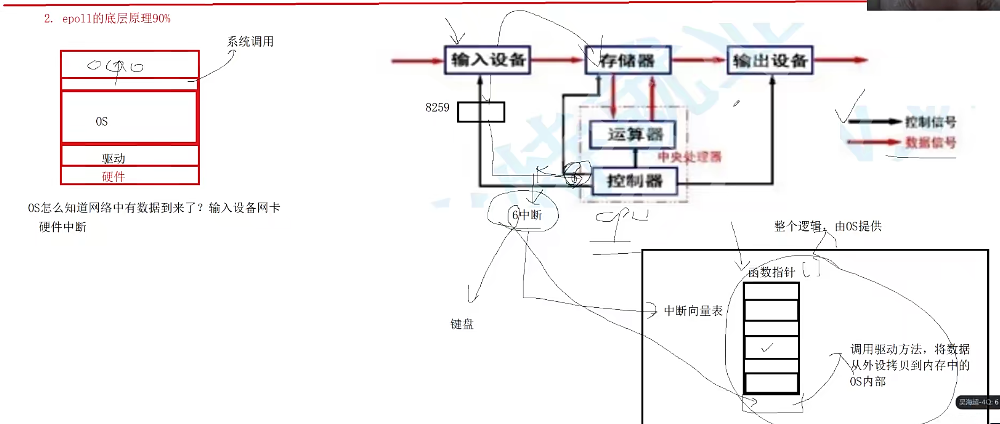


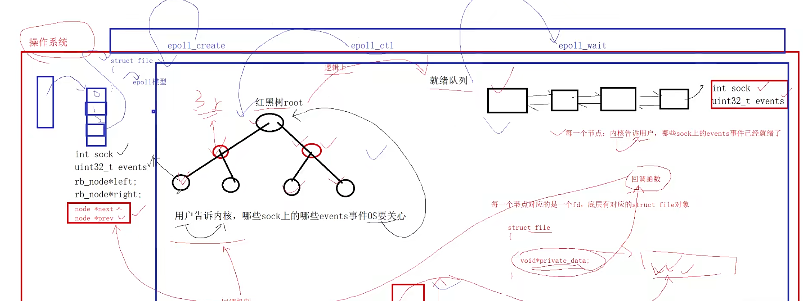

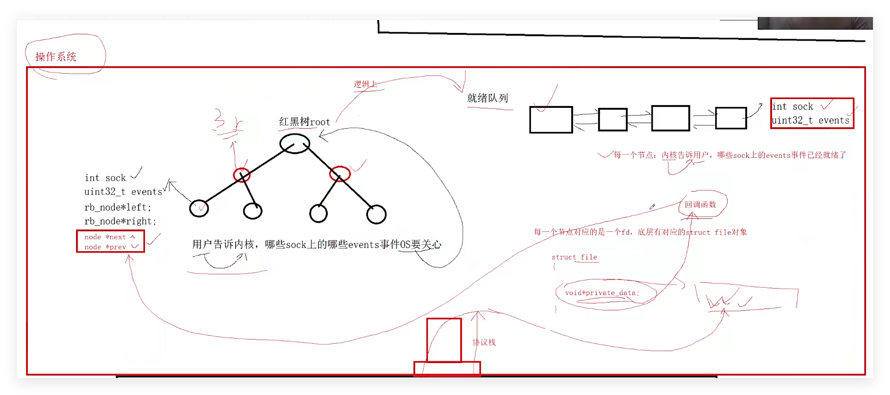


**给每一个文件描述符注册一个回调方法，然后把红黑树的节点 到  对应的序列当中去。**


**3.只关心读取的epoll的server**


