# BIT.4_Linux进程控制.pdf

##  1进程创建

**认识fork函数**

**分配新的内存块和内核数据结构给子进程 **

**将父进程部分数据结构内容拷贝至子进程 **

**添加子进程到系统进程列表当中 **

**fork返回，开始调度器调度**


**fork的返回值**

**1一个函数两个返回值 **

**return之前 已经有两个执行流了**

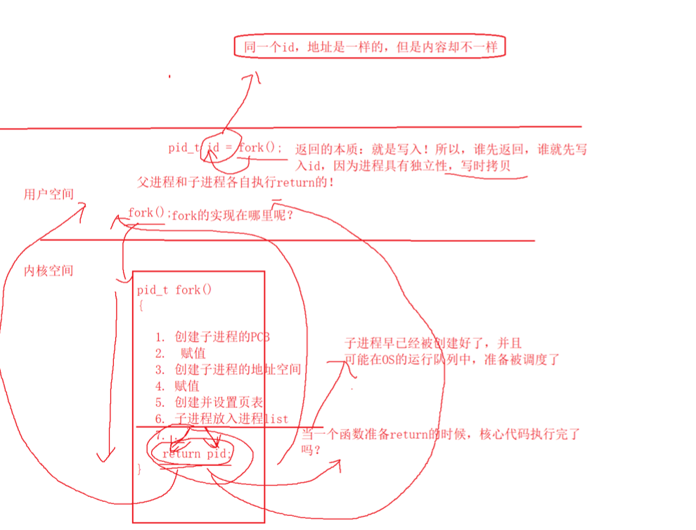

**2如何理解fork返回之后， 给父进程返回子进程的pid，给子进程返回 0？  父亲 ： 孩子 == 1 ： n。 唯一性**


**3 同一个id两个值，if eles同时执行的 **


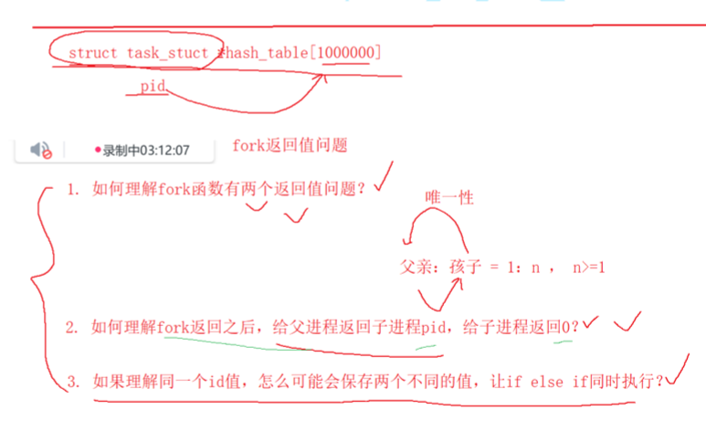

**复习**

**系统级别的环境变量，适用不同的场景 。 全局环境变量具有全局属性的。 子进程可以继承下去的。**

**echo  内置指令**

**命令行参数， 根据不同的选项执行不同的功能。 命令行参数 **

**环境变量表  getenv  main函数  extern char* environ**

**进程地址空间 ： 先见见现象， 地址一样，值不一样。这里是虚拟地址。进程地址空间。**

**OS让进程感觉自己独享空间，设计理念。 进程并不知道进程的关系，进程的独立性。**

**进程地址空间的管理：本质就是一堆的刻度管理(刻度在PCB里面的)。mm_struct管理起来的。_start  _end管理**


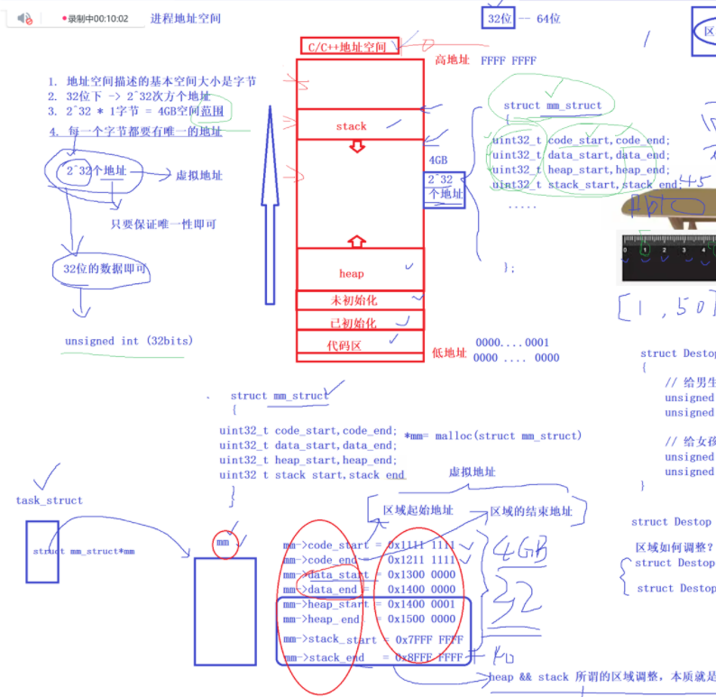


**页表映射数据**

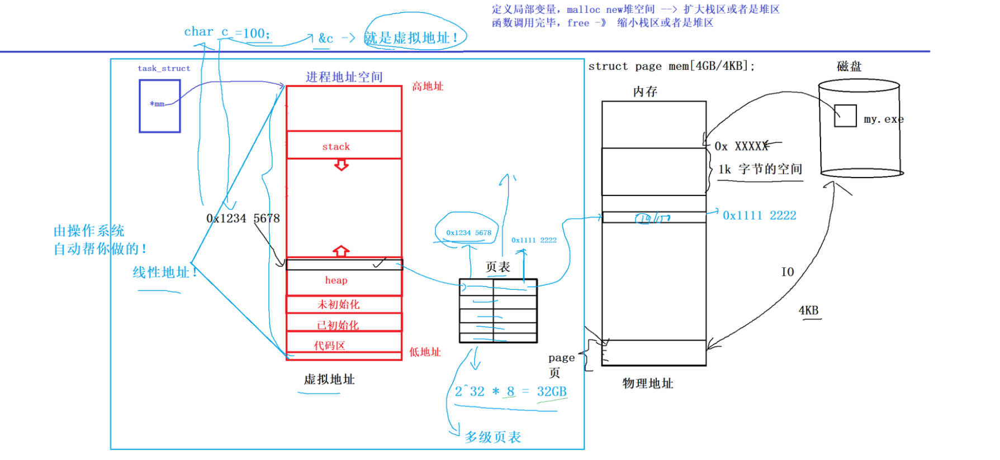


**写实拷贝**

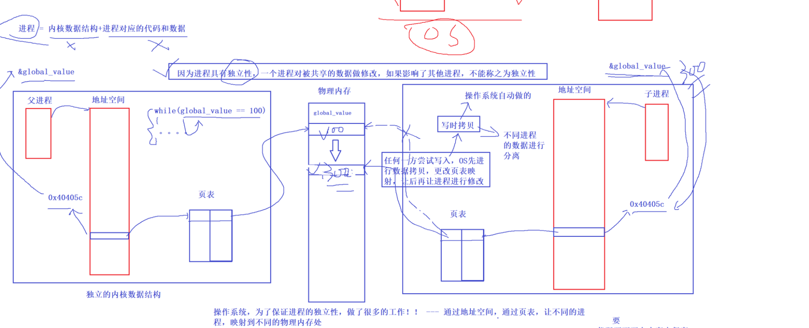


**进程地址空间的意义**


**mm_struct 的初始化 就是你编译好的代码的地址，已经可以初始化的数据 可以有地址的数据。栈区等加载到内存在进行初始化的**

**两套地址 **

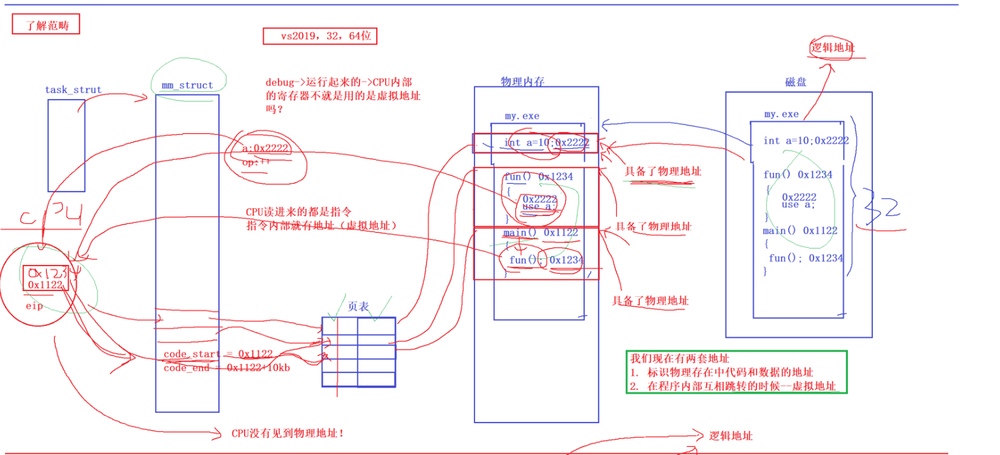

 

**进程创建**

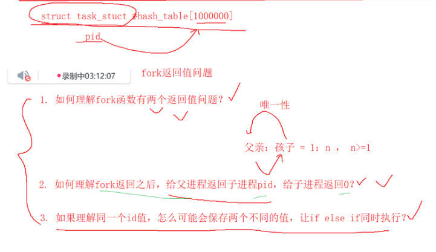


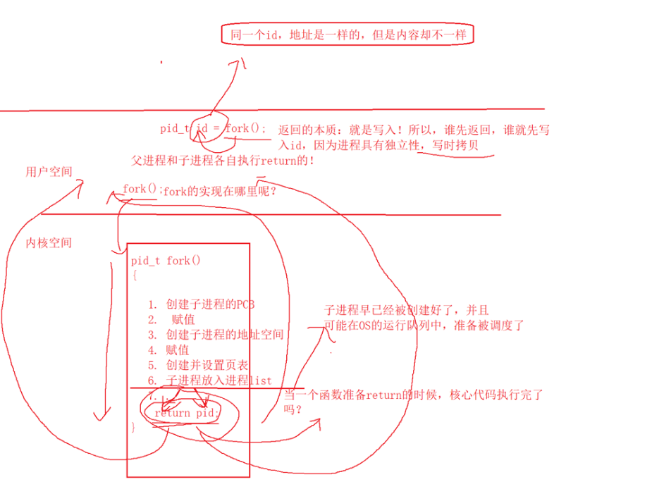


**写时拷贝**

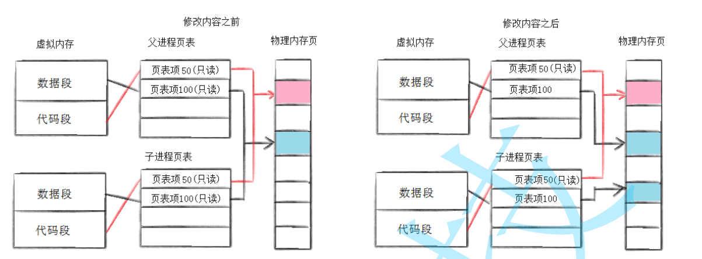


## 2进程终止

**return 0**

```c
#include <stdio.h>
#include <string.h>
int main()
{
	for(int i = 0; i < 200; i++)
    {
        printf("%d : %s \n", i, strerror(i));
    }

	// 进程的退出码，用于标定进程是否正确退出成功。
	return 0
}
```


**?是shell的一个变量，永远记录最近一个进程的退出码，main--->return**

**echo $?**

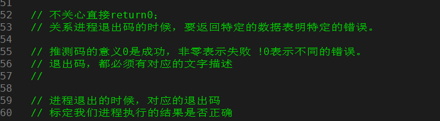

**一般而言退出码，都需要对应的描述信息。**


**进程退出一般三种情况**


**return  0**

**return  ！0**

**退出码无意义**


**进程如何退出的问题**

**mian函数 return **

**任意地方的exit函数退出 **

**_exit函数**


```c
#include<stdio.h>      
#include<unistd.h>      
#include<string.h>      
#include<stdlib.h>      
      
      
int addto(int from, int to)      
{      
  int sum = 0;      
  for(int i = from; i <= to; i++)      
  {      
    sum += i;      
  }                                                                                                                                                                                                  
  exit(21);
  /*                                                                           
   *_exit(21)                                                                    
   */                                                                          
} 

int main()
{
     printf("hello lichermionex ");         
 	add(1, 100);
    
    return 0;
}

```

**_exit函数终止不会主动刷新缓冲区，exit函数会刷新缓冲区的。**

**底层exit    调用  _exit函数的。**

**exit函数是用户层函数**

**缓冲区在哪里呢： 用户层的 不会早OS里面的。**

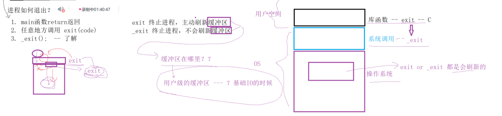


## 3进程等待

**z状态，僵尸状态。**

**进程等待，解决僵尸进程的问题。**


**wait函数**

```c
#include <unistd.h>
#include <assert.h>
#include <stdio.h>
#include <stdlib.h>
#include <sys/wait.h>

int main()
{

  pid_t id = fork();
  assert(id >= 0);

  if(id == 0)
  {
    printf("I AM CHILD, I am running  pid : %d\n", getpid());
    sleep(3);
    exit(13);
    printf("I AM CHILD, I am ending  \n");
  }
  else 
  {
    
// 退出的信号    
// exit退出
// termial退出    
//    
    printf("I am waiting child ,,,,\n");                                                                                                                                                                            
    int status = 0;    
    pid_t child_pid = wait(&status);    
    
    // printf("%d \n", (status >> 8) & 0XFF );    
    
// wait if exited    
    if(WIFEXITED(status)) // wait if exited退出    
    {    
      printf("eixt code : %d \n",WEXITSTATUS(status)); // wait exit status    
    }    
    
// wait if signaled    
    if(WIFSIGNALED(status)) // wait if signaled 退出    
    {    
      printf("signal code : %d \n", WTERMSIG(status)); // wait terminal signal    
    }    
    
    printf("status : %d \n", status);    
    printf("child_pid : %d \n", child_pid);    
    printf("I am waiting child success \n");    
  }    

// wait是阻塞式等待，直到子进程退出    
// 成果了返回子进程的PID, 失败返回-1    
// 输出的信息在，输出型参数里面    
    
// WIFEXITED(status) 
// WEXITSTATUS(status) 

// WIFSIGNALED(status)
// WTERMSIG(status)

// 正常退出的时候退出码就是零
// 不正常退出的时候，退出码在8-15

  return 0;
}


```


**wait的返回值信息**

```c
#include <unistd.h>    
#include <sys/wait.h>    
#include <sys/types.h>    
#include <stdio.h>    
#include <string.h>    
#include <assert.h>    
    
    
int main()    
{    
  pid_t id = fork();                                                                                                                                                                                                
  if(id == 0)       
  {          
    int cnt = 10;
    while(cnt)   
    {         
      printf("我是子进程：%d, 父进程的:%d , %d \n", getpid(), getppid(), cnt--);
      sleep(1);                                                                 
    }          
  }  
  sleep(15);
  pid_t ret = wait(NULL);  // 返回值就是等待子进程的pid
  if(id > 0)             
  {                      
    printf("wait success :%d \n", ret);
  }                                    
  return 0;                            
}  
```


**waitpid的输出型参数**

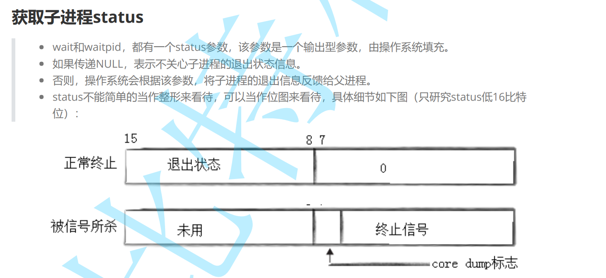


```c
#include <unistd.h>    
#include <stdlib.h>    
#include <sys/wait.h>    
#include <sys/types.h>    
#include <stdio.h>    
#include <string.h>    
#include <assert.h>    
    
    
int main()    
{    
  pid_t id = fork();    
  if(id == 0)    
  {    
    int cnt = 5;    
    while(cnt)    
    {    
      printf("我是子进程：%d, 父进程的:%d , %d \n", getpid(), getppid(), cnt--);    
      sleep(1);    
    }    
    exit(10);                                                                                                                                                                                                       
  }    
  sleep(10);    
  int status = 0;    
  // 15-8退出状态    
  // 7core dump    
  // 6-0终止信号    
  pid_t ret = waitpid(id, &status, 0);    
  if(id > 0)    
  {  
    // 111 1111
    printf("wait success : ret : %d,  sig number : %d, child exit code : %d  \n", ret, (status & 0x7F), (status>>8)&0xFF);
     
  }    
  return 0;    
}   
```


**僵尸进程的信息放在那里呢？**

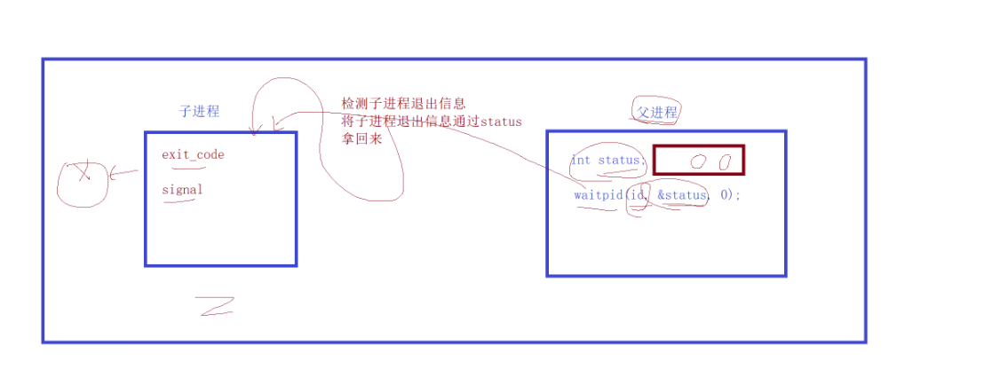

**检查子进程的退出信息， **

**复习**

**进程创建**

**创建PCB，地址空间，页表，映射，进程代码和数据load到内存里面**

**进程退出**

**释放资源，变成僵尸，父进程读取**

**退出exit和_exit**
**用户级别的缓冲区**

**从退出进程的tast_struct中获取。**
**1.进程退出会变成僵尸，会把自己的退出结果写入到自己的task_struct**
**2.wait和waitpid是一个系统调用，os os有资格也有能力去读取子进程的task_struct**


```c
#include <stdio.h>    
#include <unistd.h>    
#include <stdlib.h>    
#include <sys/wait.h>    
#include <sys/types.h>    
#include <assert.h>    
    
int main()    
{    
    
  pid_t id = fork();    
  assert(id != -1);    
    
  if(id == 0)    
  {    
    int cnt = 10;    
    while(cnt)    
    {    
      printf("child runing, pid : %d, ppid : %d, cnt : %d \n", getpid(), getppid(), cnt--);    
      sleep(1);    
    }    
    exit(10);                                                                                            
  }    
    
    
  int status = 0;    
  int ret = waitpid(id, &status, 0);    
  if(ret > 0)    
  {    
    printf("wait success, exit code : %d , sig number : %d \n", (status>>8)&0xFF, status&0x7f);    
  }    
    
  return 0;    
}  
```


```c
 30     // 是否正常退出
 31     if(WIFEXITED(status))
 32     {
 33       printf("exit code : %d \n", WEXITSTATUS(status)); // 运行结果的
 34     }    
```


**wait, waitpid是一个系统调用函数**

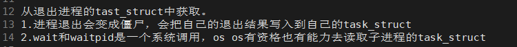


**阻塞和非阻塞等待的状态**

**阻塞等待**

**多次非阻塞等待---就是轮询**

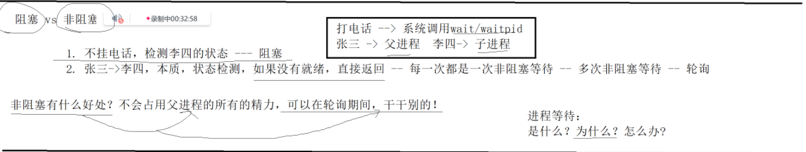


**轮询等 WNOHONG**

```c
#include <stdio.h>
#include <unistd.h>
#include <stdlib.h>
#include <sys/wait.h>
#include <sys/types.h>
#include <assert.h>

int main()
{
    
  pid_t id = fork();    
  assert(id != -1);    
    
  if(id == 0)    
  {    
    int cnt = 10;    
    while(cnt)    
    {    
      printf("child runing, pid : %d, ppid : %d, cnt : %d \n", getpid(), getppid(), cnt--);    
      sleep(1);    
    }    
    exit(10);    
  }    
    
  int status = 0;    
  while(1)    
  {    
  int ret = waitpid(id, &status, WNOHANG); // 非阻塞等待，                                                                                                                                                          
      if(ret == 0)    
      {    
        // waitpid调用成功，子进程没有退出    
        // 子进程没有退出，我的waitpid没有等待失败，仅仅是是检测到了子进程没有退出，    
        printf("真正等待中、\n");    
        sleep(1);    
      }    
      else if(ret > 0)    
      {    
        // waitpid调用成功，子进程退出了    
        printf("wait sucess \n");    
        break;    
      }    
      else    
      {    
        printf("等待失败了、\n");    
        break;    
      }    
  }  
 
   return 0;
}

```


**非阻塞等待好处？不会占用父进程的所有精力，可以轮询期间干干别的！**

```c
#include <stdio.h>    
#include <string.h>    
#include <unistd.h>    
#include <stdlib.h>    
#include <sys/wait.h>    
#include <sys/types.h>    
#include <assert.h>    
    
#define NUM 10    
typedef void (*func_t)();     
    
void task1()    
{    
  printf("task1 \n");    
}    

void task2()    
{    
  printf("task2 \n");    
}    
    
void task3()    
{    
  printf("task3 \n");    
}    
    
func_t handerTask[NUM];    
    
void loadTask()    
{    
  memset(handerTask, 0, sizeof(handerTask));    
  handerTask[0] = task1;    
  handerTask[1] = task2;    
  handerTask[2] = task3;    
}    
    
    
int main()    
{    
  pid_t id = fork();    
  assert(id != -1);    
  if(id == 0)    
  {    
    int cnt = 10;    
    while(cnt)                                                                                                                                                                                                      
    {    
      printf("child runing, pid : %d, ppid : %d, cnt : %d \n", getpid(), getppid(), cnt--);    
      sleep(1);    
    }  
      exit(10);    
  }
  
  loadTask();
  int status = 0;
  while(1)
  {
      int ret = waitpid(id, &status, WNOHANG); // 非阻塞等待，
      if(ret == 0)
      {
        // waitpid调用成功，子进程没有退出
        // 子进程没有退出，我的waitpid没有等待失败，仅仅是是检测到了子进程没有退出，
        printf("正在等待中、\n");  
        for(int i = 0; handerTask[i] != NULL; i++)
        {
          handerTask[i]();
        }
        sleep(1);
      }
      else if(ret > 0)
      {
        // waitpid调用成功，子进程退出了
        printf("wait sucess \n");
        break;
      }
      else 
      {
        printf("等待失败了、\n");
        break;
      }	
  }
  return 0;
}

```


## 4进程程序替换

**进程替换**
**1.创建子进程的目的**
**让子进程执行父进程的一部分。执行父进程对应磁盘代码中的一部分。**
**让子进程执行一个全新的程序，让我们的子进程想办法，加载磁盘上指定的程序，执行新程序的代码和数据。**

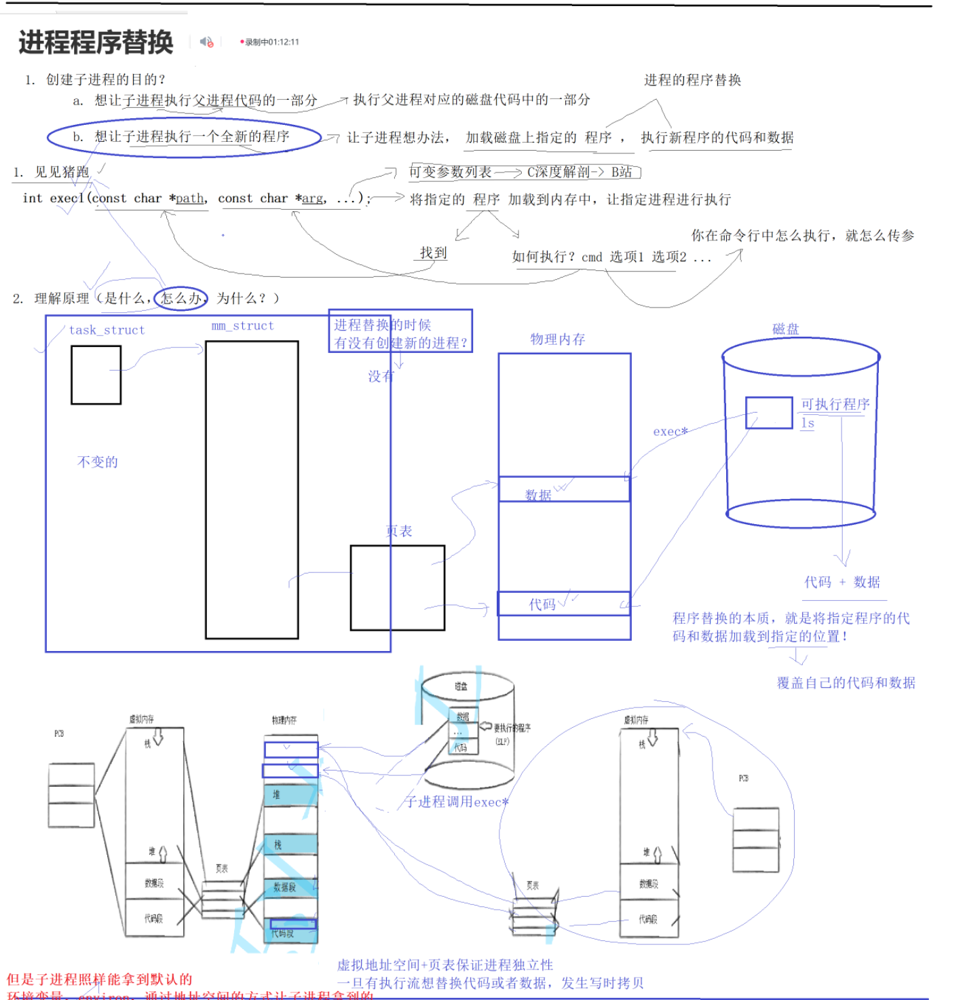

**将指定程序加载到内存里面，如何找到，然后就是选项参数。**

```c
#include <stdio.h>    
#include <string.h>    
#include <unistd.h>    
#include <stdlib.h>    
#include <sys/wait.h>    
#include <sys/types.h>    
#include <assert.h>      
    
int main()    
{    
    
  printf("process is runing ...\n");    
    
  execl("/usr/bin/ls", "ls", "-a", "-l" ,NULL); // exec系列 必须是NULL结尾。  
  // execl("/usr/bin/lssdgdfg", "ls", "-a", "-l" ,NULL); // 函数失败，不会替换
  // 只需要错误的返回值
    
  printf("process is runing ...\n");    // 不执行这条语句
  // printf也是代码，是在execl之后，是在execl执行完毕，代码已经完全覆盖了，开始执行新的代码了,无法执行printf了。
    
    
  return 0;    
} 
```


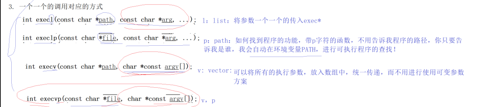


**exec*  将程序加载到内存里面。**

**exec* 加载器**

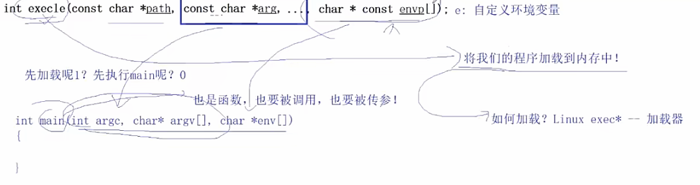


**execve 就这一个函数**

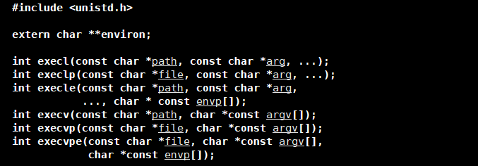

**execve是系统调用， 其它的都是封装起来的。**

**这些函数调用 不要省略。**


**程序替换系列**

```c
 #include <stdio.h>
  #include <string.h>
  #include <unistd.h>
  #include <stdlib.h>
  #include <sys/wait.h>
  #include <sys/types.h>
  #include <assert.h>
  
  
  
  
  int main(int argc, char* agrv[])
  {    
    printf("process is runing ...\n");    
        
    pid_t id = fork();    
    assert(id != -1);    
      
    if(id == 0)    
    {    
      /*    
       *execl("/usr/bin/ls", "ls", "-a", "-l", "-h", NULL); // 写时拷贝，新数据和代码执行。新的进程加载新的数据和代码。写时拷贝了。    
       */    
      
      /*    
       *execlp("ls", "ls", "-a", "-l", "-h", NULL);    
       */    
      
  /*    
   *    char* const argv[] = {    
   *      "ls",    
   *      "-a",    
   *      "-l",    
   *      "-h",    
   *      NULL    
   *    };    
   *    
   *    execv("/usr/bin/ls", argv);    
   */    
      
  /*    
   *     char* const argv[] = {    
   *       "ls",    
   *       "-a",    
   *       "-l",    
   *       "-h",    
   *       NULL    
   *     };                                                                                                                                                                                                         
   *    
   *    execvp("ls", argv);    
   */    
  /*
     *execl("./mybin", "./mybin", NULL);
     */
  
    // 自己的环境变量
  /*
   *    char* const envp_[]={
   *      (char*)"MYENV=1222111111111",
   *      NULL
   *    };
   *
   *  execle("./mybin", "mybin", NULL, envp_); 
   */
    
  
  
  /*
   *     extern char** environ;
   *     execle("./mybin", "mybin", NULL, environ);
   */
  
      /*
       *extern char** environ;
       *putenv((char*)"MYENV=1111111111111"); // 添加到环境变量里面
       *execle("./mybin", "mybin", NULL, environ);
       */
  
  
    sleep(1);
    execvp(agrv[1], &agrv[1]);

    exit(1);
    }
  
    int status = 0;
    int ret = waitpid(id, &status, 0);
    
    if(WIFEXITED(status))
    {
      printf("exit code : %d \n", WEXITSTATUS(status));
    }
    
    if(WIFSIGNALED(status))
    {
      printf("signal code : %d \n", WTERMSIG(status));
    }
  
    printf("process is runing ...\n");
  
  
  
  
    return 0;
  }

```


## 5自定义shell


```c
 #include <stdio.h>    
  #include <string.h>    
  #include <string.h>    
  #include <unistd.h>    
  #include <stdlib.h>    
  #include <sys/wait.h>    
  #include <sys/types.h>    
  #include <assert.h>    
      
  #define NUM 1024    
  #define OPT_NUM 64    
  char lineCommand[NUM];    
  char* myargv[OPT_NUM];    
      
      
int main(int argc, char* agrv[])    
  {    
    while(1)    
    {    
      
    // 获取用户输入    
    printf("用户名@主机名：当前路径# ");    
    fflush(stdout);    
      
    // 获取用户输入信息    
    char* s = fgets(lineCommand, sizeof(lineCommand) - 1, stdin);    
    assert(s != NULL);    
    (void)s;    
      
    // 清除最后一个\n    
    lineCommand[strlen(lineCommand) - 1] = 0;    
    /*printf("test : %s \n", lineCommand);*/    
      
      
    // 循环切割    
      
    myargv[0] = strtok(lineCommand, " ");    
    int i = 1;    
      
  while(myargv[i++] = strtok(NULL, " "));    
      
    /*    
     *for(int i = 0; myargv[i]; i++)    
     *{    
     *  printf("%d : %s \n", i, myargv[i]);     
     *}    
     */                                                                                                                                                                                                             
        
    // 执行指令了      
        
    pid_t id = fork();    
    assert(id != -1);    
            if(id == 0)
    {
      execvp(myargv[0], myargv);
      exit(1);
    }
  
    int status = 0;
    waitpid(id, &status, 0);
  
    }
  


```

**复习**

**子进程的退出码和退休信号**

**程序替换的七个函数，本质上都是一个系统函数， 6个封装函数。**

**子进程执行一个全新的 程序。**

**如何找到，怎么执行**

**程序替换是系统级别的替换。**

**环境变量 可以被子进程进程。**

**execve系统函数，其它封装满足不同的场景。**

**复习**


**6当前路径**

**进程当前在那个工作目录下面的**

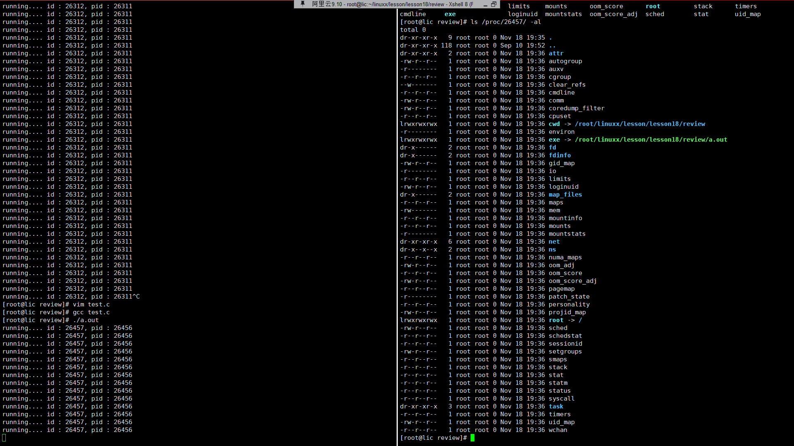

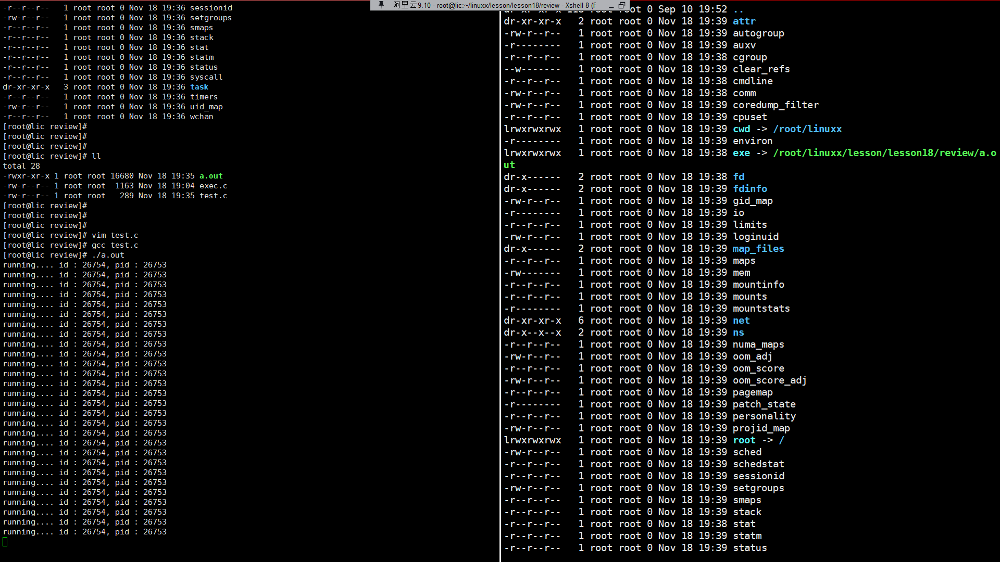


**chdir**

```c
#include <stdio.h>    
#include <unistd.h>    
#include <sys/wait.h>    
#include <sys/types.h>    
    
int main()    
{    
    
  chdir("/root/linuxx");                                                                                 
  pid_t id = fork();    
    
  if(id == 0)    
  {    
    while(1)    
    {    
      printf("running.... id : %d, pid : %d\n", getpid(), getppid());    
      sleep(2);    
    }    
  }    
    
  wait(NULL);    
    
    
    
    
  return 0;    
}    

```


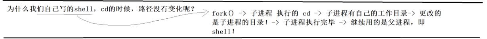


**自定义shell和内建指令**

```c
#include <stdio.h>    
  #include <string.h>    
  #include <string.h>    
  #include <unistd.h>    
  #include <stdlib.h>    
  #include <sys/wait.h>    
  #include <sys/types.h>    
  #include <assert.h>    
      
  #define NUM 1024    
  #define OPT_NUM 64    
  char lineCommand[NUM];    
  char* myargv[OPT_NUM];    
  int lastCode = 0;    
  int lastSig = 0;    
      
  int main()    
  {    
    while(1)    
    {    
            
    // 获取用户输入    
    printf("用户名@主机名：当前路径# ");    
    fflush(stdout);    
        
    // 获取用户输入信息    
    char* s = fgets(lineCommand, sizeof(lineCommand) - 1, stdin);    
    assert(s != NULL);    
    (void)s;    
      
    // 清除最后一个\n    
    lineCommand[strlen(lineCommand) - 1] = 0;    
    /*printf("test : %s \n", lineCommand);*/    
      
      
    // 循环切割    
      
    myargv[0] = strtok(lineCommand, " ");                                                                                                                                    
    int i = 1;    
    if(myargv[0] != NULL && strcmp(myargv[0], "ls") == 0)    
    {    
      myargv[i++] =(char*) "--color=auto";    
    }    

        >  while(myargv[i++] = strtok(NULL, " "));
  
  // cd命令，不需要创建子进程让shell自己执行对应的cd指令                                                                                                                     
  // 像这种不需要让我们子进程来执行，而是让shell自己执行的命令，内建内置命令
  // echo 
    if(myargv[0] != NULL && strcmp(myargv[0], "cd") == 0)
    {
      if(myargv[1] != NULL) chdir(myargv[1]);
      continue;
    }
    
    if(myargv[0] != NULL && myargv[1] != NULL && strcmp(myargv[0], "echo") == 0)
    {
      if(strcmp(myargv[1], "$?") == 0)
      {
        printf("%d, %d\n", lastCode, lastSig);
      }
      else 
      {
        printf("%s\n", myargv[1]);
      }
  
      continue;
    }
  
    /*
     *for(int i = 0; myargv[i]; i++)
     *{
     *  printf("%d : %s \n", i, myargv[i]); 
     *}
     */
    
    // 执行指令了  
    
    pid_t id = fork();
    assert(id != -1);

          if(id == 0)
    {
      execvp(myargv[0], myargv);
      exit(1);
    }
  
        int status = 0;
        pid_t ret = waitpid(id, &status, 0);
        assert(ret > 0);
        (void)ret;
        lastCode =  WIFSIGNALED(status);
        lastSig =  WTERMSIG(status);
    }

```


