# BIT.5_基础IO.pdf

## 1重新谈论文件

**1  空文件也要在磁盘占空间**
**2  文件== 内容 + 属性**
**3  文件操作 == 属性操作 + 内容操作 + (文件内容 + 文件属性 )**
**4  标定一个问题  必须使用 文件路径  + 文件名 唯一性**
**5  如果没有默认指定文件路径，默认是在当前路径访问文件  进程当前路径**
**6   fopen fclose fread fwrite 等接口写完之后，代码编译之后，形成二进制文件之后，但是没有运行 文件对应的操作没有被执行！**
 	**对文件的操作本质是进程对文件的操作**
**7  一个文件没有被打开，可以被直接访问吗？ 不可以的. 一个文件要被访问，就要打开。被我们的进程打开。**
**用户进程+OS的接口   是不是所有磁盘的文件都被打开？不是的**
                   **被打开的**
                   **没有被打开的 文件系统**

 **对文件的操作本质是进程对文件的操作**

**结论：文件操作的本质：进程和被打开文件的关系。**

**1.c语言，c++，java, python, php, go , shell? 操作接口都不一样的。**
 **文件在哪里呢--->>磁盘--》硬件---》os---》所有人想访问磁盘，都不能绕过os--->>使用os提供的接口-->>可以，操作系统只有一个**
 **---》上层语言无论如何变化**

**a库函数必须 调用 系统调用接口**

**b库函数可以千变万化，但是底层不变--- 如何降低学习成本呢?         学习不变的**

**2操作C语言**

```c
#include <stdio.h>    
#include <unistd.h>    
    
#define FILE_NAME "log.txt"    
    
int main()    
{    
    
  FILE* fp = fopen(FILE_NAME, "w"); // r w r+(读写，不存在出错) w+(读写，不存在出错)  a(append 追加) a+    
  if(NULL == fp)    
  {    
    perror("fopen");    
    return 1;    
  }    
    
  int cnt = 5;    
  while(cnt)    
  {    
    fprintf(fp, "%s:%d\n", "hello bit", cnt--);                                                                                                                              
  }    
    
  fclose(fp);    
    
  return 0;    
}  
```


```c
#include <stdio.h>    
#include <string.h>    
#include <unistd.h>    
    
#define FILE_NAME "log.txt"    
    
int main()    
{    
    
   FILE* fp = fopen(FILE_NAME, "r"); // r w r+(读写，不存在出错) w+(读写，不存在出错)  a(append 追加) a+    
    
   if(NULL == fp)    
   {    
     perror("fopen");    
     return 1;    
   }    
    
   char buffer[64];    
   while(fgets(buffer, sizeof(buffer) - 1, fp) != NULL)    
   {    
     buffer[strlen(buffer) - 1] = 0;                                                                                                                                         
      puts(buffer);    
   }    
    
   fclose(fp);  
  
  return 0;
 }
```


```c
#include <stdio.h>    
#include <string.h>    
#include <unistd.h>    
    
#define FILE_NAME "log.txt"    
    
int main()    
{    
    
   FILE* fp = fopen(FILE_NAME, "a"); // r w r+(读写，不存在出错) w+(读写，不存在出错)  a(append 追加) a+    
    
   if(NULL == fp)    
   {    
     perror("fopen");    
     return 1;    
   }    
    
    
   int cnt = 5;    
   while(cnt)    
   {    
     fprintf(fp, "%s:%d\n", "hello bit", cnt--);    
   }    
    
   fclose(fp); 
   
   return 0;
 }
```


**已w方式单纯打开文件，c会默认自动清空内部数据。**

**普通文件默认权限是666**

**目录文件默认权限是777**


**标记位**

**c语言传标记为，int--》一个标记位一个标记位                                                                                                                               
 32个比特位。通过比特位传递选项。**

**标记位传参数**

```c
#include <stdio.h>                                                                                                                                                           
#include <string.h>    
#include <unistd.h>    
    
// 每一个宏，对应的数据值，只有一个比特位是1，位置不重叠    
#define ONE   0x1  // (1<<0)    
#define TWO   0x2  // (1<<1)    
#define THREE 0x4  // (1<<2)    
#define FOUR  0x8  // (1<<3)    
    
void show(int flags)    
{    
  if(flags & ONE )   printf("one \n");    
  if(flags & TWO )   printf("two  \n");    
  if(flags & THREE ) printf("three  \n");    
  if(flags & FOUR )  printf("four  \n");    
}    
    
int main()    
{    
 show(ONE);    
 show(TWO);    
 show(ONE | TWO);    
return 0;
}    

```


 **sszie_t write(int fd,** const void * buf, size_t count)  文本类，二进制类。是c语言提供给你的。**
                        操作系统看来都是二进制位。**

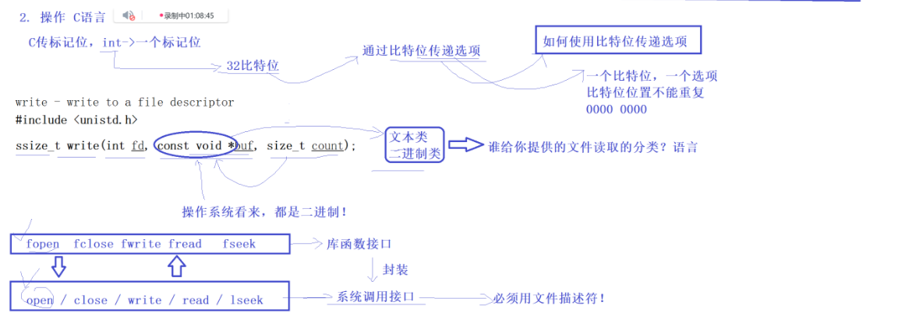

  

**系统往文件里面写入数据**

```c
#include <stdio.h>    
#include <assert.h>    
#include <string.h>    
#include <unistd.h>    
#include <sys/types.h>    
#include <sys/stat.h>    
#include <fcntl.h>    
    
#define FILE_NAME "log.txt"    
    
int main()    
{    
      
  umask(0);    
  // c-- W > O_WRONLY | O_CREAT | O_TRUNC, 0666    
  /*    
   *int fd = open(FILE_NAME, O_WRONLY | O_CREAT | O_TRUNC, 0666);    
   */    
    
  int fd = open(FILE_NAME, O_WRONLY | O_CREAT | O_APPEND, 0666);    
  if(fd < 0)    
  {    
    perror("open");    
    return 1;    
  }    
    
  int cnt = 5;    
  char buffer[64];    
  while(cnt)    
  {                                                                                                                                                                          
    sprintf(buffer, "%s:%d\n", "harallo bit", cnt--);    
    // 你以斜杠零结尾是c语言规定的，和我文件有什么关系呢？    
    write(fd, buffer, strlen(buffer)); // strlen计算\0之前的数据, 这里面不写要写入 \0    
  }    
    
    
  /*    
   *printf("%d \n", fd);    
   */    
    
  close(fd);    
return 0
}
```

```
O_CREAT      文件不存在则创建
O_EXCL       与 O_CREAT 搭配：文件存在则报错
O_TRUNC      清空文件
O_APPEND     写入自动追加
O_NONBLOCK   非阻塞模式（设备/网络）
O_CLOEXEC    exec 时自动关闭 fd（安全）

1. 日志文件                    O_WRONLY | O_CREAT | O_APPEND
2. 锁文件（防重复启动）       O_WRONLY | O_CREAT | O_EXCL
3. 清空后写入                 O_WRONLY | O_CREAT | O_TRUNC
4. 非阻塞设备                 O_RDWR   | O_NONBLOCK
5. 安全读取（不泄漏 FD）      O_RDONLY | O_CLOEXEC
```


**read**

```c
#include <stdio.h>    
#include <assert.h>    
#include <string.h>    
#include <unistd.h>    
#include <sys/types.h>    
#include <sys/stat.h>    
#include <fcntl.h>    
    
#define FILE_NAME "log.txt"    
    
int main()    
{    
      
  umask(0);    
    
  int fd = open(FILE_NAME, O_RDONLY);    
  if(fd < 0)    
  {    
    perror("open");    
    return 1;    
  }    
    
  char buffer[1024];    
  ssize_t num = read(fd, buffer, sizeof(buffer) - 1);    
  if(num > 0) buffer[num] = 0;    
  printf("%s \n", buffer);    
    
    
  close(fd);    
 return 0
}
```


**语言层面封装了系统层面的接口**

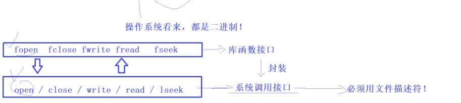


**如何理解这里的文件呢？**
**文件操作的本质：进程和被打开文件的关系**
**1.进程可以打开多个文件吗？ 可以的！ 系统中一定会存在大量的被打开的文件。被打开的文件要不要被OS管理起来呢？(要的)**
 **如何管理呢？(先描述，后组织)  操作系统为了管理对应的打开文件吗，必定要为文件创建对应的内核数据结构标识文件**


**struct file{} 包含了文件的大部分属性  内核数据结构**

**为什么fd是从3开始的呢？**

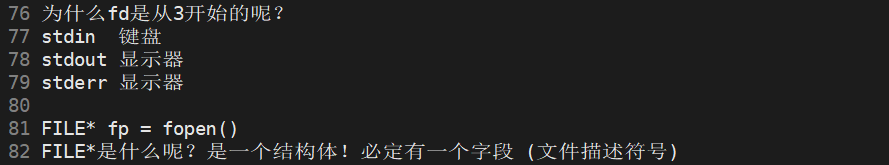


```c
#include <stdio.h>      
#include <unistd.h>      
#include <string.h>      
#include <sys/types.h>      
#include <sys/stat.h>      
#include <fcntl.h>      
#include <assert.h>      
#include <stdlib.h>      
#include <unistd.h>      
      
#define FILE_NAME(number) "log.txt"#number      
      
int main()      
{      
     
 umask(0);
 printf("stdin->fd:%d\n",  stdin->_fileno);
 printf("stdout->fd:%d\n", stdout->_fileno);
 printf("stderr->fd:%d\n", stderr->_fileno);  
    
  int fd0 = open(FILE_NAME(1), O_WRONLY | O_CREAT | O_ASYNC, 0666);      
  int fd1 = open(FILE_NAME(2), O_WRONLY | O_CREAT | O_ASYNC, 0666);      
  int fd2 = open(FILE_NAME(3), O_WRONLY | O_CREAT | O_ASYNC, 0666);      
  int fd3 = open(FILE_NAME(4), O_WRONLY | O_CREAT | O_ASYNC, 0666);      
  int fd4 = open(FILE_NAME(5), O_WRONLY | O_CREAT | O_ASYNC, 0666);      
  int fd5 = open(FILE_NAME(6), O_WRONLY | O_CREAT | O_ASYNC, 0666);      
         
  printf("fd %d \n", fd0);      
  printf("fd %d \n", fd1);      
  printf("fd %d \n", fd2);      
  printf("fd %d \n", fd3);      
  printf("fd %d \n", fd4);      
  printf("fd %d \n", fd5);      
                   
  close(fd0);      
  close(fd1);      
  close(fd2);      
  close(fd3);      
  close(fd4);      
  close(fd5);      
      
                 
  return 0;      
}      

```


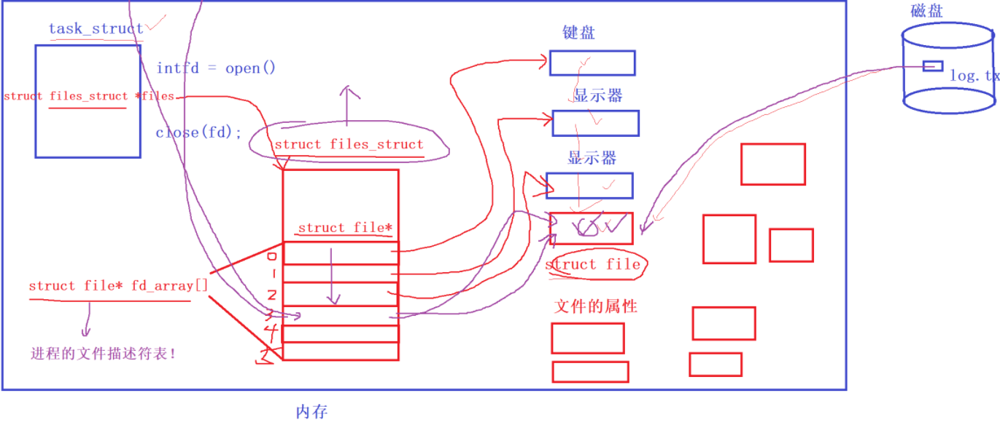


**内建指令**

**当前指令**

**文件的操作**

**文件描述符**

**复习**

**当前路径 工作 路径 **

**文件系统和文件的操作**

**文件描述符**

**文件描述符是从 stdin stdout stderr file1 file2 ...**

**复习**


**文件描述符**

```c
#include <stdio.h>    
#include <sys/types.h>    
#include <sys/stat.h>    
#include <fcntl.h>    
#include <unistd.h>    
    
int main()    
{    
    
   /*    
    *close(0);    
    */    
    
    close(1); //,标准输出的，显示器     
    
   /*    
    *close(2);    
    */    
    
  umask(0);    
  int fd = open("log.txt",O_WRONLY | O_CREAT | O_TRUNC, 0666);    
  if(fd < 0)    
  {    
    perror("open failed");    
    return 1;    
  }    
    
  printf("open fd %d \n", fd);    
  fprintf(stdout, "open fd %d \n", fd);    
  fflush(stdout);    // 这里必须刷新数据才能看到，因为缓冲区
                                                                                                                                                                             
  close(fd);    
  return 0;     
}         
```

**上面的代码就是重定向，本来到显示器，结果到文件里面去了的**

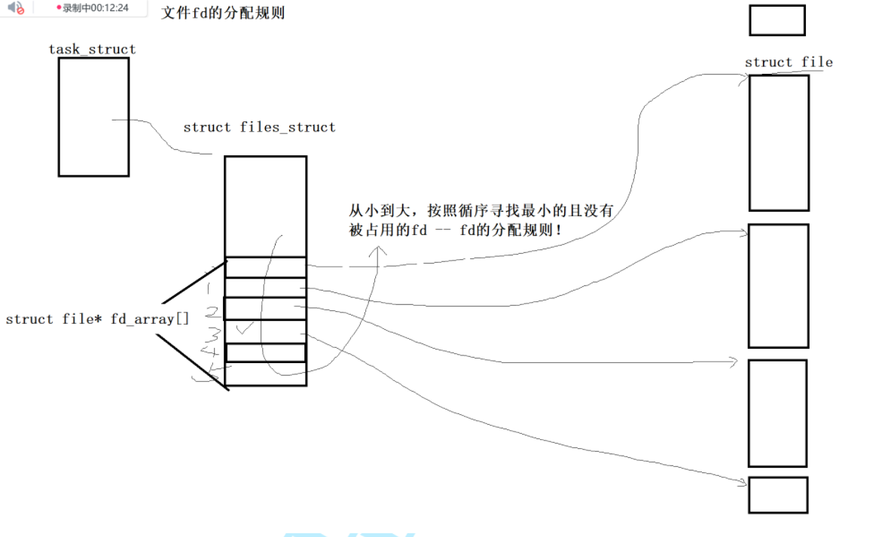


**重定向的本质是什么？
 上层用的fd不变，在内核中更改了fd对应的的struct file*的地址**

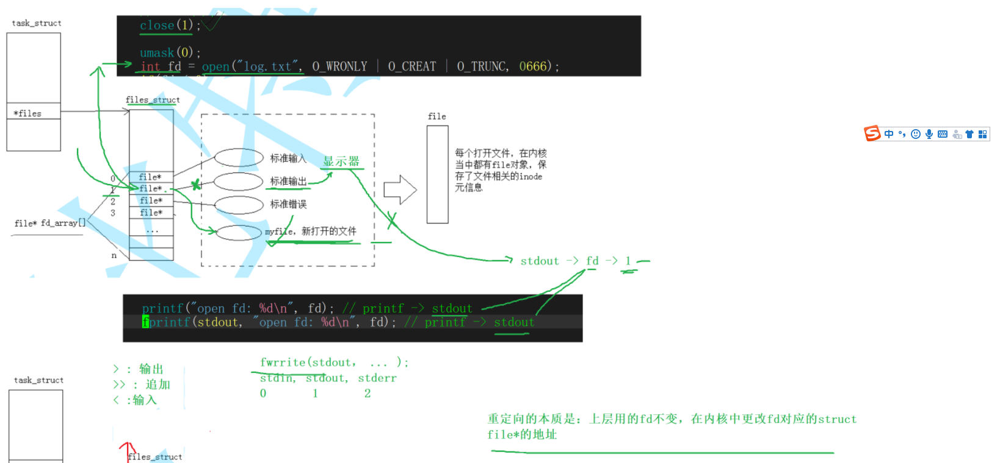


**系统重定向函数**

**dup2函数**

**输出重定向**

```c
#include <stdio.h>    
#include <sys/types.h>    
#include <sys/stat.h>    
#include <fcntl.h>    
#include <unistd.h>    
#include <string.h>    
    
int main()    
{    
    
    
    
  umask(0);    
  int fd = open("log.txt",O_WRONLY | O_CREAT | O_TRUNC, 0666);    
  /*    
   *int fd = open("log.txt",O_WRONLY | O_CREAT | O_APPEND, 0666);    
   */                                                                                                                                                                        
  if(fd < 0)    
  {    
    perror("open failed");    
    return 1;    
  }    
    
  // 现在1的位置是 fd了。现在输出数据是往fd里面了，而不是stdout(显示器了)    
  dup2(fd, 1);  // fd--->1    
    
    
    
  printf("open fd %d \n", fd); // 往stdout里面输出数据    
  fprintf(stdout, "open fd : %d \n", fd);    
    
  const char*msg = "hello world";    
  write(1,msg, strlen(msg));    
  fflush(stdout);    
    
    
    
  close(fd);    
  return 0;    
}    

```


**追加重定向 **

```c
#include <stdio.h>    
#include <sys/types.h>    
#include <sys/stat.h>    
#include <fcntl.h>    
#include <unistd.h>    
#include <string.h>    
    
int main()    
{    
      
  umask(0);    
  /*    
   *int fd = open("log.txt",O_WRONLY | O_CREAT | O_TRUNC, 0666);    
   */    
      
  int fd = open("log.txt",O_WRONLY | O_CREAT | O_APPEND, 0666);    
  if(fd < 0)    
  {    
    perror("open failed");    
    return 1;    
  }    
    
  // 现在1的位置是 fd了。现在输出数据是往fd里面了，而不是stdout(显示器了)    
  dup2(fd, 1);  // fd--->1    
    
      
  printf("open fd %d \n", fd); // 往stdout里面输出数据    
  fprintf(stdout, "open fd : %d \n", fd);    
    
  const char*msg = "hello world";    
  write(1,msg, strlen(msg));    
  fflush(stdout);    
                                                                                                                                                                             
  close(fd);    
  return 0;     
}               

```


**输入重定向**

```c
#include <stdio.h>    
#include <sys/types.h>    
#include <sys/stat.h>    
#include <fcntl.h>    
#include <unistd.h>    
#include <string.h>    
                      
int main()             
{    
    
  umask(0);    
  int fd = open("log.txt",O_RDONLY);    
  if(fd < 0)    
  {    
    perror("open failed");    
    return 1;    
  }    
    
  dup2(fd, 0); // 输入重定向                                                                                                                                                 
                                
  char line[64];    
  while(1)          
  {           
    printf("> ");    
                     
    if(fgets(line, sizeof(line), stdin) == NULL) // stdin read     
    {                                                              
      break;    
    }           
    printf("%s", line);    
  }                        
       
  close(fd);    
  return 0;     
}     
```


```c
#include <stdio.h>    
#include <string.h>    
#include <stdlib.h>    
#include <unistd.h>    
#include <sys/types.h>    
#include <sys/wait.h>    
#include <assert.h>    
#include <ctype.h>    
#include <sys/stat.h>    
#include <sys/types.h>    
#include <fcntl.h>    
#include <errno.h>    
    
#define NUM 1024    
#define OPT_NUM 64    
    
#define NONE_REDIR   0    
#define INPUT_REDIR  1    
#define OUTPUT_REDIR 2    
#define APPEND_REDIR 3    
    
#define trimSpace(start) do{\    
    while(isspace(*start)) ++start;\    
}while(0)    
    
int lastCode = 0;    
int lastSig = 0;    
    
char linecommand[NUM];    
char* myagrv[OPT_NUM];    
    
int redirType = NONE_REDIR;    
char* redirFile = NULL;    
    
//     
void commandCheck(char* command)    
{    
  assert(command != NULL);    
  char* start = command;    
  char* end = command + strlen(command);    
  while(start < end)    
  {    
    if(*start == '>')    
    {    
      *start = '\0';    
      start++;    
      if(*start == '>')    
      {    
        redirType = APPEND_REDIR;    
      }    
      else     
      {    
        redirType = OUTPUT_REDIR;    
      }    
    
      trimSpace(start);    
          
      redirFile = start;    
      break;    
    }    
    else if(*start == '<')    
    {    
      *start = '\0';    
      start++;    
      trimSpace(start);    
      redirType = INPUT_REDIR;    
      redirFile = start;    
      break;    
    }    
    else     
    {    
      start++;    
    }    
  }    
}    
    
    
    
int main()    
{    
    
      
  while(1)    
  {    
      
    // 初始化    
    redirType = NONE_REDIR;    
    redirFile = NULL;    
    errno = 0;    
  printf("用户名@主机名 当前路径# ");    
  fflush(stdout);    
    
  char* s = fgets(linecommand, sizeof(linecommand)-1, stdin);    
  assert(s != NULL);    
    
  (void)s;    
    
  // 清理最后一个\n    
  //    
  linecommand[strlen(linecommand) - 1] = 0;    
  //  printf("test %s\n", linecommand); 
  commandCheck(linecommand);    
    
  // " ls -a -l -h"    
  myagrv[0] = strtok(linecommand, " ");    
  
  int i = 1;
  if(myagrv[0] != NULL && strcmp(myagrv[0], "ls") == 0)
  {
    myagrv[i] =(char*) "--color=auto";
  }

  while((myagrv[i++] = strtok(NULL, " ")) != NULL)
  {
    ;
  }


  // 如果是cd指令，不需要创建子进程，让对应的shell执行。
  // 不需要子进程来执行，让shell自己执行----- 内建/内置命令
  if(myagrv[0] != NULL && strcmp(myagrv[0],"cd") == 0)
  {
    if(myagrv[1] != NULL) chdir(myagrv[1]);
    continue;
  }

  if(myagrv[0] != NULL && myagrv[1] != NULL && strcmp(myagrv[0], "echo") == 0 )
  {
    if( strcmp(myagrv[1],"$?") == 0) 
    {
      printf("%d, %d \n", lastCode, lastSig);
    }
    else 
    {
      printf("%s \n", myagrv[1]);
    }

    continue;
  }


  //测试 是否成功
  
/*
 *#ifdef DEBUG 
 *  for(int i = 0; myagrv[i]; i++)
 *  {
 *    printf("myagrv[%d], %s \n", i, myagrv[i]);
 *  }
 *#endif
 */

  // 执行命令 
  pid_t id = fork();
  assert(id != -1);

   if(0)
   {
      execvp(myagrv[0], myagrv);
      exit(1);
   }

   if(id == 0)
   {
     // 因为命令是子进程执行的，真正重定向的工作一定是子进程来完成的
     // 如何完成重定向， 是父进程要提供的信息、
     // 这里的重定向会影响父进程吗 进程具有独立性，不能影响父进程。拷贝struct_files
     
     switch(redirType)
     {
        case NONE_REDIR: 
          break;
        case INPUT_REDIR:
          {
            int fd = open(redirFile, O_RDONLY);
            if(fd < 0)
            {
              perror("open");
              exit(errno);
            }
            dup2(fd, 0);
          }
          break;
        case OUTPUT_REDIR:
        case APPEND_REDIR:
          {
            int flags = O_WRONLY | O_CREAT;
            if(redirType == APPEND_REDIR) flags |= O_APPEND;
            else flags |= O_TRUNC;

           int fd = open(redirFile, flags, 0666);
            if(fd < 0)
            {
              perror("open");
              exit(errno);
            }

            // 重定向文件已经打开了
            dup2(fd, 1);
          }
          break;
        default: printf("bug?\n");
          break;
     }
     execv(myagrv[0], myagrv); // 执行程序替换的时候，会不会影响曾经打开的重定向文件，不会的
     exit(1);
   }

   int status = 0;
   pid_t ret =  waitpid(id, &status, 0);
   assert(ret > 0);
   (void)ret;

   lastCode = (status>>8)&0xff;
   lastSig = status & 0x7f;
  }
  return 0;
}

```


```c
// shell_simple.c
#include <stdio.h>
#include <string.h>
#include <stdlib.h>
#include <unistd.h>
#include <sys/types.h>
#include <sys/wait.h>
#include <assert.h>
#include <ctype.h>
#include <sys/stat.h>
#include <fcntl.h>
#include <errno.h>

#define NUM 1024
#define OPT_NUM 64

#define NONE_REDIR   0
#define INPUT_REDIR  1
#define OUTPUT_REDIR 2
#define APPEND_REDIR 3

#define trimSpacePtr(p) do { while (*(p) && isspace((unsigned char)*(p))) ++(p); } while(0)

int lastCode = 0;
int lastSig = 0;

char linecommand[NUM];
char* myagrv[OPT_NUM];

int redirType = NONE_REDIR;
char* redirFile = NULL;

/* 解析重定向（只支持简单形式：cmd ... > filename 或 >> filename 或 < filename）
   解析后会把命令中重定向符号位置置 '\0'（从而截断命令部分），并把 redirType 与 redirFile 设好。 */
void commandCheck(char* command)
{
    assert(command != NULL);
    char* p = command;
    while (*p) {
        if (*p == '>') {
            *p = '\0';            // 截断命令
            p++;
            if (*p == '>') {     // >> 追加
                redirType = APPEND_REDIR;
                p++;
            } else {
                redirType = OUTPUT_REDIR;
            }
            trimSpacePtr(p);
            if (*p == '\0') { redirFile = NULL; return; }
            // 找到文件名的结尾（空白或字符串结束）
            char* fname = p;
            char* q = fname;
            while (*q && !isspace((unsigned char)*q)) ++q;
            *q = '\0'; // 截断文件名后的内容
            redirFile = fname;
            return;
        } else if (*p == '<') {
            *p = '\0';
            p++;
            trimSpacePtr(p);
            redirType = INPUT_REDIR;
            if (*p == '\0') { redirFile = NULL; return; }
            char* fname = p;
            char* q = fname;
            while (*q && !isspace((unsigned char)*q)) ++q;
            *q = '\0';
            redirFile = fname;
            return;
        } else {
            ++p;
        }
    }
}

int main()
{
    while (1) {
        // 初始化/重置
        redirType = NONE_REDIR;
        redirFile = NULL;
        errno = 0;

        printf("用户名@主机名 当前路径# ");
        fflush(stdout);

        char* s = fgets(linecommand, sizeof(linecommand), stdin);
        if (s == NULL) {
            // EOF（例如 Ctrl+D），退出 shell
            printf("\nexit\n");
            break;
        }

        // 去掉末尾的换行（如果有）
        size_t len = strlen(linecommand);
        if (len > 0 && linecommand[len - 1] == '\n') linecommand[len - 1] = '\0';

        // 忽略空行
        char* tmp = linecommand;
        trimSpacePtr(tmp);
        if (*tmp == '\0') continue;

        // 解析重定向（会把重定向符号替换为 '\0'，并设置 redirType/redirFile）
        commandCheck(linecommand);

        // tokenization：先把命令部分拆成 tokens
        for (int i = 0; i < OPT_NUM; ++i) myagrv[i] = NULL;

        int argc = 0;
        char* token = strtok(linecommand, " \t");
        while (token != NULL && argc < OPT_NUM - 1) {
            myagrv[argc++] = token;
            token = strtok(NULL, " \t");
        }
        myagrv[argc] = NULL;

        if (argc == 0) continue;

        // 内建命令：cd
        if (strcmp(myagrv[0], "cd") == 0) {
            if (myagrv[1] != NULL) {
                if (chdir(myagrv[1]) != 0) perror("chdir");
            } else {
                // 没有参数切到 HOME
                char* home = getenv("HOME");
                if (home) chdir(home);
            }
            continue;
        }

        // 内建命令：echo $?
        if (strcmp(myagrv[0], "echo") == 0 && myagrv[1] != NULL) {
            if (strcmp(myagrv[1], "$?") == 0) {
                printf("%d, %d\n", lastCode, lastSig);
            } else {
                printf("%s\n", myagrv[1]);
            }
            continue;
        }

        // 如果是 ls，插入 --color=auto（插入到 argv[1]，并向后移动），并检查不越界
        if (argc >= 1 && strcmp(myagrv[0], "ls") == 0) {
            if (argc + 1 < OPT_NUM) {
                // 从后往前移动
                for (int i = argc; i >= 1; --i) {
                    myagrv[i + 0] = myagrv[i - 1]; // move including NULL at end
                }
                myagrv[1] = "--color=auto";
                argc += 1;
                myagrv[argc] = NULL;
            }
        }

        // fork + exec
        pid_t id = fork();
        if (id < 0) {
            perror("fork");
            continue;
        }

        if (id == 0) {
            // child: 处理重定向
            switch (redirType) {
                case NONE_REDIR:
                    break;
                case INPUT_REDIR: {
                    if (redirFile == NULL) {
                        fprintf(stderr, "input redirection file missing\n");
                        _exit(1);
                    }
                    int fd = open(redirFile, O_RDONLY);
                    if (fd < 0) {
                        perror("open input");
                        _exit(errno ? errno : 1);
                    }
                    if (dup2(fd, STDIN_FILENO) < 0) {
                        perror("dup2 input");
                        close(fd);
                        _exit(1);
                    }
                    close(fd);
                } break;
                case OUTPUT_REDIR:
                case APPEND_REDIR: {
                    if (redirFile == NULL) {
                        fprintf(stderr, "output redirection file missing\n");
                        _exit(1);
                    }
                    int flags = O_WRONLY | O_CREAT;
                    if (redirType == APPEND_REDIR) flags |= O_APPEND;
                    else flags |= O_TRUNC;
                    int fd = open(redirFile, flags, 0666);
                    if (fd < 0) {
                        perror("open output");
                        _exit(errno ? errno : 1);
                    }
                    if (dup2(fd, STDOUT_FILENO) < 0) {
                        perror("dup2 output");
                        close(fd);
                        _exit(1);
                    }
                    close(fd);
                } break;
                default:
                    break;
            }

            // execvp 会根据 PATH 查找可执行文件
            execvp(myagrv[0], myagrv);
            // execvp 只有在失败时返回
            perror("execvp");
            _exit(127);
        }

        // parent: 等待子进程
        int status = 0;
        pid_t ret = waitpid(id, &status, 0);
        if (ret < 0) {
            perror("waitpid");
            continue;
        }

        if (WIFEXITED(status)) {
            lastCode = WEXITSTATUS(status);
            lastSig = 0;
        } else if (WIFSIGNALED(status)) {
            lastCode = 128 + WTERMSIG(status); // convention
            lastSig = WTERMSIG(status);
        } else {
            lastCode = status;
            lastSig = 0;
        }
    } // while

    return 0;
}

```


## 2Linux一切皆文件


**多态**

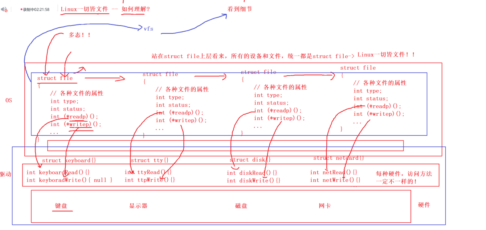

**进程地址空间**

**引用计数信息**

**存储**

**计算**

**业务**

**我们做的是业务的**


## 3缓冲区


**./a.out > log.txt**

```c
#include <stdio.h>    
#include <sys/types.h>    
#include <sys/stat.h>    
#include <fcntl.h>    
#include <unistd.h>    
#include <string.h>    
int main()    
{    
  // 用户数据都要经过缓冲区域的    
  // c接口    
  printf("hello printf \n");    
  fprintf(stdout, "hello fprintf \n");    
  fputs("hello fputs \n", stdout);    
    
  // 系统调用接口                                                                                                                                                            
  const char* msg = "hello elifc \n";    
  write(1, msg, strlen(msg));    
    
  // 执行到这里的时候，还没有刷新数据    
  fork();    
    
  return 0;    
}    

```


**复习**

**进程和被打开文件的关系**

**重定向关系**

**复习**


**用户级别的接口**


**理解缓冲区域**

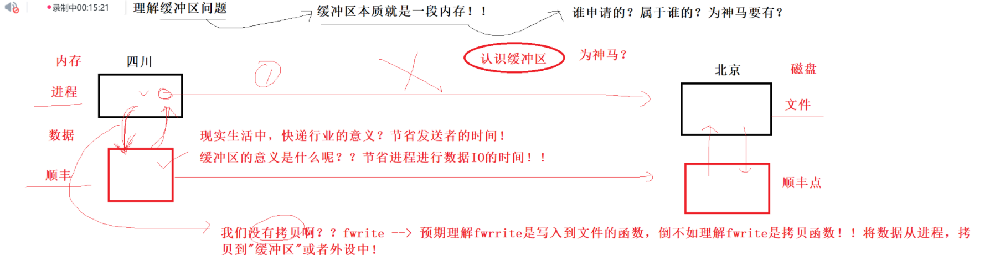

**本质及时一段内存。谁申请的？属于谁的？为什么要申请？**

​	**例子：发快递的例子。缓存快递信息。**

​	**写在缓冲区里面，不要一有数据就刷新，太浪费时间了的。**

**缓冲区的意义？节省进程进行数据IO的时间！！**

**我们没有进行拷贝啊？ fwrite---->其实是一个拷贝函数，将数据从进程拷贝到缓冲区或者外设中！！**


**缓冲区刷新策略的问题。**

**如果有一块数据，一次写入到外设。效率高。**

**如果有一块数据，多次写入到外设。效率低，多次IO访问。**


**缓冲区一定会结合具体设计，定制刷新自己的策略。**

**1.立即刷新--无缓冲**

**2.行刷新----行缓存---显示器----->给人看的**

**3.缓冲区----全缓冲---磁盘文件。**

​	**特例**

​	**1.用户强制刷新**

​	**2.进程退出，一般都要进行缓冲区刷新。**


**你所谓的缓冲区在哪里？指的是什么缓冲区？**

​	**缓冲区域不在内核中！**

​	**所有的缓冲区都指的是，用户级语言层面给我们提供的缓冲区。**

​	**这个缓冲区在，stdout stdin stderr --> FILE* --> FILE 结构体 --> fd && 缓冲区！！！！！！！！！！！。**

​	**我们在强制刷新，fflush(文件指针)， fclose(文件指针)。**


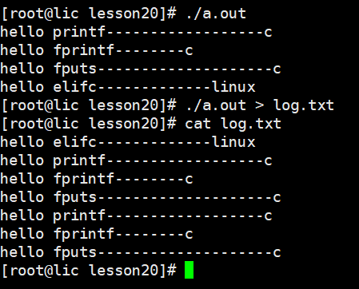

**缓冲区是语言级别 提供的内存**

**FILE*  FILE结构体**

**FILE里面存着：fd和缓冲区**


```c
#include <stdio.h>                                                                                                                                                           
#include <sys/types.h>    
#include <sys/stat.h>    
#include <fcntl.h>    
#include <unistd.h>    
#include <string.h>    
int main()    
{    
    
  // 用户数据都要经过缓冲区域的    
  // 用户接口    
  printf("hello printf------------------c\n");    
  fprintf(stdout, "hello fprintf--------c \n");    
  fputs("hello fputs--------------------c \n", stdout);    
    
    
    
  // 系统接口    
  const char* msg = "hello elifc-------------linux \n";    
  write(1, msg, strlen(msg));    
    
  // 执行到这里的时候，还没有刷新数据    
  fork();    
    
  // stdout默认是行刷新 ，fork之前，三条c函数已经数据输出到显示器了，你的FILE内部，进程进程内部不存在对应的数据了    
  // 进行了 > 写入文件不再是显示器了，而是普通文件了，采用的刷新策略全缓冲，c函数虽然有\n， 不足以将stdout缓冲区写满！    
  // 数据并没有被刷新。    
  //    
  // 执行fork时，stdout属于父进程，创建子进程，紧接着就是进程退出。但是谁先退出，一定要进行缓冲区刷新(就是修改)    
  // 发生写时拷贝    
  // 数据终止会显示两份    
  //    
  // wirte没有， write没有FILE, 用的是fd， 就没有c提供的缓冲区。    
    
  return 0;    
}    

```


**模拟实现缓冲区**

```c
#pragma once                                                                                                                                                                 
    
#include <assert.h>    
#include <stdlib.h>    
#include <errno.h>    
#include <sys/types.h>    
#include <unistd.h>    
#include <sys/stat.h>    
#include <fcntl.h>    
#include <string.h>    
    
#define SIZE      1024    
#define SYNC_NOW  1    
#define SYNC_LINE 2    
#define SYNC_FULL 4    
    
    
typedef struct _FILE    
{    
    int flags;      // 刷新方式    
    int fileno;     //     
    int cap;        // 总容量    
    int szie;       //  使用量    
    char buffer[SIZE];  //     
    
    
}FILE_;    
    
FILE_* fopen_(const char* path_name, const char* mode);    
void    fwrite_(const void* ptr, int num, FILE_* fp);    
void   fclose_(FILE_* fp);    
void fflush_(FILE_* fp);  
```


```c
#include "myStdio.h"    
    
FILE_* fopen_(const char* path_name, const char* mode)    
{    
    int flags = 0;    
    int defaultMode=0666;    
    if(strcmp(mode, "r") == 0)    
    {    
      flags |= O_RDONLY;    
    }    
    else if(strcmp(mode, "w") == 0)    
    {    
      flags |= (O_WRONLY | O_CREAT | O_TRUNC);    
    }    
    else if(strcmp(mode, "a") == 0)    
    {    
      flags |= (O_WRONLY | O_CREAT | O_APPEND);    
    }    
    else    
    {    
      // todo                                                                                                                     
    }    
    
    int fd = 0;    
    
    if(flags & O_RDONLY) fd = open(path_name, flags);    
    else fd = open(path_name, flags, defaultMode);    
    
    if(fd < 0)    
    {    
      const char* err = strerror(errno);    
      write(2, err, strlen(err));    
      return NULL;    
    }    
    
    
    
    FILE_* fp = (FILE_*)malloc(sizeof(FILE_));    
    
    assert(fp);    
    
    fp->flags = SYNC_LINE;    
    fp->fileno = fd;    
    fp->cap = SIZE;    
    fp->szie = 0;    
    memset(fp->buffer, 0, SIZE);    
    
    
    
    return fp; // 这就是为什么打开一个文件，就会返回一个FILE* 指针    
}    
    
    
    
void fwrite_(const void* ptr, int num, FILE_* fp)    
{    
  // 数据写入到缓冲区中    
   memcpy(fp->buffer + fp->szie, ptr, num); // 不考虑缓冲区的溢出    
    
   fp->szie += num;    
   // 判断是否刷新    
    
   if(fp->flags & SYNC_NOW)    
   {    
    write(fp->fileno, fp->buffer, fp->szie);    
    fp->szie = 0; // 清空缓冲区    
   }    
   else if(fp->flags & SYNC_FULL)    
   {    
     if(fp->szie == fp->cap)    
     {    
        write(fp->fileno, fp->buffer, fp->szie);    
        fp->szie =  0;    
     }    
   }    
   else if(fp->flags & SYNC_LINE)    
   {    
      if(fp->buffer[fp->szie-1] == '\n')    
      {    
        write(fp->fileno, fp->buffer, fp->szie);    
        fp->szie =  0;    
      }    
   }    
   else    
   {    
    
   }    
}    
    
    
    
void fflush_(FILE_* fp)    
{    
  // 写到系统里面    
  if(fp->szie > 0)write(fp->fileno, fp->buffer, fp->szie);    
    
  // 真正的刷新    
  // 内核缓冲区到----磁盘文件的
  fsync(fp->fileno);    
  fp->szie = 0;    
}    
    
void fclose_(FILE_* fp)    
{    
  fflush_(fp);    
  close(fp->fileno);    
}    

```


```c
#include "myStdio.h"                                                                                                                                                         
    
int main()    
{    
    
  FILE_* fp = fopen_("./log.txt","w");    
    
  if(fp == NULL)    
  {    
    return 1;    
  }    
    
  const char* msg = "helllo \n";    
    
  int cnt = 18;    
  while(cnt)    
  {    
    fwrite_(msg, strlen(msg), fp);    
    sleep(1);    
    if(cnt % 3 == 0) fflush_(fp);    
    cnt--;    
  }    
    
  fclose_(fp);    
  return 0;    
}    

```


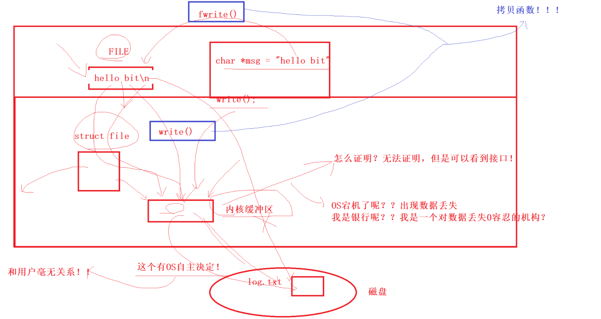


## 4文件系统


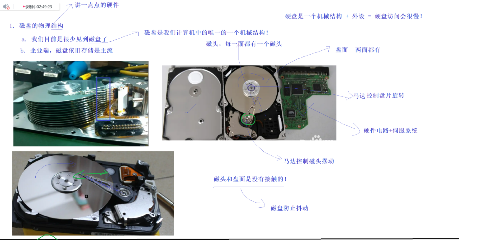


**复习**

**缓冲 缓存区**

**缓冲区就是一块内存**

**用户刷新策略和OS自己的刷新策略。**

**FILE-----OS-----磁盘上**

**文件系统，没有打开的文件**

**复习**


**磁盘的物理结构**

**磁道---》盘面-----》扇区**


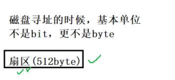


**磁盘访问的基本单位是512字节，但是依旧很小。 OS内的文件系统定制多个扇区的读取。1kb,2kb,4kb为基础**

**哪怕是1bit位，  将4kbload到内存里面，进行读取或者修改，有必要，在写回磁盘。**


**局部性原理！**

**空间换时间，缓存命中。**

**内存是被划分成为4kb大小的空间。页框。**

**磁盘中的文件，尤其是可执行文件---按照4kb大小划分好的块。页帧**

**文件 = 内容 + 属性。 linux的文件属性和文件内容是分批存储的。    
super block保存整个文件系统的信息。    
Inode是固定大小。一个文件一个Inode,文件的几乎所有属性都在inode, 文件名不在inode里面。    
data block 随着应用类型的变化，大小也在变化。分组内部所有文件的数据块。    
inode table保存了分组内部，所有可以使用的+不可以使用的inode    
inode bitmap是inode对应的位图结构，和当前文件对应的inode的位置一一对应的！    
data block数据块对应的位图结构，    
GDT 块足描述表。分组的宏观信息。**

**查找文件的时候，统一使用inode编号。    
    
struct inode    
{    
  int id;    
  mode_t mode;    
  uid;    
  gdt;    
  size;    
    
  data_block blocks[15]; // 指向的是数据块，数据块也可以是其它数据块。    
}    
    
    
(分布式)    

目录的数据块放什么呢？
 当前目录下文件名和inode的映射关系**


**复习**

****

**Linux是开源，开源手段，不是目的**

**生态丰富，文档方便**

**文件路径多叉树**

**权限：人+能够做什么**

**粘滞位**

**进程控制**

**内建指令**

****

**复习**


**建立硬链接根本没有创建新文件 **

**没有自己的内容和属性集合**

**建立硬链接是和文件名和inode编号的映射关系**

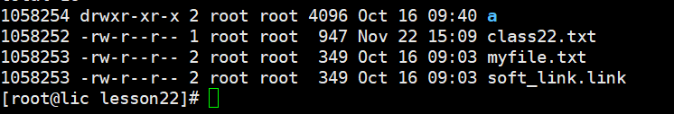


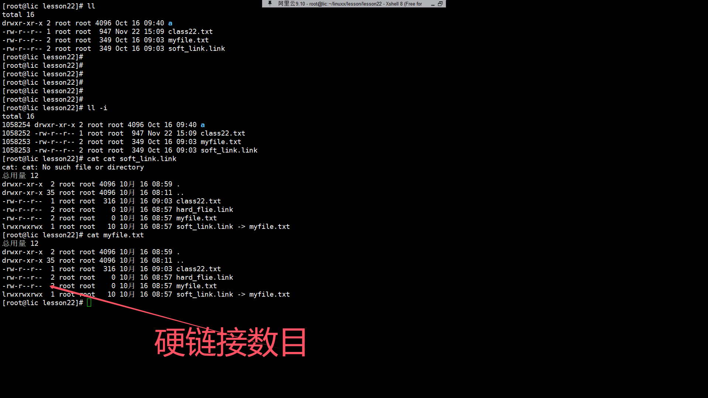


**文件真正被删除就是 硬链接数变成0的是**


**软件**

**ln -s 目标文件 链接名**

**记录文件的路径字符串**

**硬**

**ln 目标文件 链接名**

**建立一个备份**


**一个.也是文件名称**

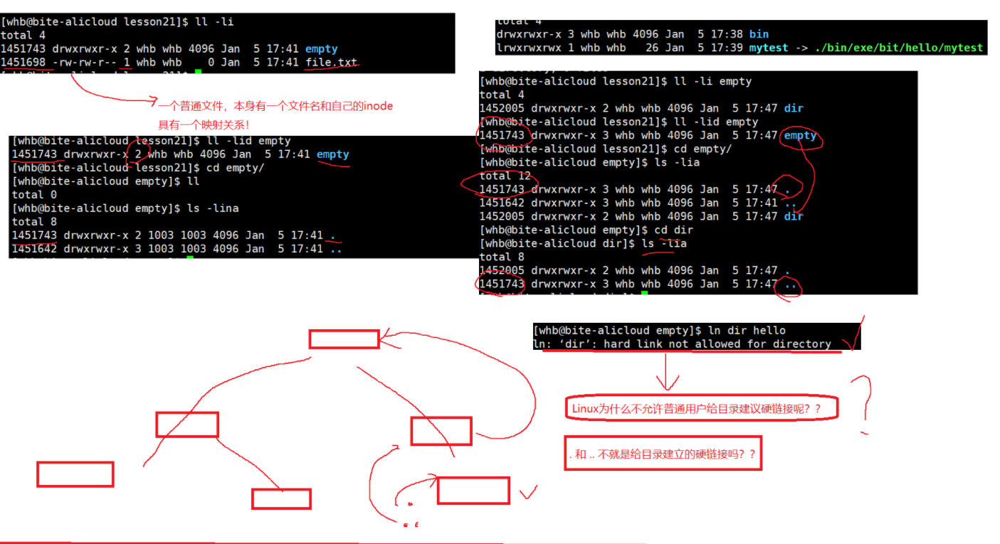


## 5动静态库


**gcc -c 形成同名文件**


**如果我们不起给对方我们的源代码，我给你提供我们的可重定位目标二进制文件，让你来用你的代码进行链接就行。**

**未来我可以给对方提供 .o（方法的实现），.h（都有什么方法）。  
我们就尝试着将所有的“.o文件”，打一个包，给对方提供一个库文件即可！**

**库文件，多个.o → 一个文件 → 库 → 动态库和静态库！**


**.o文件。二进制可重定位文件**

**.o文件方法的实现 .h都有神马方法**

**库的本质就是.o文件的集合**


### **静态库**


**库文件和对应的头文件**

**找不到头文件的   .h**

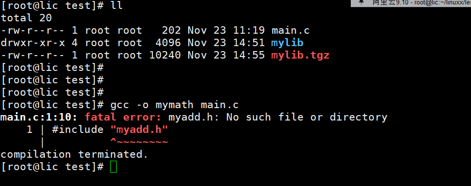


**链接错误了 .o**

**链接那个库，必须指定的很详细的**

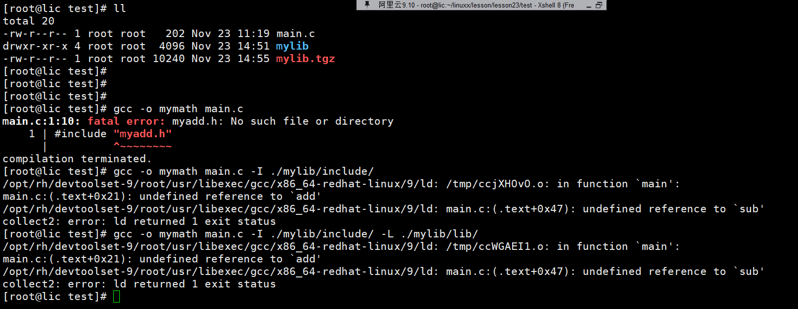


**库名称 掐头去尾的！**

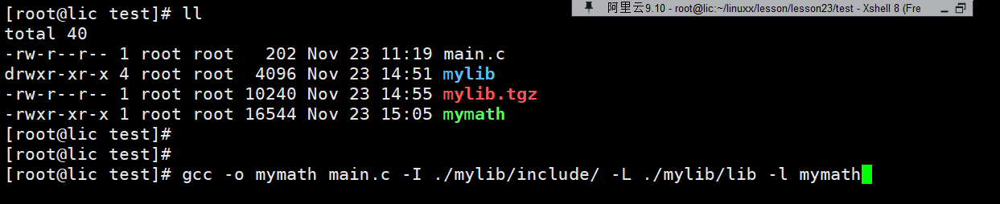

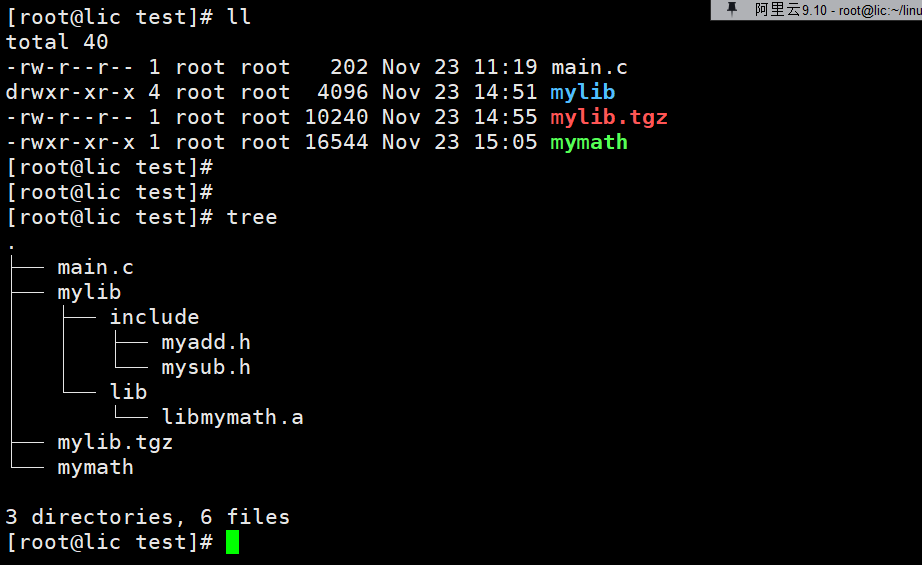

**为什么我们写c/c+= 从来没指定呢， gcc/g++已经默认知道了的**

**gcc默认动态链接 对于一个库是静态还是动态，取决于你提供的是静态还是动态。**

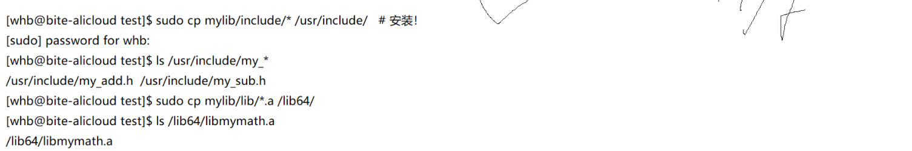

**拷贝进去了 还是要指明那个库的名称**

**gcc mian.c -l mymath**


### **动态库**


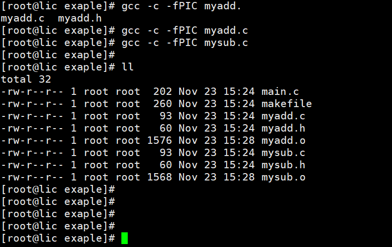


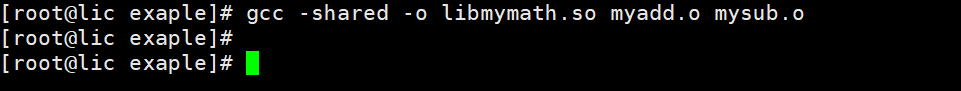


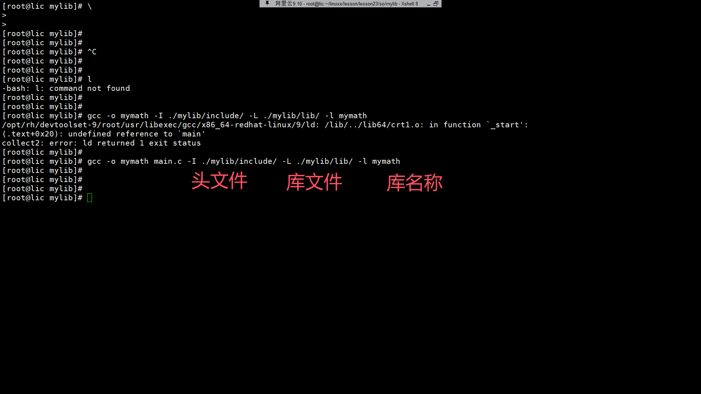


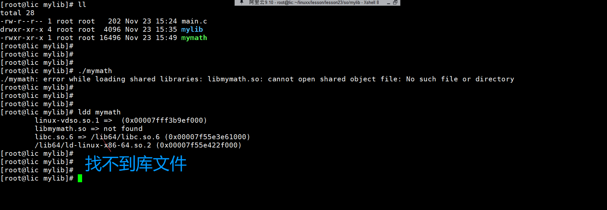


**这是和gcc说的， 动态库是运行的时候，OS才知道的。 你的库不再OS里面的。**

**gcc -o mymath main.c -I ./mylib/include/ -L ./mylib/lib/ -l mymath**

**方法1      echo $LD_LIBRARY_PATH  添加到环境变量里面**

**方法2  配置文件**

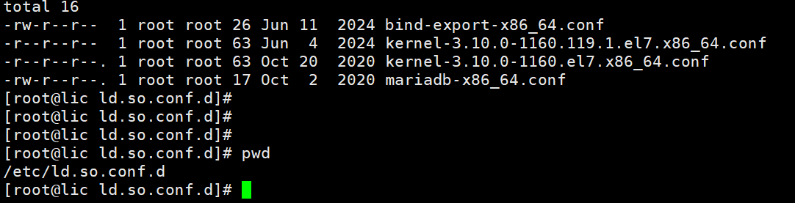

**ldconfig  更新配置文件**

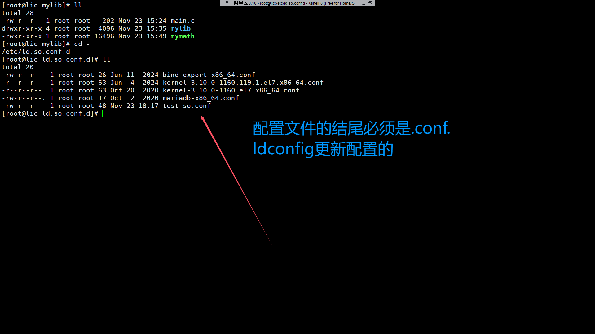


**方法3**

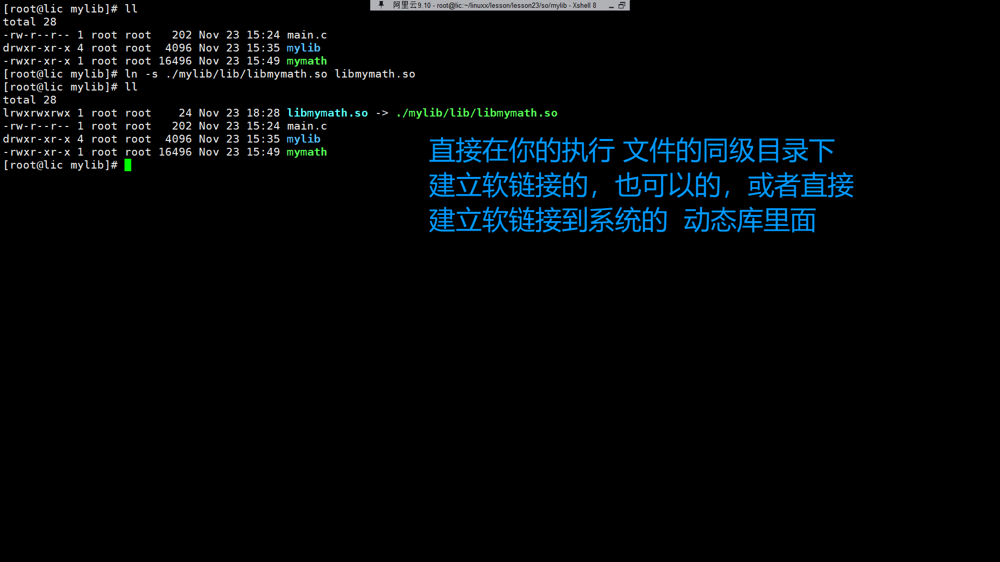


**推荐库 ncurses**

**我们可以安装很多的第三方库的 仅此而已。**

### 动静态库的加载

**静态库：不需要加载的**

​	**拷贝在哪里呢？ 代码区。未来这部分代码，必须通过相对确定的地址位置来进行访问。直接编入到可执行程序里面**

**动态库：**

​	**动态库中的指定函数的地址，写入到我们的可执行程序中。**

​	**与位置无关的地址：start(libc.so) + 偏移地址**

​	**在库中的偏移地址。  外部地址---->找到了--->映射到共享区了--->在共享区也有地址了**


**进程地址空间  还能看到很多的其它资源的。**


**文件描述符**

**软硬链接**

**动静态库**


**切换vscode**


| 区域                                         | 作用                                                         | 关键点总结                                                   |
| -------------------------------------------- | ------------------------------------------------------------ | ------------------------------------------------------------ |
| **Super Block**                              | 文件系统的“身份证”，保存整个文件系统的核心元数据             | 块大小、总块数、总inode数、挂载次数、挂载时间、文件系统状态等<br>超级重要！损坏了整个分区基本就废了（好在有备份superblock） |
| **Group Descriptor Table**<br>（组描述符表） | 描述当前这个块组的情况，也同时描述所有块组的情况（多个块组共享一份） | 包含：本块组的 block bitmap 在哪、inode bitmap 在哪、inode table 在哪、空闲块数、空闲inode数等 |
| **Block Bitmap**<br>（块位图）               | 记录本块组中哪些**数据块**已经被用了                         | 1个字节代表8个数据块，1=已用，0=空闲<br>你要新建文件，内核就来这里找0的位置 |
| **Inode Bitmap**<br>（inode位图）            | 记录本块组中哪些**inode是否被占用                            | 同上，1=已分配，0=空闲                                       |
| **Inode Table**<br>（inode表）               | 存放本块组所有 inode 节点（不管用没用，都预分配好了）        | 一个文件 = 一个inode<br>这里是真正的“文件元数据仓库”         |
| **Data Blocks**<br>（数据块）                | 真正存放文件内容、目录内容的地方                             | 普通文件内容就在这里<br>目录的内容也是在这里（目录也是文件） |

