# BIT.5_基础IO.pdf

## 1重新谈论文件

**文件操作的本质：进程和被打开文件的操作。**

**1  空文件也要在磁盘占空间**
**2  文件== 内容 + 属性**
**3  文件操作 == 属性操作 + 内容操作 + (文件内容 + 文件属性 )**
**4  标定一个文件  必须使用 文件路径  + 文件名 唯一性**
**5  如果没有默认指定文件路径，默认是在当前路径访问文件  进程当前路径**
**6   fopen fclose fread fwrite 等接口写完之后，代码编译之后，形成二进制文件之后，但是没有运行 文件对应的操作没有被执行！**
 	**对文件的操作本质是进程对文件的操作**
**7  一个文件没有被打开，可以被直接访问吗？ 不可以的. 一个文件要被访问，就要打开。被我们的进程打开。**
**用户进程+OS的接口   是不是所有磁盘的文件都被打开？不是的**
                   **被打开的**
                   **没有被打开的 文件系统**

 **对文件的操作本质是进程对文件的操作**

**结论：文件操作的本质：进程和被打开文件的关系。**

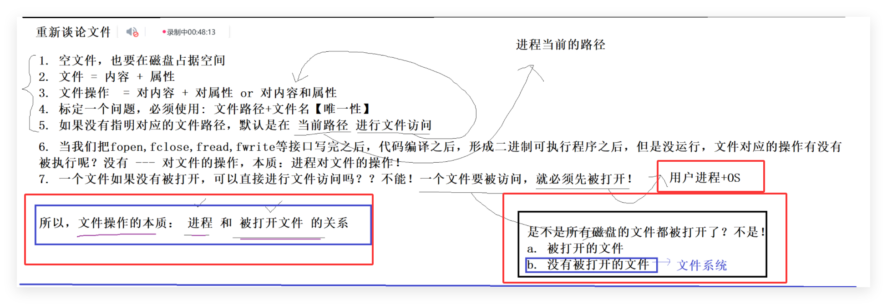

**进程和被打开文件的操作。**


## 回顾C文件接口

**1.c语言，c++，java, python, php, go , shell? 操作接口都不一样的。**

 	**文件在哪里呢--->>磁盘--》硬件---》os---》所有人想访问磁盘，都不能绕过os--->>使用os提供的接口-->>可以，操作系统只有一个**
 	**---》上层语言无论如何变化**

​	**a库函数必须 调用 系统调用接口**

​	**b库函数可以千变万化，但是底层不变--- 如何降低学习成本呢?         学习不变的**

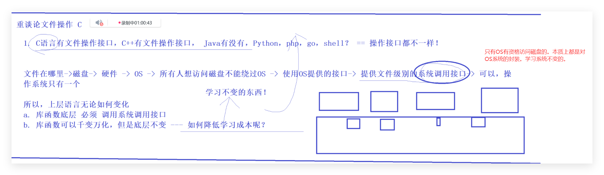


**2操作C语言**

```c
#include <stdio.h>    
#include <unistd.h>    
    
#define FILE_NAME "log.txt"    
    
int main()    
{    
  // r w r+(读写，不存在出错) w+(读写，不存在创建，每次都会重新) 
  // a(append 追加) a+  不存在创建 
  FILE* fp = fopen(FILE_NAME, "w");    
  if(NULL == fp)    
  {    
    perror("fopen");    
    return 1;    
  }    
    
  int cnt = 5;    
  while(cnt)    
  {    
    fprintf(fp, "%s:%d\n", "hello bit", cnt--);                                                                                                                              
  }    
    
  fclose(fp);    
    
  return 0;    
}  
```


```c
#include <stdio.h>    
#include <string.h>    
#include <unistd.h>    
    
#define FILE_NAME "log.txt"    
    
int main()    
{    
   FILE* fp = fopen(FILE_NAME, "r"); 
    
   if(NULL == fp)    
   {    
     perror("fopen");    
     return 1;    
   }    
    
   char buffer[64];    
   while(fgets(buffer, sizeof(buffer) - 1, fp) != NULL)    
   {    
     buffer[strlen(buffer) - 1] = 0;                                                                                                                                         
      puts(buffer);    
   }    
    
   fclose(fp);  
  
  return 0;
 }
```


```c
#include <stdio.h>    
#include <string.h>    
#include <unistd.h>    
    
#define FILE_NAME "log.txt"    
    
int main()    
{    
    
   FILE* fp = fopen(FILE_NAME, "a"); 
    
   if(NULL == fp)    
   {    
     perror("fopen");    
     return 1;    
   }    
    
    
   int cnt = 5;    
   while(cnt)    
   {    
     fprintf(fp, "%s:%d\n", "hello bit", cnt--);    
   }    
    
   fclose(fp); 
   
   return 0;
 }
```


**已w方式单纯打开文件，c会默认自动清空内部数据。**

**普通文件默认权限是666**

**目录文件默认权限是777**

### 总结

**r:只是读取文件内容，文件不存在就失败的。w:写方式打开，文件不存在就创建。文件都是重新写入的。a:追加写，文件不存在就创建。**

**r+:文件读写方式打开，文件必须存在。w+：读写方式打开，文件存在则清空重新，不存在则创建。a+:读写追加，文件不存在则创建。**

| 模式   | 含义                                   |
| ------ | -------------------------------------- |
| `"r"`  | 只读打开，文件必须存在                 |
| `"w"`  | 只写打开，文件不存在则创建，存在则清空 |
| `"a"`  | 追加写，文件不存在则创建               |
| `"r+"` | 读写打开，文件必须存在                 |
| `"w+"` | 读写打开，文件不存在则创建，存在则清空 |
| `"a+"` | 读写追加，文件不存在则创建             |
| `"rb"` | 二进制只读                             |
| `"wb"` | 二进制只写                             |
| `"ab"` | 二进制追加                             |


## 系统接口

### **标记位**

**c语言传标记为，int--》一个标记位一个标记位                                                                                                                               
 32个比特位。通过比特位传递选项。**

**标记位传参数**

```c
#include <stdio.h>                                                                                                                                                           
#include <string.h>    
#include <unistd.h>    
    
// 每一个宏，对应的数据值，只有一个比特位是1，位置不重叠    
#define ONE   0x1  // (1<<0)    
#define TWO   0x2  // (1<<1)    
#define THREE 0x4  // (1<<2)    
#define FOUR  0x8  // (1<<3)    
    
void show(int flags)    
{    
  if(flags & ONE )   printf("one \n");    
  if(flags & TWO )   printf("two  \n");    
  if(flags & THREE ) printf("three  \n");    
  if(flags & FOUR )  printf("four  \n");    
}    
    
int main()    
{    
 show(ONE);    
 show(TWO);    
 show(ONE | TWO);    
return 0;
}    

```


 **sszie_t write(int fd, const void * buf, size_t count)  文本类，二进制类。是c语言提供给你的。**
                        **操作系统看来都是二进制位。**

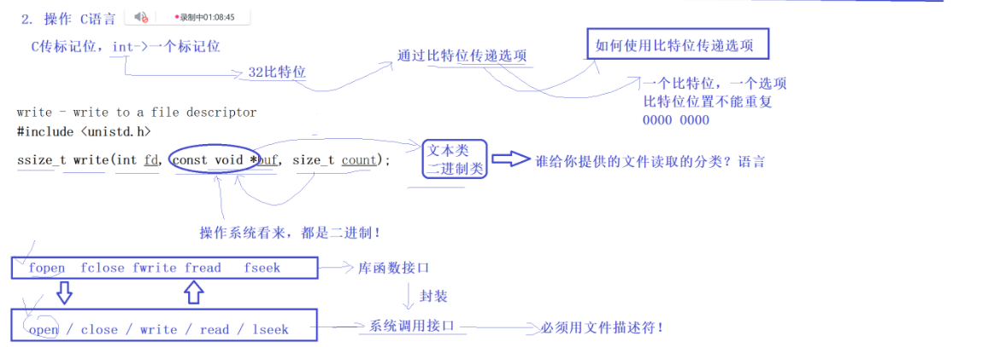

  

## open 系统接口

**系统往文件里面写入数据**

**open函数，**

```c
#include <stdio.h>    
#include <assert.h>    
#include <string.h>    
#include <unistd.h>    
#include <sys/types.h>    
#include <sys/stat.h>    
#include <fcntl.h>    
    
#define FILE_NAME "log.txt"    
    
int main()    
{    
      
  umask(0);    // 自定义掩码
  // c-- W > O_WRONLY | O_CREAT | O_TRUNC, 0666    
  /*    
   *int fd = open(FILE_NAME, O_WRONLY | O_CREAT | O_TRUNC, 0666);    
   */    
    
  int fd = open(FILE_NAME, O_WRONLY | O_CREAT | O_APPEND, 0666);    
  if(fd < 0)    
  {    
    perror("open");    
    return 1;    
  }    
    
  int cnt = 5;    
  char buffer[64];    
  while(cnt)    
  {                                                                                                                                                                          
    sprintf(buffer, "%s:%d\n", "harallo bit", cnt--);    
    // 你以斜杠零结尾是c语言规定的，和我文件有什么关系呢？    
    write(fd, buffer, strlen(buffer)); // strlen计算\0之前的数据, 这里面不写要写入 \0    
  }    
    
    
  /*    
   *printf("%d \n", fd);    
   */    
    
  close(fd);    
return 0
}
```

```
O_CREAT      文件不存在则创建
O_EXCL       与 O_CREAT 搭配：文件存在则报错
O_TRUNC      清空文件
O_APPEND     写入自动追加
O_NONBLOCK   非阻塞模式（设备/网络）
O_CLOEXEC    exec 时自动关闭 fd（安全）

1. 日志文件                    O_WRONLY | O_CREAT | O_APPEND
2. 锁文件（防重复启动）       O_WRONLY | O_CREAT | O_EXCL
3. 清空后写入                 O_WRONLY | O_CREAT | O_TRUNC
4. 非阻塞设备                 O_RDWR   | O_NONBLOCK
5. 安全读取（不泄漏 FD）      O_RDONLY | O_CLOEXEC
```

## **read**

```c
#include <stdio.h>    
#include <assert.h>    
#include <string.h>    
#include <unistd.h>    
#include <sys/types.h>    
#include <sys/stat.h>    
#include <fcntl.h>    
    
#define FILE_NAME "log.txt"    
    
int main()    
{    
      
  umask(0);    
    
  int fd = open(FILE_NAME, O_RDONLY);    
  if(fd < 0)    
  {    
    perror("open");    
    return 1;    
  }    
    
  char buffer[1024];    
  ssize_t num = read(fd, buffer, sizeof(buffer) - 1);  //
  if(num > 0) buffer[num] = 0;    
  printf("%s \n", buffer);    
    
    
  close(fd);    
 return 0
}
```


## 文件管理系统

**struct  file{}内核数据结构，先描述。**

**struct file* fdarry[], 后组织的。**

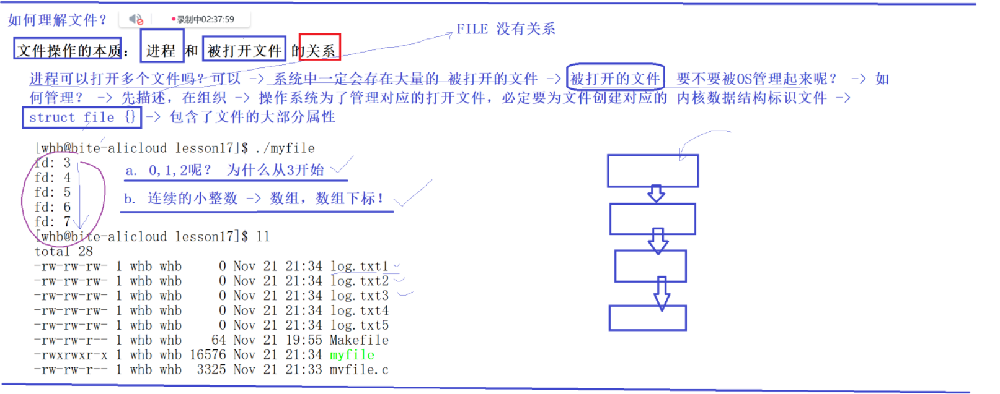

**语言层面封装了系统层面的接口**

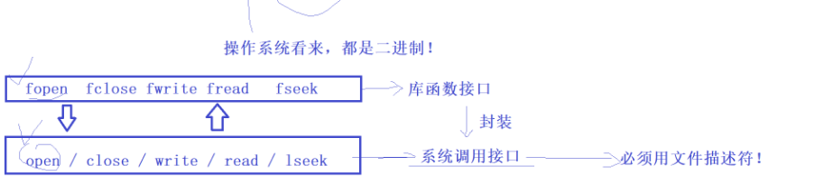


**如何理解这里的文件呢？**
**文件操作的本质：进程和被打开文件的关系**
**1.进程可以打开多个文件吗？ 可以的！ 系统中一定会存在大量的被打开的文件。被打开的文件要不要被OS管理起来呢？(要的)**
 **如何管理呢？(先描述，后组织)  操作系统为了管理对应的打开文件吗，必定要为文件创建对应的内核数据结构标识文件**


**struct file{} 包含了文件的大部分属性  内核数据结构**

**为什么fd是从3开始的呢？**

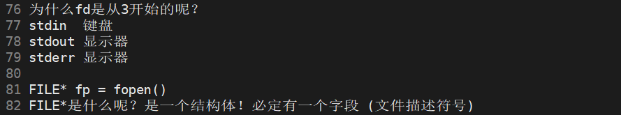


```c
#include <stdio.h>      
#include <unistd.h>      
#include <string.h>      
#include <sys/types.h>      
#include <sys/stat.h>      
#include <fcntl.h>      
#include <assert.h>      
#include <stdlib.h>      
#include <unistd.h>      
      
#define FILE_NAME(number) "log.txt"#number      
      
int main()      
{      
     
 umask(0);
 printf("stdin->fd:%d\n",  stdin->_fileno);
 printf("stdout->fd:%d\n", stdout->_fileno);
 printf("stderr->fd:%d\n", stderr->_fileno);  
    
  int fd0 = open(FILE_NAME(1), O_WRONLY | O_CREAT | O_ASYNC, 0666);      
  int fd1 = open(FILE_NAME(2), O_WRONLY | O_CREAT | O_ASYNC, 0666);      
  int fd2 = open(FILE_NAME(3), O_WRONLY | O_CREAT | O_ASYNC, 0666);      
  int fd3 = open(FILE_NAME(4), O_WRONLY | O_CREAT | O_ASYNC, 0666);      
  int fd4 = open(FILE_NAME(5), O_WRONLY | O_CREAT | O_ASYNC, 0666);      
  int fd5 = open(FILE_NAME(6), O_WRONLY | O_CREAT | O_ASYNC, 0666);      
         
  printf("fd %d \n", fd0);      
  printf("fd %d \n", fd1);      
  printf("fd %d \n", fd2);      
  printf("fd %d \n", fd3);      
  printf("fd %d \n", fd4);      
  printf("fd %d \n", fd5);      
                   
  close(fd0);      
  close(fd1);      
  close(fd2);      
  close(fd3);      
  close(fd4);      
  close(fd5);      

  return 0;      
}      

```


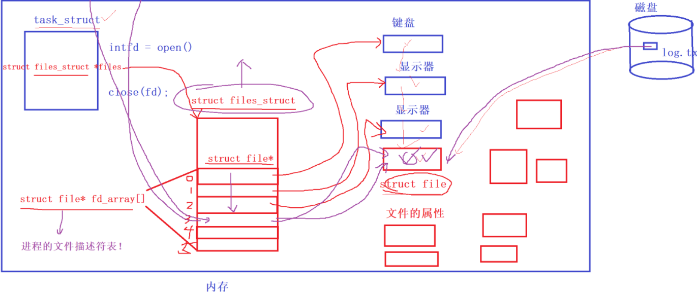

**进程控制块里面 有打开文件的信息。**

**PCB里面的 strcut file_struct* files**

**struct file_struct 结构体里面**

**struct file* fd_array[]  数组。**

```
struct files_struct* files
struct file
```


**内建指令：自己进程执行的指令**

**当前路径**

**shell原理的**

**文件的操作：c/c++接口，linux接口。 进程和被打开文件的关系。**

**进程访问文件 必须经过OS，进程需要管理 文件的。**

**文件描述符**

**复习**

**当前路径 工作 路径 **

**文件系统和文件的操作**

**文件描述符**

**文件描述符是从 stdin stdout stderr file1 file2 ...**

**其它语言本质是对系统接口的封装。**

**struct file_struct.  struct file* fd_array[] **

**复习**


**文件描述符**

```c
#include <stdio.h>    
#include <sys/types.h>    
#include <sys/stat.h>    
#include <fcntl.h>    
#include <unistd.h>    
    
int main()    
{    
    
   /*    
    *close(0);    
    */    
    
    close(1); //,标准输出的，显示器     
    
   /*    
    *close(2);    
    */    
    
  umask(0);    
  int fd = open("log.txt",O_WRONLY | O_CREAT | O_TRUNC, 0666);    
  if(fd < 0)    
  {    
    perror("open failed");    
    return 1;    
  }    
    
  printf("open fd %d \n", fd);    
  fprintf(stdout, "open fd %d \n", fd);    
  fflush(stdout);    // 这里必须刷新数据才能看到，因为缓冲区
                                                                                                                                                                             
  close(fd);    
  return 0;     
}         
```

**上面的代码就是重定向，本来到显示器，结果到文件里面去了的**

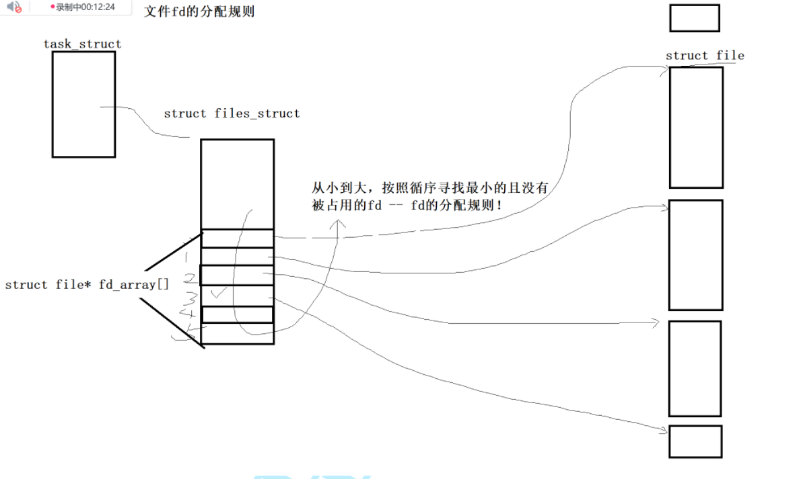


**重定向的本质是什么？
 上层用的fd不变，在内核中更改了fd对应的的struct file*的地址**

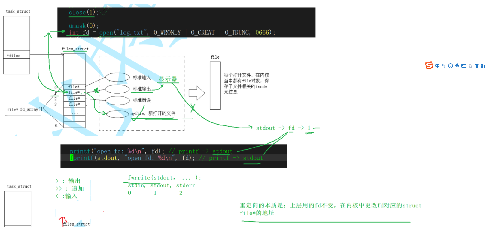


## 分配规则

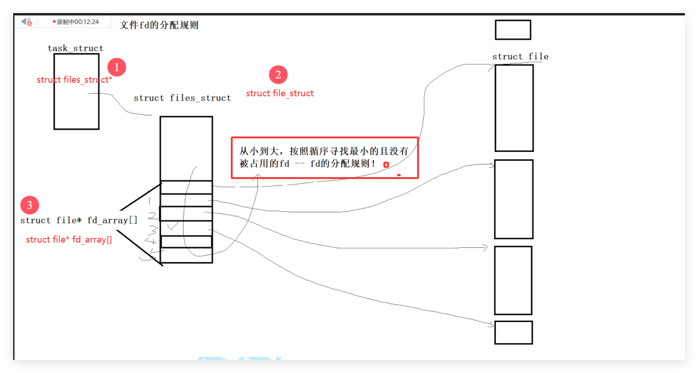

**struct files_struct**

**struct file* fd_array[]**

**struct file**

**fd的分配规则：从小到大找到最小且没有被占用的fd。默认012打开，所以一般是默认是3.**


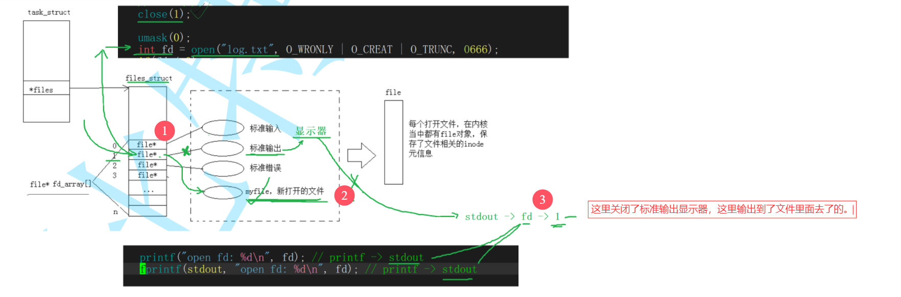

```c
#include <stdio.h>    
#include <sys/types.h>    
#include <sys/stat.h>    
#include <fcntl.h>    
#include <unistd.h>    
    
int main()    
{    
    
   /*    
    *close(0);    
    */    
    
    close(1); //,标准输出的，显示器     
    
   /*    
    *close(2);    
    */    
    
  umask(0);    
  int fd = open("log.txt",O_WRONLY | O_CREAT | O_TRUNC, 0666);    
  if(fd < 0)    
  {    
    perror("open failed");    
    return 1;    
  }    
    
  printf("open fd %d \n", fd);    
  fprintf(stdout, "open fd %d \n", fd);    
  fflush(stdout);    // 这里必须刷新数据才能看到，因为缓冲区
                                                                                                                                                                             
  close(fd);    
  return 0;     
}
```

**这就是重定向：本来是输出到显示器的，现在输出到文件里面去了的。**


## 重定向

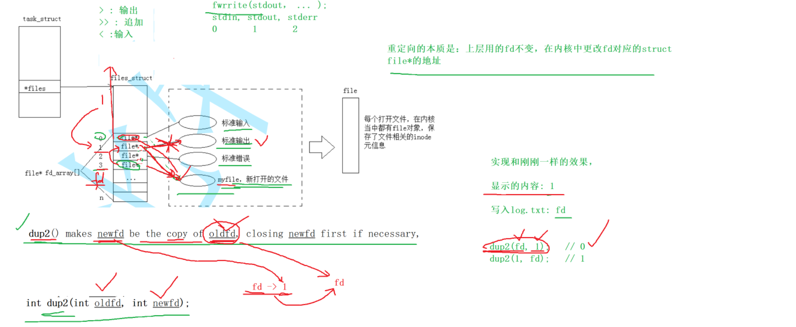

**系统重定向函数**

**dup2函数**

```c
    int dup2(int oldfd, int newfd);

    dup2() makes newfd be the copy of oldfd, closing newfd first if necessary, but note the following:

```

**先关闭后面的fd，然后在把它复制给前面的**


### 输出重定向

**输出重定向**

```c
#include <stdio.h>    
#include <sys/types.h>    
#include <sys/stat.h>    
#include <fcntl.h>    
#include <unistd.h>    
#include <string.h>    
    
int main()    
{    
    
  umask(0);    
  int fd = open("log.txt",O_WRONLY | O_CREAT | O_TRUNC, 0666);    
  /*    
   *int fd = open("log.txt",O_WRONLY | O_CREAT | O_APPEND, 0666);    
   */                                                                                                                                                                        
  if(fd < 0)    
  {    
    perror("open failed");    
    return 1;    
  }    
    
  // 现在1的位置是 fd了。现在输出数据是往fd里面了，而不是stdout(显示器了)    
  // 1.先关闭1
  // 2.让fd=1
  // 重定向了直接fd
  dup2(fd, 1);  // fd--->1    也可以理解fd-->1，fd直接重定向到1了。
    
    
  printf("open fd %d \n", fd); // 往stdout里面输出数据    
  fprintf(stdout, "open fd : %d \n", fd);    
    
  const char*msg = "hello world";    
  write(1,msg, strlen(msg));    
  fflush(stdout);    
    
    
    
  close(fd);    
  return 0;    
}    

```


### 追加重定向 

**追加重定向 **

```c
#include <stdio.h>    
#include <sys/types.h>    
#include <sys/stat.h>    
#include <fcntl.h>    
#include <unistd.h>    
#include <string.h>    
    
int main()    
{    
      
  umask(0);    
  /*    
   *int fd = open("log.txt",O_WRONLY | O_CREAT | O_TRUNC, 0666);    
   */    
      
  int fd = open("log.txt",O_WRONLY | O_CREAT | O_APPEND, 0666);    
  if(fd < 0)    
  {    
    perror("open failed");    
    return 1;    
  }    
    
  // 现在1的位置是 fd了。现在输出数据是往fd里面了，而不是stdout(显示器了)    
  dup2(fd, 1);  // fd--->1    
    
      
  printf("open fd %d \n", fd); // 往stdout里面输出数据    
  fprintf(stdout, "open fd : %d \n", fd);    
    
  const char*msg = "hello world";    
  write(1,msg, strlen(msg));    
  fflush(stdout);    
                                                                                                                                                                             
  close(fd);    
  return 0;     
}               

```


### 输入重定向

**输入重定向**

```c
#include <stdio.h>    
#include <sys/types.h>    
#include <sys/stat.h>    
#include <fcntl.h>    
#include <unistd.h>    
#include <string.h>    
                      
int main()             
{    
    
  umask(0);    
  int fd = open("log.txt",O_RDONLY);    
  if(fd < 0)    
  {    
    perror("open failed");    
    return 1;    
  }    
    
  dup2(fd, 0); // 输入重定向                                                                                                                                          
                                
  char line[64];    
  while(1)          
  {           
    printf("> ");    
                     
    if(fgets(line, sizeof(line), stdin) == NULL) // stdin read     
    {                                                              
      break;    
    }           
    printf("%s", line);    
  }                        
       
  close(fd);    
  return 0;     
}     
```


### shell重定向

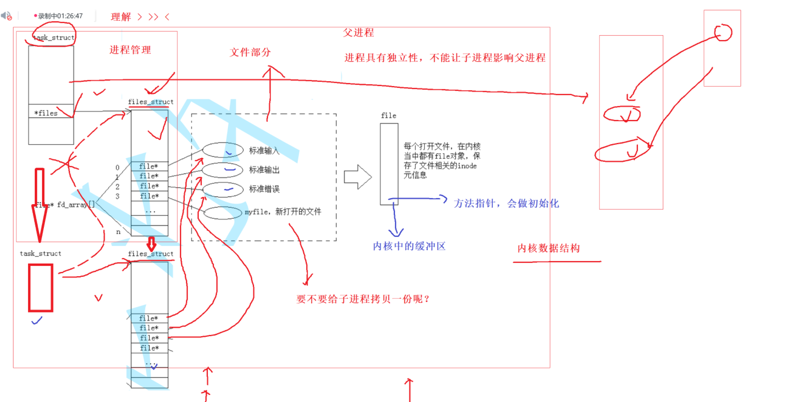

**数据结构：文件描述符系统会拷贝给子进程一份的。文件不用给子进程拷贝一份的。**

**进程的程序替换会不会影响 曾经重定向的文件描述符呢？ 不会的。PCB还是原来的PCB，程序和数据load到 内存里面去了的**


```c
#include <stdio.h>    
#include <string.h>    
#include <stdlib.h>    
#include <unistd.h>    
#include <sys/types.h>    
#include <sys/wait.h>    
#include <assert.h>    
#include <ctype.h>    
#include <sys/stat.h>    
#include <sys/types.h>    
#include <fcntl.h>    
#include <errno.h>    
    
#define NUM 1024    
#define OPT_NUM 64    
    
#define NONE_REDIR   0    
#define INPUT_REDIR  1    
#define OUTPUT_REDIR 2    
#define APPEND_REDIR 3    
    
#define trimSpace(start) do{\    
    while(isspace(*start)) ++start;\    
}while(0)    
    
int lastCode = 0;    
int lastSig = 0;    
    
char linecommand[NUM];    
char* myagrv[OPT_NUM];    
    
int redirType = NONE_REDIR;    
char* redirFile = NULL;    
    
//     
void commandCheck(char* command)    
{    
  assert(command != NULL);    
  char* start = command;    
  char* end = command + strlen(command);    
  while(start < end)    
  {    
    if(*start == '>')    
    {    
      *start = '\0';    
      start++;    
      if(*start == '>')    
      {    
        redirType = APPEND_REDIR;    
      }    
      else     
      {    
        redirType = OUTPUT_REDIR;    
      }    
    
      trimSpace(start);    
          
      redirFile = start;    
      break;    
    }    
    else if(*start == '<')    
    {    
      *start = '\0';    
      start++;    
      trimSpace(start);    
      redirType = INPUT_REDIR;    
      redirFile = start;    
      break;    
    }    
    else     
    {    
      start++;    
    }    
  }    
}    
    
    
    
int main()    
{    
    
      
  while(1)    
  {    
      
    // 初始化    
    redirType = NONE_REDIR;    
    redirFile = NULL;    
    errno = 0;    
  printf("用户名@主机名 当前路径# ");    
  fflush(stdout);    
    
  char* s = fgets(linecommand, sizeof(linecommand)-1, stdin);    
  assert(s != NULL);    
    
  (void)s;    
    
  // 清理最后一个\n    
  //    
  linecommand[strlen(linecommand) - 1] = 0;    
  //  printf("test %s\n", linecommand); 
  commandCheck(linecommand);    
    
  // " ls -a -l -h"    
  myagrv[0] = strtok(linecommand, " ");    
  
  int i = 1;
  if(myagrv[0] != NULL && strcmp(myagrv[0], "ls") == 0)
  {
    myagrv[i] =(char*) "--color=auto";
  }

  while((myagrv[i++] = strtok(NULL, " ")) != NULL)
  {
    ;
  }


  // 如果是cd指令，不需要创建子进程，让对应的shell执行。
  // 不需要子进程来执行，让shell自己执行----- 内建/内置命令
  if(myagrv[0] != NULL && strcmp(myagrv[0],"cd") == 0)
  {
    if(myagrv[1] != NULL) chdir(myagrv[1]);
    continue;
  }

  if(myagrv[0] != NULL && myagrv[1] != NULL && strcmp(myagrv[0], "echo") == 0 )
  {
    if( strcmp(myagrv[1],"$?") == 0) 
    {
      printf("%d, %d \n", lastCode, lastSig);
    }
    else 
    {
      printf("%s \n", myagrv[1]);
    }

    continue;
  }


  //测试 是否成功
  
/*
 *#ifdef DEBUG 
 *  for(int i = 0; myagrv[i]; i++)
 *  {
 *    printf("myagrv[%d], %s \n", i, myagrv[i]);
 *  }
 *#endif
 */

  // 执行命令 
  pid_t id = fork();
  assert(id != -1);

   if(0)
   {
      execvp(myagrv[0], myagrv);
      exit(1);
   }

   if(id == 0)
   {
     // 因为命令是子进程执行的，真正重定向的工作一定是子进程来完成的
     // 如何完成重定向， 是父进程要提供的信息、
     // 这里的重定向会影响父进程吗 进程具有独立性，不能影响父进程。拷贝struct_files
     
     switch(redirType)
     {
        case NONE_REDIR: 
          break;
        case INPUT_REDIR:
          {
            int fd = open(redirFile, O_RDONLY);
            if(fd < 0)
            {
              perror("open");
              exit(errno);
            }
            dup2(fd, 0);
          }
          break;
        case OUTPUT_REDIR:
        case APPEND_REDIR:
          {
            int flags = O_WRONLY | O_CREAT;
            if(redirType == APPEND_REDIR) flags |= O_APPEND;
            else flags |= O_TRUNC;

           int fd = open(redirFile, flags, 0666);
            if(fd < 0)
            {
              perror("open");
              exit(errno);
            }

            // 重定向文件已经打开了
            dup2(fd, 1);
          }
          break;
        default: printf("bug?\n");
          break;
     }
     execv(myagrv[0], myagrv); // 执行程序替换的时候，会不会影响曾经打开的重定向文件，不会的
     exit(1);
   }

   int status = 0;
   pid_t ret =  waitpid(id, &status, 0);
   assert(ret > 0);
   (void)ret;

   lastCode = (status>>8)&0xff;
   lastSig = status & 0x7f;
  }
  return 0;
}

```


```c
// shell_simple.c
#include <stdio.h>
#include <string.h>
#include <stdlib.h>
#include <unistd.h>
#include <sys/types.h>
#include <sys/wait.h>
#include <assert.h>
#include <ctype.h>
#include <sys/stat.h>
#include <fcntl.h>
#include <errno.h>

#define NUM 1024
#define OPT_NUM 64

#define NONE_REDIR   0
#define INPUT_REDIR  1
#define OUTPUT_REDIR 2
#define APPEND_REDIR 3

#define trimSpacePtr(p) do { while (*(p) && isspace((unsigned char)*(p))) ++(p); } while(0)

int lastCode = 0;
int lastSig = 0;

char linecommand[NUM];
char* myagrv[OPT_NUM];

int redirType = NONE_REDIR;
char* redirFile = NULL;

/* 解析重定向（只支持简单形式：cmd ... > filename 或 >> filename 或 < filename）
   解析后会把命令中重定向符号位置置 '\0'（从而截断命令部分），并把 redirType 与 redirFile 设好。 */
void commandCheck(char* command)
{
    assert(command != NULL);
    char* p = command;
    while (*p) {
        if (*p == '>') {
            *p = '\0';            // 截断命令
            p++;
            if (*p == '>') {     // >> 追加
                redirType = APPEND_REDIR;
                p++;
            } else {
                redirType = OUTPUT_REDIR;
            }
            trimSpacePtr(p);
            if (*p == '\0') { redirFile = NULL; return; }
            // 找到文件名的结尾（空白或字符串结束）
            char* fname = p;
            char* q = fname;
            while (*q && !isspace((unsigned char)*q)) ++q;
            *q = '\0'; // 截断文件名后的内容
            redirFile = fname;
            return;
        } else if (*p == '<') {
            *p = '\0';
            p++;
            trimSpacePtr(p);
            redirType = INPUT_REDIR;
            if (*p == '\0') { redirFile = NULL; return; }
            char* fname = p;
            char* q = fname;
            while (*q && !isspace((unsigned char)*q)) ++q;
            *q = '\0';
            redirFile = fname;
            return;
        } else {
            ++p;
        }
    }
}

int main()
{
    while (1) {
        // 初始化/重置
        redirType = NONE_REDIR;
        redirFile = NULL;
        errno = 0;

        printf("用户名@主机名 当前路径# ");
        fflush(stdout);

        char* s = fgets(linecommand, sizeof(linecommand), stdin);
        if (s == NULL) {
            // EOF（例如 Ctrl+D），退出 shell
            printf("\nexit\n");
            break;
        }

        // 去掉末尾的换行（如果有）
        size_t len = strlen(linecommand);
        if (len > 0 && linecommand[len - 1] == '\n') linecommand[len - 1] = '\0';

        // 忽略空行
        char* tmp = linecommand;
        trimSpacePtr(tmp);
        if (*tmp == '\0') continue;

        // 解析重定向（会把重定向符号替换为 '\0'，并设置 redirType/redirFile）
        commandCheck(linecommand);

        // tokenization：先把命令部分拆成 tokens
        for (int i = 0; i < OPT_NUM; ++i) myagrv[i] = NULL;

        int argc = 0;
        char* token = strtok(linecommand, " \t");
        while (token != NULL && argc < OPT_NUM - 1) {
            myagrv[argc++] = token;
            token = strtok(NULL, " \t");
        }
        myagrv[argc] = NULL;

        if (argc == 0) continue;

        // 内建命令：cd
        if (strcmp(myagrv[0], "cd") == 0) {
            if (myagrv[1] != NULL) {
                if (chdir(myagrv[1]) != 0) perror("chdir");
            } else {
                // 没有参数切到 HOME
                char* home = getenv("HOME");
                if (home) chdir(home);
            }
            continue;
        }

        // 内建命令：echo $?
        if (strcmp(myagrv[0], "echo") == 0 && myagrv[1] != NULL) {
            if (strcmp(myagrv[1], "$?") == 0) {
                printf("%d, %d\n", lastCode, lastSig);
            } else {
                printf("%s\n", myagrv[1]);
            }
            continue;
        }

        // 如果是 ls，插入 --color=auto（插入到 argv[1]，并向后移动），并检查不越界
        if (argc >= 1 && strcmp(myagrv[0], "ls") == 0) {
            if (argc + 1 < OPT_NUM) {
                // 从后往前移动
                for (int i = argc; i >= 1; --i) {
                    myagrv[i + 0] = myagrv[i - 1]; // move including NULL at end
                }
                myagrv[1] = "--color=auto";
                argc += 1;
                myagrv[argc] = NULL;
            }
        }

        // fork + exec
        pid_t id = fork();
        if (id < 0) {
            perror("fork");
            continue;
        }

        if (id == 0) {
            // child: 处理重定向
            switch (redirType) {
                case NONE_REDIR:
                    break;
                case INPUT_REDIR: {
                    if (redirFile == NULL) {
                        fprintf(stderr, "input redirection file missing\n");
                        _exit(1);
                    }
                    int fd = open(redirFile, O_RDONLY);
                    if (fd < 0) {
                        perror("open input");
                        _exit(errno ? errno : 1);
                    }
                    if (dup2(fd, STDIN_FILENO) < 0) {
                        perror("dup2 input");
                        close(fd);
                        _exit(1);
                    }
                    close(fd);
                } break;
                case OUTPUT_REDIR:
                case APPEND_REDIR: {
                    if (redirFile == NULL) {
                        fprintf(stderr, "output redirection file missing\n");
                        _exit(1);
                    }
                    int flags = O_WRONLY | O_CREAT;
                    if (redirType == APPEND_REDIR) flags |= O_APPEND;
                    else flags |= O_TRUNC;
                    int fd = open(redirFile, flags, 0666);
                    if (fd < 0) {
                        perror("open output");
                        _exit(errno ? errno : 1);
                    }
                    if (dup2(fd, STDOUT_FILENO) < 0) {
                        perror("dup2 output");
                        close(fd);
                        _exit(1);
                    }
                    close(fd);
                } break;
                default:
                    break;
            }

            // execvp 会根据 PATH 查找可执行文件
            execvp(myagrv[0], myagrv);
            // execvp 只有在失败时返回
            perror("execvp");
            _exit(127);
        }

        // parent: 等待子进程
        int status = 0;
        pid_t ret = waitpid(id, &status, 0);
        if (ret < 0) {
            perror("waitpid");
            continue;
        }

        if (WIFEXITED(status)) {
            lastCode = WEXITSTATUS(status);
            lastSig = 0;
        } else if (WIFSIGNALED(status)) {
            lastCode = 128 + WTERMSIG(status); // convention
            lastSig = WTERMSIG(status);
        } else {
            lastCode = status;
            lastSig = 0;
        }
    } // while

    return 0;
}

```


## 2Linux一切皆文件

**多态**

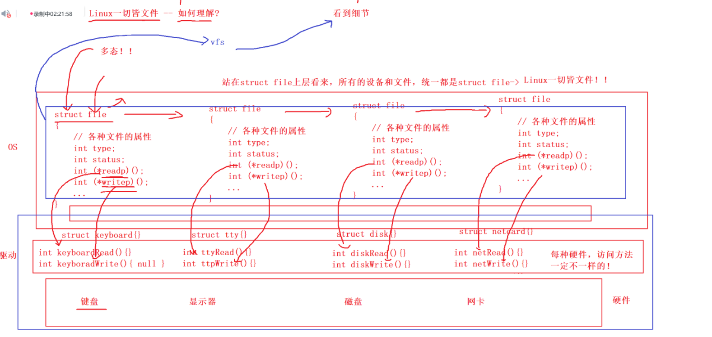

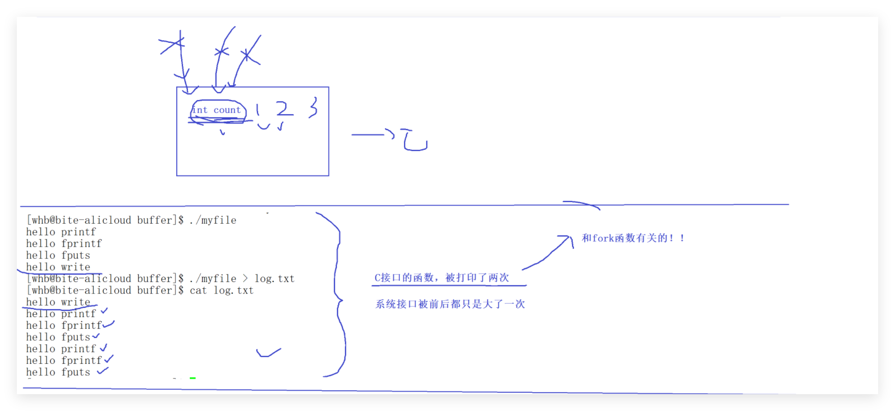

**进程地址空间**

**引用计数信息,文件被多少人打开。**

**一直要学习，但是也要谦虚的。**

**万变不离其宗。come on**


**存储**

**计算**

**业务**

**我们做的是业务的**

**一切皆文件：结构包含函数指针的。**


## 3缓冲区

### 初始缓冲区

**./a.out > log.txt**

```c
#include <stdio.h>    
#include <sys/types.h>    
#include <sys/stat.h>    
#include <fcntl.h>    
#include <unistd.h>    
#include <string.h>    
int main()    
{    
  // 用户数据都要经过缓冲区域的    
  // c接口    
  printf("hello printf \n");    
  fprintf(stdout, "hello fprintf \n");    
  fputs("hello fputs \n", stdout);    
    
  // 系统调用接口                                                                                                                                                            
  const char* msg = "hello elifc \n";    
  write(1, msg, strlen(msg));    
    
  // 执行到这里的时候，还没有刷新数据    
  fork();    
    
  return 0;    
}    

```

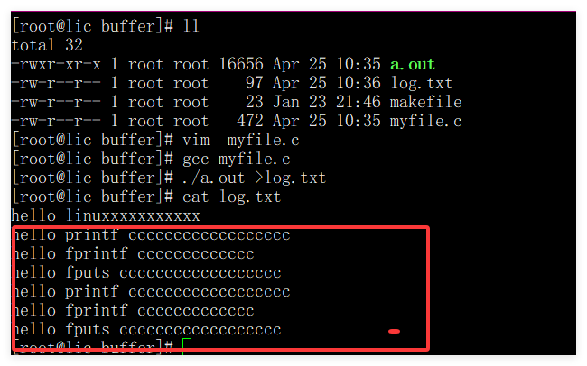

### 总结

**1.c函数会维护FILE*里面的一个缓冲区大小的。write函数就是系统的一个拷贝函数，拷贝到系统的缓冲区里面了的。**

**2.stdout标准输出采用的是，行缓冲区。所以 到fork()。c函数的缓冲区已经没有数据了的。而wirte直接拷贝尽内核里面去了的。**

**3.文件一般采用的是全缓冲的。普通文件下，`stdout` 默认是 全缓冲的。**

​	**`fork()` 会创建子进程，子进程会复制父进程的用户空间数据，其中就包括 `stdout` 里面还没刷新的那三条 C 输出内容。**

```
// 3. fork 时，父进程用户空间中的 stdout 缓冲区也会被子进程继承。
//    如果 fork 前 stdout 缓冲区中还有未刷新的数据，父子进程退出时都会调用 exit 刷新缓冲区。
//    因此这部分 C 库缓冲区中的数据会被写入两次。
//    写时拷贝是 Linux 对进程地址空间复制的优化机制，重复输出的直接原因是：
//    父子进程各自拥有一份待刷新的 stdout 缓冲区。
```

**4.重点是：重复输出不是因为 `fork()` 自动输出了两次，而是因为 `fork()` 复制了还没刷新的 C 缓冲区。**

**5.为什么write不会执行两次？  它直接把数据写入了文件描述符 `1` 对应的目标。**

**6如何避免重定向时 C 输出重复？**

```c
printf("hello printf------------------c\n");
fprintf(stdout, "hello fprintf--------c \n");
fputs("hello fputs--------------------c \n", stdout);

const char* msg = "hello elifc-------------linux \n";
write(1, msg, strlen(msg));

fflush(stdout);  // fork 前清空 C 缓冲区

fork();

return 0;
```

```
printf / fprintf / fputs：
数据先进入进程地址空间中的 stdout 缓冲区。
fork 时，如果还没刷新，这份缓冲区会被父子进程各自拥有。
所以可能输出两次。

write：
数据虽然来源于进程地址空间，但是 write 执行时已经交给内核。
fork 时，没有 write 的待刷新用户态缓冲区。
所以不会因为 fork 自动输出两次。
```

**最关键的一点。**


**缓冲区相关的，下节课继续的。**

**复习**

**进程和被打开文件的关系**

**重定向关系：dup2(fd,1)   **


**复习**

**用户级别的接口**

**理解缓冲区域**

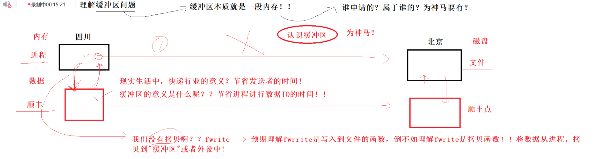

**本质及时一段内存。谁申请的？属于谁的？为什么要申请？**

​	**例子：发快递的例子。缓存快递信息。**

​	**写在缓冲区里面，不要一有数据就刷新，太浪费时间了的。**

**缓冲区的意义？节省进程进行数据IO的时间！！**

**我们没有进行拷贝啊？ fwrite---->其实是一个拷贝函数，将数据从进程拷贝到缓冲区或者外设中！！**

**缓冲区刷新策略的问题。**

**如果有一块数据，一次写入到外设。效率高。**

**如果有一块数据，多次写入到外设。效率低，多次IO访问。**


### 刷新策略

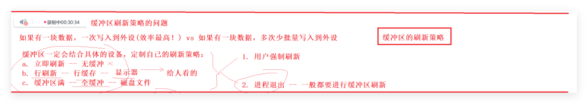

**缓冲区一定会结合具体设计，定制刷新自己的策略。**

**1.立即刷新--无缓冲**

**2.行刷新----行缓存---显示器----->给人看的**

**3.缓冲区----全缓冲---磁盘文件。**

​	**特例**

​	**1.用户强制刷新**

​	**2.进程退出，一般都要进行缓冲区刷新。**


### 缓冲区位置

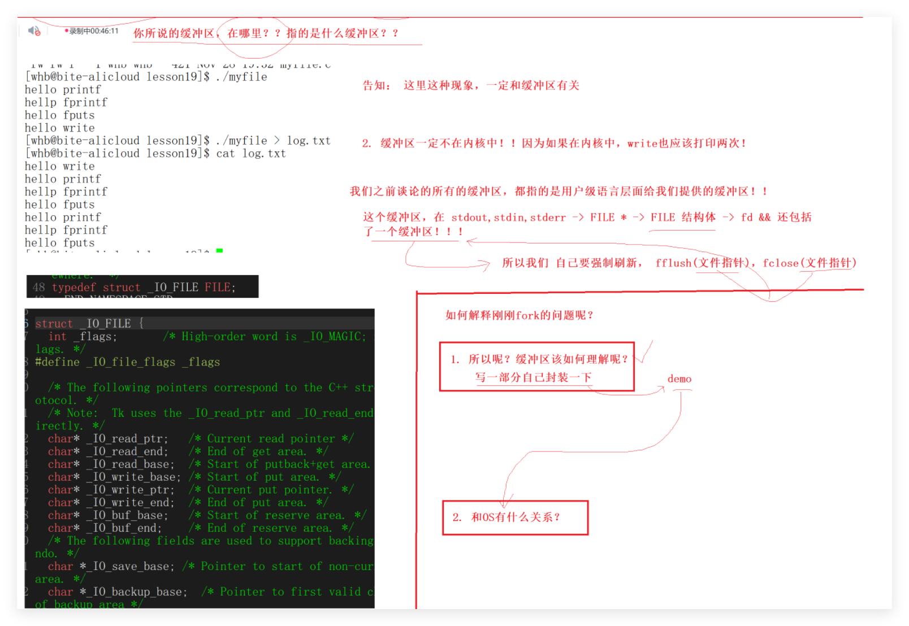

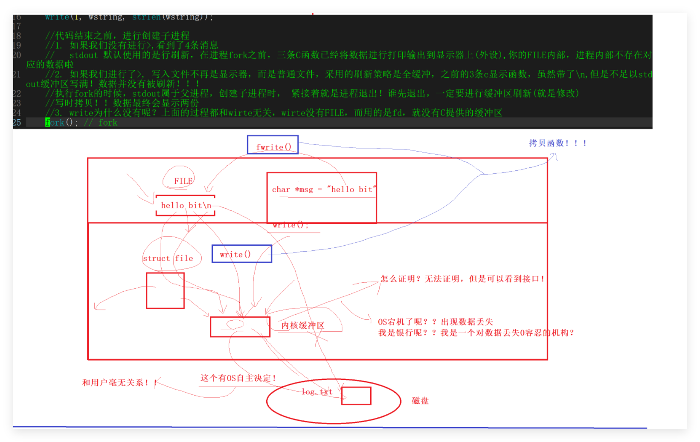

**你所谓的缓冲区在哪里？指的是什么缓冲区？**

​	**缓冲区域不在内核中！**

​	**所有的缓冲区都指的是，用户级语言层面给我们提供的缓冲区。**

​	**FILE*文件指针，这是一个结构体的。**

​	**这个缓冲区在，stdout stdin stderr --> FILE* --> FILE 结构体 --> fd && 缓冲区！！！！！！！！！！！。**

​	**我们在强制刷新，fflush(文件指针)， fclose(文件指针)。**

```c
#include <stdio.h>
#include <sys/types.h>
#include <sys/stat.h>
#include <fcntl.h>
#include <unistd.h>
#include <string.h>
int main()
{
  // 用户数据都要经过缓冲区域的
  // 用户接口
  printf("hello printf------------------c\n");
  fprintf(stdout, "hello fprintf--------c \n");
  fputs("hello fputs--------------------c \n", stdout);

  // 系统接口
  const char* msg = "hello elifc-------------linux \n";
  write(1, msg, strlen(msg));
  
  // 执行到这里的时候，还没有刷新数据
  fork();
  
  // stdout默认是行刷新 ，fork之前，三条c函数已经数据输出到显示器了，你的FILE内部，进程进程内部不存在对应的数据了
  // 进行了 > 写入文件不再是显示器了，而是普通文件了，采用的刷新策略全缓冲，c函数虽然有\n， 不足以将stdout缓冲区写满！
  // 数据并没有被刷新。
  //
  // 执行fork时，stdout属于父进程，创建子进程，紧接着就是进程退出。但是谁先退出，一定要进行缓冲区刷新(就是修改)
  // 发生写时拷贝
  // 数据终止会显示两份
  //
  // wirte没有， write没有FILE, 用的是fd， 就没有c提供的缓冲区。

  return 0;
}

```

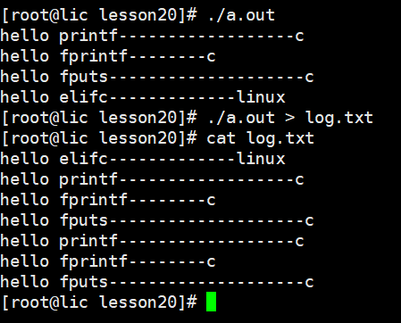

**缓冲区是语言级别 提供的内存**

**FILE*  FILE结构体**

**FILE里面存着：fd和缓冲区**

```c
#include <stdio.h>                                                                                                                                                           
#include <sys/types.h>    
#include <sys/stat.h>    
#include <fcntl.h>    
#include <unistd.h>    
#include <string.h>    
int main()    
{    
    
  // 用户数据都要经过缓冲区域的    
  // 用户接口    
  printf("hello printf------------------c\n");    
  fprintf(stdout, "hello fprintf--------c \n");    
  fputs("hello fputs--------------------c \n", stdout);    
    
    
    
  // 系统接口    
  const char* msg = "hello elifc-------------linux \n";    
  write(1, msg, strlen(msg));    
    
  // 执行到这里的时候，还没有刷新数据    
  fork();    
    
  // stdout默认是行刷新 ，fork之前，三条c函数已经数据输出到显示器了，你的FILE内部，进程进程内部不存在对应的数据了    
  // 进行了 > 写入文件不再是显示器了，而是普通文件了，采用的刷新策略全缓冲，c函数虽然有\n， 不足以将stdout缓冲区写满！    
  // 数据并没有被刷新。    
  //    
  // 执行fork时，stdout属于父进程，创建子进程，紧接着就是进程退出。但是谁先退出，一定要进行缓冲区刷新(就是修改)    
  // 发生写时拷贝    
  // 数据终止会显示两份    
  //    
  // wirte没有， write没有FILE, 用的是fd， 就没有c提供的缓冲区。    
    
  return 0;    
}    

```

**/usr/include/stdio.h**

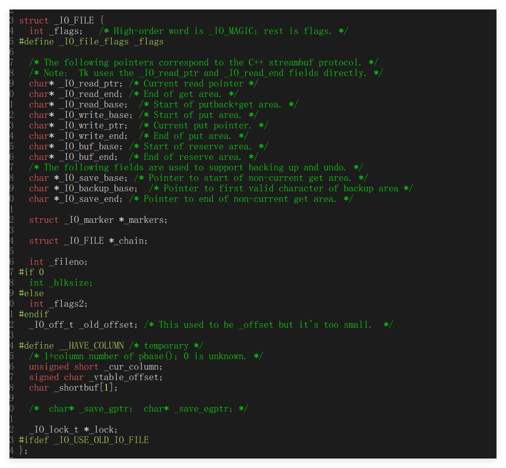

**/usr/include/libio.h**

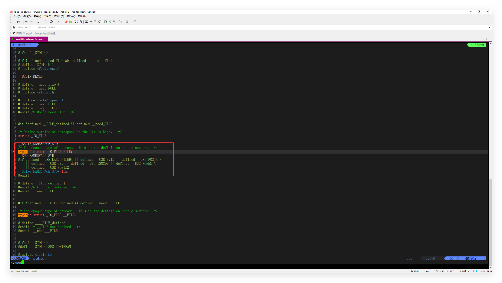


### **模拟实现缓冲区**

```c
#pragma once                                                                                                                                                                 
    
#include <assert.h>    
#include <stdlib.h>    
#include <errno.h>    
#include <sys/types.h>    
#include <unistd.h>    
#include <sys/stat.h>    
#include <fcntl.h>    
#include <string.h>    
    
#define SIZE      1024    
#define SYNC_NOW  1    
#define SYNC_LINE 2    
#define SYNC_FULL 4    
    
    
typedef struct _FILE    
{    
    int flags;      // 刷新方式    
    int fileno;     //     
    int cap;        // 总容量    
    int szie;       //  使用量    
    char buffer[SIZE];  //     
    
    
}FILE_;    
    
FILE_* fopen_(const char* path_name, const char* mode);    
void    fwrite_(const void* ptr, int num, FILE_* fp);    
void   fclose_(FILE_* fp);    
void fflush_(FILE_* fp);  
```


```c
#include "myStdio.h"    
    
FILE_* fopen_(const char* path_name, const char* mode)    
{    
    int flags = 0;    
    int defaultMode=0666;    
    if(strcmp(mode, "r") == 0)    
    {    
      flags |= O_RDONLY;    
    }    
    else if(strcmp(mode, "w") == 0)    
    {    
      flags |= (O_WRONLY | O_CREAT | O_TRUNC);    
    }    
    else if(strcmp(mode, "a") == 0)    
    {    
      flags |= (O_WRONLY | O_CREAT | O_APPEND);    
    }    
    else    
    {    
      // todo                                                                                                                     
    }    
    
    int fd = 0;    
    
    if(flags & O_RDONLY) fd = open(path_name, flags);    
    else fd = open(path_name, flags, defaultMode);    
    
    if(fd < 0)    
    {    
      const char* err = strerror(errno);    
      write(2, err, strlen(err));    
      return NULL;    
    }    
    
    
    
    FILE_* fp = (FILE_*)malloc(sizeof(FILE_));    
    
    assert(fp);    
    
    fp->flags = SYNC_LINE;    
    fp->fileno = fd;    
    fp->cap = SIZE;    
    fp->szie = 0;    
    memset(fp->buffer, 0, SIZE);    
    
    
    
    return fp; // 这就是为什么打开一个文件，就会返回一个FILE* 指针    
}    
    
    
    
void fwrite_(const void* ptr, int num, FILE_* fp)    
{    
  // 数据写入到缓冲区中    
   memcpy(fp->buffer + fp->szie, ptr, num); // 不考虑缓冲区的溢出    
    
   fp->szie += num;    
   // 判断是否刷新    
    
   if(fp->flags & SYNC_NOW)    
   {    
    write(fp->fileno, fp->buffer, fp->szie);    
    fp->szie = 0; // 清空缓冲区    
   }    
   else if(fp->flags & SYNC_FULL)    
   {    
     if(fp->szie == fp->cap)    
     {    
        write(fp->fileno, fp->buffer, fp->szie);    
        fp->szie =  0;    
     }    
   }    
   else if(fp->flags & SYNC_LINE)    
   {    
      if(fp->buffer[fp->szie-1] == '\n')    
      {    
        write(fp->fileno, fp->buffer, fp->szie);    
        fp->szie =  0;    
      }    
   }    
   else    
   {    
    
   }    
}    
    
    
    
void fflush_(FILE_* fp)    
{    
  // 写到系统里面    
  if(fp->szie > 0)write(fp->fileno, fp->buffer, fp->szie);    
    
  // 真正的刷新    
  // 内核缓冲区到----磁盘文件的
  fsync(fp->fileno);    
  fp->szie = 0;    
}    
    
void fclose_(FILE_* fp)    
{    
  fflush_(fp);    
  close(fp->fileno);    
}    

```


```c
#include "myStdio.h"                                                                                                                                                         
    
int main()    
{    
    
  FILE_* fp = fopen_("./log.txt","w");    
    
  if(fp == NULL)    
  {    
    return 1;    
  }    
    
  const char* msg = "helllo \n";    
    
  int cnt = 18;    
  while(cnt)    
  {    
    fwrite_(msg, strlen(msg), fp);    
    sleep(1);    
    if(cnt % 3 == 0) fflush_(fp);    
    cnt--;    
  }    
    
  fclose_(fp);    
  return 0;    
}    

```


**用户缓冲区，内核缓冲区，磁盘**

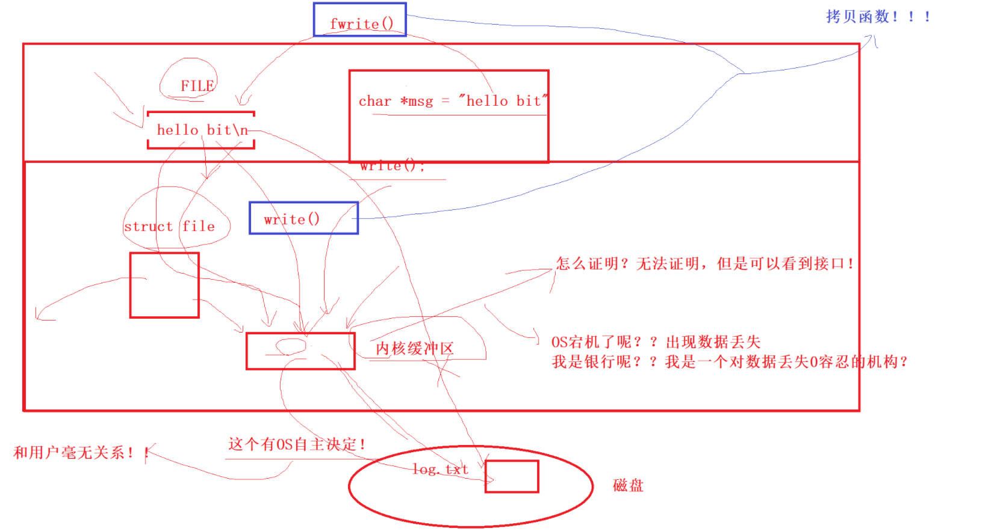

**缓冲区：发送方提高效率的。**

**缓冲区就是c语言提供的一块内存的。FILE*指向的结构体里面的。 写到wirte的缓冲区里面的。**

**wirte操作系统级别的缓冲区。**

**在写到真正的系统文件里面。**


## 4文件系统

**磁盘上静静躺着文件的管理**


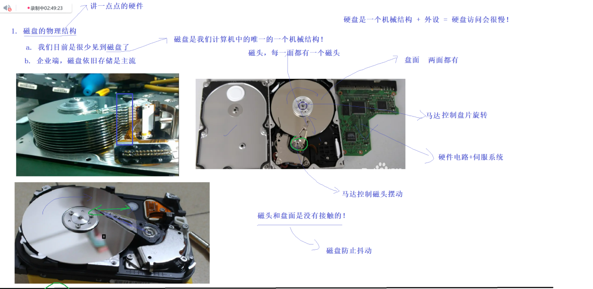

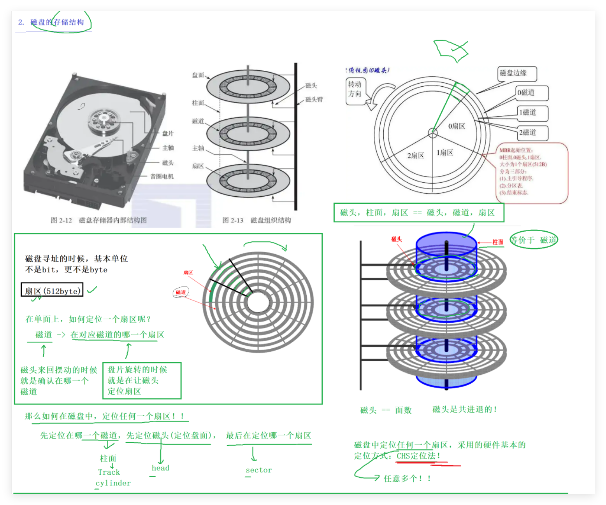

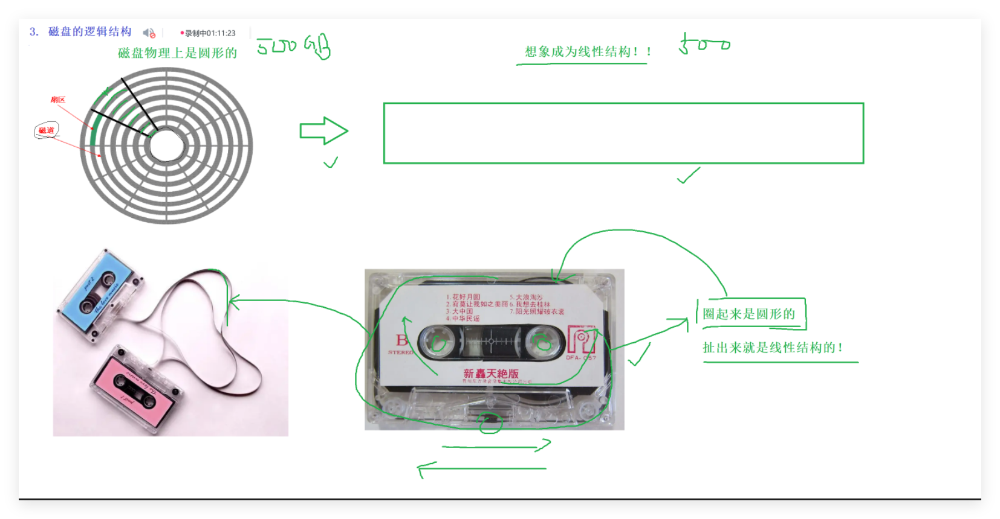

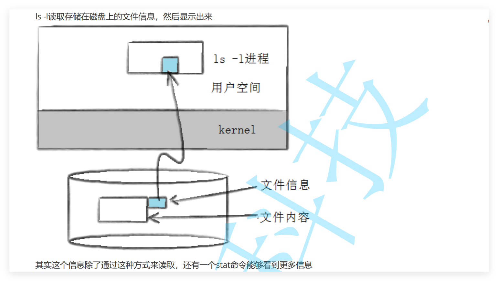

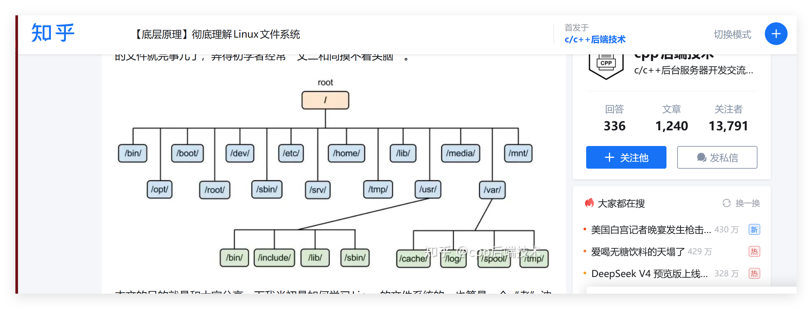

**硬盘是一个机械结构，相对于内存，CPU速度最慢的。**

**磁道就是一圈一圈的同心圆的。磁盘的一般加载是，就是一个一个扇区。512byte。 每个扇区放数据的大小是一样的。512字节的。**

**先定位哪一个磁道(磁头来回摆动。)，然后找到扇区(扇面来回转动的)。  一圈一圈的定位， 扇形扇形定位的**

**柱道。竖着的同心圆的。**

**磁头==面数。磁头共同进退的。柱面登场。**

**先定位在那个一个磁道，然后定位磁头（盘面）， 最后定位在哪一个扇区的。 柱面---盘面---扇区。**

**CHS定位法。**


### 磁盘建模

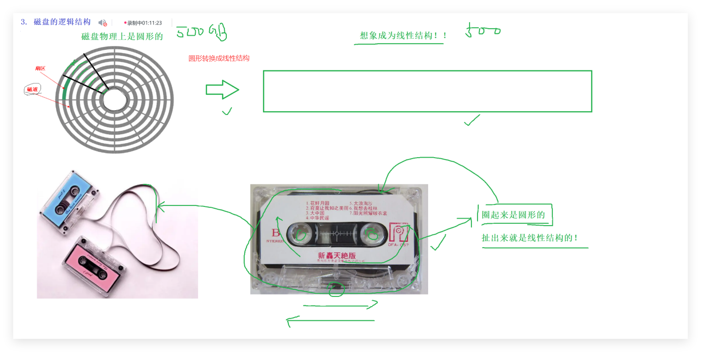

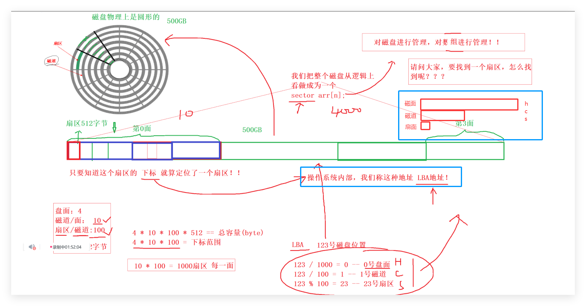

**为什么用两套地址呢？**


### 4kb

**磁盘虽然是512字节，OS看来依旧很小的。0.5KB。8个扇区load内存里面的。**

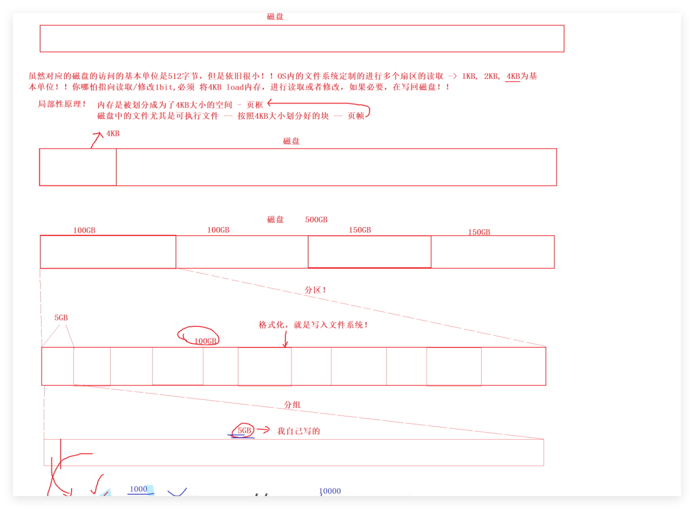

**为什么是4KB，局部性原理，可能你加载的数据，旁边的数据也可能被访问的。**

**特别是可执行文件  (进程地址空间的)  按照4KB加载到内存里面去了的。4KB就是传说中的页帧。**


**分布式**（Distributed）是计算机科学和系统架构中的一个核心概念，简单说就是：**把一个任务或系统拆分成多个部分，交给多台计算机（节点）协同完成，对外看起来像一台超级计算机**。


### 文件系统

**分区**

**管理100G好了，其它的就管理好了的。**  **boot:启动的**

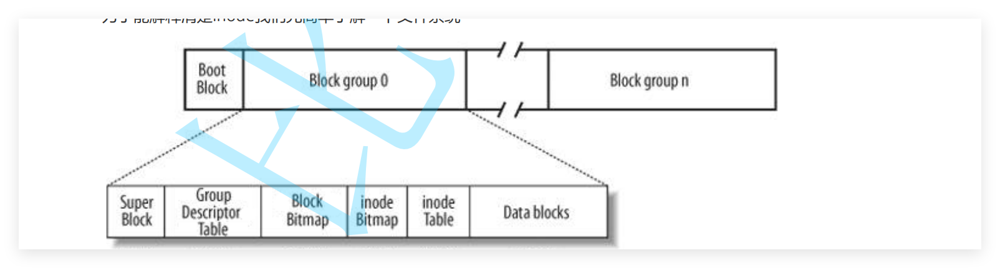

**分组**

**boot block:启动块。**

**super block:保存的是整个文件系统的信息。 可能存在几个有的。多存在就方便我们进行备份的。 不同组可能存在几个的。**

​	**文件 ==  内容 +  属性。linux的文件内容和文件属性，分开存储的。**

​	**inode：一个固定大小的，一个文件一个inode, 文件几乎所有的属性都在inode中，文件名不再inode中的。**

​	**DataBlock:文件内容大小。随着应用类型的变化，大小也在变化的。**

**inode**

**inode为了进行彼此进行区别，每一个都有自己的ID, 这就是inode.**

**inodetable:保存了分组内部所有可用的（已经使用的+没有使用的）inode信息。**

**datablock**

**datablock:保存的是分组内部所有文件的数据块。**

**inode Bitmap: inode对应的位图结构。位图中比特位的位置，和当前文件对应的inode位置是一一对应的。**

**Block Bitmap: 数据块对应的位图结构。位图中的位置和datablock是一一对应的。**

**Group Discriptor Table**

**Group Discriptor Table:GDT 块组描述表**

****

**找一个文件是使用的是inode.怎么找到文件的dataBlock呢？**

**struct inode{int blocks[]}   数据块的数组。**

**数据块可以存放：其它数据块的id信息。**

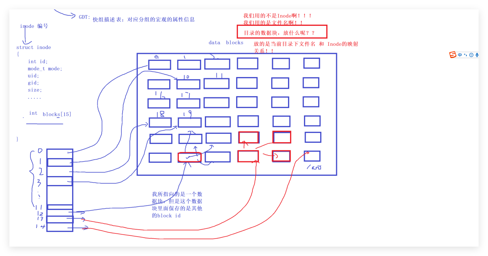

**文件系统一般是惰性删除文件的。**

**目录**

**目录的属性**

**目录的数据块放什么呢？目录的内容是：当前目录下的文件名和inode映射关系的。**


**复习**

**缓冲 缓存区**

**缓冲区就是一块内存**

**用户刷新策略和OS自己的刷新策略。**

**FILE-----OS-----磁盘上**

**文件系统，没有打开的文件**

**复习**


**磁盘的物理结构**

**磁道---》盘面-----》扇区**

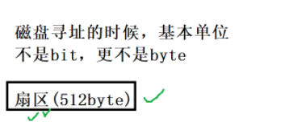


**磁盘访问的基本单位是512字节，但是依旧很小。 OS内的文件系统定制多个扇区的读取。1kb,2kb,4kb为基础**

**哪怕是1bit位，  将4kbload到内存里面，进行读取或者修改，有必要，在写回磁盘。**


**局部性原理！**

**空间换时间，缓存命中。**

**内存是被划分成为4kb大小的空间。页框。**

**磁盘中的文件，尤其是可执行文件---按照4kb大小划分好的块。页帧**

**文件 = 内容 + 属性。 linux的文件属性和文件内容是分批存储的。    
super block保存整个文件系统的信息。    
Inode是固定大小。一个文件一个Inode,文件的几乎所有属性都在inode, 文件名不在inode里面。    
data block 随着应用类型的变化，大小也在变化。分组内部所有文件的数据块。    
inode table保存了分组内部，所有可以使用的+不可以使用的inode    
inode bitmap是inode对应的位图结构，和当前文件对应的inode的位置一一对应的！    
data block数据块对应的位图结构，    
GDT 块足描述表。分组的宏观信息。**

**查找文件的时候，统一使用inode编号。    
    
struct inode    
{    
  int id;    
  mode_t mode;    
  uid;    
  gdt;    
  size;    
    
  data_block blocks[15]; // 指向的是数据块，数据块也可以是其它数据块。    
}    
    
    
(分布式)    

目录的数据块放什么呢？
 当前目录下文件名和inode的映射关系**

### **复习**

****

**Linux是开源，开源手段，不是目的。通过开源， 不同的人为之奋斗而努力的。**

**Linux的发行版本，和不同版本定制的Linux。**

**OS管理软硬件。**

**生态丰富，文档方便**

**文件路径多叉树，结构清晰，方便我们进行唯一的定位。手机进行定位的文件，只不过给你优化了的。**

**重定向：进程和打开文件的关系。dup2函数。 ls--->fork---> >重定向文件里面的。**

**shell就是终端，指令的指令就是一个子进程的。**

**权限：人+能够做什么。 root内裤穿在外面的超人。**

**粘滞位，所有人共享的一个公共目录，都可以看得，但是不能够删除的。chmod ugo+-rwx**

**umask（）掩码，遮掉权限。 **

**cd需要执行权限，进去。目录的读就是ls,目录的写就是创建文件的。目录就是一个文件名和一个inode进行关联起来的。**

**权限都打开，文件读写执行，是文件本身的属性。删除文件是和这个文件目录的属性相关的。就是写权限就是可以删除的。**

**yum配置就是配置yum软件的网址。一定在某些服务器上面的。**

**进程地址空间：PCB一个属性。代码区，数据区，应该映射到物理内存哪个位置。这里是虚拟地址的。**

**页表进行映射的。1.安全  2.同一映射 3.解耦**

**进程控制：进程等待。1.子进程的僵尸状态   2.子进程的退出信息的。**

**程序替换。进程地址空间没有变，磁盘的代码数据load到内存里面去。开始执行调度。**

**shell的内建指令。**

**FILE结构体。里面就是C语言的缓冲区的。**

**IO的几个宏和C语言给你的rwx+的者**

**文件描述符的分配规则和重定向。 dup2函数的登场。  dup2函数进行重定向的。**  

**理解重定向。和刷新策略。**

**经典例子1.刷新方式 2. 写时拷贝 3.刷新策略和缓冲区。**

**磁盘的物理结构，盘面，磁头。 柱面找到总体一圈。磁头找到一圈。最后找到扇区。**

**柱面一堆同心圆，磁道，然后就是扇区。**

**文件系统，我们如何使用磁盘的存储容量信息。**

**磁盘片面抽象成 一个巨大的数组，根据磁盘的容量，进程取模和算数就可以定位了的。**

**OS一般是4KB,进行load内存里面。**

**分区，分组。**

**分组就是一个最小的文件系统。**

**block root 。**

**super block 。**

**group 0**

**Group Descriptor Table。**

**Block bitmap**

**Inode bitmap**

**inode table**

**inode table**

**group 1,,,,n**

**目录也是文件，它文件内容是什么呢？  文件名和inode的映射关系。**

**文件面-----------inode关系相互映射。**

**删除文件最好的做法就是什么都不做，不做IO操作。找到inode恢复，根据inode找到文件数据块的。**


****

**复习**


### 软硬链接

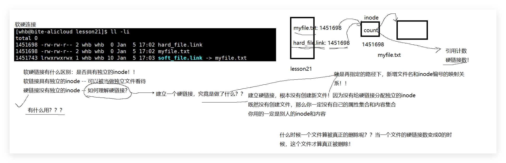

**ln -s  旧文件的名，软链接名。 快捷方式而已的。**

**ln      旧文件的名称，硬链接名**

**软硬链接是否具有独立的inode。**

**软链接具有独立的inode----可以当做独立的文件看待。**

**硬链接没有独立的inode-->如何理解硬链接呢？  建立一个硬 链接是用来做什么的？**

**硬链接根本没有独立的inode,没有创建新的文件信息。既然没有创建文件，就没有文件属性和文件信息的，你的一定是使用别人的inode可内容的。**

**硬链接的本质：新增文件名和inode编号的映射关系。**

**inode属性：引用计数器。硬链接数。多少文件指向我。**

**一个文件真正的被删除了，真正清楚文件的属性和内容？ 文件的硬链接数==0.**


**软链接：目标文件的路径内容信息。**


**建立硬链接根本没有创建新文件 **

**没有自己的内容和属性集合**

**建立硬链接是和文件名和inode编号的映射关系**

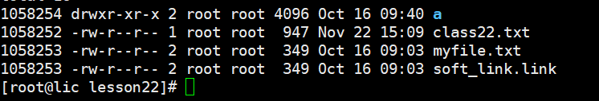

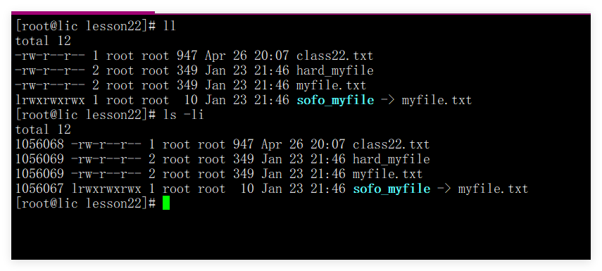

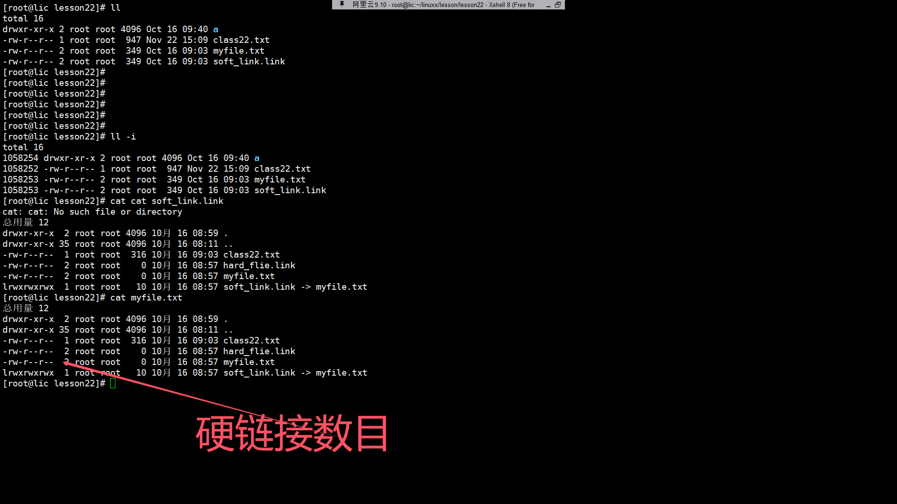


**文件真正被删除就是 硬链接数变成0的是**


**软件**

**ln -s 目标文件 链接名**

**记录文件的路径字符串**

**硬**

**ln 目标文件 链接名**

**建立一个备份**


**一个.也是文件名称**

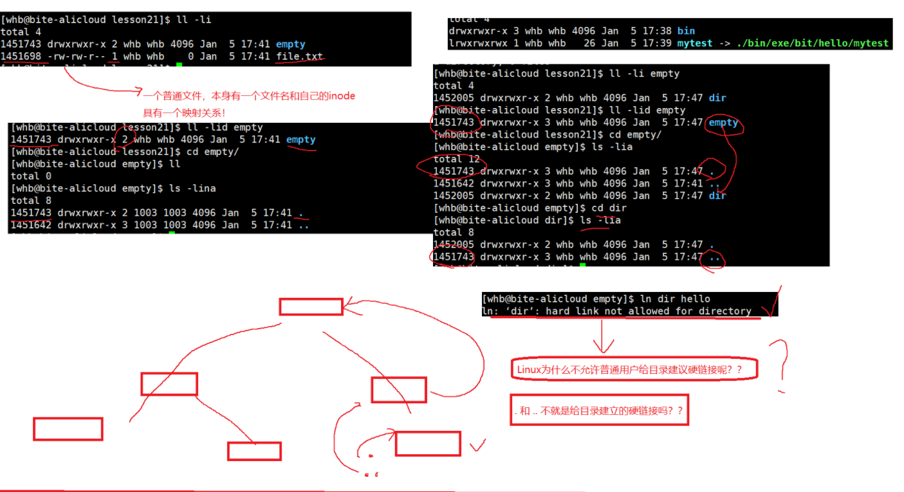


## 5动静态库

**软硬链接信息。硬链接就是增加一个文件的计算器。 硬链接就像指针一样的。**

**。 和 。。的映射关系。**

**文件的引用计数，变成零，文件就真正被删除了的。**

**静静躺着的文件：文件系统进行管理的。**

**复习前面的软硬链接。**


**.a和.so结尾的动静态库。**

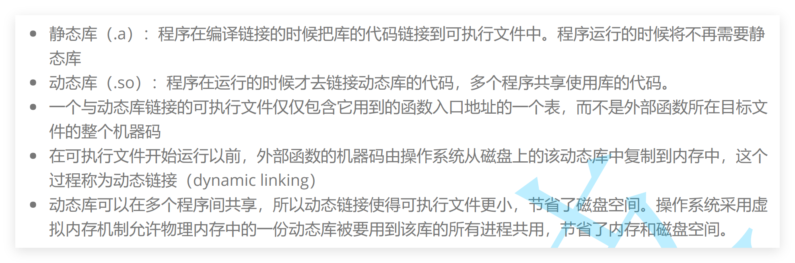


### gcc -c

`gcc -c main.c` 的意思是：使用 GCC 编译器编译 `main.c` 源文件，但**只进行到编译（生成目标文件）为止，不进行链接**。

**gcc -c 形成同名文件**

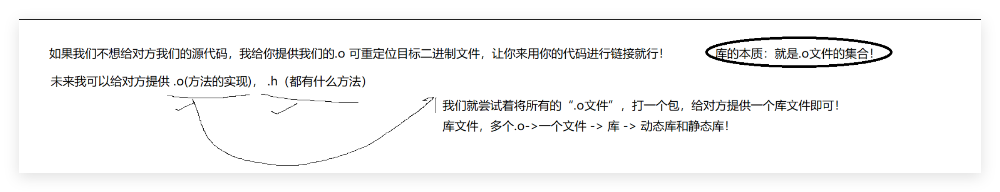

**如果我们不起给对方我们的源代码，我给你提供我们的可重定位目标二进制文件，让你来用你的代码进行链接就行。**

**未来我可以给对方提供 .o（方法的实现），.h（都有什么方法）。  
我们就尝试着将所有的“.o文件”，打一个包，给对方提供一个库文件即可！**

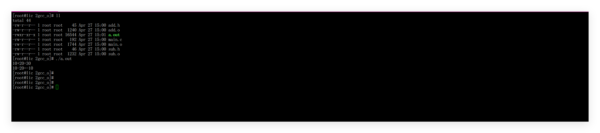


### 库文件的本质

**库文件，多个.o → 一个文件 → 库 → 动态库和静态库！**

**.o文件。二进制可重定位文件**

**.o文件方法的实现 .h都有神马方法**

**库的本质就是.o文件的集合**


### 如何交付

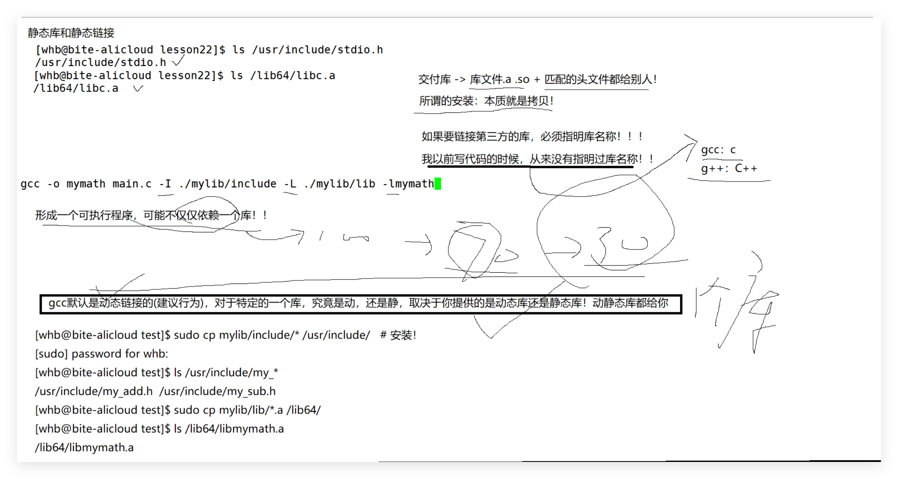


### **静态库**

```
   libmymath.a:add.o sub.o                                                                                                                                                                                                                                  
     ar -rc $@ $^
   add.o:add.c
     gcc -c add.c
   sub.o:sub.c
     gcc -c sub.c
```


```
gcc main.c  -I ./mylib/include/  -L ./mylib/lib/ -l mymath
```

**-I:这里已经进行指明了头文件的信息了，只需要指定头文件的路径就行了的。**

**-L:这里需要指明库的路径在哪里呢。**

**-l: 库的路径已经指明了，接下来就是库的软件的名称了，掐头去尾的。 （静态库是 libname.a）   去掉lib和.a。**


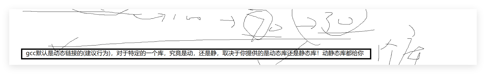

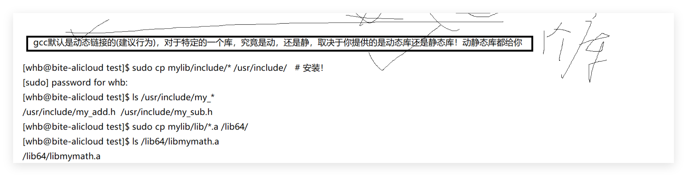

**拷贝到了系统文件，任然需要指定库文件的，对比线程库的使用，不是语言层面的，它是系统层面的。**

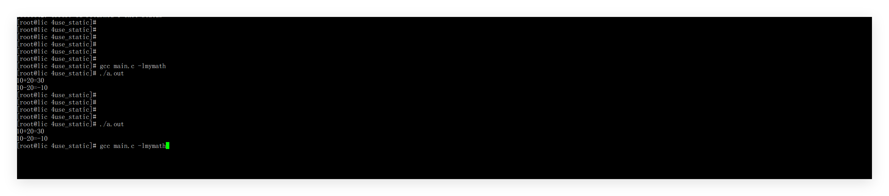


**库文件和对应的头文件**

**找不到头文件的   .h**

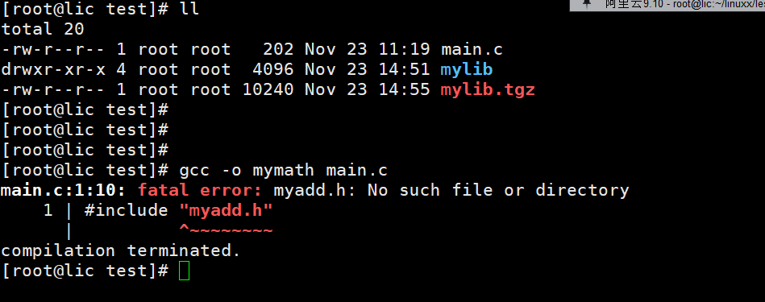


**链接错误了 .o**

**链接那个库，必须指定的很详细的**

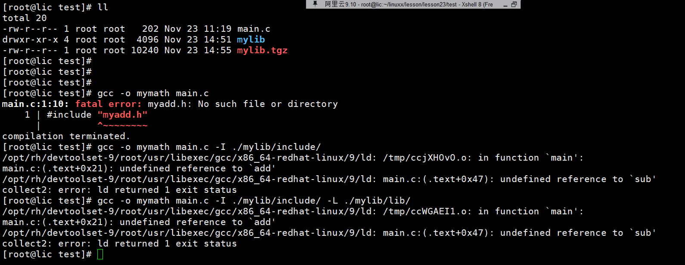


**库名称 掐头去尾的！**

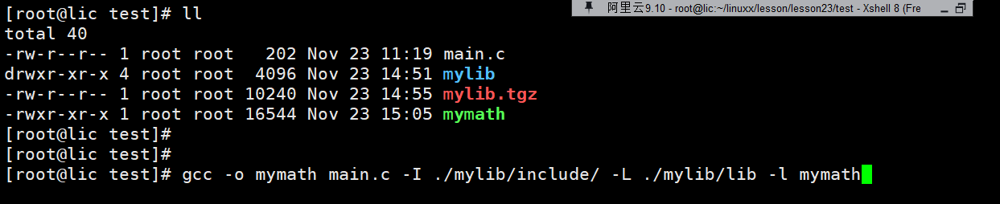

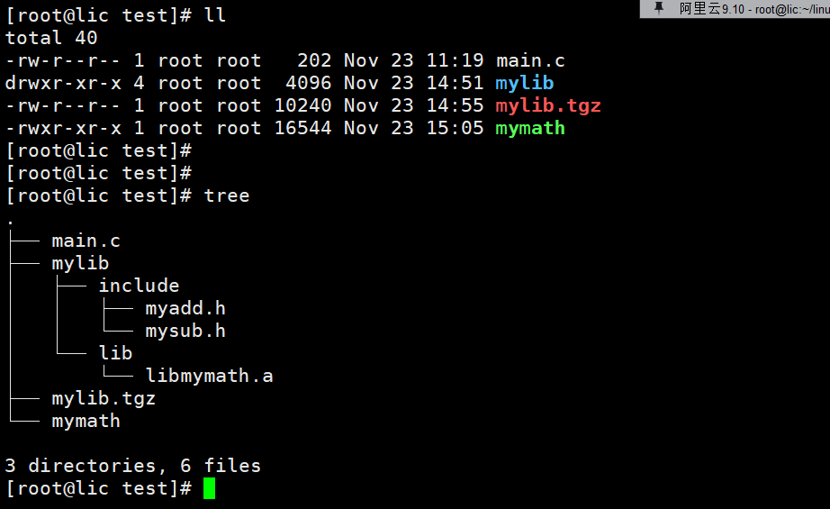

**为什么我们写c/c+= 从来没指定呢， gcc/g++已经默认知道了的**

**gcc默认动态链接 对于一个库是静态还是动态，取决于你提供的是静态还是动态。**

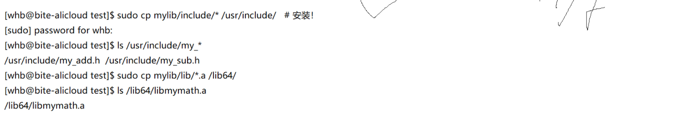

**拷贝进去了 还是要指明那个库的名称**

**gcc mian.c -l mymath**

### c语言的库文件

**centos系统：头文件在/usr/include/     /usr/lib64下面的**

**centos系统：c++头文件在/usr/include/c++     /usr/lib64下面的**

****


### **动态库**

**gcc -c fPIC test.c文件**

**gcc -shared -o libmymath.so sub.o add.o**  

**多了一个shared  **

**生成文件和静态库没啥区别的**

**gcc main.c  -o math -I ./mylib/include/  -L ./mylib/lib/  -l mymath**

**这里在运行的时候为什么找不到呢？**

**运行的时候，需要在OS找到的。**

#### 方法1

**echo $ LD_LIBRARY_PATH。 **

**添加到环境变量里面去的。**

**export LD_LIBRARY_PATH=$LD_LIBRARY_PATH:/root/linuxx/lesson/lesson23/review/6use_dynamic/mylib/lib**

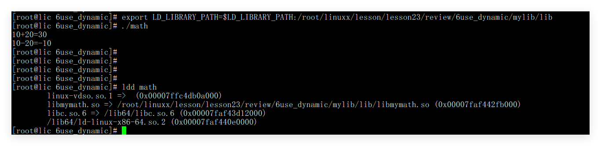

#### 方法2

**/etc/ld.so.conf.d/**

**配置文件的路径信息。**

**ldconfig**

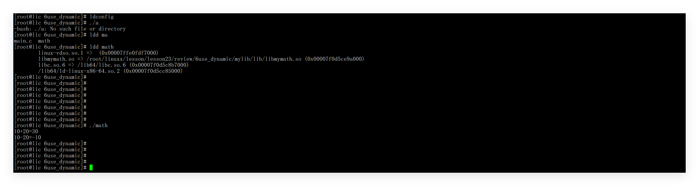


#### 方法3

**软链接信息**


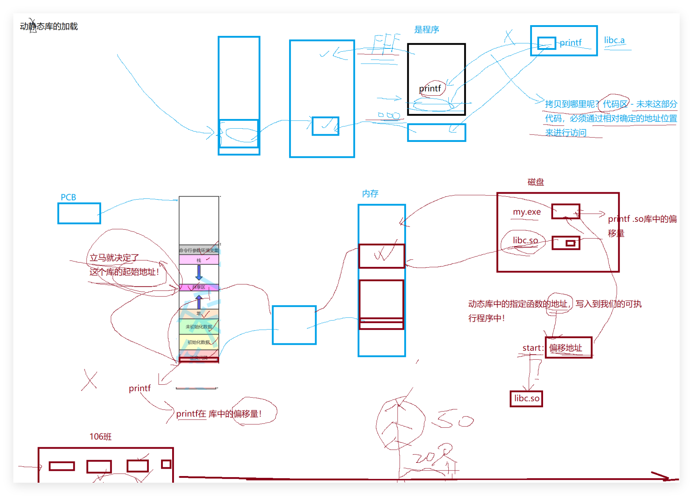

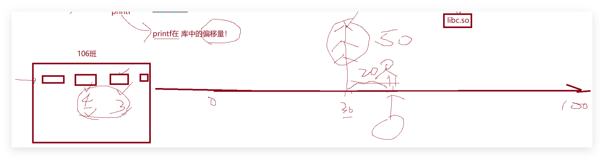

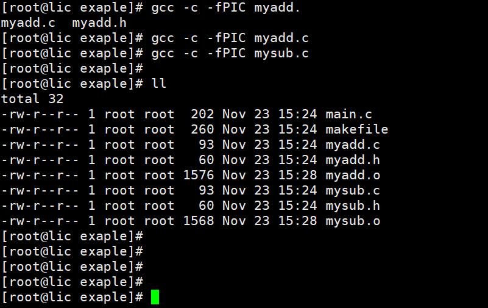


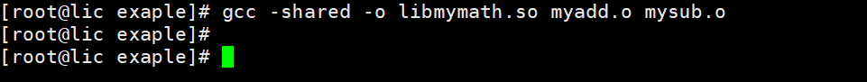


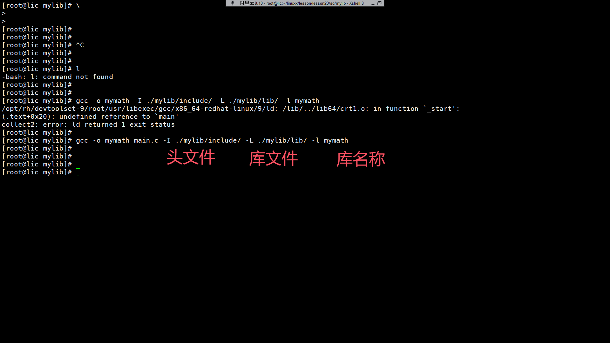


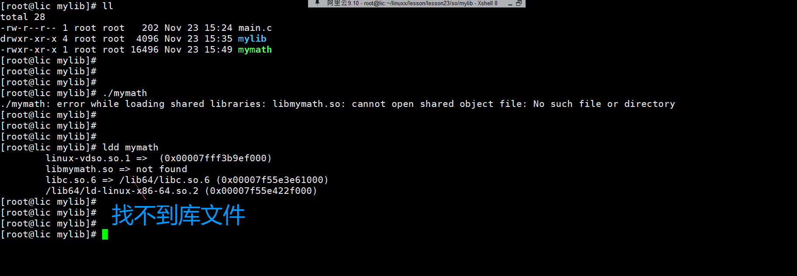


**这是和gcc说的， 动态库是运行的时候，OS才知道的。 你的库不再OS里面的。**

**gcc -o mymath main.c -I ./mylib/include/ -L ./mylib/lib/ -l mymath**

**方法1      echo $LD_LIBRARY_PATH  添加到环境变量里面**

**方法2  配置文件**

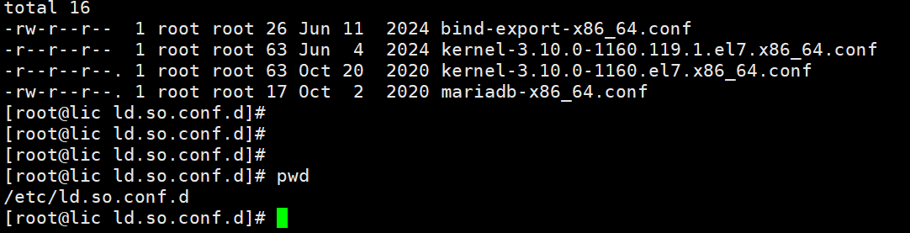

**ldconfig  更新配置文件**

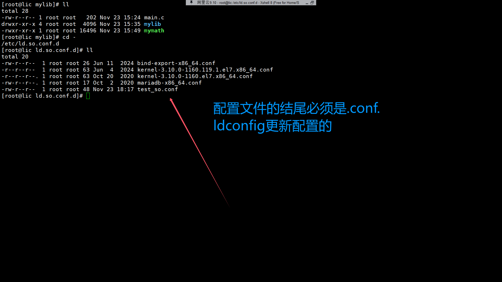


**方法3**

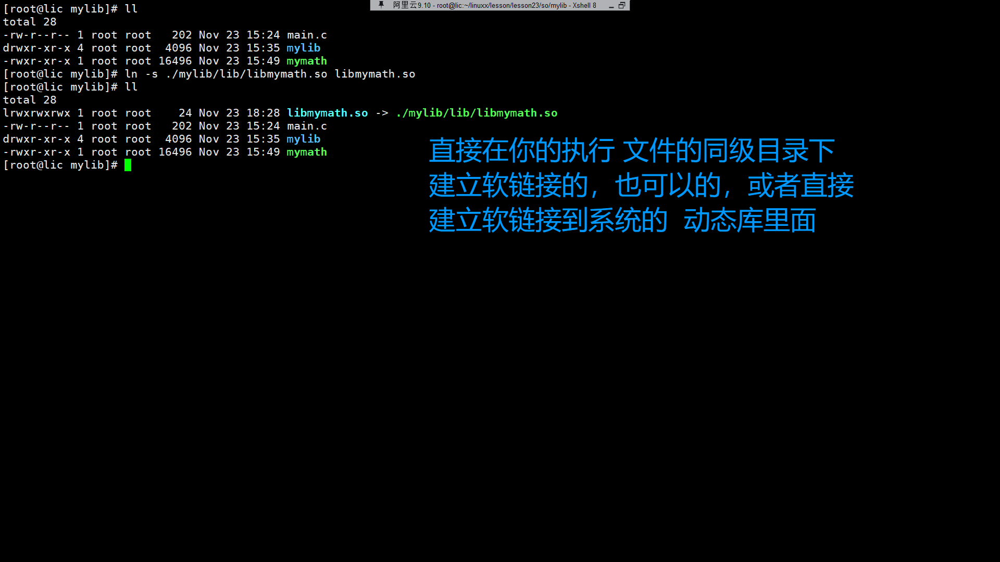


**推荐库 ncurses   图形化界面的库**

**我们可以安装很多的第三方库的 仅此而已。**


### 动静态库的加载总结

### 动静态库的加载

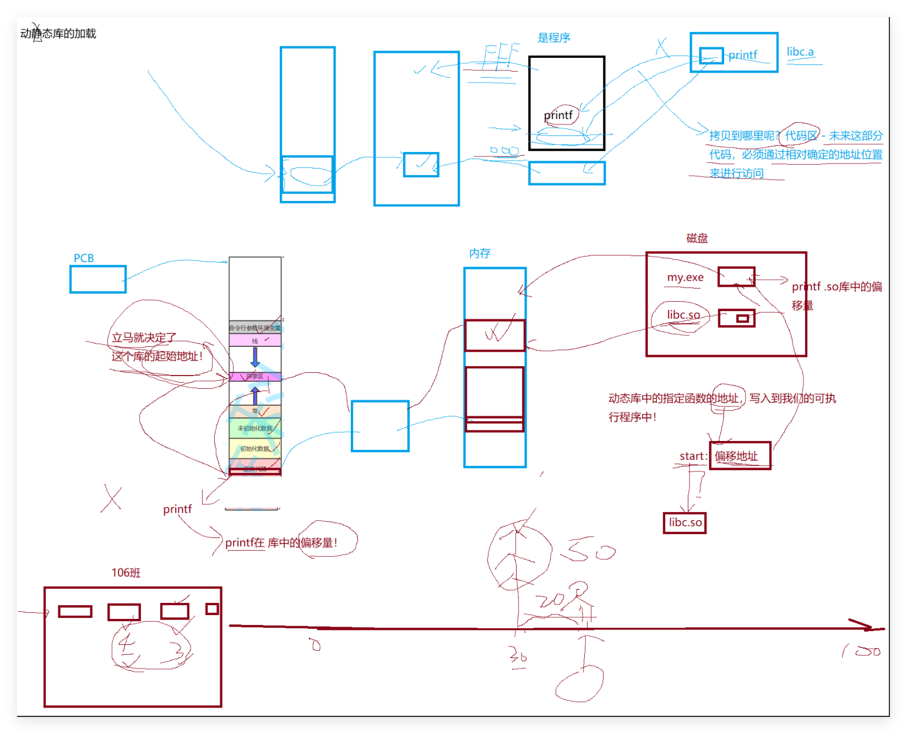

**静态库：不需要加载的**

​	**拷贝在哪里呢？ 代码区。未来这部分代码，必须通过相对确定的地址位置来进行访问。直接编入到可执行程序里面**

**动态库：**

​	**动态库中的指定函数的地址，写入到我们的可执行程序中。**

​	**与位置无关的地址：start(libc.so) + 偏移地址**

​	**在库中的偏移地址。  外部地址---->找到了--->映射到共享区了--->在共享区也有地址了**

**进程地址空间  还能看到很多的其它资源的。内核资源，信号。动静态库，线程里面的。**


**静态库：数据拷贝到代码区域，必须通过相对确定的地址位置进行访问的。就好比自己写的代码。**

**动态库：动态库中的指定的函数地址，写入到我我可执行程序中！**

​	** **


**文件描述符**

**软硬链接**

**动静态库**


**切换vscode**


| 区域                                         | 作用                                                         | 关键点总结                                                   |
| -------------------------------------------- | ------------------------------------------------------------ | ------------------------------------------------------------ |
| **Super Block**                              | 文件系统的“身份证”，保存整个文件系统的核心元数据             | 块大小、总块数、总inode数、挂载次数、挂载时间、文件系统状态等<br>超级重要！损坏了整个分区基本就废了（好在有备份superblock） |
| **Group Descriptor Table**<br>（组描述符表） | 描述当前这个块组的情况，也同时描述所有块组的情况（多个块组共享一份） | 包含：本块组的 block bitmap 在哪、inode bitmap 在哪、inode table 在哪、空闲块数、空闲inode数等 |
| **Block Bitmap**<br>（块位图）               | 记录本块组中哪些**数据块**已经被用了                         | 1个字节代表8个数据块，1=已用，0=空闲<br>你要新建文件，内核就来这里找0的位置 |
| **Inode Bitmap**<br>（inode位图）            | 记录本块组中哪些**inode是否被占用                            | 同上，1=已分配，0=空闲                                       |
| **Inode Table**<br>（inode表）               | 存放本块组所有 inode 节点（不管用没用，都预分配好了）        | 一个文件 = 一个inode<br>这里是真正的“文件元数据仓库”         |
| **Data Blocks**<br>（数据块）                | 真正存放文件内容、目录内容的地方                             | 普通文件内容就在这里<br>目录的内容也是在这里（目录也是文件） |


## code

### 字符级文件操作

```c
#include <stdio.h>
#include <unistd.h>
#include <stdlib.h>

#define FINE_NAME  "log.txt"

int main()
{ 
  // r:read读方式打开文件必须存在的，w:write,a:append，写和追加文件可以不存在的。 w:write文件存在会清空文件的内容的
  // r+:read读写追加，文件必须存在的。w+:write,文件不存在则创建，会覆盖文件的内容。a+:append,文件不存在则创建，文件的内容是追加到文件的后面的。
  // rb:二进制读，wb:二进制写，ab:二进制追加的

  //FILE* fp = fopen(FINE_NAME, "r"); 
  FILE* fp = fopen(FINE_NAME, "w+"); 

  if(fp == NULL)
  {
    perror("fopen");
    return 1;
  }

  int cnt = 10;
  while(cnt)
  {
    int ret = fputc('a', fp);
    printf("%d\n", ret);
    --cnt;
  }

// 文件指针，执行开头的位置
  rewind(fp); 
  cnt = 10;

  while(cnt)
  {
    int ch = fgetc(fp);
    int ret = putchar(ch);
    printf("%d\n", ret);
    --cnt;
  }
  printf("\n");

  fclose(fp);
  return 0;
}

```

**r:打开文件，文件必须存在的**

**w:打开文件，文件可以不存在的，每次都是重新写入的。（数据会清零的）(这就是为什么会存在a模式的)**

**a:打开文件，文件可以不存在的，每次都是追加到文件的末尾方式的。**

**r+:读写追加，文件必须存在的**

**w+:读写追加， 文件可以不存在的， 每次都是重新写入**

**a+:读写追加，文件可以不存在的，每次都是新的添加**

**rb,wb,ab 二进制再说嘛的**


### 字符串级文件操作

```c
#include <stdio.h>
#include <string.h>
#include <unistd.h>
#include <stdlib.h>

#define FINE_NAME  "log.txt"

int main()
{ 
  // r:read读方式打开文件必须存在的，w:write,a:append，写和追加文件可以不存在的。 w:write文件存在会清空文件的内容的
  // r+:read读写追加，文件必须存在的。w+:write,文件不存在则创建，会覆盖文件的内容。a+:append,文件不存在则创建，文件的内容是追加到文件的后面的。
  // rb:二进制读，wb:二进制写，ab:二进制追加的

  FILE* fp = fopen(FINE_NAME, "r+"); 

  if(fp == NULL)
  {
    perror("fopen");
    return 1;
  }

  int cnt = 10;
  while(cnt)
  {
    fputs("hello:lic\n", fp);
    --cnt;
  }
  
  char buffer[1024] = {0};
  rewind(fp);

  // fgets:1.会读取换行的，并且在末尾放\0的。
  while(fgets(buffer, sizeof buffer, fp) != NULL)
  {
    printf("%s", buffer);
    printf("%zd\n", strlen(buffer));
  }


  fclose(fp);
  return 0;
}

```


### 格式化文件操作

**fprintf函数，好用的。**

```c
#include <stdio.h>
#include <string.h>
#include <unistd.h>
#include <stdlib.h>

#define FINE_NAME  "log.txt"

int main()
{ 
  // r:read读方式打开文件必须存在的，w:write,a:append，写和追加文件可以不存在的。 w:write文件存在会清空文件的内容的
  // r+:read读写追加，文件必须存在的。w+:write,文件不存在则创建，会覆盖文件的内容。a+:append,文件不存在则创建，文件的内容是追加到文件的后面的。
  // rb:二进制读，wb:二进制写，ab:二进制追加的

  FILE* fp = fopen(FINE_NAME, "r+"); 

  if(fp == NULL)
  {
    perror("fopen");
    return 1;
  }

  int cnt = 10;
  while(cnt)
  {
    fprintf(fp, "hello lic : %d\n", cnt--);
  }
  
  char buffer[1024] = {0};
  rewind(fp);

  // fgets:1.会读取换行的，并且在末尾放\0的。
  while(fgets(buffer, sizeof buffer, fp) != NULL)
  {
    printf("%s", buffer);
    printf("%zd\n", strlen(buffer));
  }

  fclose(fp);
  return 0;
}

```


### 二进制读取 写入

```c
#include <stdio.h>
#include <string.h>
#include <unistd.h>
#include <stdlib.h>

#define FINE_NAME  "log.txt"

int main()
{ 
  // r:read读方式打开文件必须存在的，w:write,a:append，写和追加文件可以不存在的。 w:write文件存在会清空文件的内容的
  // r+:read读写追加，文件必须存在的。w+:write,文件不存在则创建，会覆盖文件的内容。a+:append,文件不存在则创建，文件的内容是追加到文件的后面的。
  // rb:二进制读，wb:二进制写，ab:二进制追加的

  FILE* fp = fopen(FINE_NAME, "rb"); 

  if(fp == NULL)
  {
    perror("fopen");
    return 1;
  }

#if 0
  int arr[] = {1, 2, 3, 4, 5, 6, 7, 8, 9, 10};

  int cnt = 10;
  while(cnt)
  {
    fwrite(arr, sizeof(int), sizeof(arr) / sizeof(int), fp);
    --cnt;
  }
  
#else 
 int arr[10] = {0};
 
 size_t ret = fread(arr, sizeof(int), sizeof(arr) / sizeof(int), fp);
 if(ret < 0)
 {
  perror("fread");
  return 1;
 }

 for(int i = 0; i < 10; ++i)
 {
   printf("%d\n", *(arr + i));
 }

#endif

  fclose(fp);
  return 0;
}

```


### 总结

```c
// 格式化写文件
fprintf(fp, "%d %s\n", num, str);

// 格式化读文件
fscanf(fp, "%d %s", &num, str);

// 按行读文件
fgets(buf, sizeof(buf), fp);

// 写字符串到文件
fputs(str, fp);

// 二进制读文件
fread(buf, size, count, fp);

// 二进制写文件
fwrite(buf, size, count, fp);

// 关闭文件
fclose(fp);
```


### 几个宏的使用

```c
#include <stdio.h>
#include <sys/types.h>
#include <sys/stat.h>
#include <fcntl.h>
#include <unistd.h>
#include <string.h>

int main()
{
  umask(022);
  int fd = open("log.txt", O_RDWR | O_CREAT | O_APPEND, 0666);
  if(fd == -1)
  {
    perror("open");
    return 1;
  }

  const char* name = "lichermionex-----------linuxxxx\n";
  int cnt = 10;
  while(cnt)
  {
    ssize_t s = write(fd, name, strlen(name));
    if(s < 0)
    {
      perror("write");
      return 1;
    }
    --cnt;
  }

  lseek(fd, 0, SEEK_SET);

  char buferr[64] = {0};
  for(int i = 0; i < 10; ++i)
  {
   ssize_t n = read(fd, buferr, sizeof buferr);
   if(n > 0)
   {
     buferr[n] = 0;
     printf("%s\n", buferr);
   }
  }

  close(fd);
  return 0;
}

```


### 重定向

```c
#include <stdio.h>
#include <sys/types.h>
#include <sys/stat.h>
#include <fcntl.h>
#include <unistd.h>
#include <string.h>

#define METHON 2
#define OPT 2


int main()
{
  if(METHON == 1)
  {
#if OPT == 0
    close(0);

#elif OPT == 1
    close(1);

#elif OPT == 2
    close(2);

#endif
    umask(022);
    int fd = open("log.txt1", O_RDWR | O_APPEND | O_CREAT, 0666);
    if(fd == -1)
    {
      perror("open");
      return 1;
    }

    printf("fd:%d\n", fd);
  }
  else 
  {
    umask(022);
    int fd = open("log.txt1", O_RDWR | O_APPEND | O_CREAT, 0666);
    if(fd == -1)
    {
      perror("open");
      return 1;
    }

#if OPT == 0
    dup2(fd, 0);
    char buffer[1024] = {0};
    ssize_t n = read(fd, buffer, sizeof(buffer) - 1);
    if(n > 0)
    {
      buffer[n] = 0;
    }
    printf("%s\n", buffer);

#elif OPT == 1
    dup2(fd, 1);
    const char* name = "lichermionexTTTTTTTTTTTTT\n";
    write(fd, name, strlen(name));

#elif OPT == 2
    dup2(fd, 2);
    const char* name = "lichermionex---erron\n";
    write(fd, name, strlen(name));

#endif
    close(fd);
  }

  return 0;
}

```


### shell重定向

```c
#include <stdio.h>
#include <string.h>
#include <stdlib.h>
#include <unistd.h>
#include <sys/types.h>
#include <sys/wait.h>
#include <assert.h>
#include <ctype.h>
#include <sys/stat.h>
#include <sys/types.h>
#include <fcntl.h>
#include <errno.h>

#define NUM 1024
#define OPT_NUM 64

#define NONE_REDIR   0
#define INPUT_REDIR  1
#define OUTPUT_REDIR 2
#define APPEND_REDIR 3

int redirType = NONE_REDIR;
char* redirFile = NULL;

int lastcode = 0;
int lastsig = 0;

char linecommand[NUM];
char* myargv[OPT_NUM];

#define trimSpace(start) do{\
  while(isspace(*start)) ++start;\
}while(0)

void commandCheck(char* command)
{
  assert(command != NULL);
  char* start = command;
  char* end = command + strlen(command);

  while(start < end)
  {
    if(*start == '>')
    {
        *start = '\0';
        start++;
        if(*start == '>')
        {
          redirType = APPEND_REDIR; // 追加重定向
          start++;
        }
        else 
        {
          redirType = OUTPUT_REDIR; // 输出重定向
        }
      
        // 重定向的文件
        trimSpace(start);
        redirFile = start;
        break;
    }
    else if(*start == '<')
    {
      *start = '\0';
      start++;
      trimSpace(start);
      redirType = INPUT_REDIR;
      redirFile = start;
      break; 
    }
    else 
    {
      ++start;
    }
  }
}

int main()
{
// 这里的重定向和shell的实现就是多了一个字符串解析而言
  while(1)
  {
    redirType = NONE_REDIR;
    redirFile = NULL;
    lastcode = 0;
    lastsig = 0;
    errno = 0;
    printf("newshell:");
    fflush(stdout);
   
    // 细节，它最大读取 sizeof(linecommand)-1个字符串，自动补上\0;
    char* s = fgets(linecommand, sizeof(linecommand), stdin);
    assert(s != NULL);
    (void)s;


    // ls -a -b \n, 这里清除\n的
    linecommand[strlen(linecommand) - 1] = 0;
  #if 0
    printf("%s\n", linecommand);
  #endif

    // 检查命令的定向方式
    commandCheck(linecommand);

    myargv[0] = strtok(linecommand, " ");
    if(myargv[0] == NULL)
    {
      continue;
    }

    int i = 1;

    while((myargv[i++] = strtok(NULL, " ")) != NULL)
    {
      ;
    }


    pid_t id = fork();
    assert(id != -1);
    if(id == 0)
    {
      switch(redirType)
      {
        case NONE_REDIR: break;
        case INPUT_REDIR:
        {
            int fd = open(redirFile, O_RDONLY);
            if(fd < 0)
            {
              perror("open");
              return 1;
            }
            dup2(fd, 0);
            break;
        }
        case OUTPUT_REDIR:
        case APPEND_REDIR:
        {
          umask(0);
          int flag = O_WRONLY | O_CREAT;
          
          if(redirType == APPEND_REDIR)
            flag |= O_APPEND;
          else 
            flag |= O_TRUNC;
          
          int fd = open(redirFile, flag, 0666);
          if(fd < 0)
          {
            perror("open");
            return 1;
          }
          
          dup2(fd, 1);
          break;
        }
        default: printf("BUG?\n");
          break;
      }
      
      execvp(myargv[0], myargv);
      perror("execvp");
      _exit(127);
    }
    
    int status = 0;
    pid_t ret = waitpid(id, &status, 0);
    assert(ret > 0);
    (void)ret;
    
    lastcode = (status>>8)&0xff;
    lastsig = status & 0x7f;
  }

  return 0;
}
```


