# BIT.6_进程间通信.pdf

## **复习**

**动静态库**

**复习**


## 目的

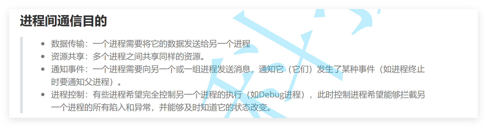

```
1. pipe 管道
2. FIFO 命名管道
3. signal 信号
4. System V 消息队列
5. System V 共享内存
6. System V 信号量
7. mmap
8. socket
9. epoll + eventfd
```


## 1进程间通信介绍

**1.什么是通信**
  **进程具有独立性的！独立的，PCB，进程地址空间，页表。**
  **通信的成本一定不定**

  **通信的目的**
  **1.数据传输**
  **2.数据共享**
  **3.事件通知**
  **4.进程控制**

**2.为什么要有通信？**
  **有时候我们是需要多进程协同的！cat file | grep 'hello'** 
  **完成业务**

**3.怎么办？**
  **POSIX:让通信过程可以跨主机。**
  **SYSTEM V:聚焦在本地通信。 共享内存**

**管道-基于文件系统。匿名管道，命名管道。**

**通信的成本一定不定,该如何理解通信的本质？**
**进程具有独立性！！！！**
**OS需要直接或者间接给通信双方的进程提供“内存空间”**
**通信的双方，必须看到一份公共的资源！**
  **不同的通信种类---本质就是：上面所说的资源，是OS的哪一个模块。**
**1.你需要先让不同的进程看到同一份资源(其实学习的是这个)**
**2.通信**

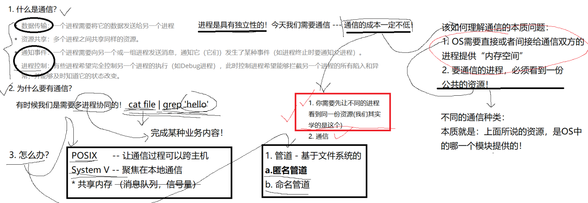


## 2匿名管道

### 同一份资源

**子进程继承父进程的文件 **

**task_struct{}  struct files_struct  --struct file 1file的操作方法，2file属于自己的内核缓冲区！**
**tast_struct{}  struct files_struct**
**看到了同一份文件系统资源**
**就是管道文件**
**管道就是内存级别文件**

**这个文件必须是第三方提供的**

**这份职资源是OS提供的**

**fork子进程看到同一份资源**

**文件需要进行拷贝的，struct files_struct需要进行拷贝的，进程打开文件，进程属性有文件属性的。**

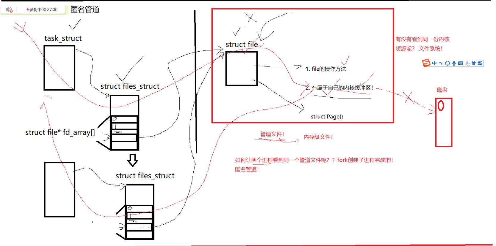

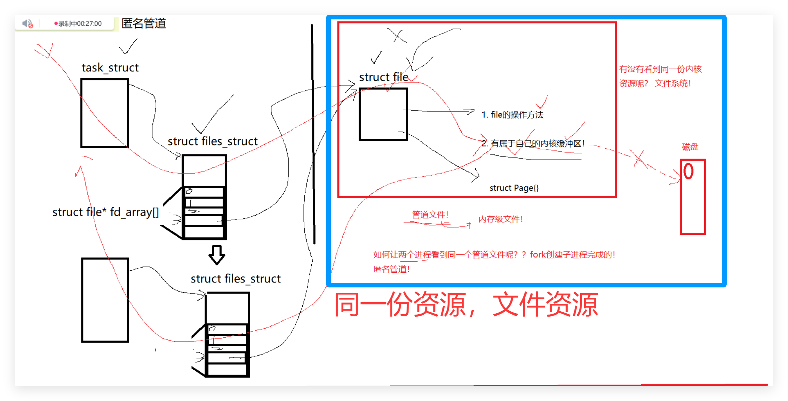

**1.不是磁盘文件的。太慢了，没有必要的。**

**2.内存级别文件的。**


### 匿名管道原理

**匿名管道通信**

**分别以读和写打开文件**

**父进程读写打开管道文件!  让子进程进程读写，方便后续的操作**

**一般管道只能用来单向数据通信！**

**匿名管道只能用来父子进程间通信**

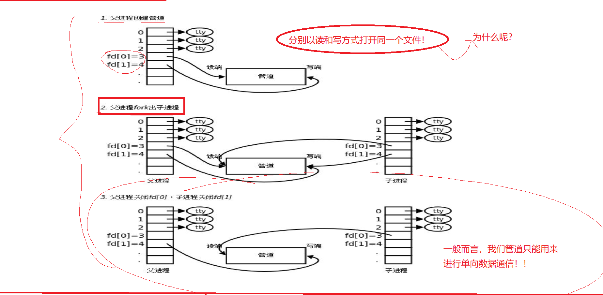


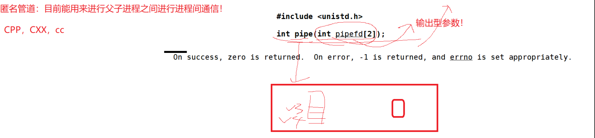

**1.父进程创建**

**2.各自关闭，建议关闭的**

**3.通信**

### pipe接口

```
int pipe(int pipefd[2]); // int pipefd[2]输出型参数

```

```c++
#include <iostream>
#include <cstring>
#include <unistd.h>
using namespace std;

int main()
{
  int fds[2];
  int n = pipe(fds);
  if(n == -1)
  {
    cerr<< "pipe:" << strerror(errno) <<endl;
    return 1;
  }

  cout<< fds[0] << endl; // read 
  cout<< fds[1] << endl; // write

  return 0;
}

```


### 管道code

**创建管道文件**

```c++
  #include <iostream>    
  #include <cassert>    
  #include <unistd.h>    
  using namespace std;    
      
  int main()    
  {    
      
    int fds[2];    
    int n = pipe(fds);    
    assert(n == 0);    
      
    cout<< fds[0] <<endl; // 读取    
    cout<< fds[1] <<endl; // 写入    
                                                                                                                   
    return 0;    
  } 
```


**匿名管道**

```c++
#include <iostream>    
#include <cstring>    
#include <string>    
#include <cassert>    
#include <unistd.h>    
#include <sys/types.h>    
#include <sys/wait.h>    
#include <unistd.h>    
using namespace std;    
    
int main()    
{    
    
  int fds[2];    
  int n = pipe(fds);    
  assert(n == 0);    
    
  pid_t id = fork();                                                                                                                              
  assert(id >= 0);    
  if(id == 0)    
  {    
    close(fds[0]);    
    
    const char* s = "我是子进程，正在给你发消息";    
    int cnt = 0;    
    while(true)    
    {    
      char buffer[1024];    
      snprintf(buffer, sizeof(buffer), "child->parent say: %s[%d][%d]", s, cnt++, getpid());    
      write(fds[1], buffer, strlen(buffer));    
      sleep(1);    
    }    
    
    close(fds[1]);    
    exit(0);    
  }    
    
  close(fds[1]);    

  while(true)    
  {
    char buffer[1024];
    ssize_t s = read(fds[0], buffer, sizeof(buffer) - 1);
    if(s > 0) buffer[s] = 0;
    cout<< buffer <<endl;;
    // 父进程没有sleep
  }

  n = waitpid(id ,nullptr, 0);
  assert(n == id);

  close(fds[0]);
  return 0;
}

```


**写的慢， 读端阻塞等待**

```c++
#include <iostream>
#include <cstring>
#include <string>
#include <cassert>
#include <unistd.h>
#include <sys/types.h>
#include <sys/wait.h>
#include <unistd.h>
using namespace std;

int main()
{
  
  int fds[2];    
  int n = pipe(fds);    
  assert(n == 0);    
    
  pid_t id = fork();    
  assert(id >= 0);    
  if(id == 0)    
  {    
    close(fds[0]);    
    
    const char* s = "我是子进程，正在给你发消息";    
    int cnt = 0;    
    while(true)    
    {    
      char buffer[1024];    
      snprintf(buffer, sizeof(buffer), "child->parent say: %s[%d][%d]", s, cnt++, getpid());    
      write(fds[1], buffer, strlen(buffer));    
      sleep(10);                                                                                                                                  
    }    
                   
    close(fds[1]);    
    exit(0);          
  }                   
                
  close(fds[1]);    
  while(true)      
 {
    char buffer[1024];
    cout<< "aaaaaaaaaaaaaaaaaaaaaaaaaaa" <<endl;
    ssize_t s = read(fds[0], buffer, sizeof(buffer) - 1);
    cout<< "bbbbbbbbbbbbbbbbbbbbbbbbbbb" <<endl;
    if(s > 0) buffer[s] = 0;
    cout<< buffer <<endl;;
  }

  n = waitpid(id ,nullptr, 0);
  assert(n == id);

  close(fds[0]);
  return 0;
}

```


**写的快 ，读的慢**

```c++
#include <iostream>    
#include <cstring>    
#include <string>    
#include <cassert>    
#include <unistd.h>    
#include <sys/types.h>    
#include <sys/wait.h>    
#include <unistd.h>    
using namespace std;    
    
int main()    
{    
      
  int fds[2];    
  int n = pipe(fds);    
  assert(n == 0);    
    
  pid_t id = fork();    
  assert(id >= 0);    
  if(id == 0)    
  {    
    close(fds[0]);    
    
    const char* s = "我是子进程，正在给你发消息";    
    int cnt = 0;    
    while(true)    
    {    
      char buffer[1024];    
      snprintf(buffer, sizeof(buffer), "child->parent say: %s[%d][%d]", s, cnt++, getpid());    
      write(fds[1], buffer, strlen(buffer));    
      cout<< "cnt:" << cnt <<endl;    
    }    
    
    close(fds[1]);                                                                                                                                
    exit(0);    
  }    
    
  close(fds[1]);    
  while(true)    
  {
    char buffer[1024];
    ssize_t s = read(fds[0], buffer, sizeof(buffer) - 1);
    if(s > 0) buffer[s] = 0;
    cout<< buffer <<endl;;
    sleep(3);
  }

  n = waitpid(id ,nullptr, 0);
  assert(n == id);

  close(fds[0]);
  return 0;
}

```


**写关闭，读到零**

```c++
#include <iostream>    
#include <cstring>    
#include <string>    
#include <cassert>    
#include <unistd.h>    
#include <sys/types.h>    
#include <sys/wait.h>    
#include <unistd.h>    
using namespace std;    
    
int main()    
{    
      
  int fds[2];    
  int n = pipe(fds);    
  assert(n == 0);    
      
  pid_t id = fork();    
  assert(id >= 0);    
  if(id == 0)    
  {    
    close(fds[0]);    
    
    const char* s = "我是子进程，正在给你发消息";    
    int cnt = 0;    
    while(true)    
    {    
      char buffer[1024];    
      snprintf(buffer, sizeof(buffer), "child->parent say: %s[%d][%d]", s, cnt++, getpid());    
      write(fds[1], buffer, strlen(buffer));    
      cout<< "cnt:" << cnt <<endl;    
      break;    
    }    
                                                                                                                                                  
    close(fds[1]);    
    exit(0);    
  }    
    
  close(fds[1]);  
   while(true)
  {
    char buffer[1024];
    ssize_t s = read(fds[0], buffer, sizeof(buffer) - 1);
    if(s > 0) 
    {
      buffer[s] = 0;
      cout<< buffer <<endl;;
    }
    else if(s == 0)
    {
      cout<< "s:" << s <<endl;
      break;
    }
  }

  n = waitpid(id ,nullptr, 0);
  assert(n == id);

  close(fds[0]);
  return 0;
}

```


```c++
#include <iostream>    
#include <cstring>    
#include <string>    
#include <cassert>    
#include <unistd.h>    
#include <sys/types.h>    
#include <sys/wait.h>    
#include <unistd.h>    
using namespace std;    
    
int main()    
{    
    
  int fds[2];    
  int n = pipe(fds);    
  assert(n == 0);    
    
  pid_t id = fork();    
  assert(id >= 0);    
  if(id == 0)    
  {    
    close(fds[0]);    
    
    const char* s = "我是子进程，正在给你发消息";    
    int cnt = 0;    
    while(true)    
    {    
      char buffer[1024];    
      snprintf(buffer, sizeof(buffer), "child->parent say: %s[%d][%d]", s, cnt++, getpid());    
      write(fds[1], buffer, strlen(buffer));    
      cout<< "cnt:" << cnt <<endl;    
    }                                                                                                                                             
    
    close(fds[1]);    
    exit(10);    
  }    
    
  while(true)  
    {                                                                                                                                               
    char buffer[1024];
    ssize_t s = read(fds[0], buffer, sizeof(buffer) - 1);
    if(s > 0) 
    {
      buffer[s] = 0;
      cout<< buffer <<endl;;
    }
    else if(s == 0)
    {
      cout<< "s:" << s <<endl;
      break;
    }
    break;
  }

  close(fds[0]); // 父进程关闭读端
  cout<< "读端关闭" <<endl;
  
  int status = 0;
  n = waitpid(id , &status, 0);
  assert(n == id);
  
  if(WIFEXITED(status))
    cout<< "子进程正常退出。退出状态：%d:" << WEXITSTATUS(status) <<endl;

  if(WIFSIGNALED(status))
    cout<< "子进程信号终止，信号编号：%d:" << WTERMSIG(status) <<endl;


  close(fds[0]);
  return 0;
}

```


### 管道的特点

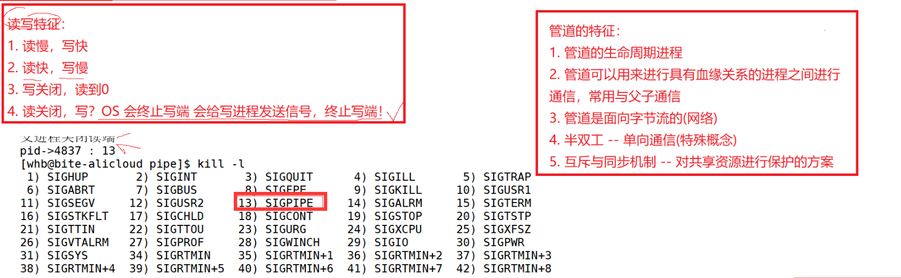

**a.匿名管道                                                                                                                                        
  1.父子进程间通信     
  2.子父进程间通信    
1.读慢，写快    
2.读快，写慢    
3.写关闭，读到零    
4.读关闭，写？ OS会终止写段，会给写进程发送信号来终止写段！**


**管道的特点**

**管道的特征    
1.管道的生命周期：就是进程的生命周期    
2.管道可以用来进行具有血缘关系的进程之间进行通信，常用与父子通信    
3.管道是面向字节流的(网络)    
4.半双工---单向通信(特殊概念)    
5.互斥与同步一致**  

**| 匿名管信息**


### 进程池

**基于匿名管道的进程池**

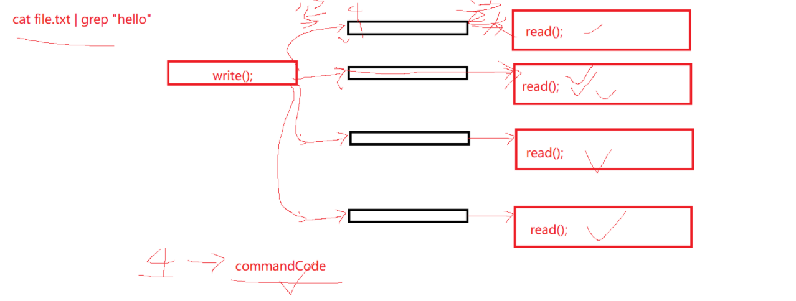

```c++
 for(int i = 0; i < PROCESS_NUM; i++)    
  {    
    int fds[2];    
    int n = pipe(fds);    
    assert(n == 0);    
    (void)n;    
    
    pid_t id = fork();    
                                                                                                                                                  
    if(id == 0)    
    {    
      // 处理任务    
      close(fds[1]);    
    
      exit(0);    
    }    
    
    close(fds[0]);    
  }    
```

**五个兄弟进程关系**


**复习**

**通信**

**进程间交流**

**进程具有独立性-----先让进程看到同一份资源-----看到公共资源---开始通信**

**子进程  --- pcb 进程地址空间  文件描述符**

**pipe**

**管道的特点**

**复习**


## 3进程池


```c++
  #include <iostream>    
  #include <sys/wait.h>    
  #include <sys/types.h>    
  #include <vector>    
  #include <cstdlib>    
  #include <unistd.h>    
  #include <cassert>    
  #include <string>    
  #include <sys/types.h>    
  #include <functional>    
  #include <ctime>    
  #include <unistd.h>    
      
  using namespace std;    
      
  #define PROCESS_NUM 5    
  #define Make_Seed() srand((unsigned long)time(nullptr)^getpid()^0x1112^rand()%1234)   // 随机数
      
  typedef void(*func_t)(); // 函数指针 类型    
      
  void downLoadTask()    
  {    
    cout<< getpid()<<":下载任务" <<endl;    
  }    
      
  void ioTask()    
  {    
    cout<< getpid() <<":io任务" <<endl;    
  }    
      
  void flushTask()    
  {    
    cout<<getpid() <<":刷新任务"<<endl;                                                                                              
  }   
  
  // 放任务    
  void loadTaskFunc(vector<func_t>* out)    
  {
    assert(out);
    out->push_back(downLoadTask);
    out->push_back(ioTask);                                                                                         
    out->push_back(flushTask);
  }
  
  // 子进程的信息
  class SubEd
  {
  public:
    SubEd(pid_t subId, int writeFd)
      :subId_(subId)
      ,writeFd_(writeFd)
    {
      char namebuffer[1024];
      snprintf(namebuffer, sizeof(namebuffer), "process-%d[(pid)%d-(fd)%d]", num++,subId_, writeFd_);
      name_ = namebuffer;
    }
  public: 
    static int num;
    string name_;
    pid_t subId_;
    int writeFd_;
  };
  
  int SubEd::num = 0;
  
  int reveTask(int readFd)
  {
    int code = 0;
    ssize_t s = read(readFd, &code, sizeof(code));
  
    if(s == 4) return code;
    else if(s <= 0) return -1;
    else return 0;
  }

 void cteateSubProcess(vector<SubEd>* subs, vector<func_t>& funcMap)
  {
    vector<int> deletefd;
    for(int i = 0; i < PROCESS_NUM; i++)
    {
      int fds[2];
      int n = pipe(fds);
      assert(n == 0);
      (void)n;
      // bug 
      // 父进程打开的文件，是会被子进程共享的
      // 关闭前面的进程的管道描述符 
      // 
      pid_t id = fork();
  
      if(id == 0)
      {                                                                                                         
          for(size_t i = 0; i < deletefd.size(); i++)
          {
            close(deletefd[i]);
          }
  
        // 处理任务
        close(fds[1]); // 关闭写端
        
        // 1接收命令码，没有就阻塞。
        while(true)
        {
         int commandcode = reveTask(fds[0]);
       	 if(commandcode >= 0 && (int)commandcode < funcMap.size()) // size_t类型和int类型的
         {
           funcMap[commandcode]();
         }
         else if(commandcode == -1) break;
        }
        exit(0);
      }
  
      close(fds[0]);
      SubEd sub(id, fds[1]);
     // (*subs).push_back(sub);
      subs->push_back(sub);
      deletefd.push_back(fds[1]);
    }
  }
  
  void sendTask(const SubEd& process, int tasknum)
  {
    cout<< "send tasknum:" << tasknum << " send to " << process.name_ <<endl;
    int n = write(process.writeFd_, &tasknum, sizeof(tasknum));
    assert(n == sizeof(int));
    (void)n;
  }

// 子进程均衡
void loadBalanceContrl(vector<SubEd>& subs, vector<func_t>& funcMap, int count)
  {
    // 父进程控制子进程
    int processnum = subs.size();
    int tasknum = funcMap.size();
    
    bool forever = (count == 0 ? true : false);
  
    while(true)
    {
      // 1选择一个子进程-----vector 
      int subIdx = rand() % processnum; 
  
      // 2选择一个任务-------
      int taskIdx = rand() % tasknum;
  
      // 3任务发送给选择的进程
      sendTask(subs[subIdx], taskIdx);                                                                                                            
      sleep(2);
      
      if(!forever)
      {
        count--;
        if(count == 0) break;
      }
    }
    // write quit---》read 0
    for(int i = 0; i < processnum; i++)
    {
      close(subs[i].writeFd_);
    }
  }

  void waitProcess(vector<SubEd> process)
  {
    int processnum = process.size();
    for(int i = 0; i < processnum; i++)
    {
      waitpid(process[i].subId_, NULL,0);
      cout<< "wait sub process success ..." << process[i].subId_ <<endl;
    }
  }
  
  int main()
  {
    Make_Seed(); 
    // 创建一批子进程
    // 子进程id和写入的fd
    
    vector<SubEd> subs; // 先描述，后组织起来
    vector<func_t> funcMap; 
  
    loadTaskFunc(&funcMap); 
    cteateSubProcess(&subs, funcMap);
  
    int taskCnt = 3; // cnt == -1 
  
    // loadBal
    loadBalanceContrl(subs, funcMap, taskCnt);
  
    // 回收子进程
    waitProcess(subs);
    return 0;
  }


```


## 4命名管道

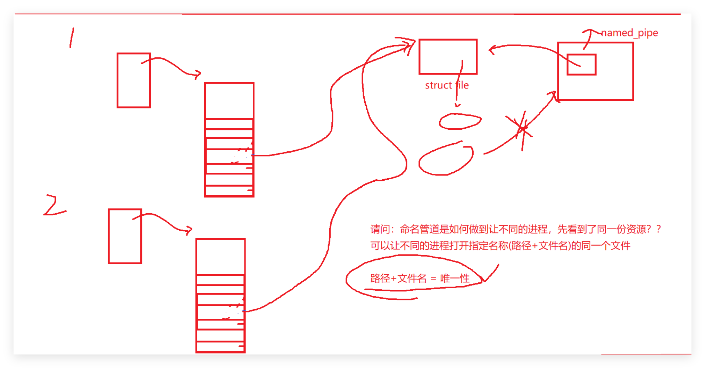

```makefile
.PHONY:all                                                                                                                                        
all:server client    
    
server:server.cc    
  g++ -o $@ $^    
client:client.cc    
  g++ -o $@ $^    
    
.PHONY:clean    
clean:    
  rm -rf server client    

```


```
mafifo:创建一个管道文件
mafifo name_pip
```


```shell
while true; do read msg; echo "$msg" > name_pipe; done  写
while true; do cat name_pipe; done  读

```


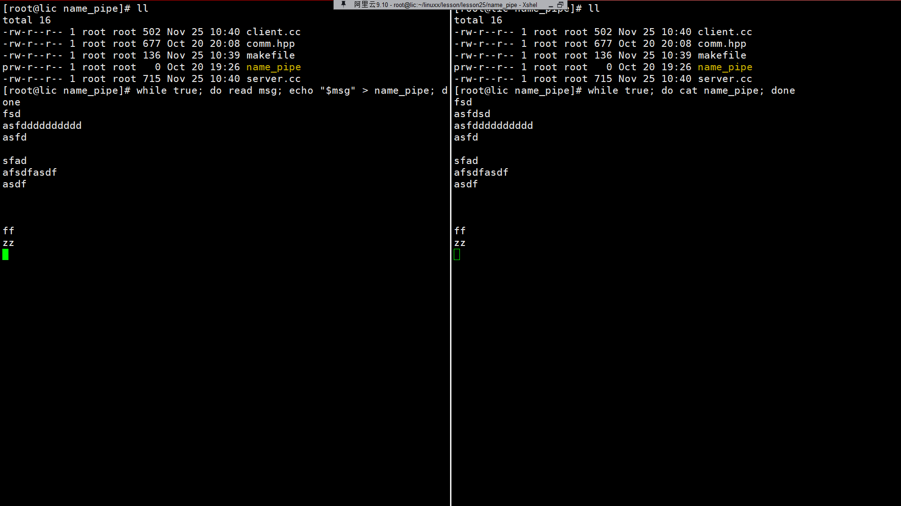

**命名管道（**Named Pipe**），也叫 **FIFO（First In First Out）**，是 Linux 中一种 **进程间通信（IPC）** 的方式。**

它的特点是：
 📌 **在文件系统中有一个名字（文件路径）**
 📌 **进程之间通过读/写这个“文件”进行通信**
 📌 **数据先进先出（FIFO）**
 📌 **只能用于进程间单向通信（一个读一个写）**，但可以创建两个管道实现双向通信

**命名管道是一种带名字的内核缓冲区，不同进程通过对它读写进行通信。**


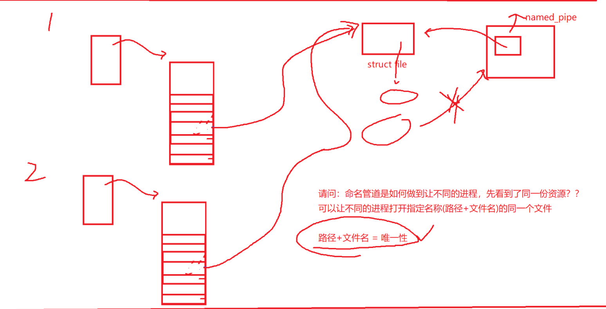


**唯一性 == 路径 + 文件名**


```c++
#pragma once     
    
#include <fcntl.h>    
#include <unistd.h>    
#include <cassert>    
#include <iostream>    
#include <string>    
#include <sys/types.h>    
#include <sys/stat.h>    
#include <cerrno>    
#include <cstring>    
                                                                                                  
#define NAME_PIPE "/tmp/mypipe.106"    
    
bool createFifo(const std::string& path)    
{    
  umask(0);    
  int n = mkfifo(path.c_str(), 0600);    
    
  if(n == 0)    
  {    
    return true;    
  }    
  else    
  {    
    std::cout<< "cerrno:" << errno << " err string " << strerror(errno) <<std::endl;    
    return false;    
  }    
}    
    
void removeFifo(const std::string& path)    // 删除文件
{    
  int n = unlink(path.c_str());    
  assert(n == 0);                         // 意料之中assert    
  (void)n;                        // 意料之外if判断  (void)n防止被警告，小技巧    
} 
```


```c++
#include "comm.hpp"

int main()
{
  
  bool r = createFifo(NAME_PIPE);
  assert(r);    
  (void)r;    
    
  std::cout<<"server begin" << std::endl;    
  int rfd = open(NAME_PIPE, O_RDONLY);    
  std::cout<<"server end" << std::endl;    
  if(rfd < 0)    
  {    
    exit(1);    
  }    
    
  char buffer[1024];    
  while(true)    
  {    
    
    ssize_t s = read(rfd, buffer, sizeof(buffer) - 1);    
    if(s>0)    
    {    
      buffer[s] = 0;    
      std::cout<< "client->server # "<< buffer << std::endl;    
    }    
    else if(s == 0)    
    {    
      std::cout<< "client quit , me too! "<<std::endl;    
      break;    
    }    
    else    
    {                                                                                
      std::cout<< "err string " << strerror(errno) <<std::endl;    
      break;    
    }    
  } 
  
   close(rfd);
  removeFifo(NAME_PIPE);
  return 0;
}

```


```c++
#include "comm.hpp"                                                                                                                               
int main()    
{    
  std::cout<< "cliend begin" <<std::endl;    
  int rfd = open(NAME_PIPE, O_WRONLY);    
  std::cout<< "cliend end" <<std::endl;    
  if(rfd < 0) exit(1);    
    
  char buffer[1024];    
  while(true)    
  {    
    std::cout<< " please say# ";    
    fgets(buffer, sizeof(buffer), stdin);    
    if(strlen(buffer) > 0)    
    {    
      buffer[strlen(buffer) - 1] = 0;    
    }    
    ssize_t n =write(rfd,buffer, strlen(buffer));    
    
    assert(n == strlen(buffer));    
    (void)n;    
  }    
  close(rfd);    
  return 0;    
} 
```


## 5共享内存


**1.共享内存的原理**

**pcb---进程地址空间---页表---物理内存**

**共享内存**

  **1.申请一块空间，TODO**
  **2.创建好的内存空间，映射到进程的地址空间！ 挂接起来**  **看到同一份资源**
  **3.未来不想通信了，取消进程和内存的映射关系，然后释放内存.去关联。释放共享内存。**

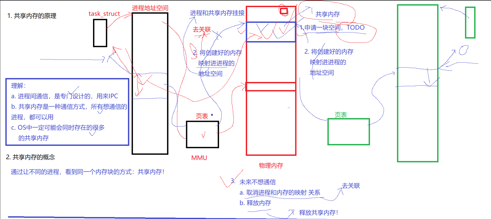


 **理解**
 **a.进程间通信，是专门设计的，用来IPC**
 **b.共享内存是一种通信的方式，所有想通信的人，都可以用。**
 **c.OS一定可能会同时存在的很多的共享内存**

**2.共享内存的概念**

**通过让不同进程，看到同一个内存块的方式：共享内存**


**shmget接口**

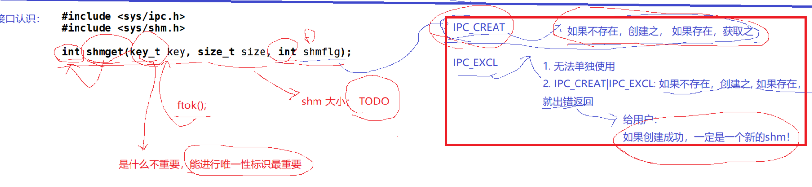

```c
#include <sys/ipc.h>
#include <sys/shm.h>

int shmget(key_t key, size_t size, int shmflg); shmget = shared memory get

IPC_CREAT:  ：:：不存在创建，存在就获取  。 0就是
IPC_EXCL :  IPC_CAEAT | IPC_EXCL 不存在创建，存在报错返回。 成功是一个新的内存。

key_t key 
key:是什么不重要，能进行唯一性标识最重要。ftok函数,ftok(char* patnmame, char proj__id);

```


```c++
 #include <sys/types.h>
 #include <sys/ipc.h>

 key_t ftok(const char *pathname, int proj_id);

```


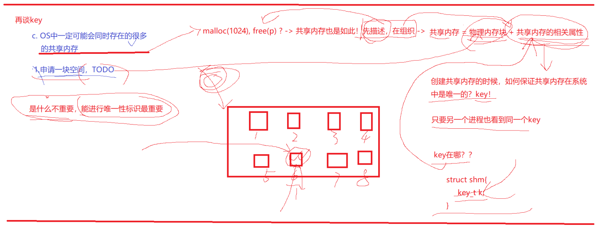

**shmget(key size flag) ;**

**在来理解key：**

**1.os同时存在共享内存---》  申请的内存也是先描述，后组织起来的**

​	**共享内存也是如此（申请，释放）---》先描述，后组织。**

​	**共享内存 == 物理内存块 + 共享内存的相关属性。**

**2.申请空间TODO---------》**

**3.是什么不重要，能进行唯一标识-》**

​	**创建共享内存的时候，怎么保证共享内存是唯一的。key！**

​	**另一个进程也看到同一个key就行了**

​	**key在哪儿？共享内存的对应属性里面的。struct shm{int key}**

​	**shmget(k,size,flag): 为什么不直接使用key作为标识符呢？ 为了和解耦(学校学号，员工员工号，内核层和用户层)**

​	**深沉理解，把key设置近，共享内存的属性里面的！！**

**key是系统使用的， int是用户使用的。**


**如何查看ipc资源**

​	**ipcs -m/-q/-s**


**ipc资源的特征**

**共享内存的生命周期是随OS的，不是随进程的（lpcs -m) (system v版本的特征)**

**ipcrm -m id 删除共享内存**


```c++
  #include <sys/ipc.h>
  #include <sys/shm.h>
  int shmctl(int shmid, int cmd, struct shmid_ds *buf);

```


**谁创建谁删除的**


**关联起来的**

```c++
#include <sys/types.h>
#include <sys/shm.h>
void *shmat(int shmid, const void *shmaddr, int shmflg);

```


**共享内存的优点**

**所有进程间通信最快的!大大减少数据拷贝的速度。综合考虑管道和共享内存，考虑键盘输入和显示器输出。共享内存几次拷贝？管道几次拷贝？**

**管道**

**char buffer**    **write 管道 read **   **char buffer**

**共享内存**

**输入    共享内存  输出**


**共享内存的缺点**

**不给我进行同步和互斥操作，没有对数据进行任何保护！对共享内存进行保护，你如何实现呢？ 写完，通知读端读取。没有通知的时候，server等待**


**解决方案**

**创建一个管道，通知共享内存进行数据读取。**

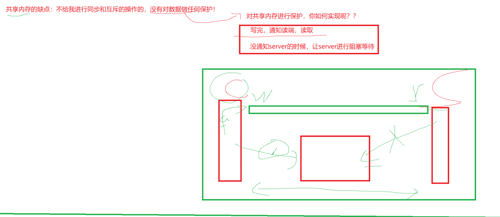


**struct shmid_ds**

```
struct shmid_ds {
    struct ipc_perm shm_perm;   // 权限和所有者信息
    size_t          shm_segsz;  // 共享内存段大小（字节）
    time_t          shm_atime;  // 最后 attach 时间
    time_t          shm_dtime;  // 最后 detach 时间
    time_t          shm_ctime;  // 最后修改时间（shmctl IPC_SET）
    pid_t           shm_cpid;   // 创建该共享内存段的进程 PID
    pid_t           shm_lpid;   // 最后一次操作该共享内存段的进程 PID
    shmatt_t        shm_nattch; // 当前 attach 的进程数量（引用计数）
};

```


| 字段           | 含义                                         |
| -------------- | -------------------------------------------- |
| **shm_perm**   | 权限信息（owner、group、mode），类似文件权限 |
| **shm_segsz**  | 共享内存段大小（shmget 创建时指定）          |
| **shm_atime**  | 最后一次 `shmat()` 的时间                    |
| **shm_dtime**  | 最后一次 `shmdt()` 的时间                    |
| **shm_ctime**  | 最后一次 `shmctl(IPC_SET)` 或创建时间        |
| **shm_cpid**   | 创建共享内存段的进程 PID                     |
| **shm_lpid**   | 最后一次操作共享内存的进程 PID               |
| **shm_nattch** | 当前 attach 的次数（多少进程映射了它）       |


**shm_perm**

```c++
struct ipc_perm {
    key_t  key;    // shmget 使用的 key
    uid_t  uid;    // 所有者 uid
    gid_t  gid;    // 所属组 gid
    uid_t  cuid;   // 创建者 uid
    gid_t  cgid;   // 创建者 gid
    mode_t mode;   // 权限位（类似 chmod）
};


```


**给你的和你能用的，两回事。**


```c++
#ifndef __COMM_HPP__    
#define __COMM_HPP__     
    
#include <iostream>    
#include <cerrno>    
#include <cstring>    
#include <cstdio>    
#include <stdlib.h>    
#include <sys/ipc.h>    
#include <sys/shm.h>    
#include <unistd.h>    
    
#define MAX_SIZE 4096    //4kb为单位的 建议的
                                                                                                                                                  
#define PATHNAME "/tmp"    
#define PROJ_ID 0X66     
                  
key_t getKey()    
{                                                                        
  key_t k = ftok(PATHNAME, PROJ_ID); // 同样的数据，同样的key值，整形    
  if(k < 0)    
  {                               
    // cin,cout,cerr---> 0,1,2            
    // stdin stdout stderr
    std::cerr<< errno << ":" << strerror(errno) <<std::endl;    
    exit(1);    
  }            
  return k;    
}    

                 
// IPC_CREAT     
// IPC_EXCL    
//                                      
int getShmHelper(key_t k, int flags)    
{                                                       
  // k是要shmget，设置共享内存的属性里面的，用来表示    
  // 该共享进程在内核的唯一性的    
  //                     
  // 用户层    内核层                       
  // shmid vs  key  ：key是shmind的属性  
   // fd    vs  inode：inode是fd的属性
    int shmid = shmget(k, MAX_SIZE, flags); // 唯一标识符，大小，标识符
    if(shmid  < 0)
    {
      std::cerr<< errno << " : " << strerror(errno) <<std::endl;
      exit(2);
    }
    return shmid;
}

int createShm(key_t k)
{
  return getShmHelper(k, IPC_CREAT  | 0600);
}

int getShm(key_t k)
{
  return getShmHelper(k, IPC_CREAT  /*0*/);
}


// 挂接到共享内存里面的
void* attachShm(int shmid)
{
  // 纯数字没有任何意义的，必须的有类型才行的
  // int a = 10;
  // 100字面量，
  // 100u;
  // 10u
  // 10L
  // 10;
  // 3.14f
   void* mem = shmat(shmid,nullptr,0); // 8个字节，int四字节^L
  if((long long)mem == 1L)
  {
    std::cerr<< errno << " : " << strerror(errno) <<std::endl;
    exit(3);                                                                                                                       
  }

  return mem;
}

void detachShm(void* start)
{
  if(shmdt(start) == -1)
  {
    std::cerr<< errno << " : " << strerror(errno) <<std::endl;
  }
}


// 删除共享内存
// shmctl(id,cmd, shmid_ds* buf);
void delShm(int shmid)
{
  if(shmctl(shmid, IPC_RMID, nullptr) == -1)
  {
    std::cerr<< errno << " : " << strerror(errno) <<std::endl;
  }
}
#endif 


```


```c++
#include "comm.hpp"                                                                                                                               
    
    
int main()    
{    
    
// 获取key    
  key_t k = getKey();    
  printf("0x%x\n", k); // key     
    
// shmget:共享内存创建    
  int shmid = createShm(k); // shmid    
  printf("%d \n", shmid);    
    
  sleep(10);    
// 链接内存    
  char* start = (char*)attachShm(shmid);    
  printf("attach success, address start: %p \n", start);    
    
// 读取数据    
  while(true)    
  {    
    printf("client say : %s ", start);  // 共享内存读数据  
    struct shmid_ds ds;    
    shmctl(shmid, IPC_STAT, &ds);    
    sleep(1);    
  }    
    
  // 去关联    
  detachShm(start);    
    
  sleep(5);    
// 删除共享内存    
// 删除，谁创建谁删除    
  delShm(shmid);    
  return 0;    
}
```


```c++
#include "comm.hpp"                                                                                                                               
int main()    
{    
    
// key获取    
  key_t k = getKey();    
  printf("key : 0x%x\n", k);    
    
// shmid获取    
  int shmid = getShm(k);    
  printf("shmid : %d\n", shmid);    
    
// 链接内存    
  char* start = (char*)attachShm(shmid);    
  printf("attach success, address start: %p \n", start);    
    
// 通信    
  const char* msg = "hello server, 我是另一个进程，正在和你通信";    
  pid_t id = getpid();    
  int cnt = 1;    
  while(true)    
  {    
    snprintf(start, MAX_SIZE, "%s[pid %d][消息次数 ；%d]\n", msg, id, cnt++);  // 往共享内存发数据   
  }    
    
// 断开链接    
  detachShm(start);    
    
  return 0;    
} 
```


