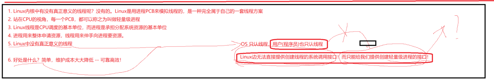
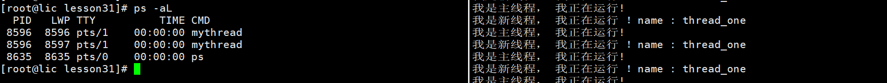
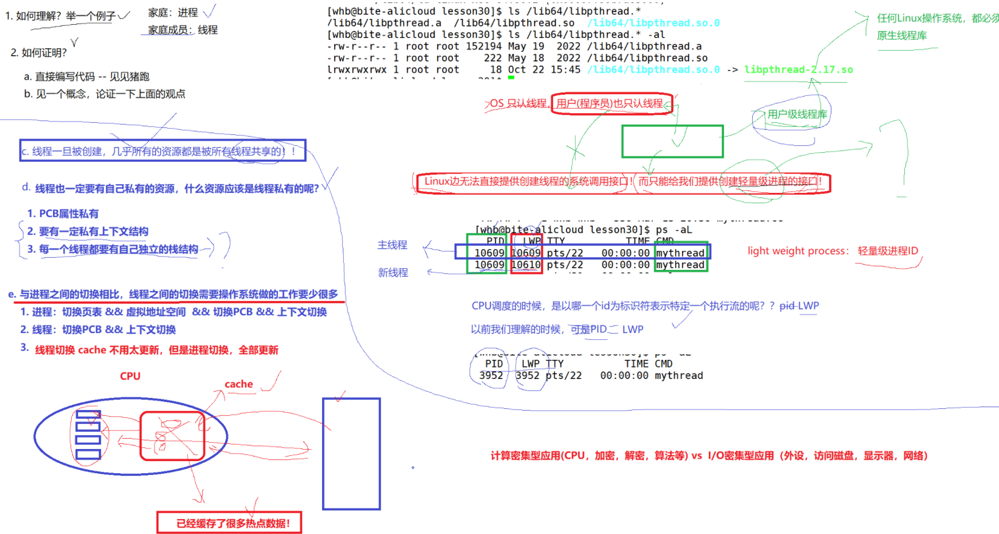
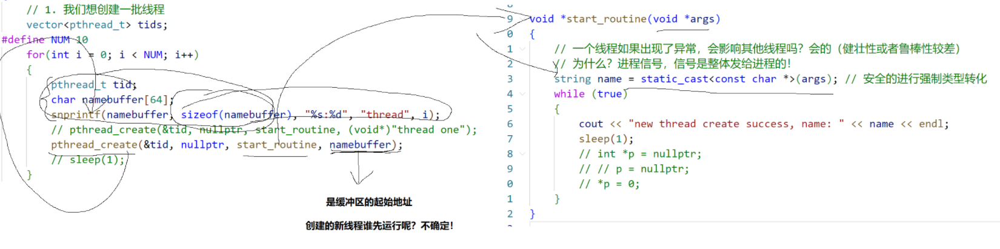
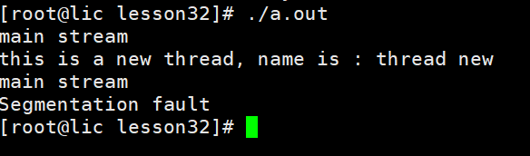

# BIT.8_Linux 多线程.pdf

## 1线程


**进程 = 内核数据结构 + 进程对应的代码和数据**

**线程：进程内的一个执行流。(一般定义)**

**1.OS都太宏观了，太抽象了。**

**2.具体化，Linux**


**如何看待虚拟内存？虚拟内存里面决定了进程能够看待的"资源" 主体资源，**

**只是创建PCB(进程控制块) 通过mm_struct看到同一块资源**

**因为通过虚拟地址空间+页表的方式进行进程的资源划分，单个"进程"的执行 力度，一定比之前的进程细**


**OS真的存在，那么应该如何管理起来呢？怎么管理？先描述，后组织。**

**CPU只关注指令，不关注你是进程还是线程。**


**描述**

**一定要为线程设计专门的数据结构，表示线程对象。TCB(thread control block) 线程控制块。(windows，单独的线程块) (Linux, 复用PCB-->TCB)**

**线程被执行：调度(id, 状态， 优先级， 上下文，栈) 单纯调度的时候，进程和线程有很多地方是重叠的。**

**linux工程师，我们不想给Linux线程专门设计数据机构，直接复用线程PCB， 用PCB来标识Linux内部的线程**


**组织**

**1.线程在进程内部运行，线程在进程地址空间内运行，有地址空间的一部分数据。**


**进程的新概念：内核视角 ： 承担分配系统资源的基本实体。**

**在linux中，线程，CPU调度的基本单位**

**一个进程内部的执行流！----》线程。**

**task_struct轻量级进程！**




**linux内核中有没有真正意义上的线程？严格意义上没得，Linux使用进程PCB来模拟线程的，是一套完全属于自己的一套线程方案。**

**cpu的视角，每一个PCB都是轻量级进程。**

**linux线程是CPU调度的基本单位，而进程是承担分配系统资源的基本单位**

**进程用来申请资源，线程用来伸手向进程要资源。**


**好处**

**简单，维护成本大大降低---可靠，高效！**

**缺点**

**线程并行的运行各种程序：电影边下载边观看。 在一个进程里面。**

**linux无法直接提供创建线程的系统调用接口，而只能给我们提供轻量级进程的接口！**

**-lpthread 线程的库**

**OS只认线程**

**用户级别线程库--->原生线程库**


**线程间通信那简直就是很简单的！！！**

**线程一旦被创建，几乎所有的资源都是被所有线程共享的！**

**线程也一定要有自己的私有属性内容！什么资源是私有的呢？**

**1.pcb里面的属性**

**2.线程切换，上下文**

**3.每一个线程都要有自己独立的栈结构：**


**动静态库！！！**

```c++
#include <iostream>    
#include <pthread.h>    
#include <unistd.h>    
#include <cassert>    
#include <cstdio>    
using namespace std;    
int g_val = 10;
    
void fun()    
{    
  cout<< "this is a new method" <<endl;    
}    
    
// 新线程，    
void* thread_routine(void* agrs)                                                                                                         
{    
  const char* name = (const char*)agrs;    
  while(true)    
  {    
     cout << "我是新线程， 我真正运行 ！" << "name : " << name <<endl;    
     sleep(2);    
  }    
  return nullptr;    
}    
    
int main()    
{    
  pthread_t tid;    
  int n = pthread_create(&tid, nullptr, thread_routine, (void*)"thread_one");    
  assert(0 == n);    
  (void)n;    
    
  // tid是地址    
   char buffer[64];    
   // 主线程    
   snprintf(buffer, sizeof(buffer), "0x%zx \n", tid);    
      while(true)    
   {    
     cout << "我是主线程， 我真正运行! " << "tid : " << tid << endl;;    
     sleep(2);
   }
  return 0;
}
```

```makefile
mythread:mythread.cc                                                                                                                              
  g++ -o $@ $^ -lpthread    
    
.PHONY:clean    
clean:    
  rm -rf mythread  
```

**ps -aL**



**调度的标识符 LWP**

**单进程lwp == PID**





**与进程之间的切换相比，线程之间的切换需要操作系统做的工作要少很多**

**少呢些？：**

**切换页表**

**虚拟地址空间**

**0**

**切换PCB**

**上下文**

**cache切换不用太更新，进程切换全部更新**

**cpu的cache：硬件级别的缓存，局部性原理。先从cache里面读取。cache里面缓冲很多热点数据。线程的共享数据基本上都在cache里面。cache基本上不用切换>    的。进程切换，cache全部切换。**


**线程也一定要有自己的私有属性内容！什么资源是私有的呢？**

**1.pcb里面的属性**

**2.线程切换，上下文**

**3.每一个线程都要有自己独立的栈结构：**

**进程地址空间只有一个啊，怎么保存线程私有呢？**


**计算密集型 CPU资源**

**IO密集型   访问磁盘 显示 器网络**


## 2线程控制

**PCB模拟线程**

**TCB---->mm_struct**

**linux无法直接提供创建线程的系统调用接口，而只能给我们提供轻量级进程的接口！**





```c++
#include <pthread.h>
#include <cstdlib>
#include <vector>
#include <unistd.h>
#include <string>
#include <iostream>
using namespace std;

void* start_routine(void* args)
{
    string name = static_cast<const char*>(args);
    while(true)
    {
        cout<< "this is a new thread, name is : " << name <<endl;
        sleep(1);
        int* p = nullptr;
        *p = 100;
    }
}

int main()
{

    pthread_t id = 0;
    pthread_create(&id, nullptr, start_routine, (void*)"thread new");

    while(true)
    {
        cout<< "main stream " <<endl;
        sleep(1);
    }
    return 0;
}
```





**信号是发给线程的！**

**所以主线程，也就退出了**

**每个线程发送信号**

**进程不会的，独立性。独立的内核数据结构。**


**线程进程组合**


**fork()---->底层是---->clone().**

**线程底层也是clone()**

**vfork() 轻量级进程的，一般不用了解的，一般是库在使用的。**


**线程控制**

**创建线程一般不用设置属性，除非您是高手，很了解的Linux操作系统。**


**线程创建**

```c++
#include <pthread.h>
#include <cstdlib>
#include <vector>
#include <unistd.h>
#include <string>
#include <iostream>
using namespace std;

// 当结构体使用
// 里面存放线程的序号，id, 名字
class ThreadData
{
public:
  int number;
  pthread_t tid;
  char namebuffer[64];
};

// 可重入函数的
void* start_routine(void* args)
{   
    // 每个线程独立的栈帧结构的
    ThreadData* td = static_cast<ThreadData*>(args);
    int cnt = 10;  
    while(cnt)
    {
      cout<< td->namebuffer << "---cnt : " << cnt <<endl;
      cnt--;
      sleep(1);
    }
    
    // 证明了独立的栈结构
    // int cnt = 10
    // cout<< "&cnt " << &cnt <<endl;
    
    delete td;
  return nullptr;
}

int main()
{
// 创建一批线程
  vector<ThreadData*> threads;
#define NUM 10
  for(int i = 0; i < NUM; i++)                                                // 循环创建是个线程
  {
    ThreadData* td = new ThreadData();                                         // 创建一个存放线程信息的对象
    td->number = i + 1;                                                        // 线程id
    snprintf(td->namebuffer, sizeof(td->namebuffer), "%s : %d", "thread", i+1); // 线程name
    pthread_create(&td->tid, nullptr, start_routine, td);                      // 创建线程，并且把线程的信息给执行的函数 td拷贝给线程
    threads.push_back(td);                                                     // 指针放到数组里面去
  } 

  for(auto& iter : threads) // 打印线程对象的信息
  {
    cout<<" create thread:" << iter->namebuffer << " : " << iter->tid << " success" <<endl;
  }
    
    while(true)
    {
        cout<< "main stream " <<endl;
        sleep(1);
    }
}
```


**线程终止**

**如果是exit,会让整个进程退出了，所以不能调用它。**

**pthread_exit()**

**线程函数里面放return **


**线程等待问题**

**线程的等待问题！如果不等待，会造成类似僵尸进程的问题--内存泄漏**

**线程必须被等待**

**1.获取新线程的退出信息 ---可以不关心退出信息**

**2.回收新线程对应的PCB等内核资源，防止内存泄漏。--暂时无法查看**


**int pthread_join(pthread_t thread, void* * retval); // 用来获取线程函数结束时，返回的退出结果！**

**因为执行的函数的返回值是* ，为了能够接受到，所以就是星星 **


**线程的返回值问题**


**你想改什么变量，就必须传给函数它的地址。**

⭐ **最精确的人类语言解释**

✔ pthread 返回一个 “指针”，要把这个指针放到 ret 里

✔ 想修改 ret，必须传入 ret 的地址

✔ ret 的地址是 ThreadReturn**

✔ pthread_join 要的就是 void**

✔ 类型兼容，所以写 (void**)&ret

```c++
#include <pthread.h>
#include <cstdlib>
#include <vector>
#include <unistd.h>
#include <string>
#include <iostream>
using namespace std;

// 当结构体使用
// 里面存放线程的序号，id, 名字
class ThreadData
{
public:
  int number;
  pthread_t tid;
  char namebuffer[64];
};

class ThreadReturn
{
public: 
  int exit_code;
  int exit_result;
};

void* start_routine(void* args)
{

    ThreadData* td = static_cast<ThreadData*>(args);
    int cnt = 10;
    while(cnt)
    {
      cout<< td->namebuffer << "---cnt : " << cnt <<endl;
      cnt--;
      sleep(1);

      // exit(1); 不行的，终止进程的
      // pthread_exit(nullptr);  // 可以的
      // return nullptr;  // 可以的
    }

// 必须返回堆空间的地址
    ThreadReturn * tr = new ThreadReturn();
    tr->exit_code = 1;
    tr->exit_result = 106;

   return (void*)tr; // 右值

// 线程怎么没有退出信号呢？
// 退出信号就是线程的，
}

int main()
{
// 创建一批线程
  vector<ThreadData*> threads;
#define NUM 10
  for(int i = 0; i < NUM; i++)                                                // 循环创建是个线程
  {
    ThreadData* td = new ThreadData();                                         // 创建一个存放线程信息的对象
    td->number = i + 1;                                                        // 线程id
    snprintf(td->namebuffer, sizeof(td->namebuffer), "%s : %d", "thread", i+1); // 线程name
    pthread_create(&td->tid, nullptr, start_routine, td);                      // 创建线程，并且把线程的信息给执行的函数 td拷贝给线程
    threads.push_back(td);                                                     // 指针放到数组里面去
  } 

  for(auto& iter : threads)
  {

    ThreadReturn *ret = nullptr;
    pthread_join(iter->tid, (void**)&ret); // 默认线程成功，退出信号是进程关系的。

    // 返回值是 *
    // 需要操作 * 来接收数据
    // 所以这里需要& *的地址的
    // 这里需要操作 ret, ret是

    cout<< " join " << " : " << iter->namebuffer << " success number " << iter->number <<endl;
    cout<< "return result " << " exit_code : " << ret->exit_code << " exit_result : " << ret->exit_result <<endl; // 拿到返回的数据

    delete iter;  // 外面释放
  }

    while(true)
    {
        cout<< "main stream " <<endl;
        sleep(1);
    }
}
```


**线程取消**

**前提：线程已经跑起来才能取消的**

**线程被取消，返回值就是 -1**

```c++
#include <pthread.h>
#include <cstdlib>
#include <vector>
#include <unistd.h>
#include <string>
#include <iostream>
using namespace std;

// 当结构体使用
// 里面存放线程的序号，id, 名字
class ThreadData
{
public:
  int number;
  pthread_t tid;
  char namebuffer[64];
};

class ThreadReturn
{
public: 
  int exit_code;
  int exit_result;
};

void* start_routine(void* args)
{

    ThreadData* td = static_cast<ThreadData*>(args);
    int cnt = 10;
    while(cnt)
    {
      cout<< td->namebuffer << "---cnt : " << cnt <<endl;
      cnt--;
      sleep(1);

      // exit(1); 不行的，终止进程的
      // pthread_exit(nullptr);  // 可以的
      // return nullptr;  // 可以的
    }

// 必须返回堆空间的地址
    ThreadReturn * tr = new ThreadReturn();
    tr->exit_code = 1;
    tr->exit_result = 106;

   return (void*)100; // 右值

// 线程怎么没有退出信号呢？
// 退出信号就是线程的，
}

int main()
{
// 创建一批线程
  vector<ThreadData*> threads;
#define NUM 10
  for(int i = 0; i < NUM; i++)                                                // 循环创建是个线程
  {
    ThreadData* td = new ThreadData();                                         // 创建一个存放线程信息的对象
    td->number = i + 1;                                                        // 线程id
    snprintf(td->namebuffer, sizeof(td->namebuffer), "%s : %d", "thread", i+1); // 线程name
    pthread_create(&td->tid, nullptr, start_routine, td);                      // 创建线程，并且把线程的信息给执行的函数 td拷贝给线程
    threads.push_back(td);                                                     // 指针放到数组里面去
  } 

    sleep(3);
    for(size_t i = 0; i < threads.size() / 2; i++)
    {
      pthread_cancel(threads[i]->tid);
    }


  for(auto& iter : threads)
  {

    ThreadReturn *ret = nullptr;
    pthread_join(iter->tid, (void**)&ret); 

    // 返回值是 *
    // 需要操作 * 来接收数据
    // 所以这里需要& *的地址的
    // 这里需要操作 ret, ret是

    cout<< " join " << " : " << iter->namebuffer << " success number " << iter->number <<endl;
    cout<< "return result : " << (long long)ret <<endl;
    delete iter;  // 外面释放
  }


    while(true)
    {
        cout<< "main stream " <<endl;
        sleep(1);
    }
}
```


**任何语言在linux使用 线程，都必须使用Linux的线程库的。**

```c++
#include <iostream>
#include <unistd.h>
#include <thread>

void thread_run()
{
  while(true)
  {
    std::cout<< "我是新线程" <<std::endl;
    sleep(1);
  }
}

int main()
{
  std::thread t1(thread_run);

  while(true)
  {
    std::cout<< "我是主线程" << std::endl;
    sleep(1);
  }

  t1.join();
  return 0;
}

```


## 3线程同步与互斥


