# BIT.8_Linux 多线程.pdf

## 1线程


**进程 = 内核数据结构 + 进程对应的代码和数据**

**线程：进程内的一个执行流。(一般定义)**

**1.OS都太宏观了，太抽象了。**

**2.具体化，Linux**


**如何看待虚拟内存？虚拟内存里面决定了进程能够看待的"资源" 主体资源，**

**只是创建PCB(进程控制块) 通过mm_struct看到同一块资源**

**因为通过虚拟地址空间+页表的方式进行进程的资源划分，单个"进程"的执行 力度，一定比之前的进程细**


**OS真的存在，那么应该如何管理起来呢？怎么管理？先描述，后组织。**

**CPU只关注指令，不关注你是进程还是线程。**


**描述**

**一定要为线程设计专门的数据结构，表示线程对象。TCB(thread control block) 线程控制块。(windows，单独的线程块) (Linux, 复用PCB-->TCB)**

**线程被执行：调度(id, 状态， 优先级， 上下文，栈) 单纯调度的时候，进程和线程有很多地方是重叠的。**

**linux工程师，我们不想给Linux线程专门设计数据机构，直接复用线程PCB， 用PCB来标识Linux内部的线程**


**组织**

**1.线程在进程内部运行，线程在进程地址空间内运行，有地址空间的一部分数据。**


**进程的新概念：内核视角 ： 承担分配系统资源的基本实体。**

**在linux中，线程，CPU调度的基本单位**

**一个进程内部的执行流！----》线程。**

**task_struct轻量级进程！**


**linux内核中有没有真正意义上的线程？严格意义上没得，Linux使用进程PCB来模拟线程的，是一套完全属于自己的一套线程方案。**

**cpu的视角，每一个PCB都是轻量级进程。**

**linux线程是CPU调度的基本单位，而进程是承担分配系统资源的基本单位**

**进程用来申请资源，线程用来伸手向进程要资源。**


**好处**

**简单，维护成本大大降低---可靠，高效！**

**缺点**

**线程并行的运行各种程序：电影边下载边观看。 在一个进程里面。**

**linux无法直接提供创建线程的系统调用接口，而只能给我们提供轻量级进程的接口！**

**-lpthread 线程的库**

**OS只认线程**

**用户级别线程库--->原生线程库**


**线程间通信那简直就是很简单的！！！**

**线程一旦被创建，几乎所有的资源都是被所有线程共享的！**

**线程也一定要有自己的私有属性内容！什么资源是私有的呢？**

**1.pcb里面的属性**

**2.线程切换，上下文**

**3.每一个线程都要有自己独立的栈结构：**


**动静态库！！！**

```c++
#include <iostream>    
#include <pthread.h>    
#include <unistd.h>    
#include <cassert>    
#include <cstdio>    
using namespace std;    
int g_val = 10;
    
void fun()    
{    
  cout<< "this is a new method" <<endl;    
}    
    
// 新线程，    
void* thread_routine(void* agrs)                                                                                                         
{    
  const char* name = (const char*)agrs;    
  while(true)    
  {    
     cout << "我是新线程， 我真正运行 ！" << "name : " << name <<endl;    
     sleep(2);    
  }    
  return nullptr;    
}    
    
int main()    
{    
  pthread_t tid;    
  int n = pthread_create(&tid, nullptr, thread_routine, (void*)"thread_one");    
  assert(0 == n);    
  (void)n;    
    
  // tid是地址，进程地址空间里面的共享空间存放 pthread里面维护的栈结构。    
   char buffer[64];    
   // 主线程    
   snprintf(buffer, sizeof(buffer), "0x%zx \n", tid);    
   while(true)    
   {    
     cout << "我是主线程， 我真正运行! " << "tid : " << tid << endl;;    
     sleep(2);
   }
  return 0;
}
```

```makefile
mythread:mythread.cc                                                                                                                              
  g++ -o $@ $^ -lpthread    
    
.PHONY:clean    
clean:    
  rm -rf mythread  
```

**ps -aL**


**调度的标识符 LWP**

**单进程lwp == PID**


**与进程之间的切换相比，线程之间的切换需要操作系统做的工作要少很多**

**少呢些？：**

**切换页表**

**虚拟地址空间**

**0**

**切换PCB**

**上下文**

**cache切换不用太更新，进程切换全部更新**

**cpu的cache：硬件级别的缓存，局部性原理。先从cache里面读取。cache里面缓冲很多热点数据。线程的共享数据基本上都在cache里面。cache基本上不用切换>    的。进程切换，cache全部切换。**


**线程也一定要有自己的私有属性内容！什么资源是私有的呢？**

**1.pcb里面的属性**

**2.线程切换，上下文**

**3.每一个线程都要有自己独立的栈结构：**

**进程地址空间只有一个啊，怎么保存线程私有呢？**


**计算密集型 CPU资源**

**IO密集型   访问磁盘 显示 器网络**


## 2线程控制

**PCB模拟线程**

**TCB---->mm_struct**

**linux无法直接提供创建线程的系统调用接口，而只能给我们提供轻量级进程的接口！**


```c++
#include <pthread.h>
#include <cstdlib>
#include <vector>
#include <unistd.h>
#include <string>
#include <iostream>
using namespace std;

void* start_routine(void* args)
{
    string name = static_cast<const char*>(args);
    while(true)
    {
        cout<< "this is a new thread, name is : " << name <<endl;
        sleep(1);
        int* p = nullptr;
        *p = 100;
    }
}

int main()
{

    pthread_t id = 0;
    pthread_create(&id, nullptr, start_routine, (void*)"thread new");

    while(true)
    {
        cout<< "main stream " <<endl;
        sleep(1);
    }
    return 0;
}
```


**信号是发给线程的！**

**所以主线程，也就退出了**

**每个线程发送信号**

**进程不会的，独立性。独立的内核数据结构。**


**线程进程组合**


**fork()---->底层是---->clone().**

**线程底层也是clone()**

**vfork() 轻量级进程的，一般不用了解的，一般是库在使用的。**


**线程控制**

**创建线程一般不用设置属性，除非您是高手，很了解的Linux操作系统。**


**线程创建**

```c++
#include <pthread.h>
#include <cstdlib>
#include <vector>
#include <unistd.h>
#include <string>
#include <iostream>
using namespace std;

// 当结构体使用
// 里面存放线程的序号，id, 名字
class ThreadData
{
public:
  int number;
  pthread_t tid;
  char namebuffer[64];
};

// 可重入函数的
void* start_routine(void* args)
{   
    // 每个线程独立的栈帧结构的
    ThreadData* td = static_cast<ThreadData*>(args);
    int cnt = 10;  
    while(cnt)
    {
      cout<< td->namebuffer << "---cnt : " << cnt <<endl;
      cnt--;
      sleep(1);
    }
    
    // 证明了独立的栈结构
    // int cnt = 10
    // cout<< "&cnt " << &cnt <<endl;
    
    delete td;
  return nullptr;
}

int main()
{
// 创建一批线程
  vector<ThreadData*> threads;
#define NUM 10
  for(int i = 0; i < NUM; i++)                                                // 循环创建是个线程
  {
    ThreadData* td = new ThreadData();                                         // 创建一个存放线程信息的对象
    td->number = i + 1;                                                        // 线程id
    snprintf(td->namebuffer, sizeof(td->namebuffer), "%s : %d", "thread", i+1); // 线程name
      
    pthread_create(&td->tid, nullptr, start_routine, td);                      // 创建线程，并且把线程的信息给执行的函数 td拷贝给线程
    threads.push_back(td);                                                     // 指针放到数组里面去
  } 

  for(auto& iter : threads) // 打印线程对象的信息
  {
    cout<<" create thread:" << iter->namebuffer << " : " << iter->tid << " success" <<endl;
  }
    
    while(true)
    {
        cout<< "main stream " <<endl;
        sleep(1);
    }
}
```


**线程终止**

**如果是exit,会让整个进程退出了，所以不能调用它。**

**pthread_exit()**

**线程函数里面放return **


**线程等待问题**

**线程的等待问题！如果不等待，会造成类似僵尸进程的问题--内存泄漏**

**线程必须被等待**

**1.获取新线程的退出信息 ---可以不关心退出信息**

**2.回收新线程对应的PCB等内核资源，防止内存泄漏。--暂时无法查看**


**int pthread_join(pthread_t thread, void* * retval); // 用来获取线程函数结束时，返回的退出结果！**

**因为执行的函数的返回值是* ，为了能够接受到，所以就是星星 **


**线程的返回值问题**


**你想改什么变量，就必须传给函数它的地址。**

⭐ **最精确的人类语言解释**

✔ pthread 返回一个 “指针”，要把这个指针放到 ret 里

✔ 想修改 ret，必须传入 ret 的地址

✔ ret 的地址是 ThreadReturn**

✔ pthread_join 要的就是 void**

✔ 类型兼容，所以写 (void**)&ret

```c++
#include <pthread.h>
#include <cstdlib>
#include <vector>
#include <unistd.h>
#include <string>
#include <iostream>
using namespace std;

// 当结构体使用
// 里面存放线程的序号，id, 名字
class ThreadData
{
public:
  int number;
  pthread_t tid;
  char namebuffer[64];
};

class ThreadReturn
{
public: 
  int exit_code;
  int exit_result;
};

void* start_routine(void* args)
{

    ThreadData* td = static_cast<ThreadData*>(args);
    int cnt = 10;
    while(cnt)
    {
      cout<< td->namebuffer << "---cnt : " << cnt <<endl;
      cnt--;
      sleep(1);

      // exit(1); 不行的，终止进程的
      // pthread_exit(nullptr);  // 可以的
      // return nullptr;  // 可以的
    }

// 必须返回堆空间的地址
    ThreadReturn * tr = new ThreadReturn();
    tr->exit_code = 1;
    tr->exit_result = 106;

   return (void*)tr; // 右值

// 线程怎么没有退出信号呢？
// 退出信号就是线程的，
}

int main()
{
// 创建一批线程
  vector<ThreadData*> threads;
#define NUM 10
  for(int i = 0; i < NUM; i++)                                                // 循环创建是个线程
  {
    ThreadData* td = new ThreadData();                                         // 创建一个存放线程信息的对象
    td->number = i + 1;                                                        // 线程id
    snprintf(td->namebuffer, sizeof(td->namebuffer), "%s : %d", "thread", i+1); // 线程name
    pthread_create(&td->tid, nullptr, start_routine, td);                      // 创建线程，并且把线程的信息给执行的函数 td拷贝给线程
    threads.push_back(td);                                                     // 指针放到数组里面去
  } 

  for(auto& iter : threads)
  {

    ThreadReturn *ret = nullptr;
    pthread_join(iter->tid, (void**)&ret); // 默认线程成功，退出信号是进程关系的。

    // 返回值是 *
    // 需要操作 * 来接收数据
    // 所以这里需要& *的地址的
    // 这里需要操作 ret, ret是

    cout<< " join " << " : " << iter->namebuffer << " success number " << iter->number <<endl;
    cout<< "return result " << " exit_code : " << ret->exit_code << " exit_result : " << ret->exit_result <<endl; // 拿到返回的数据

    delete iter;  // 外面释放
  }

    while(true)
    {
        cout<< "main stream " <<endl;
        sleep(1);
    }
}
```


**线程取消**

**前提：线程已经跑起来才能取消的**

**线程被取消，返回值就是 -1**

```c++
#include <pthread.h>
#include <cstdlib>
#include <vector>
#include <unistd.h>
#include <string>
#include <iostream>
using namespace std;

// 当结构体使用
// 里面存放线程的序号，id, 名字
class ThreadData
{
public:
  int number;
  pthread_t tid;
  char namebuffer[64];
};

class ThreadReturn
{
public: 
  int exit_code;
  int exit_result;
};

void* start_routine(void* args)
{

    ThreadData* td = static_cast<ThreadData*>(args);
    int cnt = 10;
    while(cnt)
    {
      cout<< td->namebuffer << "---cnt : " << cnt <<endl;
      cnt--;
      sleep(1);

      // exit(1); 不行的，终止进程的
      // pthread_exit(nullptr);  // 可以的
      // return nullptr;  // 可以的
    }

// 必须返回堆空间的地址
    ThreadReturn * tr = new ThreadReturn();
    tr->exit_code = 1;
    tr->exit_result = 106;

   return (void*)100; // 右值

// 线程怎么没有退出信号呢？
// 退出信号就是线程的，
}

int main()
{
// 创建一批线程
  vector<ThreadData*> threads;
#define NUM 10
  for(int i = 0; i < NUM; i++)                                                // 循环创建是个线程
  {
    ThreadData* td = new ThreadData();                                         // 创建一个存放线程信息的对象
    td->number = i + 1;                                                        // 线程id
    snprintf(td->namebuffer, sizeof(td->namebuffer), "%s : %d", "thread", i+1); // 线程name
    pthread_create(&td->tid, nullptr, start_routine, td);                      // 创建线程，并且把线程的信息给执行的函数 td拷贝给线程
    threads.push_back(td);                                                     // 指针放到数组里面去
  } 

    sleep(3);
    for(size_t i = 0; i < threads.size() / 2; i++)
    {
      pthread_cancel(threads[i]->tid);
    }


  for(auto& iter : threads)
  {

    ThreadReturn *ret = nullptr;
    pthread_join(iter->tid, (void**)&ret); 

    // 返回值是 *
    // 需要操作 * 来接收数据
    // 所以这里需要& *的地址的
    // 这里需要操作 ret, ret是

    cout<< " join " << " : " << iter->namebuffer << " success number " << iter->number <<endl;
    cout<< "return result : " << (long long)ret <<endl;
    delete iter;  // 外面释放
  }


    while(true)
    {
        cout<< "main stream " <<endl;
        sleep(1);
    }
}
```


**任何语言在linux使用 线程，都必须使用Linux的线程库的。**

```c++
#include <iostream>
#include <unistd.h>
#include <thread>

void thread_run()
{
  while(true)
  {
    std::cout<< "我是新线程" <<std::endl;
    sleep(1);
  }
}

int main()
{
  std::thread t1(thread_run);

  while(true)
  {
    std::cout<< "我是主线程" << std::endl;
    sleep(1);
  }

  t1.join();
  return 0;
}

```


**线程分离**

**线程是可以等待的，等待的时候，join等待，阻塞式等待，如果我们不想等待呢？**

**pthread_self()**

```c++
#include <iostream>
#include <cstring>
#include <string>
#include <pthread.h>
#include <cstdio>
#include <unistd.h>
using namespace std;


string changeId(const pthread_t& thread_id)
{
  char tid[128];
  snprintf(tid, sizeof(tid), "0x%zx", thread_id);
  return tid;
}

void* start_routine(void* args)
{
  string threadname = static_cast<const char*>(args);
  pthread_detach(pthread_self()); // 设置自己为分离状态
  int cnt = 5;
  while(cnt)
  {
    char tid[28];
    snprintf(tid, sizeof(tid), "0x%zx", pthread_self());
    cout<< threadname << "running..." << changeId(pthread_self()) <<endl;
    cout<< cnt <<endl;
    sleep(1);
    cnt--;
  }
  return nullptr;
}

int main()
{

  pthread_t tid;
  pthread_create(&tid, nullptr, start_routine, (void*)"thread 1");
  string main_id = changeId(pthread_self());
  pthread_detach(tid);

  cout<< " main thread run ...." << "new thread id : "  << changeId(tid) << " main_id : " << main_id <<endl;

  while(true)
  {
    //todo main
  }

  // join和detach不能共存
  // int n = pthread_join(tid, nullptr);
  // cout<< "result " << n << " n " << strerror(n) <<endl;

  return 0;
}
```


**线程的独立栈**

**原生线程库，可能要存在多个线程--你用这些接口创建了线程，别人也可以同时在用的**

**原生线程库，要不要对线程管理呢？ 要**

**先描述：线程的属性比较少，**

**组织：**


**Linux方案：用户级别线程，用户关心的线程属性在库中，内核提供线程执行流的调度**

**Linux用户级线程：内核轻量级进程=1；1**


**用户级线程id究竟是什么？**

**就是库里面创建的结构体对象**

**id就是结构体对象的地址**


**线程的栈，在线程库里面的栈。**

**共享区里面存放了，线程的地址。**

```c++
#include <iostream>
#include <cstring>
#include <string>
#include <pthread.h>
#include <cstdio>
#include <unistd.h>
using namespace std;

// 添加__thread,可以将一个内置类型设置为线程局部存储
// 每个线程都有一份资源的
__thread int g_val = 128;

// 共享资源
int shared = 44;
string changeId(const pthread_t& thread_id)
{
  char tid[128];
  snprintf(tid, sizeof(tid), "0x%zx", thread_id);
  return tid;
}

void* start_routine(void* args)
{
  string threadname = static_cast<const char*>(args);
  int cnt = 5;
  while(cnt)
  {
    char tid[28];
    snprintf(tid, sizeof(tid), "0x%zx", pthread_self());
    cout<< threadname << "running..." << changeId(pthread_self()) <<endl;
    cout<< cnt <<endl;
    cout<< "g_val: " << g_val <<endl; 
    g_val++;
    sleep(1);
    cnt--;
  }
  return nullptr;
}

int main()
{

  pthread_t tid;
  pthread_create(&tid, nullptr, start_routine, (void*)"thread 1");
  string main_id = changeId(pthread_self());
  pthread_detach(tid);

  cout<< " main thread run ...." << "new thread id : "  << changeId(tid) << " main_id : " << main_id <<endl;

  while(true)
  {
    //todo main
    cout<< "g_val: " << g_val <<endl; 
    sleep(1);
  }

  return 0;
}

```


## 3线程同步与互斥

```c++
#pragma once 
#include <string>
#include <iostream>
#include <pthread.h>
#include <functional>
#include <cassert>
#include <cstring>

class Thread;

class context
{
public:
  Thread* this_;
  void* args_;
public:
  context():this_(nullptr), args_(nullptr){}
  ~context(){}
};

class Thread
{
public:
  typedef std::function<void*(void*)> func_t;  // function pointer
  const int num = 1024;
public: 
  Thread(func_t func, void* args = nullptr, int number = 0):func_(func), args_(args)
  {
    char buffer[num];
    snprintf(buffer, sizeof(buffer), "thread-%d", number);         // thread-1,2,,n;
    name_ = buffer;                                                // thread name

    context* ctx = new context();     // store class address and agrs
    ctx->this_ = this;
    ctx->args_ = args_;

    int n = pthread_create(&tid_, nullptr, start_routine, ctx);     // TODO
    assert(n == 0);                                                 // assert 意料只中， if意料之外
    (void)n;
  }

  // 类内创建线程，执行对应的方法，方法static this pointer
  static void* start_routine(void* agrs)   // 缺省参数
  {
    context* ctx = static_cast<context*>(agrs);
    
    void* ret = ctx->this_->run(ctx->args_);
    delete ctx;
    return ret;
    // 静态不能调用成员方法，成员变量。
  }

  void join()
  {
    int n = pthread_join(tid_, nullptr);
    assert(n == 0);
    (void)n;
  }

  void* run(void* args)
  {
    return func_(args);
  }

  ~Thread()
  {
    // do nothing
  }

private:
  std::string name_;  // thread name
  func_t func_;       // thread function
  void* args_;        // thread args
  pthread_t tid_;     // thread tid
};

```


```c++
#include <iostream>
#include <memory>
#include "Thread.hpp"
#include <cstring>
#include <string>
#include <pthread.h>
#include <cstdio>
#include <unistd.h>
using namespace std;

// 间接猪跑
// pthread_mutex_t lock = PTHREAD_MUTEX_INITIALIZER; // 定义锁
// 需要多个线程交叉执行，
// 交叉执行的本质，调度器尽可能频繁发生线程调度与切换
// 线程切换：时间片到了，来了优先级跟高的线程。线程等待的时候。
// 线程是在什么时候检查上面的问题呢？内核态--》用户态。线程对调度状态进行检查，如果可以，就直接发生线程切换。

int tickets = 10000;
void* getTickets(void* args)
{
  std::string user_name = static_cast<const char*>(args);
  while(true)
  {
    if(tickets > 0)
    {
      // 进来睡觉了，前面的已经修改了ticket了
      usleep(1000); // 1=1000=1000 000
      std::cout<< user_name << "真正抢票 " << tickets <<std::endl;
      tickets--; // 修改数据
    }
    else 
    {
      break;
    }
  }
  return nullptr;
}

int main()
{
  std::unique_ptr<Thread> thread1(new Thread(getTickets, (void*)"hello lic1", 1));
  std::unique_ptr<Thread> thread2(new Thread(getTickets, (void*)"hello lic2", 2));
  std::unique_ptr<Thread> thread3(new Thread(getTickets, (void*)"hello lic3", 3));
  std::unique_ptr<Thread> thread4(new Thread(getTickets, (void*)"hello lic4", 4));

  thread1->join();
  thread2->join();
  thread3->join();
  thread4->join();
  return 0;
}

```

**为什么出现问题了**

**ticket只剩最后一张了**

**判断的本质：1读取内存的数据到CPU里面，2进行判断**

ticket
ticket--
1.
进程1进来了，睡觉了，上下文切换，ticket>0
进程2进来了，睡觉了，上下文切换，ticket>0
进程3进来了，睡觉了，上下文切换，ticket>0
进程4进来了，睡觉了，上下文切换，ticket>0
2.
进程1醒了，读数据ticket = 1
进程2醒了，读数据ticket = -1
进程3醒了，读数据ticket = -2


**变量进行--(或者++)**

**1 A加载1000到CPU里面**

**2 1000--**

**3 999写到内存里面**


**不幸的是3就被切换走了**


**1 B加载1000到CPU里面**

**2 1000--  **

**3 999写到内存里面**

**然后A读写到了还是1000了**


**加锁**

**我们定义的全局变量，没有保护的时候，往往是不安全的，像上面多个线程在交替执行，造成的数据安全问题，数据不一致问题。
多个执行流进行，安全访问的共享资源--临界资源    （小部分的代码）
我们把多个执行流中，访问临界资源的代码，临界区  （小部分的代码） 往往是线程代码的很小一部分
想让多个线程，串行访问共享资源--互斥
对一个资源进行访问的时候，要么不做，要么做完---原子性，（解释不是原子性的场景）(刚才的123，三条汇编语句)--一个对资源进行操作，如果只用一条汇编就能完成，原子性操作。反之不是原子的。 
反之：不是原子的，当前理解，方便表述。**

**原子性：原子是不可以分的。就是要做就做完，不做就不做。**


```c++
#include <iostream>
#include <memory>
#include "Thread.hpp"
#include <cstring>
#include <string>
#include <pthread.h>
#include <cstdio>
#include <unistd.h>
using namespace std;


// 间接猪跑
// pthread_mutex_t lock = PTHREAD_MUTEX_INITIALIZER; // 定义锁
// 需要多个线程交叉执行，
// 交叉执行的本质，调度器尽可能频繁发生线程调度与切换
// 线程切换：时间片到了，来了优先级跟高的线程。线程等待的时候。
// 线程是在什么时候检查上面的问题呢？内核态--》用户态。线程对调度状态进行检查，如果可以，就直接发生线程切换。

pthread_mutex_t lock = PTHREAD_MUTEX_INITIALIZER;

int tickets = 10000;
void* getTickets(void* args)
{
  std::string user_name = static_cast<const char*>(args);
  while(true)
  {
    pthread_mutex_lock(&lock);
    if(tickets > 0)
    {
      // 进来睡觉了，前面的已经修改了ticket了
      usleep(1000); // 1=1000=1000 000
      std::cout<< user_name << "真正抢票 " << tickets <<std::endl;
      tickets--; // 修改数据
    pthread_mutex_unlock(&lock);
    }
    else 
    {
      pthread_mutex_unlock(&lock);
      break;
    }
  }
  return nullptr;
}

int main()
{
  std::unique_ptr<Thread> thread1(new Thread(getTickets, (void*)"hello lic1", 1));
  std::unique_ptr<Thread> thread2(new Thread(getTickets, (void*)"hello lic2", 2));
  std::unique_ptr<Thread> thread3(new Thread(getTickets, (void*)"hello lic3", 3));
  std::unique_ptr<Thread> thread4(new Thread(getTickets, (void*)"hello lic4", 4));

  thread1->join();
  thread2->join();
  thread3->join();
  thread4->join();
  return 0;
}

```


```c++
#pragma once 
#include <string>
#include <iostream>
#include <pthread.h>
#include <functional>
#include <cassert>
#include <cstring>

class Thread;

class context
{
public:
  Thread* this_;
  void* args_;
public:
  context():this_(nullptr), args_(nullptr){}
  ~context(){}
};

class Thread
{
public:
  typedef std::function<void*(void*)> func_t;  // function pointer
  const int num = 1024;
public: 
  Thread(func_t func, void* args = nullptr, int number = 0):func_(func), args_(args)
  {
    char buffer[num];
    snprintf(buffer, sizeof(buffer), "thread-%d", number);         // thread-1,2,,n;
    name_ = buffer;                                                // thread name

    context* ctx = new context();     // store class address and agrs
    ctx->this_ = this;
    ctx->args_ = args_;

    int n = pthread_create(&tid_, nullptr, start_routine, ctx);     // TODO
    assert(n == 0);                                                 // assert 意料只中， if意料之外
    (void)n;
  }

  // 类内创建线程，执行对应的方法，方法static this pointer
  static void* start_routine(void* agrs)   // 缺省参数
  {
    context* ctx = static_cast<context*>(agrs);
    
    void* ret = ctx->this_->run(ctx->args_);
    delete ctx;
    return ret;
    // 静态不能调用成员方法，成员变量。
  }

  void join()
  {
    int n = pthread_join(tid_, nullptr);
    assert(n == 0);
    (void)n;
  }

  void* run(void* args)
  {
    return func_(args);
  }

  ~Thread()
  {
    // do nothing
  }

private:
  std::string name_;  // thread name
  func_t func_;       // thread function
  void* args_;        // thread args
  pthread_t tid_;     // thread tid
};

```


**复习**

**原生线程库**

**线程id，线程库结构体对象的id**

**线程栈--库里面**

**共享资源**

**串行访问**

**原子性**


**1如何看待锁
  锁本身就是一个共享资源，全局变量要是被保护的，锁是用来保护全局资源，锁的安全谁来保护？
  pthread_mutex_lock，pthread_mutex_unlock;加锁的过程必须是安全的！,加锁过程其实是原子的！ 申请失败或者成功。
  如果申请成功，继续向后执行。如果申请暂时没有呢？执行流会怎么办？执行流会阻塞。trylock：非阻塞申请
  谁持有锁，谁进入临界区**


**线程1**
**线程2**
**线程3**
**如果线程1，申请锁成功，进入临界资源，正在访问临界资源，其它线程在做什么？？  阻塞等待**
**如果线程1，申请锁成功，进入临界资源，正在访问临界资源，我可不可以被切换呢？？绝对可以的！，其它线程不能进来**
  **当持有锁的线程被切走，是被抱着锁切走的，即便自己被切走了，其它线程依旧无法申请成功锁，也变变无法向后执行！**
  **直到我最终释放这个锁！**
**其它线程的角度，看待当前线程有锁的过程 ，就是原子的。**
  **对应其它线程而言，有意义的锁的状态，无非两种**

  **1申请锁前**
  **2释放锁后**

  **原子态，两态**
**未来，我们在使用锁的时候，一定要尽量保证临界区的粒度非常小！**
**加锁是程序员行为，必须做到要加都要加！**


**2如何理解加锁和解锁的本质:加锁的过程是原子的。**
  **swap或exchange指令,该指令的作用是把寄存器和内存单元的数据相交换 ,由于只有一条指令.**

**mutex_t 锁变量**
**lock:**
  **movb $0, %a1  //a1是寄存器  0--》a1(0放到寄存器)（0放到上下文）。**
  **xchgb %a1, mutex // 交换的本质：共享的数据，交换到我的上下文。**
  **if(al寄存器的内容 > 0)**
  **{**
    **return 0**
  **}**
  **else**
  **{**
    **挂起等待**
    **goto lock;**
  **}**
**unlock**
  **movb $1, mutex**
  **唤醒等待Mutex的线程**
  **return 0;**
**1cpu内寄存器只有一套被所有执行流共享**
**2cpu内寄存器的内容，是每个执行流私有的，运行时的上下文。**


**死锁的四个必要条件！**
  **互斥**
  **请求与保持**
  **不剥夺**
  **环路等待条件**
**互斥条件：一个资源每次只能被一个执行流使用**
**请求与保持条件：一个执行流因请求资源而阻塞时，对已获得的资源保持不放**
**不剥夺条件:一个执行流已获得的资源，在末使用完之前，不能强行剥夺**
**循环等待条件:若干执行流之间形成一种头尾相接的循环等待资源的关系**

**能不用锁，就不用锁。除非不得已啊。**

**线程同步问题**

**同步：在保证数据安全的前提下，让线程能够按照某种特定的顺序访问临界资源，从而有效避免饥饿问**
**题，叫做同步**


**同步**

**同步：在保证数据安全的前提下，让线程能够按照某种特定的顺序访问临界资源，从而有效避免饥饿问**


****


## 4生产者消费模型

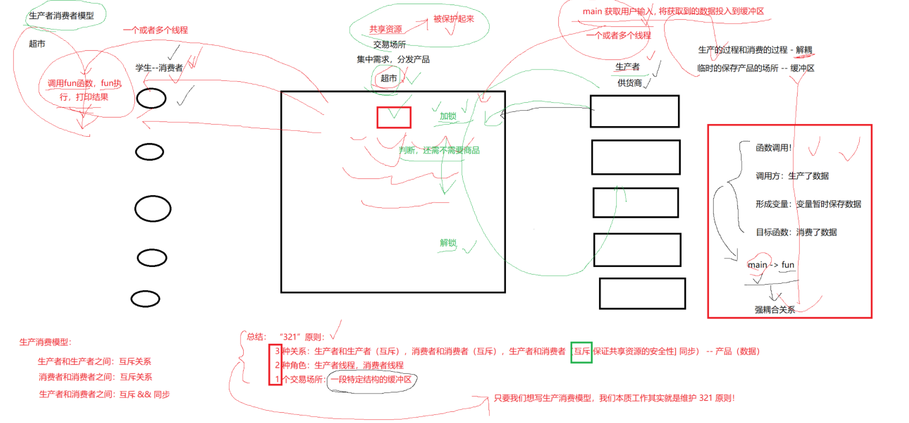


**学生--消费者   超市共享资源   供货商--生产者**

**超市：集中需求，分发产品。交易场所。**

**因为超市存在，生产和消费不相互干扰。解耦。**

**临时的保存产品的场所。--缓冲区**

**共享资源必须被保护起来**


**反例**

**函数调用！反例**

**调用方：生产了数据** **形成变量：变量暂时保存数据**

**目标函数：消费数据**

**main-->fun:main函数等fun函数，强耦合关系**

**改：生产消费**

**mian函数的数据放到缓冲区**

**调用fun函数,fun执行，打印结果**


**生产者消费模型**

**生产者和生产者之间：互斥关系 资源放谁的，只能一个人同时放数据**

**消费者和消费者之间：互斥关系 谁能够拿到，只能一个人同时拿数据**

**生产者和消费者之间：互斥关系&&同步关系 数据安全性。 放数据和拿数据分开。缓冲区的资源数量，生产者和消费者共享。 生产一部分消费一部分。数据资源协同起来。   **

**共享资源被被保护起来的**

**总结 "321"**

**3种关系：生产者和生产者：互斥，消费者和消费者：互斥，生产者和消费者:互斥和同步 产品数据**

**2种角色：生产者线程，消费者线程**

**1一个交易场所：一段特定结构的缓冲区**

**写生产者消费模型，本质就是维护321原则**

**特点**

**生产消费者模型特点：解耦，忙闲不均，高效**

**1.未来生产线程和消费线程解耦**

**2.支持生产和消费的一段时间的忙闲不均的问题**

**3.提高效率 体现在哪里呢？ **


**条件变量**

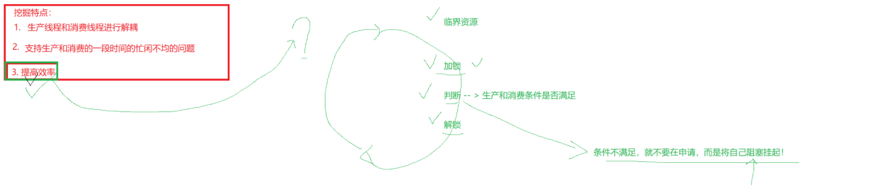

**当一个线程互斥地访问某个变量时，它可能发现在其它线程改变状态之前，它什么也做不了。**


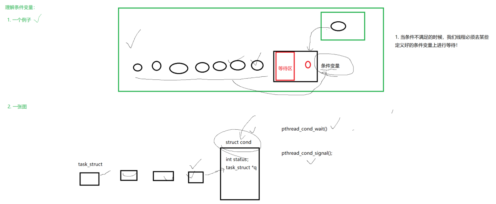


**根据条件变量生产和消费资源。**

**当条件不满足的时候，我们线程必须去某些定义好的条件变量上等待**


**见见猪跑**

```c++
#include <iostream>
#include <unistd.h>
#include <string>
#include <pthread.h>

int tickets = 1000;
pthread_mutex_t mutex = PTHREAD_MUTEX_INITIALIZER;  // 初始化锁
pthread_cond_t cond = PTHREAD_COND_INITIALIZER;     // 初始化条件变量

void* start_routine(void* args)
{
  std::string name = static_cast<const char*>(args);
  while(true)
  {
    pthread_mutex_lock(&mutex);
    pthread_cond_wait(&cond,&mutex);                  // 为什么要有mutex？ 带锁等待？这里在等待，拿到条件变量，等待被唤醒的。
    // 判断暂时省略
    std::cout<< name << " - " << tickets << std::endl;
    tickets--;
    pthread_mutex_unlock(&mutex);
  }
}

int main()
{
  // 通过条件变量控制线程的执行
  pthread_t t[5];
  for(int i = 0; i < 5; i++)
  {
    char* name = new char[64];
    snprintf(name, 64, "thread %d", i+1);              // 线程名称
    pthread_create(t+i, nullptr, start_routine, name); // 创建线程
  }

  while(true)
  {
    sleep(1);
    // pthread_cond_signal(&cond); // 唤醒一个线程 _broadcast唤醒一批线程， 这里在唤醒数据
    pthread_cond_broadcast(&cond); // 唤醒一批线程  这里为什么是五个被唤醒呢？
    std::cout<< "main thread wake up ..." <<std::endl;
  }

  for(int i = 0; i < 5; i++)
  {
    pthread_join(t[i],nullptr);
  }
  return 0;
}

```


**完整版本生产者，消费者模型**

```c++
#pragma once 
#include <iostream>
#include <functional>

class task
{
  using func_t = std::function<int(int, int)>;
public:
  task(){}
  task(int x, int y, func_t func):_x(x), _y(y), _callbacl(func)
  {}
  
  int operator()()
  {
    int result = _callbacl(_x, _y);
    return result;
  }

private:
  int _x;
  int _y;
  func_t _callbacl;
};
```


```c++
#pragma once 
#include <iostream>
#include <queue>
#include <pthread.h>

static const int gmaxcap = 5;

template<class T>
class blockqueue
{
public:
// 构造函数
  blockqueue(const int& maxcap = gmaxcap):_maxcap(maxcap)
  {
    pthread_mutex_init(&_mutex, nullptr);
    pthread_cond_init(&_pcond, nullptr);
    pthread_cond_init(&_ccond, nullptr);
  }

//放数据
// 判断是否满的
  void push(const T& in) // 输入型参数 const &
  {
    pthread_mutex_lock(&_mutex);
    //细节2
    //充当条件判断必须是while
    //if要换成whlie----》
    while(is_full())
    {
      pthread_cond_wait(&_pcond, &_mutex); // 条件不足，无法生产，继续等待
                                           // 细节1
                                           // 该函数调用的时候，会以原子性的方式，将锁释放，并且将自己挂起。 
                                           // 该函数返回的时候，会自动重新获取你传入的锁
    }
    _q.push(in);                           // 里面绝对有数据了
    pthread_cond_signal(&_ccond);          // 唤醒消费者，可以放在解锁之后的
    pthread_mutex_unlock(&_mutex);         // 释放锁了
  }

// 拿数据
// 判断是否空的
  void pop(T* out) // 输出型参数*， 输入输出型参数&
  {
    pthread_mutex_lock(&_mutex);
    //1.先判断
    while(is_empty())
    {
      pthread_cond_wait(&_ccond, &_mutex);      // 等待，释放锁，将自己挂起
    }
    //2保证有数据的
    *out = _q.front();
    _q.pop();
    
    //3这里保证至少空一个位置
    pthread_cond_signal(&_pcond);    // 唤醒消费者,可以再解锁之后。
    pthread_mutex_unlock(&_mutex);
  }

// 析构函数
  ~blockqueue()
  {
    pthread_mutex_destroy(&_mutex);
    pthread_cond_destroy(&_pcond);
    pthread_cond_destroy(&_ccond);
  }

private:
  bool is_empty()
  {
    return _q.empty();
  }
  bool is_full()
  {
    return  _q.size() == _maxcap;
  }

private:
  std::queue<T> _q;          // 队列
  int _maxcap;               // 队列的上线
  pthread_mutex_t _mutex;    // 锁
  pthread_cond_t _pcond;    // 生产者对应的条件变量
  pthread_cond_t _ccond;    // 消费者对于的条件变量
};

```


```c++
#include "blockqueue.hpp"
#include "tast.hpp"
#include <ctime>
#include <sys/types.h>
#include <unistd.h>
#include <cstdlib>


int myadd(int x, int y)
{
  return x + y;
}

// 消费者函数
void* consumer(void* bq_)
{
  blockqueue<task>* bp = static_cast<blockqueue<task> *>(bq_);
  while(true)
  {
    task t;
    bp->pop(&t);
    std::cout<<"消费数据："<< t() <<std::endl;
  }
  sleep(2);
  return nullptr;
}

// 生产者函数
void* productor(void* bq_)
{
  blockqueue<task>* bp = static_cast<blockqueue<task>*>(bq_);
  while(true)
  {
    int x = rand() % 10 + 1; // 随机数构建一个数据[1,10]
    int y = rand() % 5  + 1;
    
    std::cout<< "生产数据"<< x << " : " << y <<std::endl;
    task t(x, y, myadd);
    bp->push(t);
    //std::cout<< "生产数据：" << data <<std::endl;
  }
  return nullptr;
}


int main()
{
  srand((unsigned long)time(nullptr)^getpid());

  blockqueue<task>* bq = new blockqueue<task>(); // 同一份资源bq.
  pthread_t c, p;

  pthread_create(&c,nullptr,consumer, bq);
  pthread_create(&p,nullptr,productor, bq);

  pthread_join(c, nullptr);
  pthread_join(p, nullptr);

  delete bq;
  return 0;
}

```


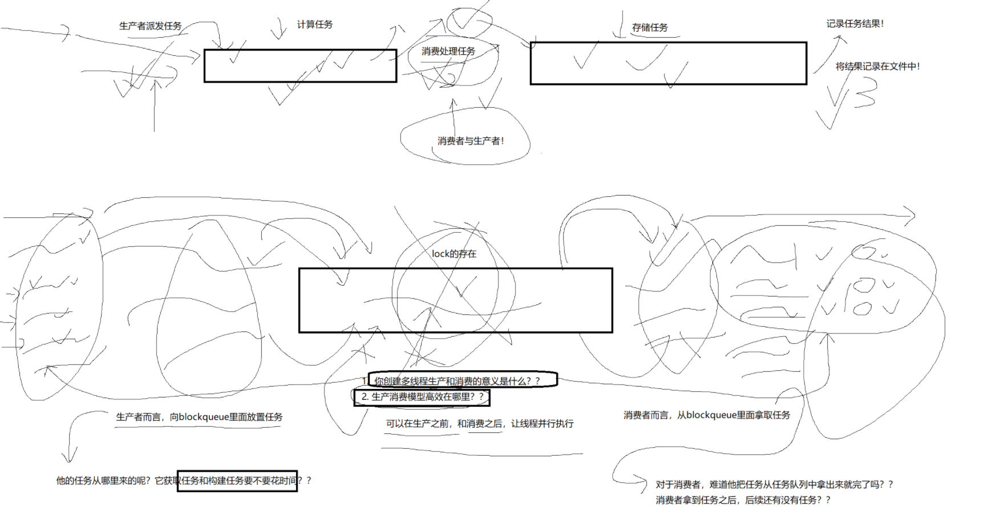


**生产者而言，向blockqueue里面放置任务**

​	**它的任务从哪里来的呢？它获取任务和构建任务要不要花时间？**

​	**拿任务花费时间**

**消费者而言，向blockqueue里面拿取任务**

​	**对于消费者，难道把任务从任务队列拿出来就完了吗？消费者拿到任务之后，后续还有没有任务。**

​	**处理任务花费时间**


**生产之前和消费之后，高效率的。**


## 5信号量

**1.一个线程，在操作临界资源的时候，必须临界资源是满足条件的！**

**2.可是，公共资源十分满足生产或者消费，我们无法直接得知，事前得知【在没有访问之前】**

**3.只能先加锁，在检查，在操作，在解锁。先加锁---本质你也是在访问临界资源！**

**因为我们再操作临界资源的时候，有可能不就绪，我们无法提前得知，只能先检查，根据检查结果决定下一步怎么走！**

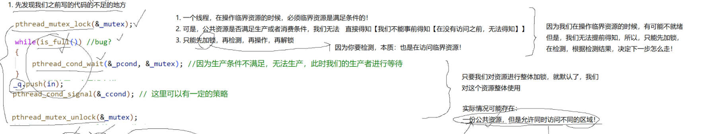


**信号量是什么**

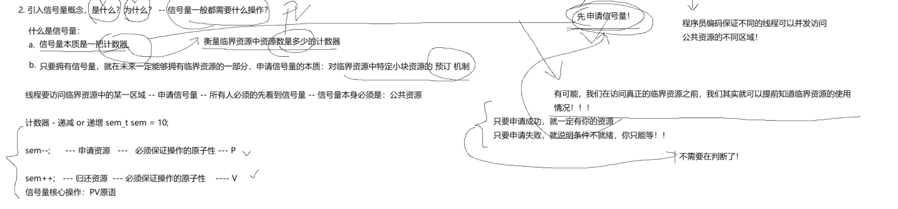


**只要我们对资源整体加锁，就默认我们对这个资源整体使用，**

**实际情况：一份公共资源，允许同时访问不同的区域！**

**先申请信号量**


**信号量为什么**

**a.信号量本质是一把计数器。衡量临界资源中资源数量多少的计数器。**

**b.只要拥有信号量，就在未来一定能够拥有临界资源的一部分。申请信号量的本质：对临界资源中特定小块资源的预订机制。**

**有可能，我们在访问真正的临界资源之前，我们其实就可以提前知道临界资源的使用情况。成功有你的资源，失败只有等  间接判断。**

**间接不用判断锁的资源，转而判断信号量的数目。**

**临界资源的预定机制。**


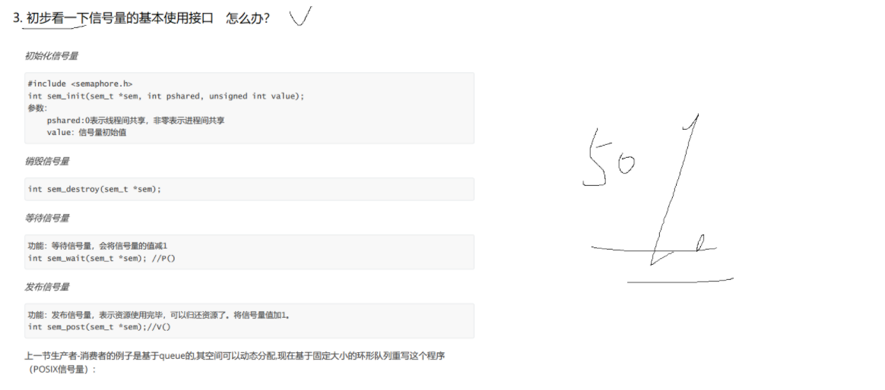


**线程要访问临界资源中的某一区域----申请信号量--所有人得先看到信号量---未来信号量本身必须是：公共资源**

**计数器-递减或者递增**

**int sem=10;**

**sem--; --申请资源   必须保证操作的原子性  --p操作**

**sem++; ++归还资源   必须保证操作的原子性  --v操作**

**信号量核心操作：PV原语**


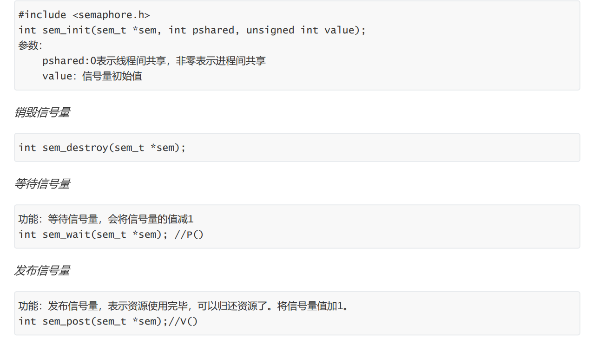


## 6环形队列

**引入环形队列**
**环形队列---判断空，判断满**
**1.计数器**
**2.空一个位置**

**环形队列**
**生产者和消费者在什么情况下访问同一个位置：**
**1.空的时候**
**2.满的时候**
**3.其它情况，生产者和消费者，根本访问的就是不同的区域**

**1.你不能超过我**
**2.我不能把你套一个圈**
**3.我们两个什么是时候会站到一起**
  **盘子全为空**
    **我们两个站在一起，谁先运行呢？生产者**
  **盘子全都是满的**
    **我们两个站在一起，谁先运行呢？消费者**

  **其它情况，我们两个指向的是不同的位置**
**环形队列中，大部分情况，单生产和单消费是可以并发指向的！**
**只有在满和空，才满足互斥和同步的问题。**
**完成环形队列的核心问题？123**

**信号量是用来干什么的呢？**
  **信号量是用来衡量临界资源中的资源数量的**
  **对于生产者而言，看中什么？队列中的剩余空间-----------空间资源--定义信号量**
  **对于消费者而言，看中什么？队列中的放入队列中的数据---数据资源--定义信号量**
**代码**


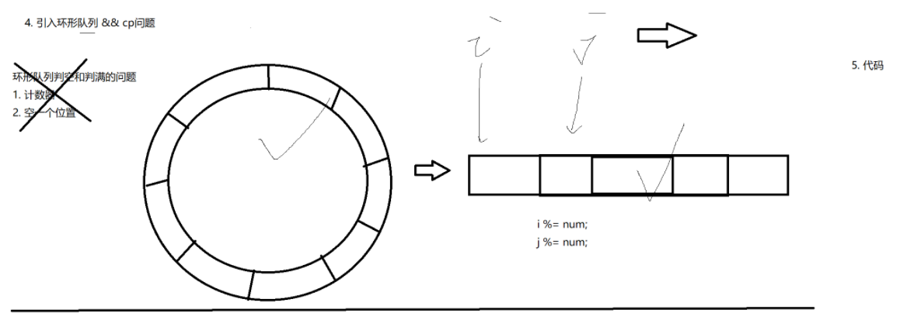


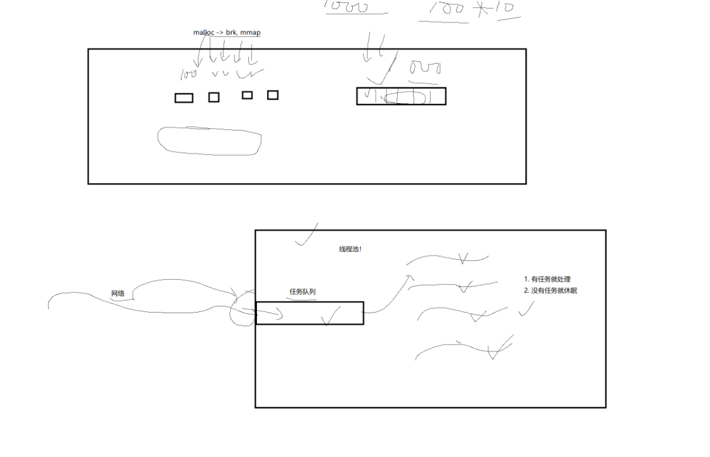


**生产者消费者模型1**

```c++
#include "ringqueue.hpp"
#include <pthread.h>
#include <ctime>
#include <stdlib.h>
#include <sys/types.h>
#include <unistd.h>

// 生产者往队列里面放数据
void* productorRontine(void* rq)
{
  RingQueue<int>* ringqueue = static_cast<RingQueue<int>*>(rq); 
  while(true)
  {
    int data = rand() % 10 + 1;
    ringqueue->push(data);    // 生产数据

    std::cout<<"生产数据完成， 生产的数据是 ："<< data <<std::endl;
    sleep(1);

  }
}

// 消费者往队里里面去取数据
void* consumerRoutine(void* rq)
{
  RingQueue<int>* ringqueue = static_cast<RingQueue<int>*>(rq); 
  while(true)
  {
    int data;
    ringqueue->pop(&data); // 消费数据

    std::cout<<"消费数据完成， 消费的数据是 ："<< data <<std::endl;
  }
}

int main()
{
  srand((unsigned int)time(nullptr)^getpid()^pthread_self()); // 随机数种子
  
  RingQueue<int>* rq = new RingQueue<int>();                  // 队列里面存放数据，统一份资源
  pthread_t c, p;

  pthread_create(&c, nullptr, productorRontine, rq);          //rq就是同一份资源
  pthread_create(&p, nullptr, consumerRoutine,  rq);          //rq就是同一份资源

  pthread_join(c, nullptr);
  pthread_join(p, nullptr);
  return 0;
}
```


```c++
#pragma once 
#include <iostream>
#include <vector>
#include <semaphore.h>
#include <cassert>

static const int gcap = 5;

template<class T>
class RingQueue
{
private: 
// p操作
  void p(sem_t& sem)
  {
    int i = sem_wait(&sem); // 等待信号量， 信号量会减一
    assert(0 == i);
    (void)i;
  }

// v操作
  void v(sem_t& sem)
  {
     int i = sem_post(&sem); // 释放信号，信号量会加一
     assert(0 == i);
     (void)i;
  }

public:
  RingQueue(const int& cap = gcap):_queue(cap), _cap(cap)
  {
    int n = sem_init(&_spaceSem, 0, _cap);   // 信号量的大小
    assert(0 == n);

    n = sem_init(&_dataSem, 0, 0);           // 信号量的大小
    assert(0 == n);

    _productorStep = _consumerStep = 0;      // 初始化生产者，消费者一样的位置
  }

// 生产者 
  void push(const T& in)
  {
    // 判断能够生产, 判断空间信号量
    p(_spaceSem);                       // p--
    _queue[_productorStep++] = in; 

    _productorStep %= _cap;                // 生产者的步伐
    v(_dataSem);                       // v++
  }

// 消费者
  void pop(T* out)
  {
    p(_dataSem);                     // p--
    *out = _queue[_consumerStep++];

    _consumerStep %= _cap;                // 消费者的步伐
    v(_spaceSem);                   // v++
  }

// 删除信号量，
  ~RingQueue()
  {
    sem_destroy(&_spaceSem);
    sem_destroy(&_dataSem);
  }
private:
  std::vector<T> _queue;   // 模拟环形队列，
  int _cap;                // 队列容量
  sem_t _spaceSem;         // 生产者 想生产，空间资源，生产者需要空间
  sem_t _dataSem;          // 消费者 想消费，数据资源，消费者需要数据
  int _productorStep;
  int _consumerStep;
};

```


**生产者消费者模型2**

```c++
#include "ringqueue.hpp"
#include <pthread.h>
#include <ctime>
#include <stdlib.h>
#include <sys/types.h>
#include <unistd.h>
#include "tast.hpp"

std::string selfname()
{
  char name[128];
  snprintf(name, sizeof(name), "thread[0x%zx]", pthread_self());
  return name;
}

void* productorRontine(void* rq)
{
  RingQueue<task>* ringqueue = static_cast<RingQueue<task>*>(rq); 
  while(true)
  {
    int x = rand() % 10;
    int y = rand() % 10;
    char op = oper[rand()%oper.size()];

    task t(x, y, op, myadd);
    
    ringqueue->push(t);
    std::cout<< selfname() <<" 生产者派发任务"<< t.totaskstring()<< " "<<std::endl; 
  }
}

void* consumerRoutine(void* rq)
{
  RingQueue<task>* ringqueue = static_cast<RingQueue<task>*>(rq); 
  while(true)
  {
    task t;
    ringqueue->pop(&t);
    std::string result = t();
    std::cout<< selfname() <<"             消费者消费了一个任务："<< result <<std::endl; 
    sleep(3);
  }
}

int main()
{
  srand((unsigned int)time(nullptr)^getpid()^pthread_self()); // 随机数种子
  
  RingQueue<task>* rq = new RingQueue<task>();

  pthread_t p[4], c[8];
  for(int i = 0; i < 4; i++)pthread_create(p+i, nullptr, productorRontine, rq);  //rq就是同一份资源
  for(int i = 0; i < 8; i++)pthread_create(c+i, nullptr, consumerRoutine, rq);   //rq就是同一份资源
  // 单生产者 单消费者
  // 多生产者 多消费者

  for(int i = 0; i < 4; i++)pthread_join(p[i], nullptr);
  for(int i = 0; i < 8; i++)pthread_join(c[i], nullptr);
  return 0;
}

```


```c++
#pragma once 

#include <iostream>
#include <vector>
#include <semaphore.h>
#include <cassert>
#include <pthread.h>

static const int gcap = 5;

template<class T>
class RingQueue
{
private: 
  void p(sem_t& sem)
  {
    int i = sem_wait(&sem); // 等待信号量， 信号量会减一
    assert(0 == i);
    (void)i;
  }

  void v(sem_t& sem)
  {
     int i = sem_post(&sem); // ++
     assert(0 == i);
     (void)i;
  }

public:
  RingQueue(const int& cap = gcap):_queue(cap), _cap(cap)
  {
    int n = sem_init(&_spaceSem, 0, _cap);
    assert(0 == n);
    n = sem_init(&_dataSem, 0, 0);
    assert(0 == n);

    _productorStep = _consumerStep = 0;

    pthread_mutex_init(&_pmutex, nullptr);
    pthread_mutex_init(&_cmutex, nullptr);
  }

// 生产者 
  void push(const T& in)
  {

    pthread_mutex_lock(&_pmutex);
    // 判断能够生产, 判断空间信号量
    p(_spaceSem);
    _queue[_productorStep++] = in; 

    _productorStep %= _cap; 
    v(_dataSem);
    pthread_mutex_unlock(&_pmutex);
  }

  void pop(T* out)
  {
    pthread_mutex_lock(&_cmutex);
    p(_dataSem);
    *out = _queue[_consumerStep++];

    _consumerStep %= _cap;
    v(_spaceSem);
    pthread_mutex_unlock(&_cmutex);
  }

  ~RingQueue()
  {
    sem_destroy(&_spaceSem);
    sem_destroy(&_dataSem);


    pthread_mutex_destroy(&_pmutex);
    pthread_mutex_destroy(&_cmutex);
  }
private:
  std::vector<T> _queue;
  int _cap;
  sem_t _spaceSem; // 生产者 想生产，空间资源
  sem_t _dataSem;  // 消费者 想消费，数据资源
  int _productorStep;
  int _consumerStep;
  pthread_mutex_t _pmutex;
  pthread_mutex_t _cmutex;
};

```


```c++
#pragma once 
#include <string>
#include <iostream>
#include <functional>
#include <cstring>


const std::string oper = "+-*/%";
class task
{
  using func_t = std::function<int(int, int, char)>;
public:
  task(){}
  task(int x, int y, char op, func_t func):_x(x), _y(y), _op(op), _callbacl(func)
  {}
  
  std::string operator()()
  {
    int result = _callbacl(_x, _y, _op);
    char buffer[1024];
    snprintf(buffer, sizeof(buffer),"%d%c%d=%d", _x, _op, _y, result);
    return buffer;
  }
  std::string totaskstring()
  {
    char buffer[1024];
    snprintf(buffer, sizeof(buffer), "%d %c %d = ?", _x, _op, _y);
    return buffer;
  }
private:
  int _x;
  int _y;
  char _op;
  func_t _callbacl;
};

class savetask
{
  typedef std::function<void(const std::string&)> func_t; // 函数模板吧？
public:
  savetask(){}
  savetask(const std::string& message, func_t func):_message(message), _func(func)
  {}

  void operator()()
  {
    _func(_message);
  }
private:
  std::string _message;
  func_t _func;
};

int myadd(int x, int y, char op)
{
  int result = 0;
  switch(op)
  {
    case '+': result = x+y; break;
    case '-': result = x-y; break;
    case '*': result = x*y; break;
    case '/': 
    {
      if(0 == y)
      {
        std::cerr<< "div zero error" <<std::endl;
        result = -1;
      }
      else 
        result = x / y;
    }
      break;
    case '%':
    {
      if(0 == y)
      {
        std::cerr<< "mod zero error" <<std::endl;
        result = -1;
      }
      else 
        result = x % y;
    }
      break;
    default: break;
  }
  return result;
}

void Save(const std::string& message)
{   
  const std::string target = "./lag.txt";
  FILE* fp = fopen(target.c_str(), "a+");

  if(!fp)
  {
    std::cerr<< "fopen error" <<std::endl;
  }
  
  fputs(message.c_str(), fp);
  fputs("\n", fp);
  fclose(fp);
}

```


**高效拿去任务需要 花费时间的**

**高效消费任务需要 花费时间的**


## 7线程池


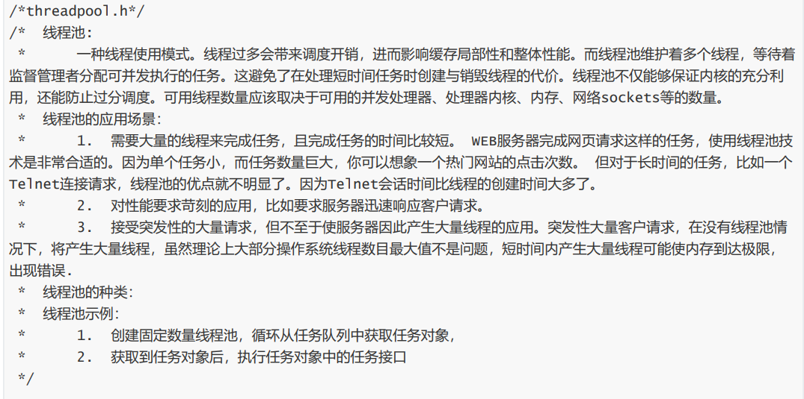


## 8设计模型

**饿汉模式：提前准则**

**懒汉模型：需要的时候才准备**

**内存申请：懒汉模型，地址空间扩大，用的时候给你的。**

**OS，你需要的时候我才给你的。**

**全局静态**


## 9自旋锁

**自旋锁是一种锁机制**，当一个线程尝试获取锁但发现锁已被别的线程占用时，它**不会睡眠、不会阻塞**，而是**在原地一直循环等待（自旋）**，反复检查锁是否可用。

**“我就在这里一直盯着，等你把锁放开，我马上抢过来。”**

**自旋锁是一种忙等锁，非常轻量，但会浪费 CPU，因此只适合锁持有时间极短的情况。**


## 10读者写者问题

**多个线程需要同时访问同一个共享资源（例如数据库、全局变量）时，如何保证安全？**

# 🔒 规则（基本要求）

1. **多个读者可以同时读**（互不影响）
2. **写者写的时候必须独占**
    → 此时不能有其他读者或写者
3. **读与写互斥，写与写互斥**

**场景：一次发布很长时间不去修改，大部分时间是被读取的。**

**在任何时刻，一个人写入，但是可能多个读者读去。**


