# BIT.9_网络基础1.pdf

## 0书籍推荐

**原理：《操作系统精髓与设计原理》 《现代操作系统》**

**Linux：《linux内核设计与实现》 《深入理解linux内核》**

**Linux编程方面：《linux高性能服务器编程》 《Unix 环境高级编程》**

**深入理解计算机系统**

**先编程，后原理**

## 1广域网和局域网

 **局域网（LAN：Local Area Network）**

**广域网（WAN：Wide Area Network）**

**常见例子：**

| 对比项   | 局域网 LAN         | 广域网 WAN         |
| -------- | ------------------ | ------------------ |
| 覆盖范围 | 小（房间/楼/校园） | 大（城市/省/国家） |
| 创建者   | 用户自己           | 运营商建设         |
| 速度     | 更快               | 相对较慢           |
| 成本     | 低                 | 高                 |
| 典型例子 | 家用 WiFi          | 互联网             |

**局域网  = 小范围自家用**
 **广域网 = 大范围运营商级网络**

------

**局域网**

**广域网**

**局域网和广域网相对而言的**

## 2网络协议

**一台计算机内部本质也是一个小型 网络结构。**

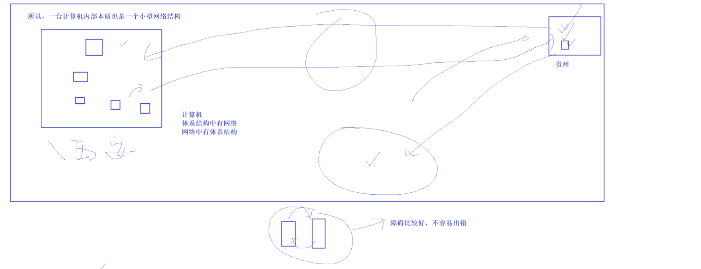

**距离变长，引入新的问题。定制协议，减少通信的成本。**

下面用**简单易懂**的方式告诉你：**什么是网络协议？**

**网络协议（Network Protocol）是什么？**

**网络协议就是计算机之间为了能互相通信而共同遵守的规则和约定。**

最经典的是 **TCP/IP 五层模型**：

1. **应用层**（HTTP、FTP、DNS…）
2. **传输层**（TCP/UDP）
3. **网络层**（IP、ICMP）
4. **数据链路层**（ARP、以太网协议）
5. **物理层**（电信号、光信号）

**没有网络协议，电脑无法交流；
有了协议，所有电脑都用统一的“语言”通信，才有了互联网。**

**协议的抽象理解。 电话铃声响几次。**

**协议的本质就是通信。**

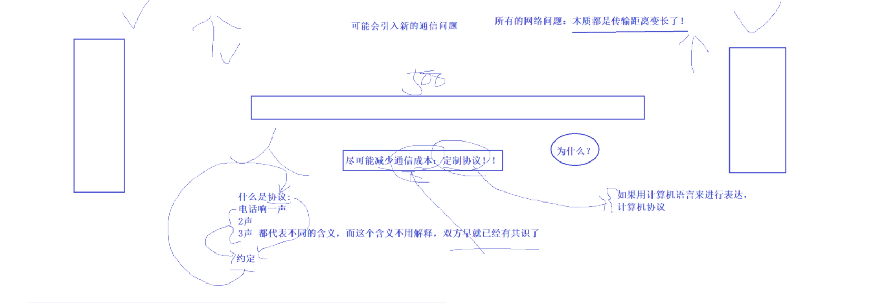

## 3协议分层

**封装，继承，多态。**

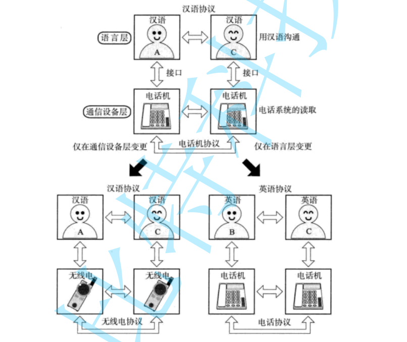

**分层是为了解耦操作**

**软件设计方面--低耦合**

**功能模块高的层，记住在一起**

**每一次解决特定的问题**

**理解分层**

**a.软件设计方面的优势:                                                                                   低耦合**

**b.一般我们的分层依据：功能比较集中，耦合度比较高的模块，设置--一层。高内聚**

**c.每一层都有解决特定的问题。**

**主机1                                                                    主机2**

**1，如何把数据交付给和自己直接相连的下一台主机。**

**2. 路径选择的能力    (别送错了的)**

**3. 容错能力       （万一送错了）**

**4. 解决应用方面的问题（送到目的是手段）**

**上面的每一层，都有自己匹配的协议，每一层协议都解决自己的问题。**

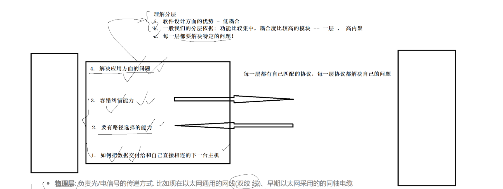

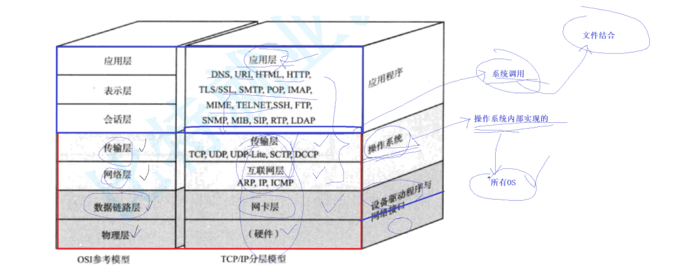

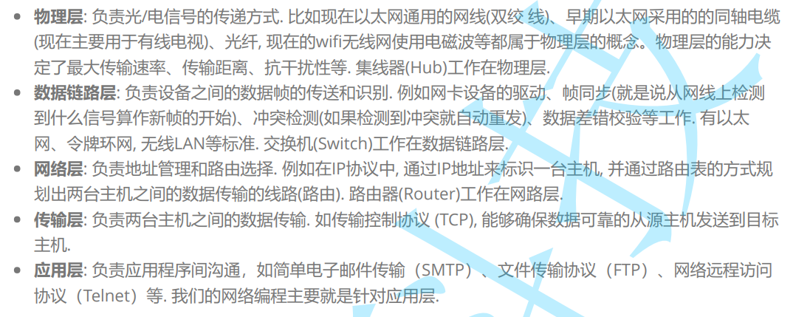

**OSI七层模型**

| 层级  | 名称       | 作用                        | 代表协议 / 设备      |
| ----- | ---------- | --------------------------- | -------------------- |
| **7** | 应用层     | 提供应用服务                | HTTP、FTP、DNS       |
| **6** | 表示层     | 数据格式转换、加密压缩      | JPEG、MP3、TLS       |
| **5** | 会话层     | 建立/管理/终止会话          | RPC、NetBIOS         |
| **4** | 传输层     | 端到端传输、可靠性          | TCP、UDP             |
| **3** | 网络层     | 寻址、路由选择              | IP、ICMP、路由器     |
| **2** | 数据链路层 | 成帧、MAC 地址、错误检测    | ARP、交换机          |
| **1** | 物理层     | 传输比特流（电信号/光信号） | 网线、光纤、无线电波 |

**TCP/IP五层结构**

| 层级  | 名称       | 作用                | 代表协议 / 设备      |
| ----- | ---------- | ------------------- | -------------------- |
| **5** | 应用层     | 提供用户应用服务    | HTTP、DNS、FTP       |
| **4** | 传输层     | 端到端可靠传输      | TCP、UDP             |
| **3** | 网络层     | 寻址、路由          | IP、ICMP、路由器     |
| **2** | 数据链路层 | MAC、成帧、错误检测 | ARP、交换机          |
| **1** | 物理层     | 发送比特流          | 网线、光纤、无线电波 |

**TCP/IP和OSI对比**

| OSI 七层   | TCP/IP 五层    |
| ---------- | -------------- |
| 应用层     | 应用层         |
| 表示层     | ↓ 合并至应用层 |
| 会话层     | ↓ 合并至应用层 |
| 传输层     | 传输层         |
| 网络层     | 网络层         |
| 数据链路层 | 数据链路层     |
| 物理层     | 物理层         |

**物理发电信号 → 链路看 MAC → 网络走 IP → 传输靠 TCP/UDP → 应用用 HTTP/DNS**

**网络中的地址管理**

| 分类                 | 地址/协议                | 所在层                | 作用                                   | 示例                               |
| -------------------- | ------------------------ | --------------------- | -------------------------------------- | ---------------------------------- |
| **物理地址**         | **MAC 地址**             | 数据链路层（第 2 层） | 局域网中标识设备                       | `3C-A6-F6-2E-19-77`                |
| **逻辑地址**         | **IP 地址（IPv4/IPv6）** | 网络层（第 3 层）     | 标识主机在网络中的位置，用于跨网络寻址 | `192.168.1.10` / `fe80::1`         |
| **子网信息**         | **子网掩码**             | 网络层                | 划分网络号与主机号                     | `255.255.255.0` / `/24`            |
|                      | **默认网关（Gateway）**  | 网络层                | 主机跨网通信的出口路由                 | `192.168.1.1`                      |
| **端口号**           | **Port**                 | 传输层（第 4 层）     | 标识主机上的服务和应用程序             | `80`、`443`、`22`                  |
| **域名**             | **域名（Domain Name）**  | 应用层                | 人类可读名称，依赖 DNS 转 IP           | `www.baidu.com`                    |
| **解析协议**         | **DNS**                  | 应用层                | 域名 ↔ IP 地址映射                     | `www.google.com → 142.250.xxx.xxx` |
| **地址映射协议**     | **ARP**                  | 数据链路层            | 通过 IP 查 MAC（IPv4）                 | `192.168.1.2 → MAC?`               |
| **自动分配协议**     | **DHCP**                 | 应用层                | 自动分配 IP、掩码、网关、DNS           | WiFi 自动分 IP                     |
| **邻居发现（IPv6）** | **NDP**                  | 网络层                | IPv6 的 ARP 功能（MAC 解析）           | IPv6 专用                          |

| 地址类型 | 谁来用      | 用来干嘛           |
| -------- | ----------- | ------------------ |
| **MAC**  | 交换机      | 局域网内找设备     |
| **IP**   | 路由器      | 跨网络找设备       |
| **端口** | 系统 + 应用 | 找主机中的具体程序 |
| **域名** | DNS 服务器  | 方便人类访问地址   |

**OSI七层模型(Open System Interconnection)**

**7应用层**

**6表示层**

**5会话层**

**4传输层      两个节点之间的数据传输**

**3网络层      路径选择**

**2数据链路层  互连设备**

**1物理层        硬件方面**

**TCP/IP协议(4层或者5层)**

**1.物理层       Hub层（集线器），信号放大。光猫：数字到模拟--模拟到数字。网卡。  大概了解 **

**2.数据链路层   交换机**

**3.网络层       路径选项**

**4.传输层       容错能力**

**5.应用层       拿到数据，如何解决（会话，表示，应用）**

**光猫 = 光纤调制解调器（ONU/ONT）**

**ONU（Optical Network Unit）光网络单元**

**ONT（Optical Network Terminal）光网络终端**

**光纤 → 光猫 → 路由器 → 手机/电脑/WiFi**

**光猫负责“把网弄进来”，路由器负责“在家里分网”**

**光猫，是光纤入户的“光信号 ↔ 电信号转换设备”，相当于你家网络的第一站。**

**光猫把光变成网，路由器把网分给设备。**

**网卡是电脑连接网络的“接口”，负责收发数据、MAC 地址管理和信号转换。**

**局域网通信的原理**

## 4局域网

**先谈局域网：**

**1.协议报头**

​	**a协议每一层都有，而每一个协议最终表现：就是协议要有报头。**

​		**收快递的时候，不止快递(还有盒子和快递单子) 快递单就是报头 盒子就是打包数据。**

​		**快递单的意义（报头的意义）：**

​	**b协议通常是: 通过协议报头来进行表达的**

​	**c每一份数据最终被发送，或者在不同的协议层，都要有自己的报头，**

​	**d送到目的地是手段，使用才是目的。**

​	**e说明书才是引用层协议**

**每一层都要有自己的协议报头**

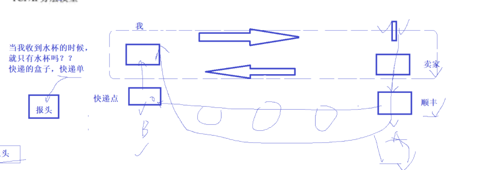

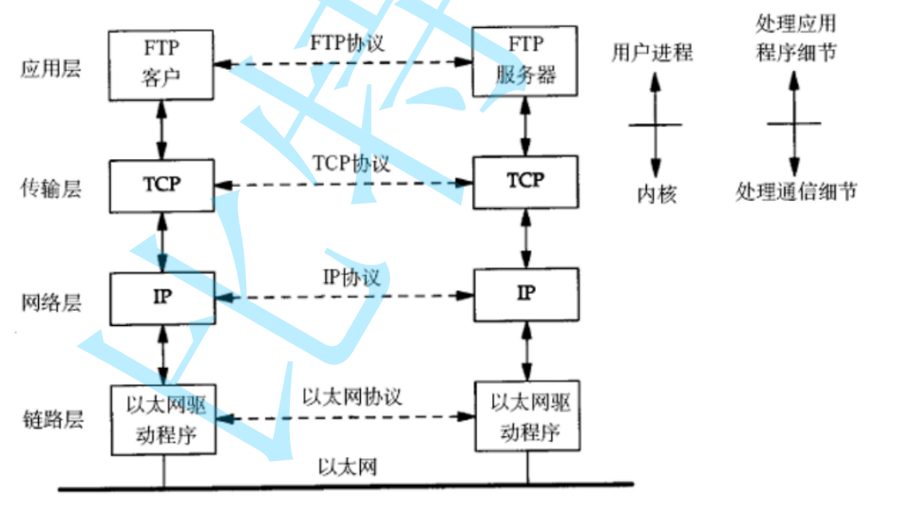

**局域网：**

**a.两台局域网的主机能够直接通信**

**b.局域网通信的原理(第一讲)**

​	**每一台机器都有自己的名字，每一台主机都有网卡，每一张网卡都有自己的地址，MAC地址。**

​	**MAC地址表明自己在局域网中的唯一性**

| 地址类型     | 解决的问题                             |
| ------------ | -------------------------------------- |
| **MAC 地址** | **让同一个局域网内的设备能互相找到**   |
| **IP 地址**  | **让世界上不同网络之间的设备互相找到** |

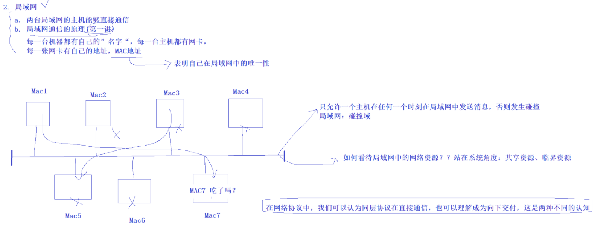

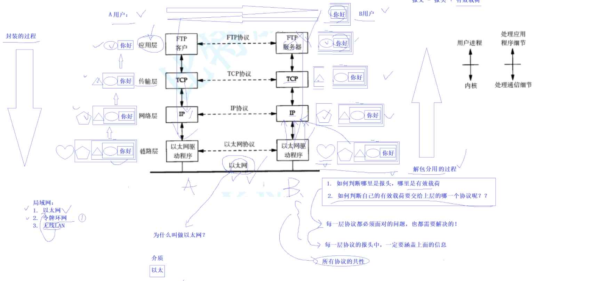

**在网络协议当中，我们可以认为同层协议在直接通信，也可以理解成，向下交付。这是两种不同的认知。**

**几乎每一层协议都必须面对的，也都需要解决的**

​	**所有协议的共性**

​	**1.如何识别哪里是报头，那里是有效载荷？**

​	**2.如何判断自己的有效载荷要交给上层的哪一个协议呢？**

**每一层协议的报头中，一定要涵盖上面的信息**

**上面是所有协议的共性。**

**解包分用上传。**

**全局网：**

**1.以太网:**

**2.令牌环网:令牌发数据，类似锁。**

**3.无线LAN:**

**局域网，只允许一个主机在任何时刻在局域网中发送信息，否则碰撞。**

**局域网：碰撞域**

**如何看待局域网中的网络资源？？站在系统角度，共享资源 临界资源。**

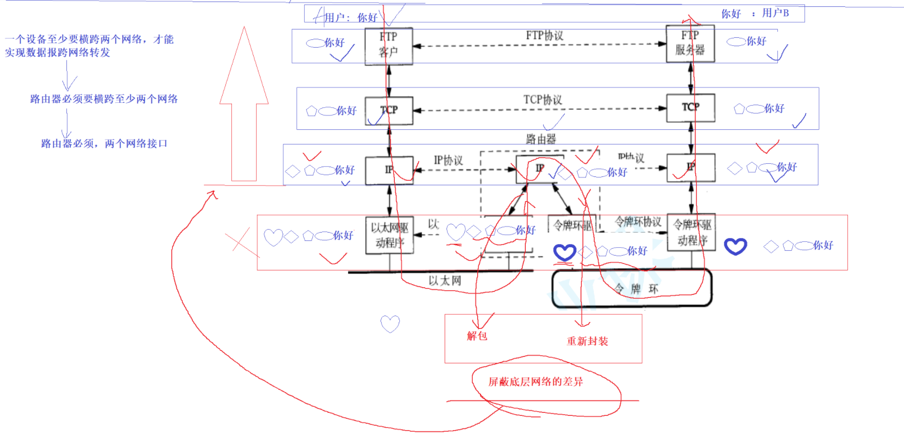

**路由器分发数据到对应的网络里面。**

**路由器：解包和重新封装，屏蔽底层网络的差异。**

**路由器：解密一层，再加密一层。**

**ip层存在的意义：屏蔽底层网络的差异。**

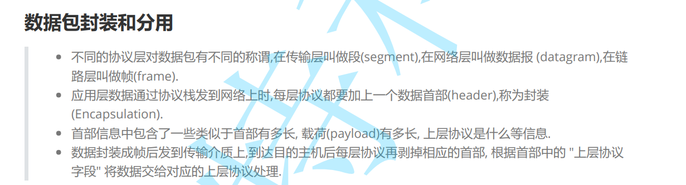

**协议**

**分成**

**路由器封装和解包**

**局域网**

**全局网**

**报头有效载荷分离和交付。**

## MAC地址和IP地址

