# BIT.9_网络基础1.pdf

## 0书籍推荐

**原理：《操作系统精髓与设计原理》 《现代操作系统》**

**Linux：《linux内核设计与实现》 《深入理解linux内核》**

**Linux编程方面：《linux高性能服务器编程》 《Unix 环境高级编程》**

**深入理解计算机系统**

**先编程，后原理**

## 1广域网和局域网

**网络的发展历程， 用户之间相互和。**

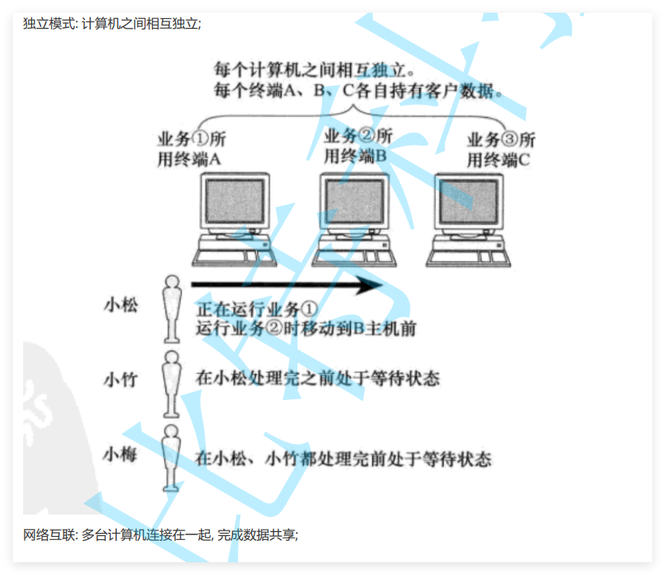

 **局域网（LAN：Local Area Network）**

**广域网（WAN：Wide Area Network）**

**局域网**

**广域网**

**局域网之间是通过交换机连接。**

**交换机和路由器**

| **设备**            | **形象比喻** | **主要作用**                                           |
| ------------------- | ------------ | ------------------------------------------------------ |
| **交换机 (Switch)** | **楼内电梯** | 负责**局域网内部**的连接。让屋子里的设备互相说话。     |
| **路由器 (Router)** | **大楼大门** | 负责**连接不同的网络**（比如把你家局域网连到互联网）。 |

**交换机局域网**

**路由器广域网**

**局域网和广域网相对而言的**

**网络的发明是为了计算机之间相互协作。**

**局域网和广域网是相对而言的。**

**学习网络，离不开运营商的角色**

## 2网络协议

**一台计算机内部本质也是一个小型 网络结构。**

**计算机的组件，通过线连接起来的。**

**计算机体系结构中：体系结构有网络，网络有体系结构。**

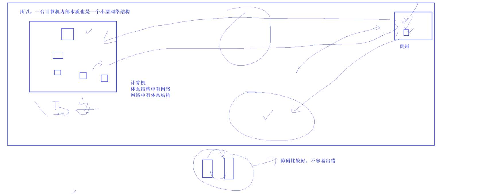

**距离变长，引入新的问题。定制协议，减少通信的成本。**

**网络协议（Network Protocol）是什么？**

**网络协议就是计算机之间为了能互相通信而共同遵守的规则和约定。**

**故事：你给你爸爸打电话约定，电话费太贵，约定响几次代表什么意思？**

**协议的抽象理解。 电话铃声响几次，代表不同的含义，不需要过多的解释。。**

**协议的本质就是通信。**

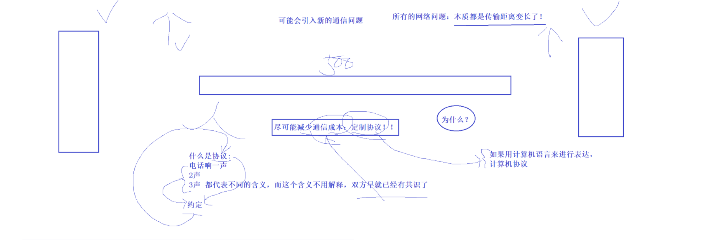

## 3协议分层

**最经典的是 TCP/IP 五层模型**：

1. **应用层**（HTTP、FTP、DNS…）
2. **传输层**（TCP/UDP）
3. **网络层**（IP、ICMP）
4. **数据链路层**（ARP、以太网协议）
5. **物理层**（电信号、光信号）

**封装，继承，多态。**

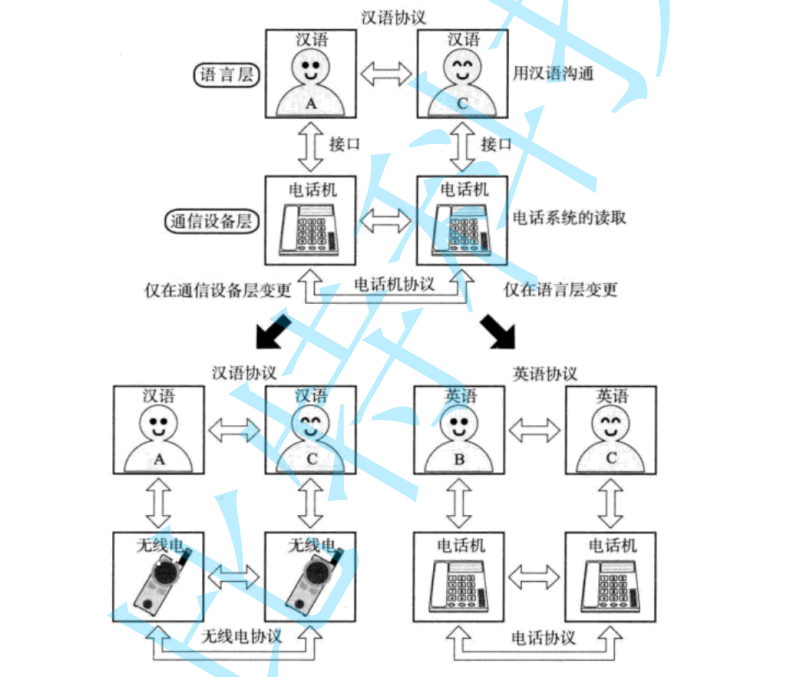

**分层是为了解耦操作**

**软件设计方面--低耦合**

**功能模块高的层，记住在一起**

**每一次解决特定的问题**

**理解分层**

**a.软件设计方面的优势:                                                                                   低耦合**

**b.一般我们的分层依据：功能比较集中，耦合度比较高的模块，设置--一层。高内聚**

**c.每一层都有解决特定的问题。**

**分层需要解决那些问题。**

**主机1                                                                    主机2**

**1，如何把数据交付给和自己直接相连的下一台主机。 目标**

**2. 路径选择的能力    (别送错了的)**

**3. 容错能力       （万一送错了）**

**4. 解决应用方面的问题（送到目标是手段）**

**上面的每一层，都有自己匹配的协议，每一层协议都解决自己的问题。**

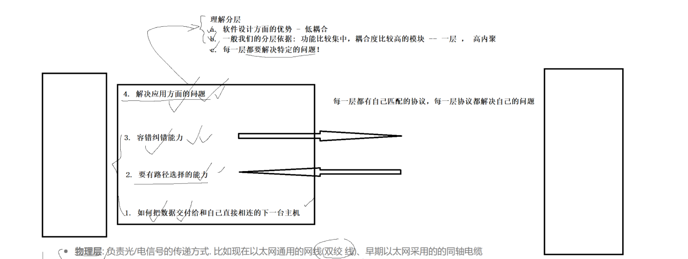

**OSI（Open System Interconnection，开放系统互连）七层网络模型称为开放式系统互联参考模型**

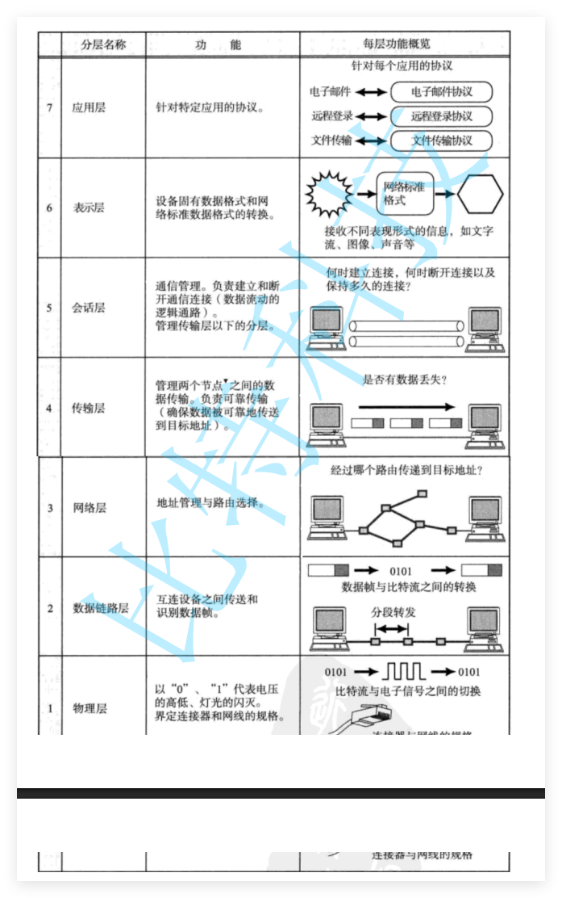

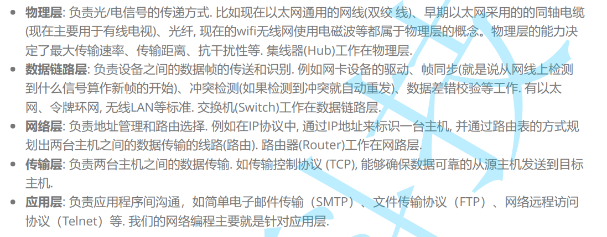

**OS里面存在：传输层，网络层。所有的操作系统。**

**上面层就是系统调用，实现用户一样的。**

**系统就是网络，网络就是系统。**

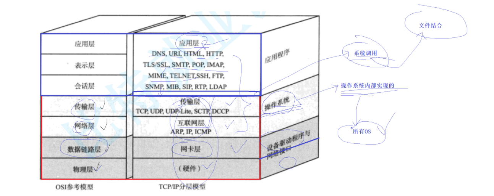

**TCP/IP就是老大了。谁给的，OS，操作系统给的。**

**OSI七层模型**

| 层级  | 名称       | 作用                        | 代表协议 / 设备      |
| ----- | ---------- | --------------------------- | -------------------- |
| **7** | 应用层     | 提供应用服务                | HTTP、FTP、DNS       |
| **6** | 表示层     | 数据格式转换、加密压缩      | JPEG、MP3、TLS       |
| **5** | 会话层     | 建立/管理/终止会话          | RPC、NetBIOS         |
| **4** | 传输层     | 端到端传输、可靠性          | TCP、UDP             |
| **3** | 网络层     | 寻址、路由选择              | IP、ICMP、路由器     |
| **2** | 数据链路层 | 成帧、MAC 地址、错误检测    | ARP、交换机          |
| **1** | 物理层     | 传输比特流（电信号/光信号） | 网线、光纤、无线电波 |

**TCP/IP五层结构**

| 层级  | 名称       | 作用                | 代表协议 / 设备      |
| ----- | ---------- | ------------------- | -------------------- |
| **5** | 应用层     | 提供用户应用服务    | HTTP、DNS、FTP       |
| **4** | 传输层     | 端到端可靠传输      | TCP、UDP             |
| **3** | 网络层     | 寻址、路由          | IP、ICMP、路由器     |
| **2** | 数据链路层 | MAC、成帧、错误检测 | ARP、交换机          |
| **1** | 物理层     | 发送比特流          | 网线、光纤、无线电波 |

**TCP/IP和OSI对比**

| OSI 七层   | TCP/IP 五层    |
| ---------- | -------------- |
| 应用层     | 应用层         |
| 表示层     | ↓ 合并至应用层 |
| 会话层     | ↓ 合并至应用层 |
| 传输层     | 传输层         |
| 网络层     | 网络层         |
| 数据链路层 | 数据链路层     |
| 物理层     | 物理层         |

**物理发电信号 → 链路看 MAC → 网络走 IP → 传输靠 TCP/UDP → 应用用 HTTP/DNS**

**网络中的地址管理**

| 分类                 | 地址/协议                | 所在层                | 作用                                   | 示例                               |
| -------------------- | ------------------------ | --------------------- | -------------------------------------- | ---------------------------------- |
| **物理地址**         | **MAC 地址**             | 数据链路层（第 2 层） | 局域网中标识设备                       | `3C-A6-F6-2E-19-77`                |
| **逻辑地址**         | **IP 地址（IPv4/IPv6）** | 网络层（第 3 层）     | 标识主机在网络中的位置，用于跨网络寻址 | `192.168.1.10` / `fe80::1`         |
| **子网信息**         | **子网掩码**             | 网络层                | 划分网络号与主机号                     | `255.255.255.0` / `/24`            |
|                      | **默认网关（Gateway）**  | 网络层                | 主机跨网通信的出口路由                 | `192.168.1.1`                      |
| **端口号**           | **Port**                 | 传输层（第 4 层）     | 标识主机上的服务和应用程序             | `80`、`443`、`22`                  |
| **域名**             | **域名（Domain Name）**  | 应用层                | 人类可读名称，依赖 DNS 转 IP           | `www.baidu.com`                    |
| **解析协议**         | **DNS**                  | 应用层                | 域名 ↔ IP 地址映射                     | `www.google.com → 142.250.xxx.xxx` |
| **地址映射协议**     | **ARP**                  | 数据链路层            | 通过 IP 查 MAC（IPv4）                 | `192.168.1.2 → MAC?`               |
| **自动分配协议**     | **DHCP**                 | 应用层                | 自动分配 IP、掩码、网关、DNS           | WiFi 自动分 IP                     |
| **邻居发现（IPv6）** | **NDP**                  | 网络层                | IPv6 的 ARP 功能（MAC 解析）           | IPv6 专用                          |

| 地址类型 | 谁来用      | 用来干嘛           |
| -------- | ----------- | ------------------ |
| **MAC**  | 交换机      | 局域网内找设备     |
| **IP**   | 路由器      | 跨网络找设备       |
| **端口** | 系统 + 应用 | 找主机中的具体程序 |
| **域名** | DNS 服务器  | 方便人类访问地址   |

**OSI七层模型(Open System Interconnection)**

**7应用层**

**6表示层**

**5会话层**

**4传输层      两个节点之间的数据传输**

**3网络层      路径选择**

**2数据链路层  互连设备**

**1物理层        硬件方面**

**TCP/IP协议(4层或者5层)**

**1.物理层       Hub层（集线器），信号放大。光猫：数字到模拟--模拟到数字。网卡。  大概了解 **

**2.数据链路层   交换机**

**3.网络层       路径选项**

**4.传输层       容错能力**

**5.应用层       拿到数据，如何解决（会话，表示，应用）**

**光猫 = 光纤调制解调器（ONU/ONT）**

**ONU（Optical Network Unit）光网络单元**

**ONT（Optical Network Terminal）光网络终端**

**光纤 → 光猫 → 路由器 → 手机/电脑/WiFi**

**光猫负责“把网弄进来”，路由器负责“在家里分网”**

**光猫，是光纤入户的“光信号 ↔ 电信号转换设备”，相当于你家网络的第一站。**

**光猫把光变成网，路由器把网分给设备。**

**网卡是电脑连接网络的“接口”，负责收发数据、MAC 地址管理和信号转换。**

**局域网通信的原理**

## 4局域网LAN

**先谈局域网：**

**1.协议报头**

​	**a协议每一层都有，而每一个协议最终表现：就是协议要有报头。**

​		**收快递的时候，不止快递(还有盒子和快递单子) 快递单就是报头 盒子就是打包数据。**

​		**快递单的意义（报头的意义）：**

​	    **快递单根本就不是给你看的，给路上的快递员看的。**

​	**b协议通常是: 通过协议报头来进行表达的**

​			**拿起起来就知道是什么东西。**

​	**c每一份数据最终被发送，或者在不同的协议层，都要有自己的报头，**

​	**d送到目的地是手段，使用才是目的。**

​	**e说明书才是应用层协议**

**每一层都要有自己的协议报头**

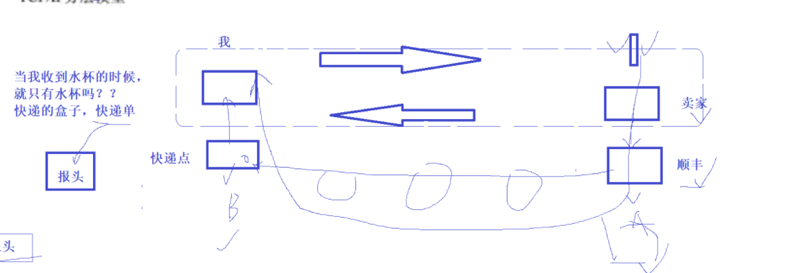

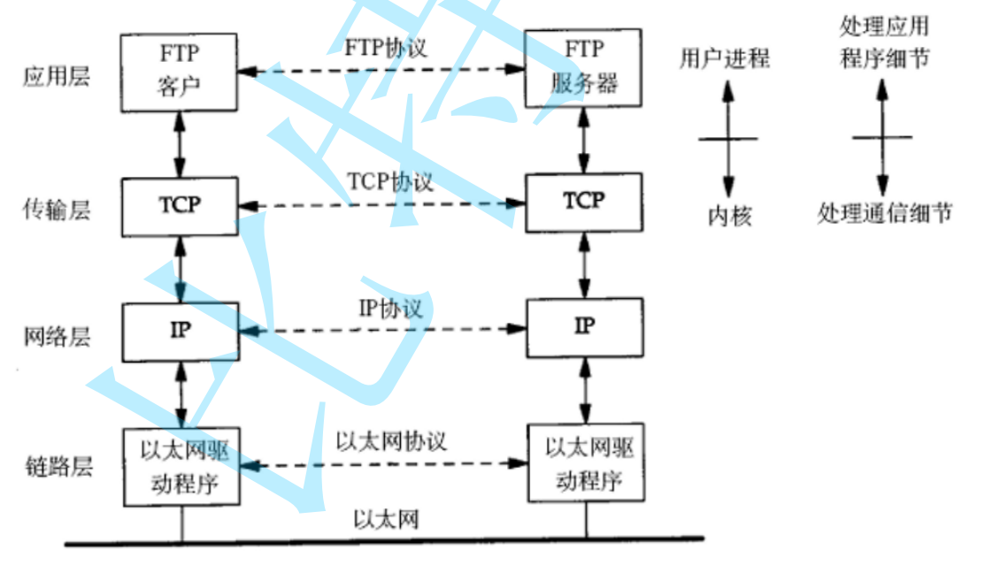

**局域网：**

**a.两台局域网的主机能够直接通信**

**b.局域网通信的原理(第一讲)**

​	**每一台机器都有自己的名字，每一台主机都有网卡，每一张网卡都有自己的地址，MAC地址。**

​	**MAC = Media Access Control**

​	**MAC 地址中的 MAC 是 Media Access Control 的缩写，表示数据链路层用于控制设备访问传输介质并在局域网内唯一标识网络接口的地址。**

​	**MAC地址表明自己在局域网中的唯一性**

| 地址类型     | 解决的问题                             |
| ------------ | -------------------------------------- |
| **MAC 地址** | **让同一个局域网内的设备能互相找到**   |
| **IP 地址**  | **让世界上不同网络之间的设备互相找到** |

**局域网通信的原理。**

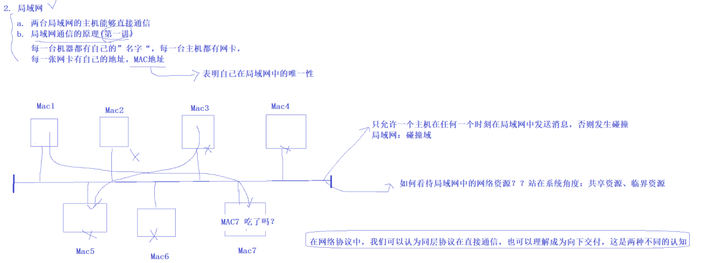

**MAC1----MAC7。其它主机丢弃数据。 根据MAC地址，进行数据传输。**

**局域网的主机都接收了消息。 最底层协议拿到了。在局域网通信中，目标不是自己的数据帧，通常在数据链路层（第二层，MAC 层）就会被丢弃，不会上交到 IP 层及以上。 **

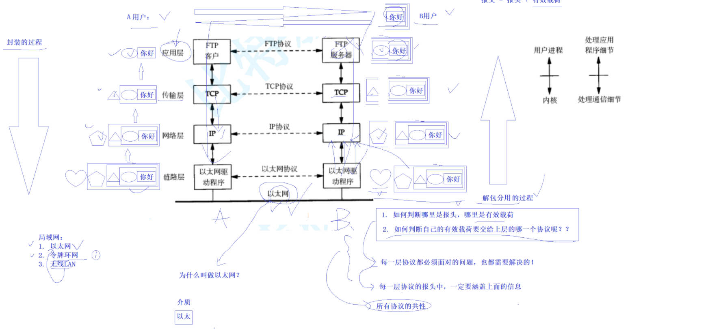

**在网络协议当中，我们可以认为同层协议在直接通信，也可以理解成，向下交付。这是两种不同的认知。**

**几乎每一层协议都必须面对的，也都需要解决的**

​	**所有协议的共性**

​	**1.如何识别哪里是报头，那里是有效载荷？**

​	**2.如何判断自己的有效载荷要交给上层的哪一个协议呢？**

​	**每一层协议的报头中，一定要涵盖上面的信息**

​	**上面是所有协议的共性。**

**解包分用上传。**

**报文和有效载荷分类**

**局域网**

**1.以太网:**

**2.令牌环网:令牌发数据，类似锁。**

**3.无线LAN:**

**局域网，只允许一个主机在任何时刻在局域网中发送信息，否则碰撞。**

**局域网：碰撞域**

**如何看待局域网中的网络资源？？站在系统角度，共享资源 临界资源。**

## 5全局网WAN

**一个设备至少要横跨两个网络，才能实现数据跨网络转发。**

**路由器必须的至少横跨两个网络。**

**路由器必须，至少两个网络接口。**

**全局网：**

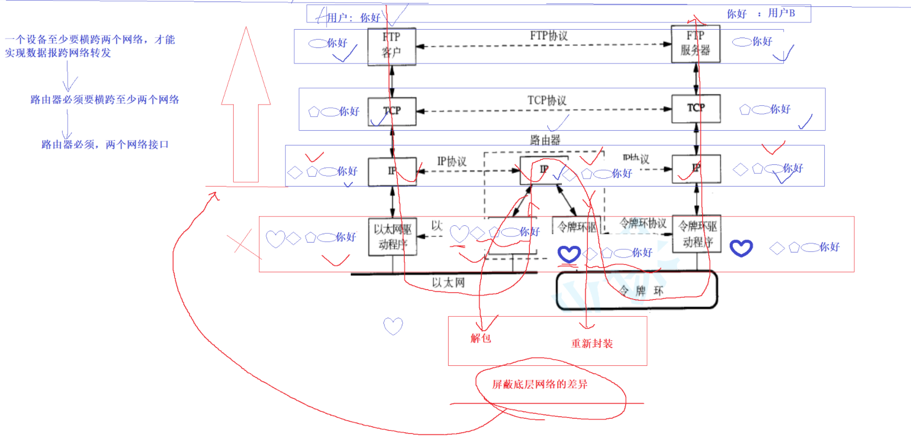

**路由器分发数据到对应的网络里面。**

**路由器：解包和重新封装，屏蔽底层网络的差异。**

**路由器：解密一层，再加密一层。**

**ip层存在的意义：屏蔽底层网络的差异。**

**最底层的协议不一样的。**

**协议**

**分层**

**路由器封装和解包**

**局域网**

**全局网**

**报头有效载荷分离和交付。**

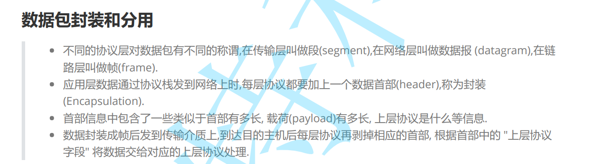

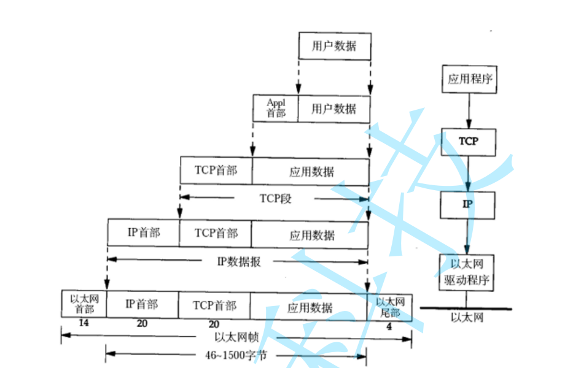

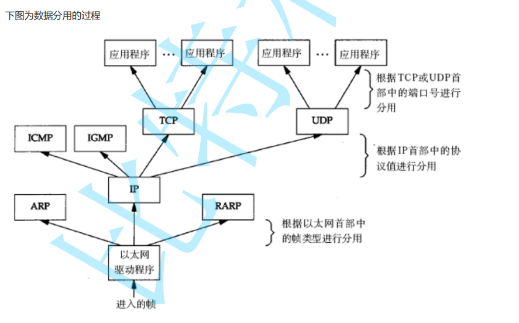

**请求 ：响应，数据报，数据段，数据帧。**

**有效载荷和数据分离。数据如何向上交付。**

## 6MAC地址和IP地址

**ipv4:32位。点分十。**

**ipv6:48位，点分十。**

**两套：**

**MAC地址 6位 , IP地址。**

**1从哪里来，到哪里去。                  终极目标，目的ip(源IP)。未来每一个阶段，提供方向目标，方便进行路径选择。   方向  IP地址**

**2上一站从哪里来，下一站去哪里。  该类地址，一直在变化。MAC地址。                                                                  可行性  MAC地址**

**开始学习---找工作**

**(c语言，数据结构，c++, linux系统，Linux网络编程)**

**IP地址：**

**IP地址是在IP协议中, 用来标识网络中不同主机的地址;**

**MAC地址：**

**MAC地址用来识别数据链路层中相连的节点**

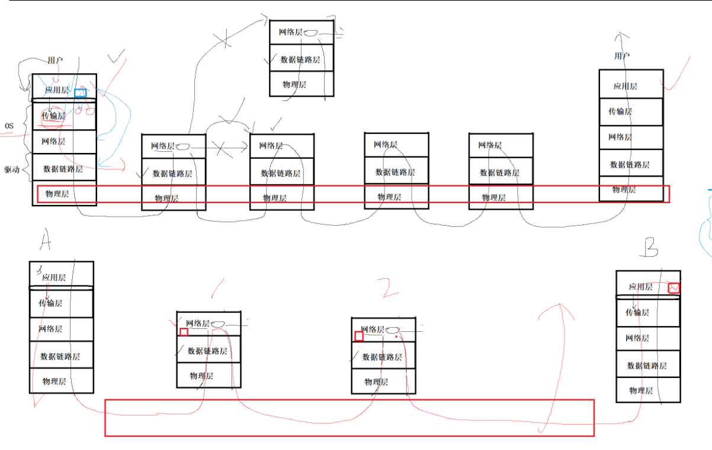

**传输层和网络层在OS里面。**

**MAC地址一值变化的**

**IP地址A                                         IP地址B**

**应用层                                        应用层**

**传输层       MAC1       MAC...    传输层**

**网络层      网络层                        网络层**

**数据链路层  数据链路层    ...        数据链路层**

**物理层      物理层                物理层**

**下           上下        ...      上**

**数据都必须在物理层上面跑**

## 7公网 IP、私网 IP 和 端口

要理解 **公网 IP**、**私网 IP** 和 **端口**，最简单的方法是把它们想象成一套**现实生活中的“邮寄与办公楼系统”**。

1. 公网 IP：大楼的“详细地理位置”

**公网 IP**（Public IP）就像是地球上**唯一**的一个街道地址（比如：XX省XX市XX路100号）。

- **唯一性**：全球范围内，这个地址是唯一的，谁都能通过地图找到它。
- **作用**：它是你在互联网上的身份标识。任何互联网上的服务器想要把数据发给你，必须先找到你的“大楼地址”。
- **管理者**：由运营商（电信、移动、联通）分配。

2. 私网 IP：大楼内部的“房间号”

**私网 IP**（Private IP）就像是大楼内部的房间号（比如：101室、202室）。

- **重复性**：不同的大楼里都可以有“101室”。你在家里的私网 IP 可能是 `192.168.1.5`，你邻居家的电脑也可能是这个 IP，但因为你们在不同的“大楼”（公网 IP）里，所以互不干扰。
- **作用**：用于局域网内部设备（如你的手机、电脑、智能冰箱）互相通信。
- **路由器（Router）的角色**：路由器就是这栋大楼的“前台”或“收发室”。它拥有一个公网 IP，负责帮屋里的所有房间收发快递。

3. 端口（Port）：房间里的“特定窗口”

如果 IP 决定了数据能送到哪台**电脑**，那么 **端口** 就决定了数据该交给这台电脑里的哪个**程序**。

我们可以把一个房间（IP 地址）想象成有很多个“服务窗口”，每个窗口负责不同的业务：

- **80/443 端口**：负责“网页访问”业务。
- **22 端口**：负责“远程管理”业务。
- **3306 端口**：负责“数据库查询”业务。

为什么需要端口？

因为你的电脑同时在运行很多程序。当你下载文件的同时又在看网页，端口能确保下载的数据进到下载器，网页的数据进到浏览器，而不会乱套。

4. 它们是如何协同工作的？（举个例子）

假设你（私网 IP：`192.168.1.5`）想在浏览器里访问百度。

1. **出发**：你的电脑发起请求，告诉路由器：“我要去百度，顺便给我开个临时的**端口 12345** 等回信。”
2. **经过路由器（前台）**：路由器把你的私网地址换成它的**公网地址**（例如 `114.x.x.x`），并发给互联网。这一步叫 **NAT（网络地址转换）**。
3. **到达百度**：百度的服务器（公网 IP）收到请求，看了一下请求的**端口（443）**，知道你是要看网页，于是把网页内容打包发回给你的路由器。
4. **回到你手中**：路由器根据之前记录的**端口号 12345**，准确地把网页数据转发给房间里的 `192.168.1.5`。

总结表

| **概念**    | **类比**       | **范围**      | **特点**                   |
| ----------- | -------------- | ------------- | -------------------------- |
| **公网 IP** | 大楼的街道地址 | 全球互联网    | 全球唯一，直接可达         |
| **私网 IP** | 房间号         | 家庭/公司内部 | 内部唯一，外部无法直接访问 |
| **端口**    | 业务窗口       | 单台设备内    | 区分不同的软件/服务        |

为什么这对你写程序很重要？

回到你之前写的 `initListenFd(unsigned short port)` 函数：

**`port`（端口）** 就是在告诉操作系统：“请给我的这个程序在电脑上开一个特定的‘窗口’。以后只要有发往这台电脑、且找这个端口号的数据，都请交给我处理。”

