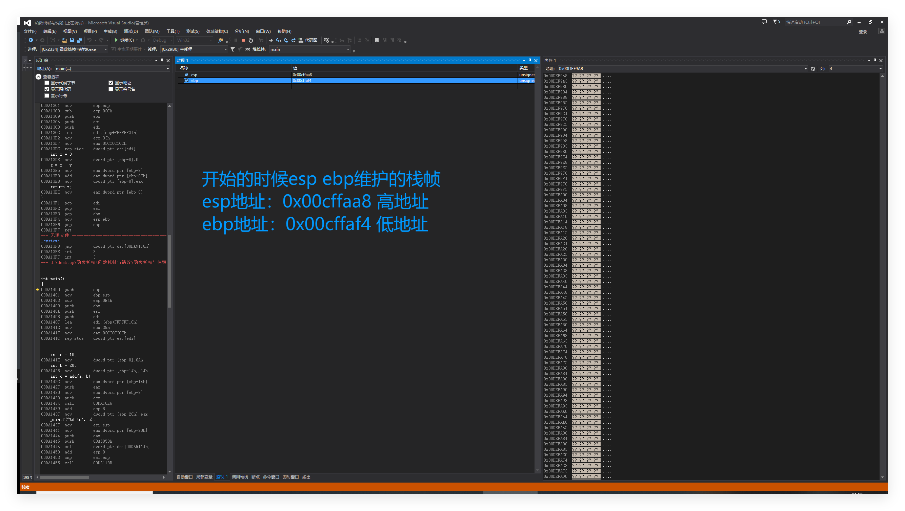
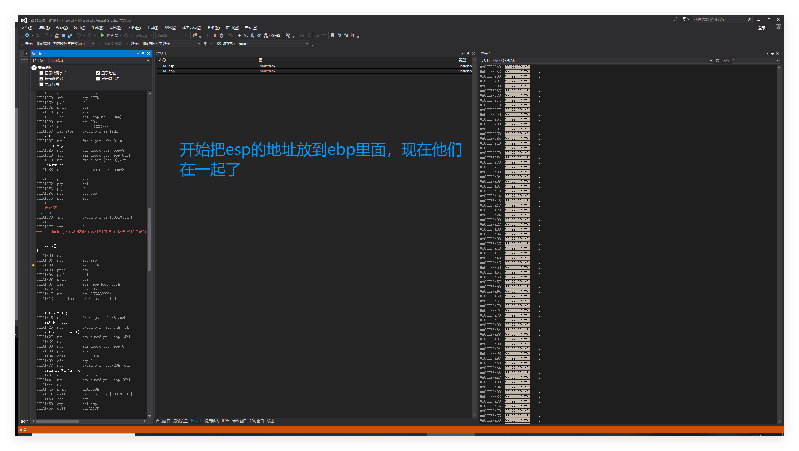
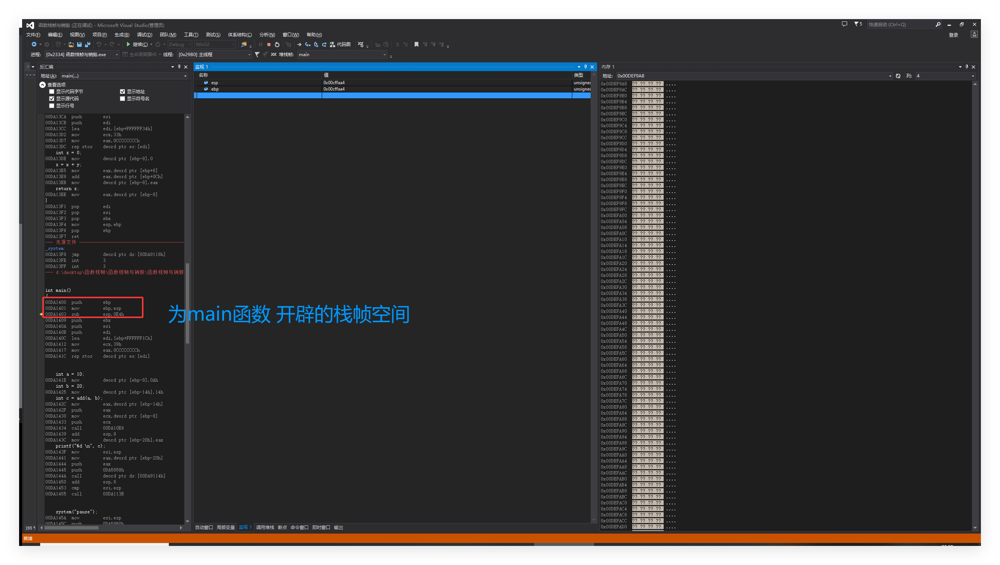
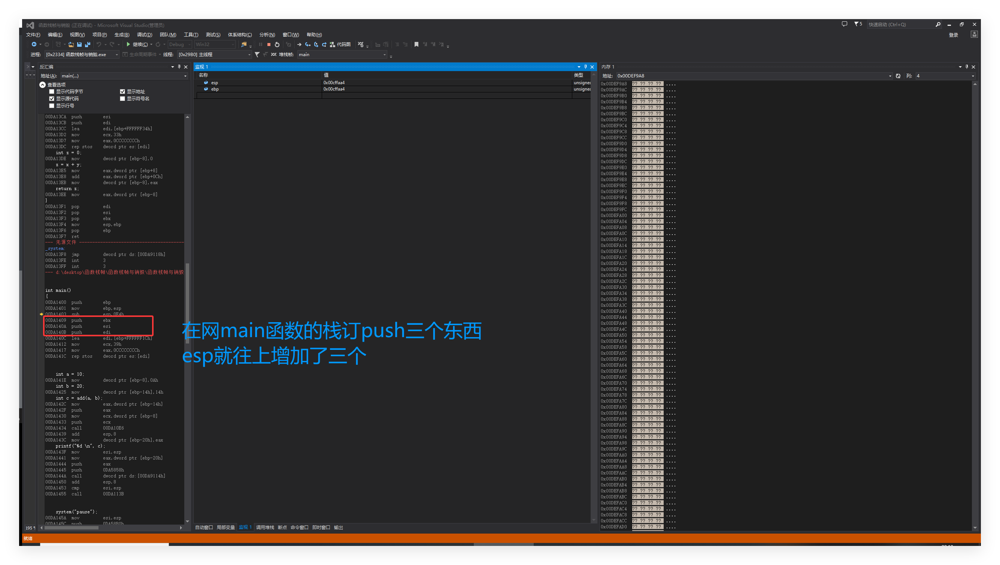
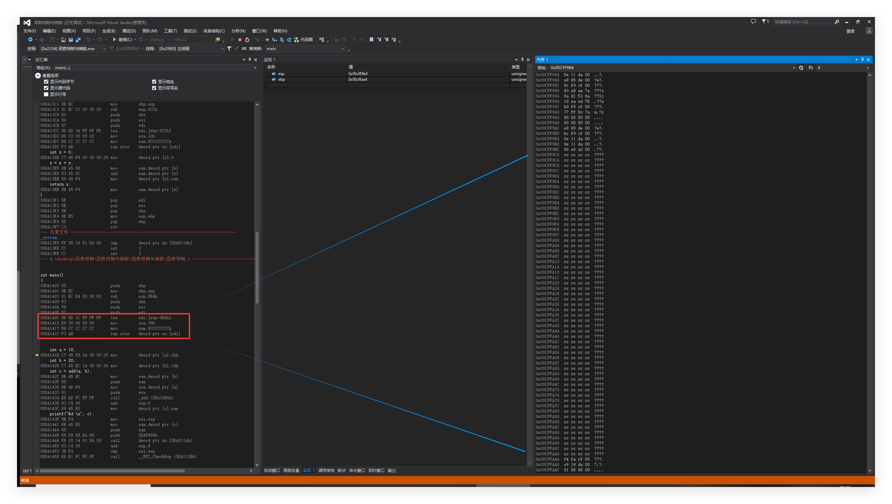
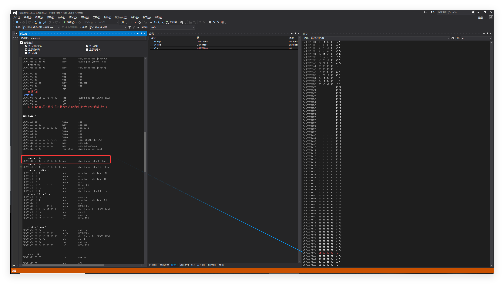
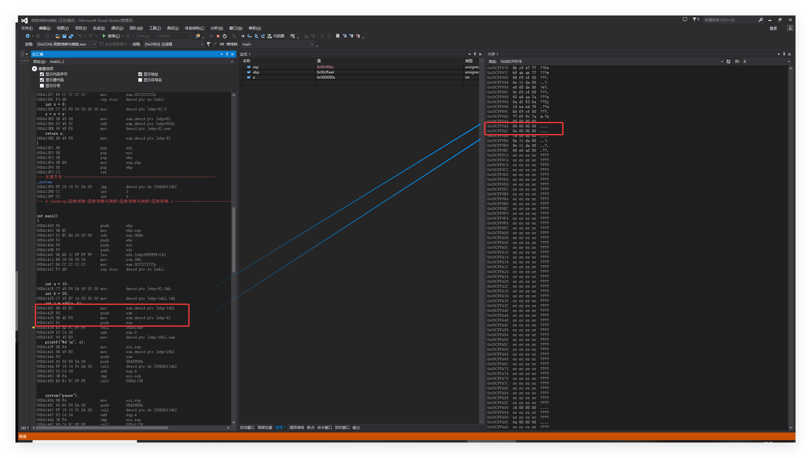

### 函数的栈帧

## 寄存器

**eax ebx ecx edx**

**ebp esp  这两个寄存器存放地址，用来维护函数的栈帧的**

**每一个函数调用，都在栈区创建一个空间**

**ebp栈底指针**

**esp栈顶指针**

**main函数也是被其它函数调用的**

**前面存在两个函数 调用的**

**mian函数的头上 eax ecx**

**call调用指令**

