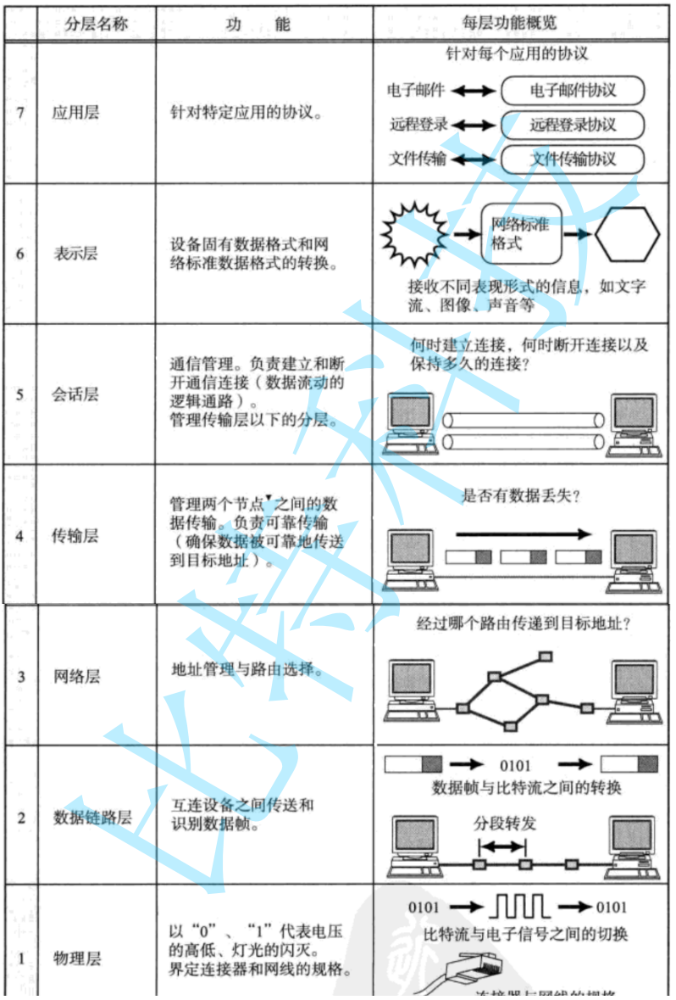
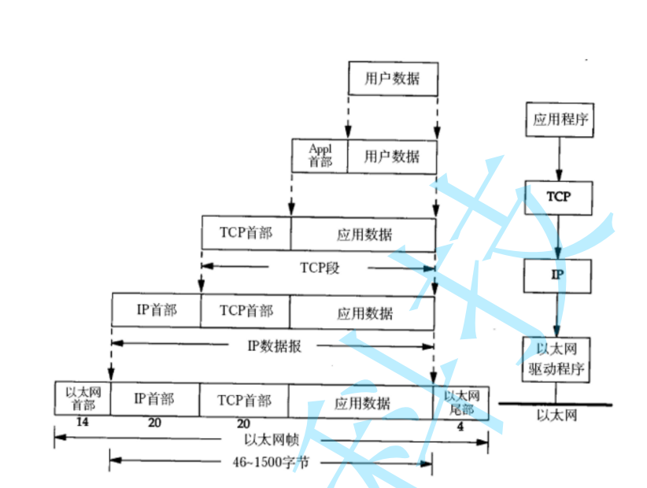
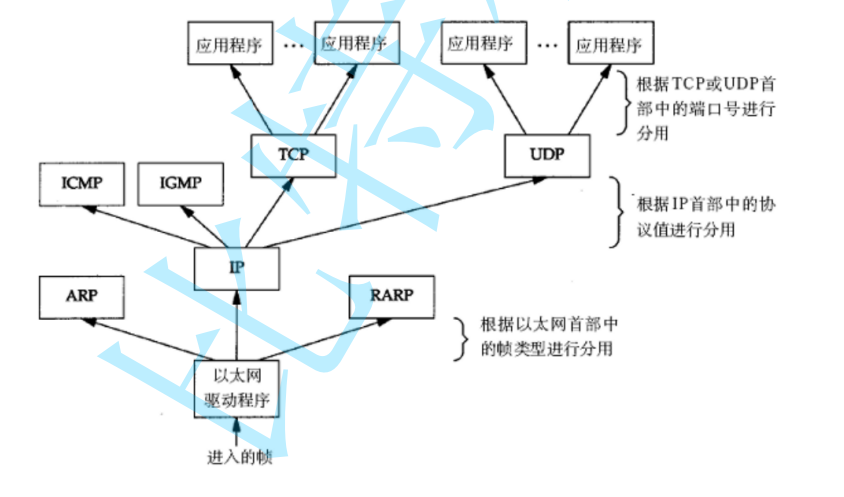

# 网络

## 1广域网和局域网

**局域网（LAN）**：一个**较小范围、通常由同一个组织或同一个路由设备管理**的网络

​	**公式搭建的局域网也可能分层的。**

**广域网（WAN）**：把**多个局域网或多个远距离网络连接起来**形成的更大范围网络

​	**跨路由器不一定是广域网；跨地区、跨站点、经过运营商网络，才更典型地属于广域网。**


**局域网**


**广域网**


**注意并不是有路由器就是广域网：一般来说，跨地区，跨站点，经过运营商转发。才是广域网。**

**其实广域网也是相对局域网来的。**


## 2网络协议

**协议的本质就是让通信更加简单，一看都知道是什么.**

​	**网络通信双方提前约定好的一套“说话规则”和“做事规范”**

**协议：封装。语言层，封装语言的方法。通信层封装通信的方法。**


**OSI七层**



**TCP/IP四层或者五层**


**1.应用层：你发的数据是什么，我该如何理解。**

**2.传输层：数据应该如何发送给另一台机器，数据出错了该怎么办。**

**3.网络层：提供目标，目标主机是那一台。**

**4.数据链路层：负责局域网的如何下一跳。**


**协议如何封装**



**应用层，传输层，网络层都是在首部的**

**数据链路层在头部和尾巴的**


**数据如何向上交付**



**IP地址：x.x.x.x。32位的**

**MAC地址：x.x.x.x.x.x。6位的**


## 3IP和端口号

**IP全网唯一，一个端口号只能绑定一个port.**

**IPA + PORTA**

**IPB + PORTB**

**网络通信的本质：进程间通信，看到同一份的资源。 （网络）**


**TCP:可靠传输，有连接，面向字节流**

**UDP:不可靠传输，无连接，面向数据报**


**网络字节序：大端。**

**htons.四个函数**


## 4UDP

**服务端**

```c++
class server
{
public:
  server(uint16_t port)
    :_port(port)
    ,_sock(-1)
  {}
  
  ~server()
  {
    if(_sock >= 0 )
    {
      close(_sock);
    }
  }

// 1.创建有个网络通信的文件描述符
  bool CreateSocket()
  {
    _sock = socket(AF_INET, SOCK_DGRAM, 0);
    if(_sock < 0)
    {
      
      cout<< "socket failed" <<endl;
      return false;
    }
  
    cout<< "socket success" <<endl;
    return true;
  }

// 2.网络文件描述符和服务器地址和端口绑定

  bool Bind()
  {
    struct sockaddr_in local;
    bzero(&local, sizeof(local));

    local.sin_family = AF_INET;
    local.sin_addr.s_addr = htonl(INADDR_ANY);
    local.sin_port = htons(_port);    
    
    if(bind(_sock, (struct sockaddr*)&local, sizeof(local)) < 0)
    {    
      cout<< "bind success" <<endl;    
      return false;                                                                                                                                                                                                                                            
    }    
    return true;    
  }    

    // 3.UDP服务器就可以通信了的。    
  bool Recv()    
  {    
    char buffer[1024] = {0};
    for(;;)
    {
      struct sockaddr_in client;
      bzero(&client, sizeof(client));
      socklen_t len = sizeof(client);
      
      char clientip[INET_ADDRSTRLEN];

      ssize_t s = recvfrom(_sock, buffer, sizeof(buffer) - 1, 0, (struct sockaddr*)&client, &len);
      if(s > 0)
      {
        buffer[s] = 0;
        
        if(inet_ntop(AF_INET, &client.sin_addr, clientip, INET_ADDRSTRLEN) == nullptr)
        {
          cout<< "inet_ntop failed" <<endl;
          return false;
        }
        
        cout<<"客户端[" << clientip << "]" << ":" << "["  << ntohs(client.sin_port) << "]" << "message:" << buffer <<endl;
          
        string message = "信息已经被接收到了\n";
        sendto(_sock, message.c_str(), message.size(), 0, (struct sockaddr*)&client, sizeof(client)); // 目标地址的信息
      }
    }
  }
private:
  uint16_t _port;
  int _sock;
};

```

**int_ntop**

```c++
 const char *inet_ntop(int af, const void *src,  char *dst, socklen_t size);
// int af : 使用的是那种通信协议
// src:从哪儿来的
// dst:放到哪儿去的
// size:多大
// INET_ADDRSTRLEN
```

**客户端**

```c++
class client    
{    
public:    
  client(const string& ip, uint16_t port)                                                                                                                                                                                                                      
    :_ip(ip)    
    ,_port(port)    
    ,_sock(-1)    
  {}    
    
  ~client()    
  {    
    if(_sock >= 0)    
    {    
      close(_sock);    
    }    
  }    
    
  bool CreateSocket()    
  {    
    _sock = socket(AF_INET, SOCK_DGRAM, 0);    
    if(_sock < 0)    
    {    
      cout<< "socket failed" <<endl;    
      return false;    
    }    
    
    return true;    
  }    
    
    
  bool Send()    
  {    
    char buffer[1024] = {0};    
    char inbuffer[1024] = {0};    
    struct sockaddr_in server;    
    
    server.sin_family = AF_INET;    
    if(inet_pton(AF_INET, _ip.c_str(), &server.sin_addr) < 0)    
    {    
      cout<< "网络字节序转换失败" <<endl;    
      return false;    
    }    
    server.sin_port = htons(_port);    
    
    for(;;)    
    {    
      cout<<"请输入:";    
      cin>>buffer;    
    
      sendto(_sock, buffer, sizeof(buffer) - 1, 0,(struct sockaddr*)&server, sizeof(server));    
    
      recvfrom(_sock, inbuffer, sizeof(inbuffer) - 1, 0, nullptr, 0);    
      cout<< inbuffer <<endl;    
    }    
  }

private:
  string _ip;
  uint16_t _port;
  int _sock;
};

```

```c++
int inet_pton(int af, const char *src, void *dst);
// af:AF_NET
// src:自己需要发送的
// dst:设置进去的
```

## TCP


