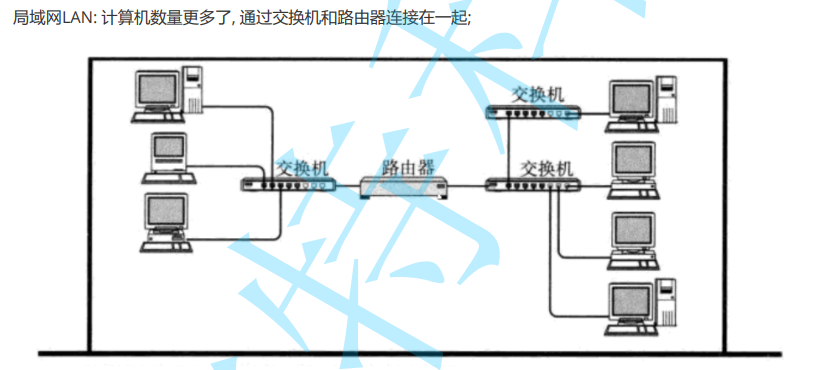
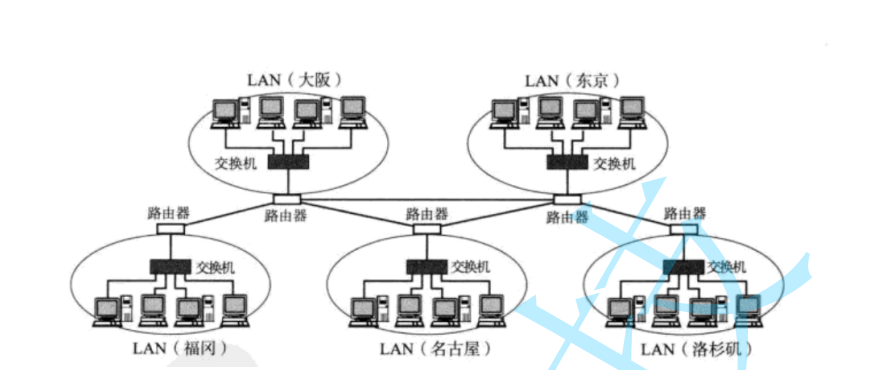
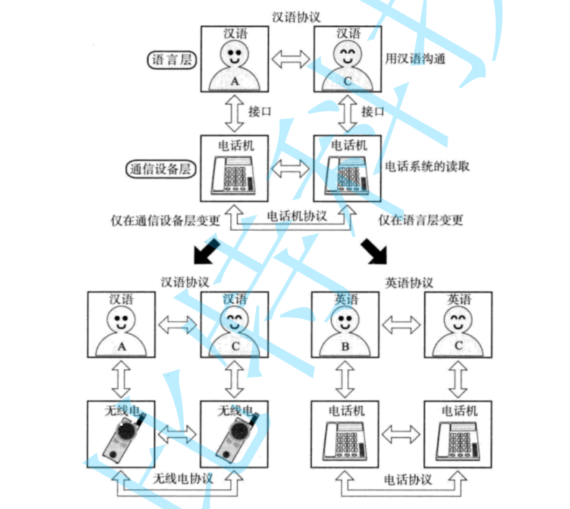
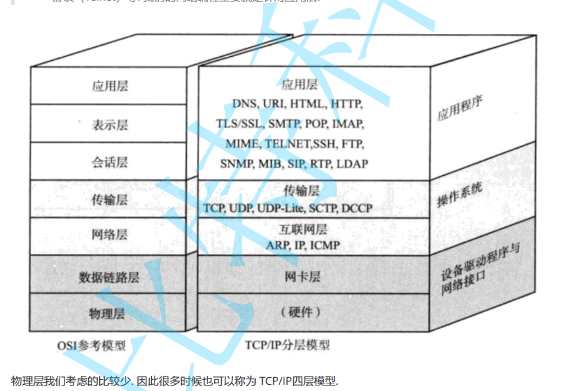
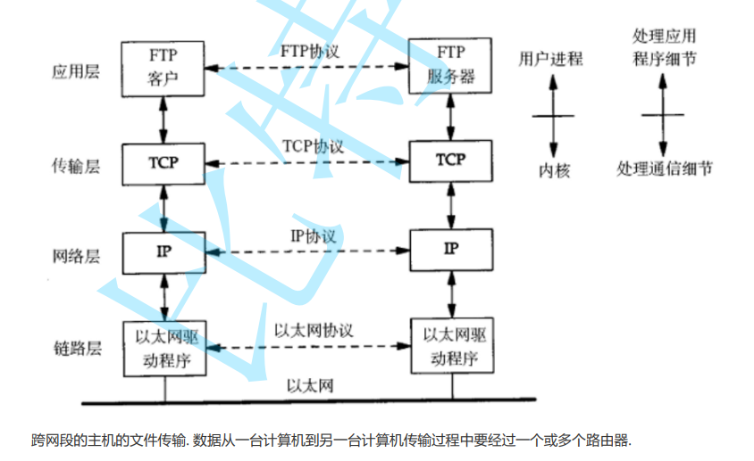
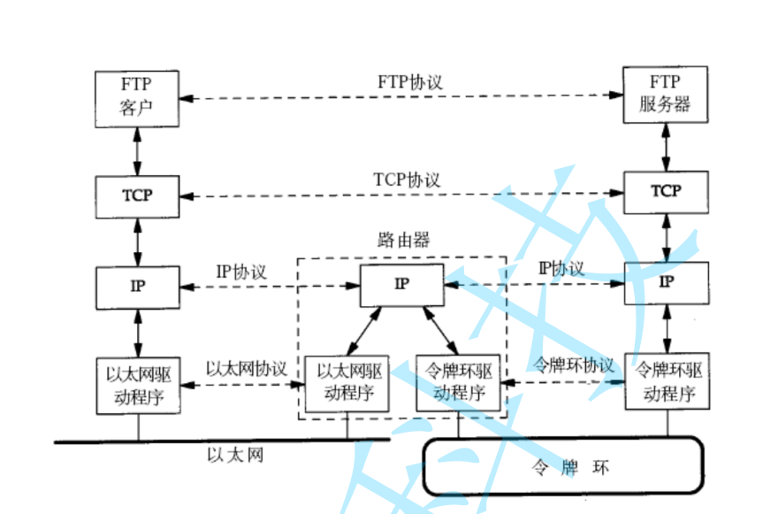
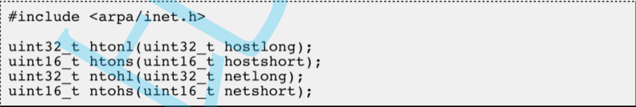
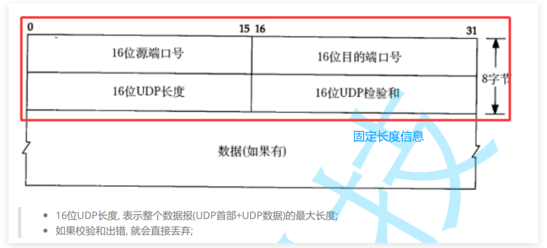
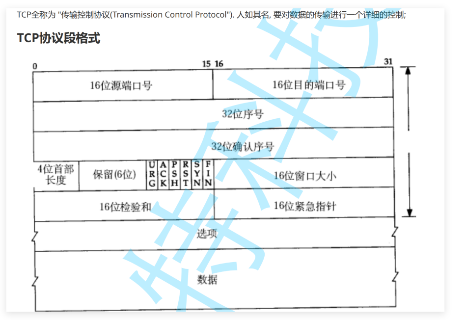
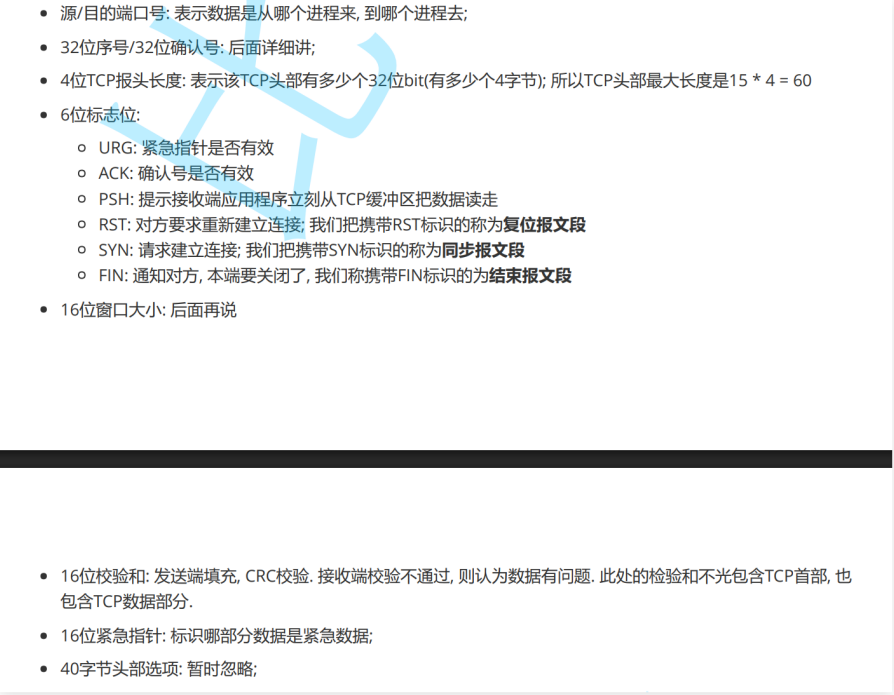

# 网络

## 1广域网和局域网

**局域网（LAN）**：一个**较小范围、通常由同一个组织或同一个路由设备管理**的网络

​	**公式搭建的局域网也可能分层的。**

**广域网（WAN）**：把**多个局域网或多个远距离网络连接起来**形成的更大范围网络

​	**跨路由器不一定是广域网；跨地区、跨站点、经过运营商网络，才更典型地属于广域网。**


**局域网**

**交换机：当某台主机发数据时，交换机根据目标 MAC 地址，把帧转发到正确的端口，而不是像集线器一样广播给所有端口。**

**交换机通过学习源 MAC 地址建立 MAC 表，再根据目标 MAC 地址决定把以太网帧从哪个端口转发出去，从而实现局域网内高效的二层通信。**



**广域网**



**注意并不是有路由器就是广域网：一般来说，跨地区，跨站点，经过运营商转发。才是广域网。**

**其实广域网也是相对局域网来的。**


## 2网络协议

**协议的本质就是让通信更加简单，一看都知道是什么.**

​	**网络通信双方提前约定好的一套“说话规则”和“做事规范”**

**协议：封装。语言层，封装语言的方法。通信层封装通信的方法。**



**OSI七层**


**TCP/IP四层或者五层**



**1.应用层：你发的数据是什么，我该如何理解。**

**2.传输层：数据应该如何发送给另一台机器，数据出错了该怎么办。**

**3.网络层：提供目标，目标主机是那一台。**

**4.数据链路层：负责局域网的如何下一跳。**





**路由器：屏蔽了网络层的差异信息的。**


**协议如何封装**


**应用层，传输层，网络层都是在首部的**

**数据链路层在头部和尾巴的**


**数据如何向上交付**


**IP地址：x.x.x.x。32位的**

**MAC地址：x.x.x.x.x.x。6位的**

****


## 3IP和端口号

**IP全网唯一，一个端口号只能绑定一个port.**

**IPA + PORTA**

**IPB + PORTB**

**网络通信的本质：进程间通信，看到同一份的资源。 （网络）**


**TCP:可靠传输，有连接，面向字节流**

**UDP:不可靠传输，无连接，面向数据报**


**网络字节序：大端。高权重的数据存储到地位置的。**

**htons.四个函数**




## 4UDP

**服务端**

```c++
class server
{
public:
  server(uint16_t port)
    :_port(port)
    ,_sock(-1)
  {}
  
  ~server()
  {
    if(_sock >= 0 )
    {
      close(_sock);
    }
  }

// 1.创建有个网络通信的文件描述符
  bool CreateSocket()
  {
    _sock = socket(AF_INET, SOCK_DGRAM, 0);
    if(_sock < 0)
    {
      
      cout<< "socket failed" <<endl;
      return false;
    }
  
    cout<< "socket success" <<endl;
    return true;
  }

// 2.网络文件描述符和服务器地址和端口绑定

  bool Bind()
  {
    struct sockaddr_in local;
    bzero(&local, sizeof(local));

    local.sin_family = AF_INET;
    local.sin_addr.s_addr = htonl(INADDR_ANY);
    local.sin_port = htons(_port);    
    
    if(bind(_sock, (struct sockaddr*)&local, sizeof(local)) < 0)
    {    
      cout<< "bind success" <<endl;    
      return false;                                                                                                                                                                                                                                            
    }    
    return true;    
  }    

    // 3.UDP服务器就可以通信了的。    
  bool Recv()    
  {    
    char buffer[1024] = {0};
    for(;;)
    {
      struct sockaddr_in client;
      bzero(&client, sizeof(client));
      socklen_t len = sizeof(client);
      
      char clientip[INET_ADDRSTRLEN];

      ssize_t s = recvfrom(_sock, buffer, sizeof(buffer) - 1, 0, (struct sockaddr*)&client, &len);
      if(s > 0)
      {
        buffer[s] = 0;
        
        if(inet_ntop(AF_INET, &client.sin_addr, clientip, INET_ADDRSTRLEN) == nullptr)
        {
          cout<< "inet_ntop failed" <<endl;
          return false;
        }
        
        cout<<"客户端[" << clientip << "]" << ":" << "["  << ntohs(client.sin_port) << "]" << "message:" << buffer <<endl;
          
        string message = "信息已经被接收到了\n";
        sendto(_sock, message.c_str(), message.size(), 0, (struct sockaddr*)&client, sizeof(client)); // 目标地址的信息
      }
    }
  }
private:
  uint16_t _port;
  int _sock;
};

```

**int_ntop**

```c++
 const char *inet_ntop(int af, const void *src,  char *dst, socklen_t size);
// int af : 使用的是那种通信协议
// src:从哪儿来的
// dst:放到哪儿去的
// size:多大
// INET_ADDRSTRLEN
```

**客户端**

```c++
class client    
{    
public:    
  client(const string& ip, uint16_t port)                                                                                                                                                                                                                      
    :_ip(ip)    
    ,_port(port)    
    ,_sock(-1)    
  {}    
    
  ~client()    
  {    
    if(_sock >= 0)    
    {    
      close(_sock);    
    }    
  }    
    
  bool CreateSocket()    
  {    
    _sock = socket(AF_INET, SOCK_DGRAM, 0);    
    if(_sock < 0)    
    {    
      cout<< "socket failed" <<endl;    
      return false;    
    }    
    
    return true;    
  }    
    
    
  bool Send()    
  {    
    char buffer[1024] = {0};    
    char inbuffer[1024] = {0};    
    struct sockaddr_in server;    
    
    server.sin_family = AF_INET;    
    if(inet_pton(AF_INET, _ip.c_str(), &server.sin_addr) < 0)    
    {    
      cout<< "网络字节序转换失败" <<endl;    
      return false;    
    }    
    server.sin_port = htons(_port);    
    
    for(;;)    
    {    
      cout<<"请输入:";    
      cin>>buffer;    
    
      sendto(_sock, buffer, sizeof(buffer) - 1, 0, (struct sockaddr*)&server, sizeof(server));    
    
      recvfrom(_sock, inbuffer, sizeof(inbuffer) - 1, 0, nullptr, 0);    
      cout<< inbuffer <<endl;    
    }    
  }

private:
  string _ip;
  uint16_t _port;
  int _sock;
};

```

```c++
int inet_pton(int af, const char *src, void *dst);
// af:AF_NET
// src:自己需要发送的
// dst:设置进去的
```


### API

```c++
int socket(int domain, int type, int protocol);
int bind(int sockfd, const struct sockaddr *addr, socklen_t addrlen);
ssize_t sendto(int sockfd, 
               const void *buf, 
               size_t len, 
               int flags,
               const struct sockaddr *dest_addr, 
               socklen_t addrlen);
ssize_t recvfrom(int sockfd, 
                 void *buf, 
                 size_t len, 
                 int flags,
                 struct sockaddr *src_addr, 
                 socklen_t *addrlen);
int close(int fd);

uint16_t htons(uint16_t hostshort);
uint32_t htonl(uint32_t hostlong);
uint16_t ntohs(uint16_t netshort);
uint32_t ntohl(uint32_t netlong);

int inet_pton(int af, const char *src, void *dst);
const char *inet_ntop(int af, const void *src, char *dst, socklen_t size);

struct sockaddr_in 
{
    sa_family_t    sin_family;
    in_port_t      sin_port;
    struct in_addr sin_addr;
};

int connect(int sockfd, const struct sockaddr *addr, socklen_t addrlen);
int setsockopt(int sockfd, int level, int optname,
               const void *optval, socklen_t optlen);

```


## TCP

**服务端**

```c++
#pragma once
#include <iostream>
#include <string>
#include <cstring>
#include <cerrno>
#include <unistd.h>
#include <arpa/inet.h>
#include <sys/socket.h>
#include <netinet/in.h>
using namespace std;

class server
{
public:
  server(uint16_t port)
    :_port(port)
    ,_sock(-1)
  {}
  
  ~server()
  {
    if(_sock >= 0 )
    {
      close(_sock);
    }
  }

// 1.创建有个网络通信的文件描述符
  bool CreateSocket()
  {
    _sock = socket(AF_INET, SOCK_STREAM, 0);
    if(_sock < 0)
    {
      
      cout<< "socket failed" <<endl;
      return false;
    }
  
    cout<< "socket success" <<endl;
    return true;
  }

// 2.网络文件描述符和服务器地址和端口绑定
  bool Bind()
  {
    struct sockaddr_in local;
    bzero(&local, sizeof(local));

    local.sin_family = AF_INET;
    local.sin_addr.s_addr = htonl(INADDR_ANY);
    local.sin_port = htons(_port);
    
    if(bind(_sock, (struct sockaddr*)&local, sizeof(local)) < 0)
    {
      cout<< "bind success" <<endl;
      return false;
    }
    
    cout<< "bind success" <<endl;
    return true;
  }

// 3.创建一个开始监听了
  
  bool Listen()
  {
    if(listen(_sock, 5) < 0)
    {
      cout<< "listen failed" <<endl;
      return false;
    }

    cout<< "listen success" <<endl;
    return true;
  }


// 3.TCP服务器就可以通信了的。
bool Recv()
{
    char buffer[1024] = {0};
    for(;;)
    {
        struct sockaddr_in client;
        bzero(&client, sizeof(client));
        socklen_t len = sizeof(client);
        char clientip[INET_ADDRSTRLEN];

        // 1. 接受新连接
        int sock = accept(_sock, (struct sockaddr*)&client, &len);
        if (sock < 0)
        {
            perror("accept failed");
            // 这里可以根据 errno 决定是否继续，简单起见继续循环
            continue;
        }

        // 2. 将客户端 IP 转换为字符串
        if (inet_ntop(AF_INET, &client.sin_addr, clientip, INET_ADDRSTRLEN) == nullptr)
        {
            cerr << "inet_ntop failed" << endl;
            close(sock);      // 转换失败也要关闭 socket
            continue;
        }

        cout << "接受连接 from " << clientip << ":" << ntohs(client.sin_port) << endl;

        // 3. 接收客户端数据（处理完整接收，直到对方关闭或出错）
        ssize_t n = recv(sock, buffer, sizeof(buffer) - 1, 0);
        if (n > 0)
        {
            buffer[n] = '\0';
            cout << "接收到消息: " << buffer << endl;
        }
        else if (n == 0)
        {
            cout << "客户端 " << clientip << " 已关闭连接" << endl;
        }
        else // n < 0
        {
            perror("recv failed");
        }

        // 4. 关闭与客户端的连接，释放资源
        close(sock);
    }
}


private:
  uint16_t _port;
  int _sock;
};


#include "server.hpp"


int main()
{

  server ser(8080);
  ser.CreateSocket();
  ser.Bind();
  ser.Recv();


  return 0;
}
```


**客户端**

```c++
#pragma once
#include <iostream>
#include <string>
#include <cstring>
#include <cerrno>
#include <unistd.h>
#include <arpa/inet.h>
#include <sys/socket.h>
#include <netinet/in.h>
using namespace std;

class client
{
public:
  client(const string& ip, uint16_t port)
    :_ip(ip)
    ,_port(port)
    ,_sock(-1)
  {}
  
  ~client()
  {
    if(_sock >= 0)
    {
      close(_sock);
    }
  }

  bool CreateSocket()
  {
    _sock = socket(AF_INET, SOCK_STREAM, 0);
    if(_sock < 0)
    {
      cout<< "socket failed" <<endl;
      return false;
    }
    
    return true;
  }


  bool Connect()
  {
    struct sockaddr_in peer;
    peer.sin_family = AF_INET;
    if(inet_pton(AF_INET, _ip.c_str(), &peer.sin_addr.s_addr) < 0)
    {
      cout<< "inet_pton failde" << endl;
      return false;
    }
    peer.sin_port = htons(_port);
    
    if(connect(_sock, (struct sockaddr*)&peer, sizeof(peer)) < 0)
    {

      perror("connect failed");
      return false;
    }
    
    char buffer[1024] = {0};

    while(1)
    {
      cout<<"请输入";
      cin>>buffer;

      send(_sock, buffer, sizeof(buffer), 0);
    }
    
  }


private:
  string _ip;
  uint16_t _port;
  int _sock;
};

#include "client.hpp"


int main(int argc, char* argv[])
{
  (void)argc;
  string ip = argv[1];
  uint16_t port = atoi(argv[2]);

  client cli(ip, port);
  cli.CreateSocket();
  cli.Connect();


  return 0;
}
```

###  API

```c++
int socket(int domain, int type, int protocol);
int bind(int sockfd, const struct sockaddr *addr, socklen_t addrlen);
int listen(int sockfd, int backlog); // 把主动 socket 变成监听 socket，用来等待客户端连接。
int accept(int sockfd, struct sockaddr *addr, socklen_t *addrlen); // 从监听 socket 对应的已完成连接队列里取出一个连接。
int connect(int sockfd, const struct sockaddr *addr, socklen_t addrlen); // 从监听 socket 对应的已完成连接队列里取出一个连接。
ssize_t send(int sockfd, const void *buf, size_t len, int flags);
ssize_t recv(int sockfd, void *buf, size_t len, int flags);
int close(int fd);

int setsockopt(int sockfd, int level, int optname,
               const void *optval, socklen_t optlen);

int flag = fcntl(fd, F_GETFL);
fcntl(fd, F_SETFL, flag | O_NONBLOCK);
```


****


## HTTP

**HTTP的响应行 **

```
HTTP/1.1 200 OK\r\n
HTTP/1.1 404 Not Found
HTTP/1.1 403 Forbidden
HTTP/1.1 500 Internal Server Error
HTTP/1.1 301 Moved Permanently   Location: /new_path
HTTP/1.1 302 Found

HTTP/1.1 400 Bad Request
```

```
200 OK
404 Not Found
400 Bad Request
405 Method Not Allowed
500 Internal Server Error
```

**响应头**

```
Content-Type: text/html; charset=utf-8
Content-Type: text/plain; charset=utf-8
Content-Type: image/png
Content-Type: application/json

Content-Length: 43
Connection: close
在 HTTP 协议中，Connection: close 是一个请求头或响应头，用来明确告知对方：本次通信结束后，立即关闭 TCP 连接，不要复用这条连接。
```


## HTTPS


## UDP



**UDP:数据报文。发一个，收一个。**

## TCP






## IP

## NAT

## 以太网协议

## select

## poll

## epoll


