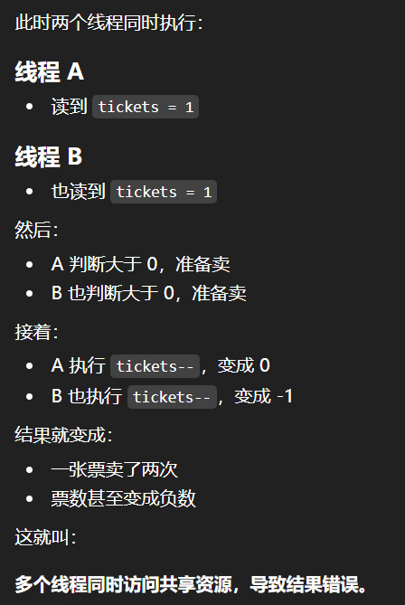

# 线程code

## 1.创建线程

```c++
#include <pthread.h>
#include <iostream>
#include <cstring>
using namespace std;

// 总结
// 1.创建线程的本质就是：进程内的一个新执行流，执行的代码，
//   这个代码是函数，函数建立新的栈帧在共享区域。tid就是共享区的地址。
// 2.pthread_create的执行的函数 (void*)(*start_routine)(void*);
// 3.pthread_join(tid, void**), 因为返回值是void*, 所以需要二级指针进行回收。
// 两个函数都是成功返回0，失败返回error
void* start_routine(void* arg)
{
  string* info = (string*)arg;
  cout<< "传入参数：" << *info <<endl;

  info->insert(info->begin(), ' ');
  info->insert(info->begin(), ' ');
  info->insert(info->begin(), 'c');
  info->insert(info->begin(), 'i');
  info->insert(info->begin(), 'L');

  return info;
}

int main()
{
  string lic = "lichermionex";
  pthread_t tid;
  int n = pthread_create(&tid, nullptr, start_routine, &lic);
  if(n != 0)
  {
    cerr<< "pthread_create erron : " << strerror(n) <<endl;
    return 1;
  }
  
  void* ret = nullptr;
  n = pthread_join(tid, &ret);
  if(n != 0)
  {
    cerr<< "pthread_join errno : " << strerror(n) <<endl;
    return 1;
  }

  string* retNew = (string*)ret;
  cout<< "传出参数：" << *retNew <<endl;
  return 0;
}
```

**位置：lesson31**

## 2封装线程的属性

```c++
#include <pthread.h>
#include <cstring>
#include <vector>
#include <iostream>
#include <unistd.h>
using namespace std;

// 总结
// 1.线程执行的函数，需要的参数可以放在对象里面进行，传参的。
// 2.vector里面有指针记得释放，然后clear,的
class threadData 
{
public:
  int id;
  pthread_t tid;
  char buffer[64];
};

void* start_routine(void* arg)
{
  sleep(1);
  threadData* td = static_cast<threadData*>(arg);
  cout<< td->buffer << endl;

  return td;
}

int main()
{
  vector<threadData*> v; 
  for(int i =  0; i  < 5; ++i)
  {
    threadData* td = new threadData();
    td->id = i + 1;
    snprintf(td->buffer, sizeof(td->buffer), "thread %d",  i + 1);

    int n = pthread_create(&td->tid, nullptr, start_routine, td);
    if(n != 0)
    {
      cerr << "pthread_create error  : " << strerror(n) << endl;
      return 1;
    }

    v.push_back(td);
  }

  for(int i = 0; i < 5; ++i)
  {
    void* ret = nullptr;
    int n = pthread_join(v[i]->tid, &ret);
    if(n != 0)
    {
      cerr << "pthread_join error  : " << strerror(n) << endl;
      return 1;
    }

    threadData* td = static_cast<threadData*>(ret);
    cout<< "线程" << td->id << "被回收了" << endl;
  }

  for(auto& e : v)
  {
    delete e;
  }

  v.clear();
  return 0;
}
```

**位置：lesson32**


## 3.线程返回资源

```c++
#include <pthread.h>
#include <cstring>
#include <vector>
#include <stdlib.h>
#include <unistd.h>
#include <iostream>
using namespace std;

// 总结 
// 1.线程回收比拿到tid，注意vector的数据放进去
// 2.注意new出来的资源和delete搭配
// 3.线程申请的资源在堆上，不能直接在线程里面 定义临时变量拿出来的

class threadData
{
public:
  int id;
  pthread_t tid;
  char namebuffer[64];
};

class threadReturn
{
public:
  int exit_code;
  int exit_result;
};

void* start_routine(void* arg)
{
  sleep(1);
  threadData* td = static_cast<threadData*>(arg);
  cout<< "I  am " <<  td->namebuffer <<endl;
  
  threadReturn* tr = new threadReturn();
  tr->exit_code = 0;
  tr->exit_result = 10;

  return (void*)tr;
}

int main()
{
  vector<threadData*> threads;
  for(int i = 0; i < 10; ++i)
  {
    threadData* td  = new threadData();
    td->id = i + 1;
    snprintf(td->namebuffer, sizeof td->namebuffer, "thread%d", i + 1);

    int n = pthread_create(&td->tid, nullptr, start_routine, td);
    if(n != 0)
    {
      cerr<< "pthread_create error : " << strerror(n) << endl;
      return 1;
    }

    threads.push_back(td);
  }

  for(auto& iter : threads)
  {
    void*  ret  = nullptr;
    int n = pthread_join(iter->tid, &ret);
    if(n != 0)
    {
      cerr<< "pthread_join error : " << strerror(n) << endl;
      return 1;
    }

    threadReturn* retNew = static_cast<threadReturn*>(ret);
    cout<< iter->namebuffer 
            << "  success  " 
            << "exit_code:"
            << retNew->exit_code 
            << "exit_result:" 
            << retNew->exit_result 
            <<endl;
      
    delete retNew;
  }

  for(auto& iter : threads)
  {
    delete iter;
  }
  
  threads.clear();

  return 0;
}
```


## 4见过c++版本线程

**c++是对linux的线程进行封装了的， 封装成一个线程对象的。**

```c++
#include <iostream>
#include <unistd.h>
#include <thread>
using namespace std;

void run()
{
  sleep(1);
  cout<< "这是一个子线程" <<endl;
}

int main()
{ 
  thread t(run);
  cout<< "这是一个主线程" <<endl;

  t.join();

  return 0;
}
```


## 5线程退出

```c++
#include <pthread.h>
#include <cstring>
#include <cstdlib>
#include <vector>
#include <unistd.h>
#include <string>
#include <iostream>
using namespace std;

// 总结线程 pthread_exit也需要带出来参数信息的 
// pthread_exit(void*)
void* start_routine(void* arg)
{
  const char* lic = static_cast<const char*>(arg);
  cout<< "线程参数:" << lic <<endl;
  
  pthread_exit((void*)lic);
}

int main()
{

  const char* lic = "hello licherminonex";
  pthread_t tid;

  int n = pthread_create(&tid, nullptr, start_routine, (void*)lic);
  if(n != 0)
  {
    cerr<< "pthread_create  error: " << strerror(n) <<endl;
    return 1;
  }

  void* ret = nullptr;
  n = pthread_join(tid, &ret);
  const char* retNew = static_cast<const char*>(ret);
  cout<< "返回参数:" << retNew <<endl;

  return 0;
}
```


## 6线程退出

```c++
#include <pthread.h>
#include <unistd.h>
#include <string>
#include <iostream>
using namespace std;

void* start_routine(void* args)
{
  // 一个线程出现异常，会影响其它线程的
  // 进程信号，信号是发给整体发给进程的！
    string name = static_cast<const char*>(args);
    while(true)
    {
      cout<< "new thread  create success : " << name <<endl;
      sleep(1);

      int* p = nullptr;
      p = nullptr;
      *p = 0;
    }
}

int main()
{

  pthread_t id;
  pthread_create(&id, nullptr, start_routine, (void*) "pthread_one");

  while(true)
  {
      cout<< "main thread" <<endl;
      sleep(1);
  }

  return 0;
}
```

**lesson 32**

## **7.线程取消**

```c++
#include <iostream>
#include <vector>
#include <pthread.h>
#include <unistd.h>
#include <cstdio>
#include <cstring>

using namespace std;
class threadData
{
public:
  int id;
  pthread_t tid;
  char namebuffer[64];
};

void* start_routine(void* arg)
{
  sleep(10);
  threadData* td = static_cast<threadData*>(arg);
  cout<< td->namebuffer << ":" << td->id <<endl;

  return td;
}

int main()
{

  vector<threadData*> v;
// 1.创建10个线程，线程信息放到v里面去的。
  for(int i = 0; i < 10; ++i)
  {
    threadData* td = new threadData();
    td->id = i + 1;
    snprintf(td->namebuffer, sizeof(td->namebuffer), "thread%d", i + 1);

    int n = pthread_create(&td->tid, nullptr, start_routine, td);
    if(n != 0)
    {
      cerr<< "pthread_create error " << strerror(n) <<endl;
      return 1;
    }

    v.push_back(td);
  }

// 2.取消5个线程的
  sleep(3);
  for(int i = 0; i < 5; ++i)
  {
    int n = pthread_cancel(v[i]->tid); 
    if(n != 0)
    {
      cerr<< "pthread_cancel errno : " << strerror(n) << endl;
      return 1;
    }
    
    cout<< "线程被取消了" << i + 1<< endl;
  }

// 3.回收线程
  for(auto& e : v)
  {
    void* ret = nullptr;
    int n  = pthread_join(e->tid, &ret);
    if(n != 0)
    {
      cerr << "pthread_join errno:" << strerror(n) << endl;
      continue;
    }

    if(ret == PTHREAD_CANCELED)
    {
      cout<< e->namebuffer << "被取消" <<endl;
    }
    else 
    {
      threadData* td = static_cast<threadData*>(ret);
      cout<< td->namebuffer << "正常结束id = " << td->id <<endl; 
    }
  }

  return 0;
}
```

**线程可以进行退出的，线程退出的返回值是一个宏 PTHREAD_CANELED.**

**创建线程，取消 线程，等待线程都是返回值 成功0 失败返回 错误码的。**


##  8线程分离

```c++
#include <iostream>
#include <cstring>
#include <string>
#include <pthread.h>
#include <cstdio>
#include <unistd.h>
using namespace std;

string changeId(const pthread_t& pthread_id)
{
  char tid[128];
  snprintf(tid, sizeof(tid), "0x%zx", pthread_id);

  return tid;
}

void* start_routine(void* arg)
{
  string threadName = static_cast<const char*>(arg);
  int cnt = 5;
  while(cnt)
  {
    char tid[128];
    snprintf(tid, sizeof tid, "0x%zx", pthread_self());
    cout<< threadName << "running.." << changeId(pthread_self());
    cout<< cnt <<endl;
    --cnt;
  }

  return nullptr;
}


int main()
{
   pthread_t tid;
   pthread_create(&tid, nullptr, start_routine, (void*)"thread 1");
   string main_id = changeId(pthread_self());
   pthread_detach(tid);
 
   cout<< " main thread run ...." << "new thread id : "  << changeId(tid) << " main_id : " << main_id <<endl;
 
   while(true)
  {
     //todo main
  }

  return 0;
}

```

**有时候我们不需要等待线程的返回结果，就可以进行线程的分离，分离的方法，在主线程里面进行分离，因为子线程 进行执行需要建立栈帧的。**

**分离了就不需要进行等待了，否则程序可能阻塞主了的。**


## 9线程互斥

**共享资源：全局变量，静态变量，堆区的对象，同一个socket， 同一个容器，同一块内存区。**

**一条语句在汇编层面不是原子的，可能造成数据的歧义**

**ticket == 1**



**一般的逻辑信息**

**整段“读 + 判断 + 修改”的逻辑。**

**lesson 33**

```c++
#include <iostream>
#include <memory>
#include <memory>
#include "thread.hpp"
#include <cstring>
#include <string>
#include <pthread.h>
#include <cstdio>
#include <unistd.h>
using namespace std;

// 间接猪跑
// pthread_mutex_t lock = PTHREAD_MUTEX_INITIALIZER; // 定义锁
// 需要多个线程交叉执行，
// 交叉执行的本质，调度器尽可能频繁发生线程调度与切换
// 线程切换：时间片到了，来了优先级跟高的线程。线程等待的时候。
// 线程是在什么时候检查上面的问题呢？内核态--》用户态。线程对调度状态进行检查，如果可以，就直接发生线程切换。

pthread_mutex_t mutex = PTHREAD_MUTEX_INITIALIZER; // 初始化全局的锁
int tickets = 100000;

void* getTickets(void* args)
{
  std::string user_name =  static_cast<const char*>(args);
#if 0 
  while(true)
  {
    if(tickets >  0)
    {
      std::cout << user_name << tickets << std::endl;
      tickets--;
    }
    else 
    {
      break;
    }
  }
  return nullptr;
#else 
    
  while(true)
  {
    pthread_mutex_lock(&mutex);
    if(tickets > 0)
    {
      std::cout << user_name << ":" << tickets << std::endl;
      tickets--;
      pthread_mutex_unlock(&mutex);
    }
    else 
    {
      pthread_mutex_unlock(&mutex);
      break;
    }
  }
  return nullptr;
#endif 
}

int main()
{
  std::unique_ptr<Thread>  thread1(new Thread(getTickets, (void*)"lic 1", 1));
  std::unique_ptr<Thread>  thread2(new Thread(getTickets, (void*)"lic 2", 2));
  std::unique_ptr<Thread>  thread3(new Thread(getTickets, (void*)"lic 3", 3));
  std::unique_ptr<Thread>  thread4(new Thread(getTickets, (void*)"lic 4", 4));

  thread1->start();
  thread2->start();
  thread3->start();
  thread4->start();

  thread1->join();
  thread2->join();
  thread3->join();
  thread4->join();

  return 0;
}

```

```c++
#pragma once 
#include <string>
#include <iostream>
#include <pthread.h>
#include <functional>
#include <cassert>
#include <cstring>

class Thread;

class context
{
public:
  Thread* _this; // 线程对象
  void* _arg;   // 线程执行函数的参数信息
public:
  context()
    :_this(nullptr)
    ,_arg(nullptr)
  {}
};

class Thread
{
private:
  using func_t = std::function<void*(void*)>; // 类型别名的
  const int num = 1024;   // 线程名称信息的

private:
  std::string _name;
  func_t _func;
  void* _arg;
  pthread_t _tid;
  context* _ctx;
public:
  Thread(func_t func, void* arg = nullptr, int number = 0)
    :_func(func)
    ,_arg(arg)
  {
    char buffer[num];
    snprintf(buffer, sizeof(buffer), "Thread%d\n", number);
    _name = buffer;

    _ctx = new context();
    _ctx->_this = this;
    _ctx->_arg = _arg;
  } 

  ~Thread()
  {
  }

public:
  void start()
  {
    int n = pthread_create(&_tid, nullptr, start_routine, _ctx);
    if(n != 0)
    {
      std::cerr << "pthread_create error : " << strerror(n) << std::endl;
      return;
    }
  }

  void join()
  {
    int n = pthread_join(_tid,  nullptr);
    if(n != 0)
    {
      std::cerr << "pthread_join error : " << strerror(n) << std::endl;
      return;
    }
  }

private:
  static void* start_routine(void* arg)
  {
    context* ctx = static_cast<context*>(arg);
    void* ret = ctx->_this->run(ctx->_arg);
    delete ctx;
    return ret;
  }

  void* run(void* arg)
  {
    return _func(arg);
  }
};

```


## 10互斥

**lesson 34**

```c++
#include <iostream>
#include "mutex.hpp"
#include <vector>
#include <memory>
#include "thread.hpp"
#include <cstring>
#include <string>
#include <pthread.h>
#include <cstdio>
#include <unistd.h>
using namespace std;

// 间接猪跑
// pthread_mutex_t lock = PTHREAD_MUTEX_INITIALIZER; // 定义锁 全局锁
// 需要多个线程交叉执行，
// 交叉执行的本质，调度器尽可能频繁发生线程调度与切换
// 线程切换：时间片到了，来了优先级跟高的线程。线程等待的时候。
// 线程是在什么时候检查上面的问题呢？内核态--》用户态。线程对调度状态进行检查，如果可以，就直接发生线程切换。

// 全局锁，只需要加锁和解释，不需要初始化和销毁

class threadData
{
public:
  string _threadName;
  pthread_mutex_t*  _mutex_t;

public:
  threadData(const string& threadName, pthread_mutex_t* mutex_t)
    :_threadName(threadName)
    ,_mutex_t(mutex_t)
  {}
};

int tickets = 100000;

void* getTickets(void* args)
{
  threadData* td = static_cast<threadData*>(args);
  while(true)
  {
#if 0
    pthread_mutex_lock(td->_mutex_t);
    if(tickets > 0)
    {
      cout<< td->_threadName << ":" << tickets << endl;
      --tickets;
      pthread_mutex_unlock(td->_mutex_t);
    }
    else 
    {
      pthread_mutex_unlock(td->_mutex_t);
      break;
    }
#else 
      LockGuard lockguard(td->_mutex_t);
      if(tickets > 0)
      {
        cout<< td->_threadName << ":" << tickets << endl;
        --tickets;
      }
      else 
      {
        break;
      }
#endif
  }
  return nullptr;
}


int main()
{
  pthread_mutex_t lock;
  pthread_mutex_init(&lock, nullptr);
  vector<pthread_t>  tids(4);
  for(int i = 0; i < 4; ++i)
  {
    char buffer[64] = {0};
    snprintf(buffer, sizeof buffer, "thread->%d", i + 1);
    
    threadData* td = new  threadData(buffer, &lock);

    int n = pthread_create(&tids[i], nullptr, getTickets, td);
    if(n != 0)
    {
      cerr<< "pthread_create error" << strerror(n) << endl;
      return 1;
    }
  }

  for(auto tid :  tids)
  {
    pthread_join(tid, nullptr);
    cout<< tid << "：线程等待成功" << endl;
  }
  return 0;
}


```

```c++
#pragma once 
#include <iostream>
#include <pthread.h>

class Mutex
{
public:
  Mutex(pthread_mutex_t* lock_p = nullptr):lock_p_(lock_p){}
  ~Mutex(){}
  
  void lock()
  {
    if(lock_p_ != nullptr) pthread_mutex_lock(lock_p_);
  }
  void unlock()
  {
    if(lock_p_ != nullptr) pthread_mutex_unlock(lock_p_);
  }
private:
  pthread_mutex_t* lock_p_; // 锁
};

class LockGuard
{
public:
  LockGuard(pthread_mutex_t* mutex):mutex_(mutex)
  {
    mutex_.lock(); // 加锁
  }

  ~LockGuard()
  {
    mutex_.unlock();  // 解锁
  }
private:
  Mutex mutex_;  // 锁的对象
};

```


## 11同步

**lesson 35**

````c++
#include <iostream>
#include <unistd.h>
#include <string>
#include <pthread.h>
#include <vector>
using namespace std;

int tickets = 10000;
pthread_mutex_t mutex = PTHREAD_MUTEX_INITIALIZER;
pthread_cond_t  cond = PTHREAD_COND_INITIALIZER;

void* getTicket(void* arg)
{
  string name = static_cast<const char*>(arg);

  while(true)
  {
    pthread_mutex_lock(&mutex);
    pthread_cond_wait(&cond, &mutex);
// 1.条件变量的等待队列
// 2.原子释放mutex：解锁 + 进入等待
// 3.唤醒后，重新竞争mutex，然后返回。
    if(tickets > 0)
    {
      cout<< name << " 抢票" << tickets << endl;
      --tickets;
      pthread_mutex_unlock(&mutex);
    }
    else 
    {
      pthread_mutex_unlock(&mutex);
      break;
    }
  }
  return nullptr;
}

int main()
{
  pthread_t tid[5];
  for(int i = 0; i < 5; ++i)
  {
    char* buffer = new char[64];
    snprintf(buffer, 64, "thread->%d ", i + 1);
    
    int n = pthread_create(&tid[i], nullptr, getTicket, buffer);
    if(n != 0)
    {
      perror("pthread_create");
      return 1;
    }
  }

  while(true)
  {
#if 0
    pthread_cond_signal(&cond); 
#else 
   pthread_cond_broadcast(&cond);
#endif
  }
  return 0;
}
````


